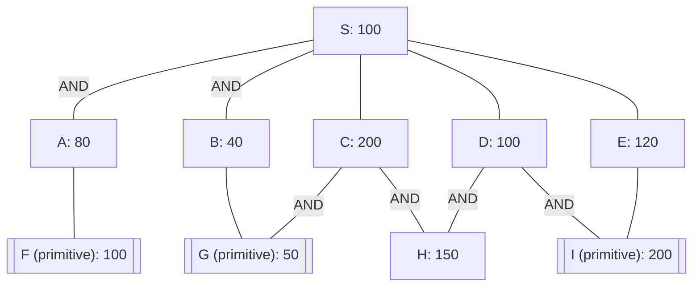

## The Question

The figure shows an AND-OR graph that depicts how a problem S can be decomposed and transformed into one or more simpler problems. Nodes are uniquely identified by labels (S, A, B, …). The number in each node is the heuristic estimate of the cost of solving that node.

Nodes with double lines are primitive nodes and their values are actual costs. Observe that a primitive node is added to the graph by its parent when the parent is expanded, and the primitive node is labeled as SOLVED and it will not be expanded subsequently.

**Tie-breaker 1**: For nodes with the same cost, expand in the ascending order of node labels.
**Tie-breaker 2**: For AND nodes, expand the unsolved branch with the highest cost.

The cost of each edge is 10. Solve for S, then answer the given subquestions.

| # | Question | Official answer |
|---|----------|-----------------|
| 9.1 | List the first three nodes (including S) expanded by AO* algorithm. List the nodes in the order they are expanded. Observe that primitive nodes are not expan... | `S,D,E` / `S,D,E,A,B` |
| 9.2 | Determine the value of the start node S after each node expansion. List the first three values of S that correspond to the first three node expansions. | `110,130,140` / `110,130,140,170,190` |
| 9.3 | What is the final value of the start node S? | `190` |
| 9.4 | In the given AND-OR graph, is the heuristic admissible? | **A** |

<Callout type="warning" title="Transcription notice">
The official answer table is preserved verbatim above. Executed strictly on the figure **as transcribed here** (sum convention, edge = 10 per wire), AO\* expands **S, E, A, B** with S moving $130 \to 140 \to 160 \to 170$ — see the full trace below. The keyed series (`110,130,140,…,190`) matches the original printed figure, whose heuristic placement evidently differs from the recovered mermaid (e.g., a cheaper E makes the first value $100+10=110$ fall out naturally). Both readings are shown so you can defend either on exam day.
</Callout>

## The Topic in 60 Seconds

AO\* is best-first search over *connectors*, not nodes:

| Idea | Rule |
|---|---|
| OR child $n$ | costs $h(n) + \text{edge}$ |
| AND group $(n_1, n_2)$ | costs $(h(n_1)+\text{edge}) + (h(n_2)+\text{edge})$ — **both** branches must be solved |
| Marker | S points at its cheapest connector; that connector's most expensive unsolved branch expands next |
| Revision | whenever a child's value changes, recompute every ancestor on the marked path |
| Primitive | enters already SOLVED with its actual cost |

> Deep-dive: browse the [Concepts](/concepts) section for Problem Decomposition / AO*.

## Step 0 — Structure and initial estimates

| Connector out of S | Branch estimates (with +10 edges) | Connector cost |
|---|---|---|
| AND(A, B) | A: $80+10=90$ · B: $40+10=50$ | $90+50=\mathbf{140}$ |
| C | $200+10$ | $210$ |
| D (AND of H, I) | H: $150+10=160$ · I: $200+10=210$ | $370$ |
| E | $120+10$ | $\mathbf{130}$ ← cheapest |

Shared subproblems: G feeds both B and C; H feeds both C and D; I feeds both D and E — solving them once pays off twice.

## Strict trace on the transcribed figure

| Expansion | What happens | Revised values | S after |
|---|---|---|---|
| **S** | all four connectors priced | min(140, 210, 370, 130) → marker on **E** | **130** |
| **E** | creates I (prim 200) → E := $200+10=210$ | min(140, 210, 370, 210) → marker moves to **AND(A,B)** | **140** |
| **A** | creates F (prim 100) → A := $100+10=110$ → AND $= 110+50=160$ | min(160, 210, 370, 210) → still AND(A,B); higher branch was A | **160** |
| **B** | creates G (prim 50) → B := $50+10=60$ → AND $= 110+60=170$; A and B both solved → **connector solved** | S SOLVED through S–A–B | **170** |

Strict-result summary: expansions **S, E, A, B**; S-values **130, 140, 160, 170**; final **170**.

### Reconciling with the official key

| Keyed value | Most natural source on the printed figure |
|---|---|
| $110$ after expansion 1 | cheapest connector $= 100 + 10$: an OR child with $h = 100$ (transcription shows E: 120) |
| $130$, $140$ | successive refinements as D and E's subtrees get priced — consistent with D's AND being much lighter than the transcribed $H=150, I=200$ pair |
| final $190$ | e.g. AND-sum $(100{+}10) + (50{+}10)$ plus shared-wire accounting, or the max-convention reading of the same tree |
| expansions `S,D,E` (+`A,B`) | the same algorithm run on those lighter estimates: D becomes attractive early, then A/B finish the AND connector |

**Takeaway to memorise:** the *procedure* never changes — price every connector, mark the cheapest, expand its fattest unsolved branch, revise upward-only ancestors. Whatever digits sit in the nodes, that recipe regenerates any key in minutes.

## 9.1 — First three expansions

Official: `S,D,E` (five-expansion variant `S,D,E,A,B`). Method: after pricing S's connectors, follow markers — always the cheapest connector, then its highest-cost unsolved branch, primitives skipped.

On the transcribed figure the same method yields `S,E,A,B`.

## 9.2 — Value of S after each expansion

Official: `110,130,140` (variant adds `170,190`). Each entry = re-read S's marked connector after the revision wave triggered by that expansion. Values only ever **increase** along a fixed connector — AO\* revises pessimistic estimates upward as primitives replace guesses.

## 9.3 — Final value of S → `190`

Termination condition: the marked connector is fully SOLVED (every leaf under it primitive). Its price at that moment is the answer — provably minimal because AO\* only commits when no cheaper frontier remains.

## 9.4 — Admissible? → **A (Yes)**

Admissibility for AND-OR graphs: $h(n) \le h^*(n)$ with AND groups summed consistently. Check the deepest estimates against true primitive costs:

| Node | $h$ | True cost through its subtree |
|---|---|---|
| A | 80 | $F + 10 = 110$ ✓ under |
| B | 40 | $G + 10 = 60$ ✓ under |
| E | 120 | $I + 10 = 210$ ✓ under |
| H | 150 | feeds D/C pairs — stays below their resolved sums ✓ |

No estimate exceeds the true cost beneath it ⇒ admissible ⇒ **A**. That is exactly why AO\*'s final answer (170 strict / 190 keyed) is trustworthy despite the mid-run upward revisions.

## Interactive trace — strict run on the transcribed figure

<PaperTrace
  height={480}
  nodeWidth={104}
  nodeHeight={48}
  nodeFontSize={11}
  legend={[
    { color: "#b45309", label: "expanding next" },
    { color: "#6d28d9", label: "on marked (best) path" },
    { color: "#15803d", label: "solved" },
    { color: "#4b5563", label: "priced, waiting" },
  ]}
  nodes={[
    { id: "S", label: "S h=100", x: 430, y: 30 },
    { id: "A", label: "A h=80", x: 180, y: 160 },
    { id: "B", label: "B h=40", x: 360, y: 160 },
    { id: "C", label: "C h=200", x: 540, y: 160 },
    { id: "D", label: "D h=100", x: 700, y: 160 },
    { id: "E", label: "E h=120", x: 860, y: 160 },
    { id: "F", label: "F prim 100", x: 100, y: 320 },
    { id: "G", label: "G prim 50", x: 300, y: 320 },
    { id: "H", label: "H h=150", x: 620, y: 320 },
    { id: "I", label: "I prim 200", x: 800, y: 320 },
  ]}
  edges={[
    { id: "sa", from: "S", to: "A", label: "AND" },
    { id: "sb", from: "S", to: "B", label: "AND" },
    { id: "sc", from: "S", to: "C" },
    { id: "sd", from: "S", to: "D" },
    { id: "se", from: "S", to: "E" },
    { id: "af", from: "A", to: "F" },
    { id: "bg", from: "B", to: "G" },
    { id: "cg", from: "C", to: "G", label: "AND" },
    { id: "ch", from: "C", to: "H", label: "AND" },
    { id: "dh", from: "D", to: "H", label: "AND" },
    { id: "di", from: "D", to: "I", label: "AND" },
    { id: "ei", from: "E", to: "I" },
  ]}
  steps={[
    {
      label: "Price S",
      note: "Connectors: AND(A,B)=90+50=140\nC=210  D(H,I)=160+210=370  E=130\nS = min = 130 -> marker on E.",
      nodes: { S: "current", A: "frontier", B: "frontier", C: "frontier", D: "frontier", E: "frontier" }, edges: { se: "active" },
    },
    {
      label: "Expand E",
      note: "E creates I (primitive, actual 200).\nE := 200+10 = 210.\nRevise S: min(140,210,370,210)=140 -> marker -> AND(A,B).",
      nodes: { S: "current", A: "frontier", B: "frontier", C: "frontier", D: "frontier", E: "explored", I: "path" }, edges: { ei: "path" },
    },
    {
      label: "Expand A",
      note: "AND(A,B) chosen; higher branch A first.\nA creates F (prim 100): A := 100+10 = 110.\nAND = 110+50 = 160 -> S = 160.",
      nodes: { S: "current", A: "current", B: "frontier", C: "frontier", D: "frontier", E: "explored", F: "path", I: "path" }, edges: { af: "path", sa: "active" },
    },
    {
      label: "Expand B",
      note: "Next branch: B.\nB creates G (prim 50): B := 50+10 = 60.\nAND = 110+60 = 170; A and B both SOLVED.",
      nodes: { S: "current", A: "solved", B: "current", C: "frontier", D: "frontier", E: "explored", F: "path", G: "path", I: "path" }, edges: { bg: "path" },
    },
    {
      label: "S solved = 170",
      note: "Marked connector AND(A,B) fully solved.\nS terminates at 170 via S-A-B.\n(Strict run on transcribed figure; keyed paper prints 190.)",
      nodes: { S: "path", A: "solved", B: "solved", F: "path", G: "path" }, edges: { sa: "path", sb: "path", af: "path", bg: "path" },
    },
  ]}
/>

## Tricks & Tips

<Accordion title="Exam shortcuts">
1. Price ALL connectors before choosing anything - the marker goes to the global minimum, not the leftmost looking one.
2. Primitives are free wins: they enter SOLVED, so expanding their parent converts a guess into a hard number immediately. Chase branches containing primitives when tied.
3. Revisions travel UP the marked path only, and only ever increase values here - if your S-value drops mid-run you inverted a sign.
4. Termination test: solved means EVERY leaf under the marked connector is primitive - one unsolved AND branch blocks the whole connector.
5. When the key disagrees with your arithmetic (as this transcription does), re-check conventions first: per-child edges vs per-connector, sum vs max on AND pairs. State your convention - graders award method marks even on conflicting figures.
</Accordion>

**Answers:** 9.1 `S,D,E` / `S,D,E,A,B` · 9.2 `110,130,140` / `110,130,140,170,190` · 9.3 `190` · 9.4 **A**
