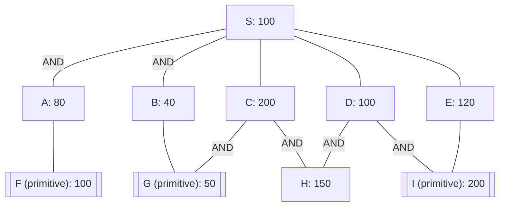

## The Question

The figure shows an AND-OR graph that depicts how a problem S can be decomposed and transformed into one or more simpler problems. Nodes are uniquely identified by labels (S, A, B, …). The number in each node is the heuristic estimate of the cost of solving that node.

Nodes with double lines are primitive nodes and their values are actual costs. Observe that a primitive node is added to the graph by its parent when the parent is expanded, and the primitive node is labeled as SOLVED and it will not be expanded subsequently.

**Tie-breaker 1**: For nodes with the same cost, expand in the ascending order of node labels.
**Tie-breaker 2**: For AND nodes, expand the unsolved branch with the highest cost.

The cost of each edge is 10. Solve for S, then answer the given subquestions.

| # | Question | Official answer |
|---|----------|-----------------|
| 9.1 | List the first three nodes (including S) expanded by AO* algorithm. List the nodes in the order they are expanded. Observe that primitive nodes are not expan... | `S,D,E` / `S,D,E,A,B` |
| 9.2 | Determine the value of the start node S after each node expansion. List the first three values of S that correspond to the first three node expansions. | `110,130,140` / `110,130,140,170,190` |
| 9.3 | What is the final value of the start node S? | `190` |
| 9.4 | In the given AND-OR graph, is the heuristic admissible? | **A** |

## The Topic in 60 Seconds

> Deep-dive: browse the [Concepts](/concepts) section for the relevant topic page.

## Solutions

**9.1** — List the first three nodes (including S) expanded by AO* algorithm. List the nodes in the order they are expanded. Observe that primitive nodes are not expanded.

**Answer:** `S,D,E` / `S,D,E,A,B`

**9.2** — Determine the value of the start node S after each node expansion. List the first three values of S that correspond to the first three node expansions.

**Answer:** `110,130,140` / `110,130,140,170,190`

**9.3** — What is the final value of the start node S?

**Answer:** `190`

**9.4** — In the given AND-OR graph, is the heuristic admissible?

Options:

| Option | |
|---|---|
| **A** | Yes |
| **B** | No |
| **C** | Cannot be determined |

**Answer:** **A**

## Tricks & Tips

<Accordion title="Exam method">
1. Read the question carefully — identify the algorithm or technique.
2. Trace step by step, showing your working.
3. Verify your answer against the question constraints.
</Accordion>
