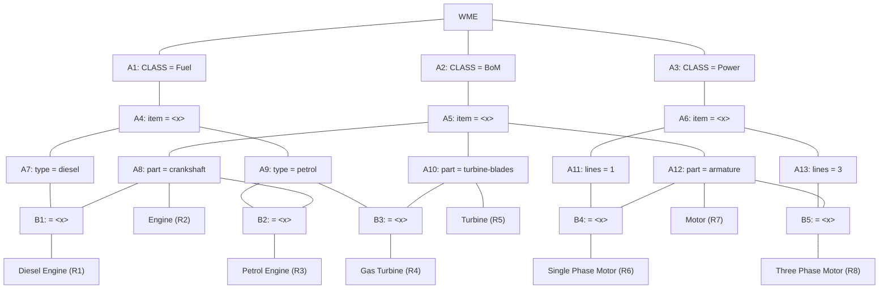

## The Question

A Rete Net for classification of machines is shown in the figure. The labels A1, A2, A3, ..., A10, A11, A12, A13, ..., B1, B2, ..., B5, R1, R2, ..., R8, uniquely identify the nodes in the network. When required, use the given label ordering to break ties and to enter your answers.



Run the Rete algorithm for the Working Memory shown below, where the WMEs are in timestamp order. Assume that WMEs reside at appropriate Alpha nodes, and the Beta nodes point to WMEs residing in Alpha nodes.

```text
101. (Fuel  ^item machine5 ^type diesel)
102. (Fuel  ^item machine2 ^type petrol)
103. (Fuel  ^item machine3)
104. (Power ^item machine4 ^lines 1)
105. (BoM   ^item machine4 ^part armature)
106. (BoM   ^item machine3 ^part armature)
107. (BoM   ^item machine5 ^part crankshaft)
```

For each WME identify its location (node label) in the Rete Net, and prepare the conflict set for the first cycle, then answer the given subquestions.


| # | Question | Official answer |
|---|----------|-----------------|
| 10.1 | Which of the following rule-data tuples are in the conflict-set? | **A**, **B**, **C**, **D**, **E** |
| 10.2 | If the Inference Engine uses Specificity as the conflict resolution strategy then identify the rule-data tuples that will be ready to fire. If multiple rule-... | `R1,101,107` / `R1,107,101` |
| 10.3 | If the Inference Engine uses Recency as the conflict resolution strategy then identify the rule-data tuples that will be ready to fire. If multiple rule-data... | `R1,101,107` / `R1,107,101` |

## The Topic in 60 Seconds

> Deep-dive: browse the [Concepts](/concepts) section for the relevant topic page.

## Solutions

**10.1** — Which of the following rule-data tuples are in the conflict-set?

Options:

| Option | |
|---|---|
| **A** | R1,101,107 |
| **B** | R2,107 |
| **C** | R6,104,105 |
| **D** | R7,105 |
| **E** | R7,106 |
| **F** | R3,102,107 |
| **G** | R7,105,106 |
| **H** | R8,105,106 |

**Answer:** **A**, **B**, **C**, **D**, **E**

**10.2** — If the Inference Engine uses Specificity as the conflict resolution strategy then identify the rule-data tuples that will be ready to fire. If multiple rule-data tuples qualify then choose one.

**Answer:** `R1,101,107` / `R1,107,101`

**10.3** — If the Inference Engine uses Recency as the conflict resolution strategy then identify the rule-data tuples that will be ready to fire. If multiple rule-data tuples qualify then choose one.

**Answer:** `R1,101,107` / `R1,107,101`

## Tricks & Tips

<Accordion title="Exam method">
1. Read the question carefully — identify the algorithm or technique.
2. Trace step by step, showing your working.
3. Verify your answer against the question constraints.
</Accordion>
