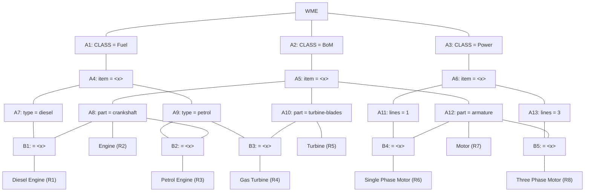

## The Question

A Rete Net for classification of machines is shown in the figure. The labels A1, A2, A3, ..., A10, A11, A12, A13, ..., B1, B2, ..., B5, R1, R2, ..., R8, uniquely identify the nodes in the network. When required, use the given label ordering to break ties and to enter your answers.



Run the Rete algorithm for the Working Memory shown below, where the WMEs are in timestamp order. Assume that WMEs reside at appropriate Alpha nodes, and the Beta nodes point to WMEs residing in Alpha nodes.

```text
101. (Fuel  ^item machine5 ^type diesel)
102. (Fuel  ^item machine2 ^type petrol)
103. (Fuel  ^item machine3)
104. (Power ^item machine4 ^lines 1)
105. (BoM   ^item machine4 ^part armature)
106. (BoM   ^item machine3 ^part armature)
107. (BoM   ^item machine5 ^part crankshaft)
```

For each WME identify its location (node label) in the Rete Net, and prepare the conflict set for the first cycle, then answer the given subquestions.


| # | Question | Official answer |
|---|----------|-----------------|
| 10.1 | Which of the following rule-data tuples are in the conflict-set? | **A**, **B**, **C**, **D**, **E** |
| 10.2 | If the Inference Engine uses Specificity as the conflict resolution strategy then identify the rule-data tuples that will be ready to fire. If multiple rule-... | `R1,101,107` / `R1,107,101` |
| 10.3 | If the Inference Engine uses Recency as the conflict resolution strategy then identify the rule-data tuples that will be ready to fire. If multiple rule-data... | `R1,101,107` / `R1,107,101` |

## The Topic in 60 Seconds

Rete runs every WME through two halves:

| Half | Nodes | Job |
|---|---|---|
| Alpha net | A1…A13 | single-WME constant tests; each node stores every passing WME |
| Beta net | B1…B5 | joins two token streams on shared variables ($\text{item}=\langle x\rangle$) |

A production fires a **rule-data tuple** $(R, w_1, \dots)$ when tokens cover all its conditions. Live tuples = **conflict set**.

> Deep-dive: browse the [Concepts](/concepts) section for Rule-Based Expert Systems / Rete.

## Step 0 — File each WME into its alpha node

| WME | Path through the net | Binding |
|---|---|---|
| 101 Fuel, diesel, machine5 | A1 → A4 ($x$=m5) → **A7** | $x$ = machine5 |
| 102 Fuel, petrol, machine2 | A1 → A4 ($x$=m2) → **A9** | $x$ = machine2 |
| 103 Fuel, no type, machine3 | A1 → A4 only (**A7/A9 reject** — missing ^type) | $x$ = machine3, goes nowhere |
| 104 Power, lines 1, machine4 | A3 → A6 ($x$=m4) → **A11** | $x$ = machine4 |
| 105 BoM, armature, machine4 | A2 → A5 ($x$=m4) → **A12** | $x$ = machine4 |
| 106 BoM, armature, machine3 | A2 → A5 ($x$=m3) → **A12** | $x$ = machine3 |
| 107 BoM, crankshaft, machine5 | A2 → A5 ($x$=m5) → **A8** | $x$ = machine5 |

Empty after all insertions: **A10** (turbine-blades), **A13** (lines 3) — so R3's join partner exists but mismatches, while R4, R5, R8 can never activate at all this cycle.

## Step 1 — Beta joins and rule activations

| Beta / Rule | Join tested | Result |
|---|---|---|
| **B1** (A7 ⋈ A8 on $x$) | A7: $\{m5\}$ · A8: $\{m5\}$ | match at m5 → (**R1**, 101, 107) |
| **R2** (A8 alone) | single condition | (**R2**, 107) |
| **B2** (A9 ⋈ A8 on $x$) | A9: $\{m2\}$ · A8: $\{m5\}$ | no overlap → nothing |
| **B3** (A9 ⋈ A10) | A10 empty | nothing |
| **R5** (A10 alone) | empty | nothing |
| **B4** (A11 ⋈ A12 on $x$) | A11: $\{m4\}$ · A12: $\{m4, m3\}$ | match at m4 → (**R6**, 104, 105) |
| **R7** (A12 alone) | single condition | (**R7**, 105), (**R7**, 106) |
| **B5** (A13 ⋈ A12) | A13 empty | nothing |

### 10.1 — Conflict set → **A, B, C, D, E**

$$\{(R1,101,107),\ (R2,107),\ (R6,104,105),\ (R7,105),\ (R7,106)\}$$

| Option | Tuple | Verdict |
|---|---|---|
| **A** | R1,101,107 | Yes — diesel m5 meets crankshaft m5 in B1 |
| **B** | R2,107 | Yes — 107 sits in A8 |
| **C** | R6,104,105 | Yes — lines-1 m4 pairs with armature m4 |
| **D** | R7,105 | Yes — 105 passes A12 |
| **E** | R7,106 | Yes — 106 also passes A12 |
| F | R3,102,107 | No — B2 fails: petrol is m2, crankshaft is m5 |
| G | R7,105,106 | No — R7 is single-condition; it never takes two WMEs |
| H | R8,105,106 | No — B5 needs lines-3, which no WME supplies |

### 10.2 — Specificity → `R1,101,107`

Count each rule's WME patterns (conditions); most specific wins:

| Tuple | Conditions counted | Specificity |
|---|---|---|
| **R1,101,107** | Fuel + diesel + BoM + crankshaft | **4** |
| R6,104,105 | Power + lines-1 + BoM + armature | 4 (tie) |
| R2,107 | BoM + crankshaft | 2 |
| R7,105 / R7,106 | BoM + armature | 2 |

Tie between R1 and R6 at 4 conditions → question says break ties by label ordering → **R1 < R6**, so `R1,101,107` fires.

### 10.3 — Recency → `R1,101,107`

Compare sorted-descending timestamp lists of each tuple's WMEs:

| Tuple | Timestamps | Sorted desc |
|---|---|---|
| R2,107 | 107 | [107] |
| **R1,101,107** | 101, 107 | **[107, 101]** ← wins |
| R7,106 | 106 | [106] |
| R6,104,105 | 104, 105 | [105, 104] |
| R7,105 | 105 | [105] |

Both R1's and R2's newest element is 107; the next comparison favours the tuple with additional (older) supporting WMEs: $[107,101] \succ [107]$ → `R1,101,107`.

## Interactive trace — WMEs flowing through the net

<PaperTrace
  height={520}
  nodeWidth={110}
  nodeHeight={44}
  nodeFontSize={11}
  legend={[
    { color: "#0f766e", label: "alpha node" },
    { color: "#b45309", label: "just activated" },
    { color: "#0369a1", label: "holding tokens" },
    { color: "#15803d", label: "rule in conflict set" },
  ]}
  nodes={[
    { id: "WME", label: "WM", x: 30, y: 250 },
    { id: "A1", label: "A1 CLASS=Fuel", x: 190, y: 110 },
    { id: "A2", label: "A2 CLASS=BoM", x: 190, y: 290 },
    { id: "A3", label: "A3 CLASS=Power", x: 190, y: 460 },
    { id: "A4", label: "A4 item=<x>", x: 350, y: 70 },
    { id: "A5", label: "A5 item=<x>", x: 350, y: 260 },
    { id: "A6", label: "A6 item=<x>", x: 350, y: 450 },
    { id: "A7", label: "A7 type=diesel", x: 520, y: 25 },
    { id: "A9", label: "A9 type=petrol", x: 520, y: 115 },
    { id: "A8", label: "A8 part=crankshaft", x: 520, y: 210 },
    { id: "A12", label: "A12 part=armature", x: 520, y: 310 },
    { id: "A11", label: "A11 lines=1", x: 520, y: 440 },
    { id: "B1", label: "B1 x=x", x: 680, y: 115 },
    { id: "R1", label: "R1 DieselEngine", x: 850, y: 70 },
    { id: "R2", label: "R2 Engine", x: 850, y: 185 },
    { id: "B4", label: "B4 x=x", x: 680, y: 375 },
    { id: "R6", label: "R6 SingPhMotor", x: 850, y: 340 },
    { id: "R7", label: "R7 Motor", x: 850, y: 430 },
  ]}
  edges={[
    { id: "w1", from: "WME", to: "A1" },
    { id: "w2", from: "WME", to: "A2" },
    { id: "w3", from: "WME", to: "A3" },
    { id: "a14", from: "A1", to: "A4" },
    { id: "a25", from: "A2", to: "A5" },
    { id: "a36", from: "A3", to: "A6" },
    { id: "a47", from: "A4", to: "A7" },
    { id: "a49", from: "A4", to: "A9" },
    { id: "a58", from: "A5", to: "A8" },
    { id: "a5c", from: "A5", to: "A12" },
    { id: "a6l", from: "A6", to: "A11" },
    { id: "b1a", from: "A7", to: "B1" },
    { id: "b1b", from: "A8", to: "B1" },
    { id: "r1", from: "B1", to: "R1" },
    { id: "r2", from: "A8", to: "R2" },
    { id: "b4a", from: "A11", to: "B4" },
    { id: "b4b", from: "A12", to: "B4" },
    { id: "r6", from: "B4", to: "R6" },
    { id: "r7", from: "A12", to: "R7" },
  ]}
  steps={[
    {
      label: "WM empty",
      note: "Working memory starts empty.\nNo alpha node holds anything.",
      nodes: {}, edges: {},
    },
    {
      label: "+101 Fuel diesel",
      note: "101 (Fuel item=machine5 type=diesel)\nA1 -> A4 (x=m5) -> A7.\nNo rule complete yet.",
      nodes: { WME: "start", A1: "current", A4: "current", A7: "current" }, edges: { w1: "active" },
    },
    {
      label: "+102 Fuel petrol",
      note: "102 (Fuel item=machine2 type=petrol)\nA1 grows; lands in A9 (x=m2).\nStill nothing complete.",
      nodes: { WME: "start", A1: "frontier", A4: "frontier", A7: "frontier", A9: "current" }, edges: {},
    },
    {
      label: "+103 Fuel (no type)",
      note: "103 (Fuel item=machine3) has NO ^type:\nrejected by A7 AND A9. Dead end -\nmakes every R3 tuple impossible later.",
      nodes: { WME: "start", A1: "frontier", A4: "frontier", A7: "frontier", A9: "frontier" }, edges: {},
    },
    {
      label: "+104 Power lines1",
      note: "104 (Power item=machine4 lines=1)\nA3 -> A6 (x=m4) -> A11. Waiting for an armature BoM...",
      nodes: { WME: "start", A1: "frontier", A4: "frontier", A7: "frontier", A9: "frontier", A3: "frontier", A6: "current", A11: "current" }, edges: { w3: "active" },
    },
    {
      label: "+105 BoM arm m4",
      note: "105 (BoM item=machine4 part=armature)\nA2 -> A5 (x=m4) -> A12 (x={m4}).\nB4 joins A11{x=m4} with A12{x=m4}: MATCH!\n(R6,104,105) enters conflict set. R7 also: (R7,105).",
      nodes: { WME: "start", A3: "frontier", A6: "frontier", A11: "frontier", A2: "current", A5: "current", A12: "current", B4: "current", R6: "path", R7: "path" }, edges: { r6: "path", r7: "path" },
    },
    {
      label: "+106 BoM arm m3",
      note: "106 (BoM item=machine3 part=armature)\nA12 gains second token (x=m3).\nR7 fires again: (R7,106).\nB4 re-check: A11 still only has m4 -> no new R6.",
      nodes: { WME: "start", A2: "frontier", A5: "frontier", A11: "frontier", A12: "current", B4: "frontier", R6: "path", R7: "path" }, edges: { r6: "path", r7: "path" },
    },
    {
      label: "+107 BoM crank m5",
      note: "107 (BoM item=machine5 part=crankshaft)\nA5 -> A8 (x=m5).\nR2 (single-cond on A8): (R2,107) in!\nB1 joins A7{x=m5} with A8{x=m5}: MATCH!\n(R1,101,107) in!",
      nodes: { WME: "start", A5: "frontier", A12: "frontier", B4: "frontier", A8: "current", B1: "current", R1: "path", R2: "path", R6: "path", R7: "path" }, edges: { r1: "path", r2: "path", r6: "path", r7: "path" },
    },
    {
      label: "Conflict set",
      note: "CONFLICT SET =\n{(R1,101,107), (R2,107), (R6,104,105), (R7,105), (R7,106)}\nSpecificity: R1 (4 cond) beats R6 (tie->label order).\nRecency: [107,101] beats [107] -> R1 again.",
      nodes: { WME: "start", A8: "frontier", A12: "frontier", B1: "frontier", B4: "frontier", R1: "path", R2: "path", R6: "path", R7: "path" }, edges: { r1: "path", r2: "path", r6: "path", r7: "path" },
    },
  ]}
/>

## Tricks & Tips

<Accordion title="Exam shortcuts">
1. Table the alpha net first (node → WMEs held → x-binding). Every join becomes a one-line intersection - never re-scan raw WMEs during beta work.
2. Missing attributes kill silently: 103 has no ^type so BOTH type filters reject it; any option built on 103 + petrol/diesel is auto-wrong (kills F here).
3. Single-condition rules fire once PER TOKEN: A12 holding \{105, 106\} gives TWO R7 tuples - exactly why D and E are both correct.
4. Specificity ties are broken by LABEL ORDER (question says so!) - R1 vs R6 both have 4 conditions, R1 comes first alphabetically.
5. Recency compares timestamp LISTS newest-first; when tops tie ([107] vs [107,101]) the LONGER list wins - more supporting WMEs = more recent overall.
</Accordion>

**Answers:** 10.1 **A, B, C, D, E** · 10.2 `R1,101,107` / `R1,107,101` · 10.3 `R1,101,107` / `R1,107,101`
