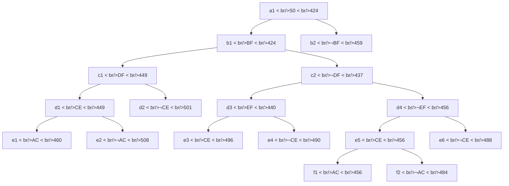

## The Question

TSP BnB snapshot when the optimal tour is discovered.

| # | Question | Official answer |
|---|----------|-----------------|
| 2.1 | Number of cities | `6` |
| 2.2 | 2nd–5th refined | `b1,c2,d3,c1` |
| 2.3 | Optimal tour node | `f1` |
| 2.4 | Cost | `456` |
| 2.5 | Tour from A | `A,C,E,D,B,F` |

## The Topic in 60 Seconds

Each node carries an **edge decision** (`XY` = include, `¬XY` = exclude) plus a **lower bound**. Refining = pop the node with the smallest bound and create both children. A childless node is a **complete tour**. Stop when a tour pops while every open bound is at least as large — nothing left can beat it.

> Deep-dive: [Reading BnB Trees](/concepts/week-05-optimal-tsp/01-bnb-tree-reading), [Branch and Bound](/concepts/week-03-heuristic-search/05-branch-and-bound).

## 2.1 — Number of cities → `6`

The deepest branch runs root → b → c → d → e → **f** (nodes f1, f2): that is **5 decision levels** below the root. Each level settles one tour edge, and a full refinement needs $N - 1$ levels before the last edge is forced. So $N = 5 + 1 =$ **6 cities** ✓

## 2.2 — Refine order after a1 → `b1,c2,d3,c1`

Pop the cheapest bound each round; ties break on reference labels.

| Pop | Node : bound | Children created | OPEN after (cheapest first) |
|-----|--------------|------------------|------------------------------|
| 1 | a1 : 424 | b1 : 424, b2 : 459 | b1 424 · b2 459 |
| 2 | b1 : 424 | c1 : 449, c2 : 437 | c2 437 · c1 449 · b2 459 |
| 3 | c2 : 437 | d3 : 440, d4 : 456 | d3 440 · c1 449 · b2 459 · d4 456 |
| 4 | d3 : 440 | e3 : 496, e4 : 490 | c1 449 · b2 459 · d4 456 · e4 490 · e3 496 |
| 5 | c1 : 449 | d1 : 449, d2 : 501 | d1 449 · b2 459 · d4 456 · e4 490 · e3 496 · d2 501 |

Refined #2–#5 = **b1, c2, d3, c1** ✓ — note how c2 (437) jumps the queue ahead of its own sibling c1 (449).

## 2.3 & 2.4 — Optimal node and cost → `f1`, `456`

Continuing from the last table:

| Pop | Node : bound | Children created | OPEN after |
|-----|--------------|------------------|------------|
| 6 | d1 : 449 | e1 : 460, e2 : 508 | d4 456 · b2 459 · e1 460 · e4 490 · … |
| 7 | d4 : 456 | e5 : 456, e6 : 488 | e5 456 · b2 459 · e1 460 · e6 488 · … |
| 8 | e5 : 456 | f1 : 456, f2 : 484 | f1 456 · b2 459 · e1 460 · … |
| 9 | **f1 : 456 — leaf ⇒ a tour** | none | b2 459 · e1 460 · e6 488 · f2 484 · e4 490 · e3 496 · d2 501 · e2 508 |

When f1 pops, every remaining open bound is ≥ 456, so no unexplored branch can produce anything cheaper → **f1 is the optimal tour, cost `456`** ✓

## 2.5 — Tour from city A → `A,C,E,D,B,F`

Walk the path a1 → f1 and collect the decisions: **BF in** (b1), **DF out** (c2), **EF out** (d4), **CE in** (e5), **AC in** (f1). Now finish the cycle by degree-forcing:

| City | Degree so far | Needs |
|------|---------------|-------|
| A | 1 (AC) | 1 more |
| B | 1 (BF) | 1 more |
| C | 2 (AC, CE) | full |
| D | 0 | 2 more |
| E | 1 (CE) | 1 more |
| F | 1 (BF) | 1 more |

DF and EF are excluded, so F can only close via **FA** (C is full) → A becomes full too. D must take exactly two partners: DA is blocked (A is full), leaving **DB and DE forced**. That fills B (BF+BD) and E (CE+ED). Final edge set: AC, CE, ED, DB, BF, FA → cycle **A-C-E-D-B-F-A**, i.e. `A,C,E,D,B,F`, 6 cities ✓

## Interactive refinement trace

<PaperTrace
  height={520}
  nodeWidth={92}
  nodeHeight={46}
  nodeFontSize={10}
  legend={[
    { color: "#b45309", label: "popping (min bound)" },
    { color: "#0369a1", label: "on OPEN" },
    { color: "#4b5563", label: "refined" },
    { color: "#16a34a", label: "optimal tour leaf" },
  ]}
  nodes={[
    { id: "a1", label: "a1 S0 424", x: 360, y: 25 },
    { id: "b1", label: "b1 BF 424", x: 180, y: 110 },
    { id: "b2", label: "b2 ¬BF 459", x: 560, y: 110 },
    { id: "c1", label: "c1 DF 449", x: 60, y: 195 },
    { id: "c2", label: "c2 ¬DF 437", x: 300, y: 195 },
    { id: "d1", label: "d1 CE 449", x: 15, y: 280 },
    { id: "d2", label: "d2 ¬CE 501", x: 140, y: 280 },
    { id: "d3", label: "d3 EF 440", x: 255, y: 280 },
    { id: "d4", label: "d4 ¬EF 456", x: 385, y: 280 },
    { id: "e1", label: "e1 AC 460", x: 15, y: 365 },
    { id: "e2", label: "e2 ¬AC 508", x: 130, y: 365 },
    { id: "e3", label: "e3 CE 496", x: 225, y: 365 },
    { id: "e4", label: "e4 ¬CE 490", x: 340, y: 365 },
    { id: "e5", label: "e5 CE 456", x: 445, y: 365 },
    { id: "e6", label: "e6 ¬CE 488", x: 560, y: 365 },
    { id: "f1", label: "f1 AC 456", x: 400, y: 450 },
    { id: "f2", label: "f2 ¬AC 484", x: 520, y: 450 },
  ]}
  edges={[
    { id: "x1", from: "a1", to: "b1" },
    { id: "x2", from: "a1", to: "b2" },
    { id: "x3", from: "b1", to: "c1" },
    { id: "x4", from: "b1", to: "c2" },
    { id: "x5", from: "c1", to: "d1" },
    { id: "x6", from: "c1", to: "d2" },
    { id: "x7", from: "c2", to: "d3" },
    { id: "x8", from: "c2", to: "d4" },
    { id: "x9", from: "d1", to: "e1" },
    { id: "x10", from: "d1", to: "e2" },
    { id: "x11", from: "d3", to: "e3" },
    { id: "x12", from: "d3", to: "e4" },
    { id: "x13", from: "d4", to: "e5" },
    { id: "x14", from: "d4", to: "e6" },
    { id: "x15", from: "e5", to: "f1" },
    { id: "x16", from: "e5", to: "f2" },
  ]}
  steps={[
    { label: "Pop a1 : 424", note: "children b1:424, b2:459\nOPEN = [b1 424 · b2 459]", nodes: { a1: "explored", b1: "frontier", b2: "frontier" } },
    { label: "Pop b1 : 424", note: "children c1:449, c2:437\nOPEN = [c2 437 · c1 449 · b2 459]", nodes: { a1: "explored", b1: "current", b2: "frontier", c1: "frontier", c2: "frontier" } },
    { label: "Pop c2 : 437", note: "children d3:440, d4:456\nOPEN = [d3 440 · c1 449 · b2 459 · d4 456]", nodes: { a1: "explored", b1: "explored", b2: "frontier", c1: "frontier", c2: "current", d3: "frontier", d4: "frontier" } },
    { label: "Pop d3 : 440", note: "children e3:496, e4:490\nOPEN = [c1 449 · b2 459 · d4 456 · e4 490 · e3 496]", nodes: { a1: "explored", b1: "explored", b2: "frontier", c1: "frontier", c2: "explored", d3: "current", d4: "frontier", e3: "frontier", e4: "frontier" } },
    { label: "Pop c1 : 449", note: "children d1:449, d2:501\nOPEN = [d1 449 · b2 459 · d4 456 · e4 490 · e3 496 · d2 501]\nRefined order so far: b1, c2, d3, c1", nodes: { a1: "explored", b1: "explored", b2: "frontier", c1: "current", c2: "explored", d1: "frontier", d2: "frontier", d3: "explored", d4: "frontier", e3: "frontier", e4: "frontier" }, edges: {} },
    { label: "Pop d1 : 449", note: "children e1:460, e2:508\nOPEN = [d4 456 · b2 459 · e1 460 · e4 490 · e3 496 · d2 501 · e2 508]", nodes: { a1: "explored", b1: "explored", b2: "frontier", c1: "explored", c2: "explored", d1: "current", d2: "frontier", d3: "explored", d4: "frontier", e1: "frontier", e2: "frontier", e3: "frontier", e4: "frontier" } },
    { label: "Pop d4 : 456", note: "children e5:456, e6:488\nOPEN = [e5 456 · b2 459 · e1 460 · e6 488 · e4 490 · e3 496 · d2 501 · e2 508]", nodes: { a1: "explored", b1: "explored", b2: "frontier", c1: "explored", c2: "explored", d1: "explored", d2: "frontier", d3: "explored", d4: "current", e1: "frontier", e2: "frontier", e3: "frontier", e4: "frontier", e5: "frontier", e6: "frontier" } },
    { label: "Pop e5 : 456", note: "children f1:456, f2:484\nOPEN = [f1 456 · b2 459 · e1 460 · e6 488 · f2 484 · e4 490 · e3 496 · d2 501 · e2 508]", nodes: { a1: "explored", b1: "explored", b2: "frontier", c1: "explored", c2: "explored", d1: "explored", d2: "frontier", d3: "explored", d4: "explored", e1: "frontier", e2: "frontier", e3: "frontier", e4: "frontier", e5: "current", e6: "frontier", f1: "frontier", f2: "frontier" } },
    { label: "Pop f1 : 456 → TOUR", note: "f1 is a leaf = complete tour.\nMin remaining open bound = b2 459 ≥ 456 → STOP.\nOptimal cost 456 via a1→b1(BF)→c2(¬DF)→d4(¬EF)→e5(CE)→f1(AC).\nTour: A,C,E,D,B,F", nodes: { a1: "path", b1: "path", b2: "explored", c1: "explored", c2: "path", d1: "explored", d2: "explored", d3: "explored", d4: "path", e1: "explored", e2: "explored", e3: "explored", e4: "explored", e5: "path", e6: "explored", f1: "goal", f2: "explored" }, edges: { x1: "path", x4: "path", x8: "path", x13: "path", x15: "path" } },
  ]}
/>

## Tricks & Tips

<Accordion title="Reading these trees fast">
1. Sort by bound, not by depth: c2 (437) refines before its own parent-side sibling c1 (449) — cheapest-first is the whole algorithm.
2. Leaf = tour. The moment a leaf's bound ties or beats the cheapest open node, stop; do not refine further.
3. Cities = deepest level + 1 (levels b–f here give 6). Count levels, not nodes.
4. For the tour, list included/excluded edges, then fill degrees: excluded DF/EF force F to close through A, which cascades DB and DE into place.
</Accordion>

**Answers:** 2.1 `6` · 2.2 `b1,c2,d3,c1` · 2.3 `f1` · 2.4 `456` · 2.5 `A,C,E,D,B,F`
