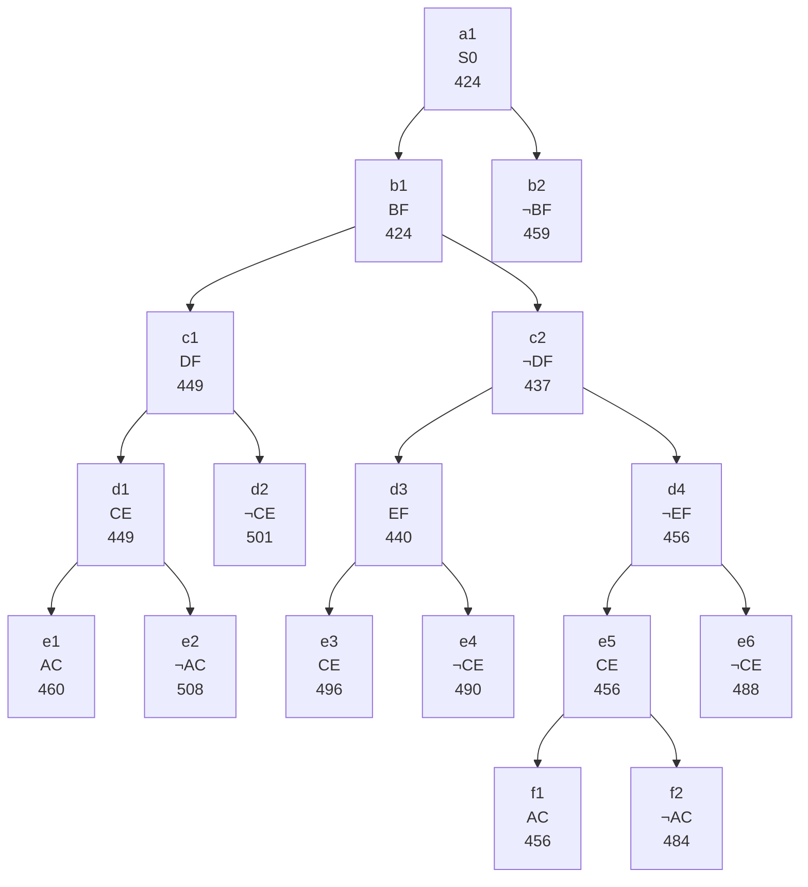

## The Question

TSP BnB snapshot when the optimal tour is discovered.

| # | Question | Official answer |
|---|----------|-----------------|
| 2.1 | Number of cities | `6` |
| 2.2 | 2nd–5th refined | `b1,c2,d3,c1` |
| 2.3 | Optimal tour node | `f1` |
| 2.4 | Cost | `456` |
| 2.5 | Tour from A | `A,C,E,D,B,F` |

## The Topic in 60 Seconds

Refine = pop cheapest, insert two children. Childless = tours. Stop when a tour pops with no cheaper open node.

> Deep-dive: [Reading BnB Trees](/concepts/week-05-optimal-tsp/01-bnb-tree-reading), [Branch and Bound](/concepts/week-03-heuristic-search/05-branch-and-bound).

## 2.1 — Refine order → `b1,c2,d3,c1`

| Pop | Queue (min first) | Action |
|-----|-------------------|--------|
| 1 | a1 : 424 | refine → b1(424), b2(459) |
| 2 | b1 : 424, b2 : 459 | refine **b1** → c1(449), c2(437) |
| 3 | c2 : 437, c1 : 449, b2 : 459 | refine **c2** → d3(440), d4(456) |
| 4 | d3 : 440, c1 : 449, b2 : 459, d4 : 456 | refine **d3** → e3(496), e4(490) |
| 5 | c1 : 449, b2 : 459, d4 : 456, e4 : 490, e3 : 496 | refine **c1** → d1(449), d2(501) |

## 2.2 — Optimal tour → `f1`, cost `456`

Continuing: pop d1(449) → e1(460), e2(508). Pop d4(456) → e5(456), e6(488). Pop e5(456) → f1(456), f2(484). Now **f1 : 456** is a **leaf** — a tour — and every open node ≥ 456 → **f1 = optimal, 456** ✓

## 2.3 — Cities → `6`

Path root→f1: **BF in, ¬DF, ¬EF, CE in (via e5), AC in (via f1)**. The chain has 5 decision levels (b→c→d→e→f) plus the root. For a TSP with N cities, the tree depth = N-1 edge decisions. Here: 5 decision levels → **6 cities** ✓

## 2.4 — Cost → `456` ✓

## 2.5 — Tour from A → `A,C,E,D,B,F`

Path root→f1: **BF in, DF out, EF out, CE in, AC in**. Edges included: BF, CE, AC. Degrees: B–1(F), F–1(B), C–2(A,E) full, E–1(C), D–0, A–1(C). D and E need completing, A and F need completing. The forced tour: **A–C–E–D–B–F–A** → 6 cities ✓

<Graph
  height={500}
  nodeWidth={100}
  nodeHeight={50}
  nodeFontSize={11}
  layout={{ name: "preset" }}
  elements={[
    { data: { id: "a1", label: "a1: S0 424", type: "current" }, position: { x: 380, y: 20 } },
    { data: { id: "b1", label: "b1: BF 424", type: "current" }, position: { x: 180, y: 110 } },
    { data: { id: "b2", label: "b2: ¬BF 459" }, position: { x: 600, y: 110 } },
    { data: { id: "c1", label: "c1: DF 449", type: "current" }, position: { x: 40, y: 200 } },
    { data: { id: "c2", label: "c2: ¬DF 437", type: "current" }, position: { x: 320, y: 200 } },
    { data: { id: "d1", label: "d1: CE 449", type: "current" }, position: { x: 10, y: 290 } },
    { data: { id: "d2", label: "d2: ¬CE 501" }, position: { x: 130, y: 290 } },
    { data: { id: "d3", label: "d3: EF 440", type: "current" }, position: { x: 270, y: 290 } },
    { data: { id: "d4", label: "d4: ¬EF 456", type: "current" }, position: { x: 400, y: 290 } },
    { data: { id: "e1", label: "e1: AC 460" }, position: { x: 10, y: 380 } },
    { data: { id: "e2", label: "e2: ¬AC 508" }, position: { x: 120, y: 380 } },
    { data: { id: "e3", label: "e3: CE 496" }, position: { x: 230, y: 380 } },
    { data: { id: "e4", label: "e4: ¬CE 490" }, position: { x: 340, y: 380 } },
    { data: { id: "e5", label: "e5: CE 456", type: "current" }, position: { x: 450, y: 380 } },
    { data: { id: "e6", label: "e6: ¬CE 488" }, position: { x: 560, y: 380 } },
    { data: { id: "f1", label: "f1: AC 456 ✓", type: "path" }, position: { x: 420, y: 470 } },
    { data: { id: "f2", label: "f2: ¬AC 484" }, position: { x: 540, y: 470 } },
    { data: { id: "x1", source: "a1", target: "b1" } },
    { data: { id: "x2", source: "a1", target: "b2" } },
    { data: { id: "x3", source: "b1", target: "c1" } },
    { data: { id: "x4", source: "b1", target: "c2" } },
    { data: { id: "x5", source: "c1", target: "d1" } },
    { data: { id: "x6", source: "c1", target: "d2" } },
    { data: { id: "x7", source: "c2", target: "d3" } },
    { data: { id: "x8", source: "c2", target: "d4" } },
    { data: { id: "x9", source: "d1", target: "e1" } },
    { data: { id: "x10", source: "d1", target: "e2" } },
    { data: { id: "x11", source: "d3", target: "e3" } },
    { data: { id: "x12", source: "d3", target: "e4" } },
    { data: { id: "x13", source: "d4", target: "e5" } },
    { data: { id: "x14", source: "d4", target: "e6" } },
    { data: { id: "x15", source: "e5", target: "f1" } },
    { data: { id: "x16", source: "e5", target: "f2" } },
  ]}
/>

*Amber = refined in order b1 → c2 → d3 → c1. Green = f1, the 456 tour.*

**Answers:** 2.1 `6` · 2.2 `b1,c2,d3,c1` · 2.3 `f1` · 2.4 `456` · 2.5 `A,C,E,D,B,F`
