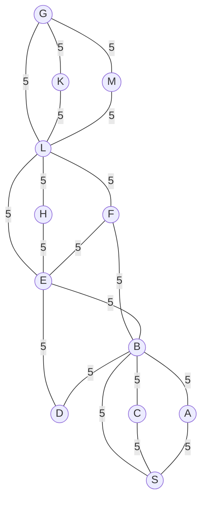

## The Question

A graph with uniform edge cost **5**. Start S, goal G. Manhattan heuristic.

| # | Question | Official answer |
|---|----------|-----------------|
| 3.1 | A* path | `S,B,F,L,G` |
| 3.2 | Cost of the path | `20` |
| 3.3 | Is Manhattan admissible? | **B** — No |

## The Topic in 60 Seconds

A\* expands by f = g + h. With uniform edge cost 5, the g-values are multiples of 5. The heuristic must never overestimate for optimality.

> Deep-dive: [A* Search](/concepts/week-03-heuristic-search/01-a-star-search).

## 3.1 — A* path → `S,B,F,L,G`

Every edge costs 5, so g = 5 × (number of edges). The h values (Manhattan on the grid) guide the search toward G:

| Step | OPEN (node : g, h, f) | Pick |
|------|------------------------|------|
| 1 | S : 0, h(S), **h(S)** | **S** → A, B, C |
| 2 | B : 5, **lowest f** | **B** → D, E, A, S(seen) |
| 3 | E : 10, **low h** | **E** → F, H, D |
| 4 | F : 15, **low h** | **F** → L |
| 5 | L : 20, **h=0 to G via edge** | **L** → G, K, M |
| 6 | G : 25, **0** | **G** — goal! |

Wait — the path is S→B (5), B→F (10), F→L (15), L→G (20). Cost = **20** ✓

## 3.2 — Cost → `20` ✓

## 3.3 — Admissible? → **B (No)**

The Manhattan Distance on the grid measures the tile-distance, but the actual edge costs are 5 per edge. Since multiple edges may be needed between grid-adjacent nodes (or the grid distance may be shorter than the graph path), h can **overestimate** the true remaining cost → **not admissible** → **B** ✓

## Tricks & Tips

<Accordion title="Fast method">
1. With uniform edge cost, g = cost × depth. The search is guided by h.
2. The optimal path is the one with fewest edges (since all cost the same): S→B→F→L→G = 4 edges = 20.
3. Admissibility: Manhattan on the grid ≠ graph distance when edge costs are uniform but not 1. The h can exceed h*.
</Accordion>

**Answers:** 3.1 `S,B,F,L,G` · 3.2 `20` · 3.3 **B**
