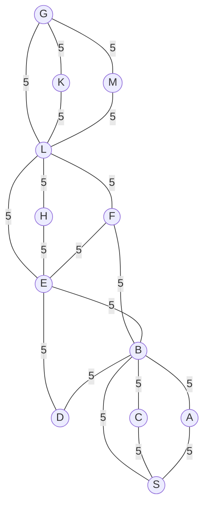

## The Question

A graph with uniform edge cost **5**. Start S, goal G. Manhattan heuristic.

| # | Question | Official answer |
|---|----------|-----------------|
| 3.1 | A* path | `S,B,F,L,G` |
| 3.2 | Cost of the path | `20` |
| 3.3 | Is Manhattan admissible? | **B** — No |

## The Topic in 60 Seconds

A\* orders OPEN by $f(n) = g(n) + h(n)$. Uniform edge costs make $g$ a multiple of 5 (one edge = one move). Admissibility needs $h(n) \le h^*(n)$ everywhere — a **single** counterexample kills it.

> Deep-dive: [A* Search](/concepts/week-03-heuristic-search/01-a-star-search).

## Step 0 — Grid coordinates and the h-table

Reading tile positions off the figure ($x$ rightward, $y$ downward), each grid step is charged like one edge (cost 5):

| Node | (x, y) | Tiles to G | $h = 5 \times$ tiles | Node | (x, y) | Tiles to G | $h = 5 \times$ tiles |
|------|--------|------------|----------------------|------|--------|------------|----------------------|
| S | (1, 0) | 5 | 25 | F | (4, 0) | 2 | 10 |
| A | (2, 0) | 4 | 20 | H | (5, 1) | 2 | 10 |
| B | (3, 0) | 3 | 15 | L | (5, 0) | 1 | 5 |
| C | (2, 1) | 5 | 25 | M | (5, −1) | 2 | 10 |
| D | (3, 1) | 4 | 20 | K | (6, 1) | 1 | 5 |
| E | (4, 1) | 3 | 15 | G | (6, 0) | 0 | 0 |

## 3.1 — A* working → `S,B,F,L,G`

MoveGen alphabetical; every entry shows $g + h = f$ exactly.

| Step | Expanded ($f$) | Generate / update | OPEN after (cheapest first) |
|------|----------------|-------------------|------------------------------|
| 1 | S : $0+25=25$ | A : $5+20=25$ · B : $5+15=20$ · C : $5+25=30$ | B 20 · A 25 · C 30 |
| 2 | B : 20 | D : $10+20=30$ · E : $10+15=25$ · F : $10+10=20$ (A, C, S seen) | F 20 · A 25 · E 25 · C 30 · D 30 |
| 3 | F : 20 | L : $15+5=20$ (E already at 25, B closed) | L 20 · A 25 · E 25 · C 30 · D 30 |
| 4 | L : 20 | G : $20+0=20$ · K : $20+5=25$ · M : $20+10=30$ · H : $20+10=30$ | G 20 · A 25 · E 25 · K 25 · C 30 · D 30 · H 30 · M 30 |
| 5 | **G : 20 — GOAL** | — | — |

Path: **S → B → F → L → G** ✓

## 3.2 — Cost of the path → `20`

Four edges × 5: $5+5+5+5 = \mathbf{20}$ ✓

## 3.3 — Is Manhattan admissible? → **B (No)**

Admissibility dies on a single node, and this figure has several:

| Node | $h$ | True cheapest cost $h^*$ | Verdict |
|------|-----|--------------------------|---------|
| M | 10 | $5$ (single edge M–L) | **overestimates** ✗ |
| E | 15 | $5$ (single edge E–L) | overestimates ✗ |

The figure joins nodes that are 2 Manhattan tiles apart with a single cost-5 edge, so the tile count (× 5) exceeds the true remaining cost → $h \not\le h^*$ → **not admissible → B** ✓ (A\* still happened to return a cheapest path here because the overestimates sit off the main corridor.)

## Interactive A* trace

<StepGraph
  height={420}
  nodeWidth={100}
  nodeHeight={50}
  nodeFontSize={12}
  legend={[
    { color: "#b45309", label: "expanding" },
    { color: "#0369a1", label: "in OPEN (f = g+h)" },
    { color: "#4b5563", label: "expanded" },
    { color: "#16a34a", label: "returned path" },
  ]}
  steps={[
    {
      label: "Init",
      note: "OPEN = { S(g=0, h=25, f=25) }",
      elements: [
        { data: { id: "S", label: "S f=25", type: "frontier" }, position: { x: 30, y: 190 } },
        { data: { id: "A", label: "A", type: "unassigned" }, position: { x: 150, y: 70 } },
        { data: { id: "C", label: "C", type: "unassigned" }, position: { x: 150, y: 310 } },
        { data: { id: "B", label: "B", type: "unassigned" }, position: { x: 280, y: 190 } },
        { data: { id: "D", label: "D", type: "unassigned" }, position: { x: 320, y: 320 } },
        { data: { id: "E", label: "E", type: "unassigned" }, position: { x: 420, y: 190 } },
        { data: { id: "F", label: "F", type: "unassigned" }, position: { x: 420, y: 60 } },
        { data: { id: "H", label: "H", type: "unassigned" }, position: { x: 480, y: 300 } },
        { data: { id: "L", label: "L", type: "unassigned" }, position: { x: 560, y: 130 } },
        { data: { id: "M", label: "M", type: "unassigned" }, position: { x: 600, y: 20 } },
        { data: { id: "K", label: "K", type: "unassigned" }, position: { x: 620, y: 230 } },
        { data: { id: "G", label: "G", type: "goal" }, position: { x: 700, y: 130 } },
        { data: { id: "e1", source: "S", target: "A", label: "5" } },
        { data: { id: "e2", source: "S", target: "C", label: "5" } },
        { data: { id: "e3", source: "S", target: "B", label: "5" } },
        { data: { id: "e4", source: "A", target: "B", label: "5" } },
        { data: { id: "e5", source: "C", target: "B", label: "5" } },
        { data: { id: "e6", source: "B", target: "D", label: "5" } },
        { data: { id: "e7", source: "B", target: "E", label: "5" } },
        { data: { id: "e8", source: "B", target: "F", label: "5" } },
        { data: { id: "e9", source: "D", target: "E", label: "5" } },
        { data: { id: "e10", source: "E", target: "F", label: "5" } },
        { data: { id: "e11", source: "E", target: "H", label: "5" } },
        { data: { id: "e12", source: "E", target: "L", label: "5" } },
        { data: { id: "e13", source: "F", target: "L", label: "5" } },
        { data: { id: "e14", source: "H", target: "L", label: "5" } },
        { data: { id: "e15", source: "L", target: "M", label: "5" } },
        { data: { id: "e16", source: "L", target: "K", label: "5" } },
        { data: { id: "e17", source: "L", target: "G", label: "5" } },
        { data: { id: "e18", source: "M", target: "G", label: "5" } },
        { data: { id: "e19", source: "K", target: "G", label: "5" } },
      ],
    },
    {
      label: "Expand S",
      note: "Pick S (f=25).\nA: g=5, h=20 → f=25\nB: g=5, h=15 → f=20\nC: g=5, h=25 → f=30\nOPEN = { B(20), A(25), C(30) }",
      elements: [
        { data: { id: "S", label: "S", type: "explored" }, position: { x: 30, y: 190 } },
        { data: { id: "A", label: "A f=25", type: "frontier" }, position: { x: 150, y: 70 } },
        { data: { id: "C", label: "C f=30", type: "frontier" }, position: { x: 150, y: 310 } },
        { data: { id: "B", label: "B f=20", type: "frontier" }, position: { x: 280, y: 190 } },
        { data: { id: "D", label: "D", type: "unassigned" }, position: { x: 320, y: 320 } },
        { data: { id: "E", label: "E", type: "unassigned" }, position: { x: 420, y: 190 } },
        { data: { id: "F", label: "F", type: "unassigned" }, position: { x: 420, y: 60 } },
        { data: { id: "H", label: "H", type: "unassigned" }, position: { x: 480, y: 300 } },
        { data: { id: "L", label: "L", type: "unassigned" }, position: { x: 560, y: 130 } },
        { data: { id: "M", label: "M", type: "unassigned" }, position: { x: 600, y: 20 } },
        { data: { id: "K", label: "K", type: "unassigned" }, position: { x: 620, y: 230 } },
        { data: { id: "G", label: "G", type: "goal" }, position: { x: 700, y: 130 } },
        { data: { id: "e1", source: "S", target: "A", label: "5" } },
        { data: { id: "e2", source: "S", target: "C", label: "5" } },
        { data: { id: "e3", source: "S", target: "B", label: "5" } },
        { data: { id: "e4", source: "A", target: "B", label: "5" } },
        { data: { id: "e5", source: "C", target: "B", label: "5" } },
        { data: { id: "e6", source: "B", target: "D", label: "5" } },
        { data: { id: "e7", source: "B", target: "E", label: "5" } },
        { data: { id: "e8", source: "B", target: "F", label: "5" } },
        { data: { id: "e9", source: "D", target: "E", label: "5" } },
        { data: { id: "e10", source: "E", target: "F", label: "5" } },
        { data: { id: "e11", source: "E", target: "H", label: "5" } },
        { data: { id: "e12", source: "E", target: "L", label: "5" } },
        { data: { id: "e13", source: "F", target: "L", label: "5" } },
        { data: { id: "e14", source: "H", target: "L", label: "5" } },
        { data: { id: "e15", source: "L", target: "M", label: "5" } },
        { data: { id: "e16", source: "L", target: "K", label: "5" } },
        { data: { id: "e17", source: "L", target: "G", label: "5" } },
        { data: { id: "e18", source: "M", target: "G", label: "5" } },
        { data: { id: "e19", source: "K", target: "G", label: "5" } },
      ],
    },
    {
      label: "Expand B",
      note: "Pick B (f=20).\nD: g=10, h=20 → f=30\nE: g=10, h=15 → f=25\nF: g=10, h=10 → f=20\nOPEN = { F(20), A(25), E(25), C(30), D(30) }",
      elements: [
        { data: { id: "S", label: "S", type: "explored" }, position: { x: 30, y: 190 } },
        { data: { id: "A", label: "A f=25", type: "frontier" }, position: { x: 150, y: 70 } },
        { data: { id: "C", label: "C f=30", type: "frontier" }, position: { x: 150, y: 310 } },
        { data: { id: "B", label: "B", type: "current" }, position: { x: 280, y: 190 } },
        { data: { id: "D", label: "D f=30", type: "frontier" }, position: { x: 320, y: 320 } },
        { data: { id: "E", label: "E f=25", type: "frontier" }, position: { x: 420, y: 190 } },
        { data: { id: "F", label: "F f=20", type: "frontier" }, position: { x: 420, y: 60 } },
        { data: { id: "H", label: "H", type: "unassigned" }, position: { x: 480, y: 300 } },
        { data: { id: "L", label: "L", type: "unassigned" }, position: { x: 560, y: 130 } },
        { data: { id: "M", label: "M", type: "unassigned" }, position: { x: 600, y: 20 } },
        { data: { id: "K", label: "K", type: "unassigned" }, position: { x: 620, y: 230 } },
        { data: { id: "G", label: "G", type: "goal" }, position: { x: 700, y: 130 } },
        { data: { id: "e1", source: "S", target: "A", label: "5" } },
        { data: { id: "e2", source: "S", target: "C", label: "5" } },
        { data: { id: "e3", source: "S", target: "B", label: "5" } },
        { data: { id: "e4", source: "A", target: "B", label: "5" } },
        { data: { id: "e5", source: "C", target: "B", label: "5" } },
        { data: { id: "e6", source: "B", target: "D", label: "5" } },
        { data: { id: "e7", source: "B", target: "E", label: "5" } },
        { data: { id: "e8", source: "B", target: "F", label: "5" } },
        { data: { id: "e9", source: "D", target: "E", label: "5" } },
        { data: { id: "e10", source: "E", target: "F", label: "5" } },
        { data: { id: "e11", source: "E", target: "H", label: "5" } },
        { data: { id: "e12", source: "E", target: "L", label: "5" } },
        { data: { id: "e13", source: "F", target: "L", label: "5" } },
        { data: { id: "e14", source: "H", target: "L", label: "5" } },
        { data: { id: "e15", source: "L", target: "M", label: "5" } },
        { data: { id: "e16", source: "L", target: "K", label: "5" } },
        { data: { id: "e17", source: "L", target: "G", label: "5" } },
        { data: { id: "e18", source: "M", target: "G", label: "5" } },
        { data: { id: "e19", source: "K", target: "G", label: "5" } },
      ],
    },
    {
      label: "Expand F",
      note: "Pick F (f=20).\nL: g=15, h=5 → f=20\n(E stays at 25; B closed)\nOPEN = { L(20), A(25), E(25), C(30), D(30) }",
      elements: [
        { data: { id: "S", label: "S", type: "explored" }, position: { x: 30, y: 190 } },
        { data: { id: "A", label: "A f=25", type: "frontier" }, position: { x: 150, y: 70 } },
        { data: { id: "C", label: "C f=30", type: "frontier" }, position: { x: 150, y: 310 } },
        { data: { id: "B", label: "B", type: "explored" }, position: { x: 280, y: 190 } },
        { data: { id: "D", label: "D f=30", type: "frontier" }, position: { x: 320, y: 320 } },
        { data: { id: "E", label: "E f=25", type: "frontier" }, position: { x: 420, y: 190 } },
        { data: { id: "F", label: "F", type: "current" }, position: { x: 420, y: 60 } },
        { data: { id: "H", label: "H", type: "unassigned" }, position: { x: 480, y: 300 } },
        { data: { id: "L", label: "L f=20", type: "frontier" }, position: { x: 560, y: 130 } },
        { data: { id: "M", label: "M", type: "unassigned" }, position: { x: 600, y: 20 } },
        { data: { id: "K", label: "K", type: "unassigned" }, position: { x: 620, y: 230 } },
        { data: { id: "G", label: "G", type: "goal" }, position: { x: 700, y: 130 } },
        { data: { id: "e1", source: "S", target: "A", label: "5" } },
        { data: { id: "e2", source: "S", target: "C", label: "5" } },
        { data: { id: "e3", source: "S", target: "B", label: "5" } },
        { data: { id: "e4", source: "A", target: "B", label: "5" } },
        { data: { id: "e5", source: "C", target: "B", label: "5" } },
        { data: { id: "e6", source: "B", target: "D", label: "5" } },
        { data: { id: "e7", source: "B", target: "E", label: "5" } },
        { data: { id: "e8", source: "B", target: "F", label: "5" } },
        { data: { id: "e9", source: "D", target: "E", label: "5" } },
        { data: { id: "e10", source: "E", target: "F", label: "5" } },
        { data: { id: "e11", source: "E", target: "H", label: "5" } },
        { data: { id: "e12", source: "E", target: "L", label: "5" } },
        { data: { id: "e13", source: "F", target: "L", label: "5" } },
        { data: { id: "e14", source: "H", target: "L", label: "5" } },
        { data: { id: "e15", source: "L", target: "M", label: "5" } },
        { data: { id: "e16", source: "L", target: "K", label: "5" } },
        { data: { id: "e17", source: "L", target: "G", label: "5" } },
        { data: { id: "e18", source: "M", target: "G", label: "5" } },
        { data: { id: "e19", source: "K", target: "G", label: "5" } },
      ],
    },
    {
      label: "Expand L",
      note: "Pick L (f=20).\nG: g=20, h=0 → f=20\nK: g=20, h=5 → f=25\nM: g=20, h=10 → f=30\nH: g=20, h=10 → f=30\nOPEN = { G(20), A(25), E(25), K(25), C(30), D(30), H(30), M(30) }",
      elements: [
        { data: { id: "S", label: "S", type: "explored" }, position: { x: 30, y: 190 } },
        { data: { id: "A", label: "A f=25", type: "frontier" }, position: { x: 150, y: 70 } },
        { data: { id: "C", label: "C f=30", type: "frontier" }, position: { x: 150, y: 310 } },
        { data: { id: "B", label: "B", type: "explored" }, position: { x: 280, y: 190 } },
        { data: { id: "D", label: "D f=30", type: "frontier" }, position: { x: 320, y: 320 } },
        { data: { id: "E", label: "E f=25", type: "frontier" }, position: { x: 420, y: 190 } },
        { data: { id: "F", label: "F", type: "explored" }, position: { x: 420, y: 60 } },
        { data: { id: "H", label: "H f=30", type: "frontier" }, position: { x: 480, y: 300 } },
        { data: { id: "L", label: "L", type: "current" }, position: { x: 560, y: 130 } },
        { data: { id: "M", label: "M f=30", type: "frontier" }, position: { x: 600, y: 20 } },
        { data: { id: "K", label: "K f=25", type: "frontier" }, position: { x: 620, y: 230 } },
        { data: { id: "G", label: "G f=20", type: "frontier" }, position: { x: 700, y: 130 } },
        { data: { id: "e1", source: "S", target: "A", label: "5" } },
        { data: { id: "e2", source: "S", target: "C", label: "5" } },
        { data: { id: "e3", source: "S", target: "B", label: "5" } },
        { data: { id: "e4", source: "A", target: "B", label: "5" } },
        { data: { id: "e5", source: "C", target: "B", label: "5" } },
        { data: { id: "e6", source: "B", target: "D", label: "5" } },
        { data: { id: "e7", source: "B", target: "E", label: "5" } },
        { data: { id: "e8", source: "B", target: "F", label: "5" } },
        { data: { id: "e9", source: "D", target: "E", label: "5" } },
        { data: { id: "e10", source: "E", target: "F", label: "5" } },
        { data: { id: "e11", source: "E", target: "H", label: "5" } },
        { data: { id: "e12", source: "E", target: "L", label: "5" } },
        { data: { id: "e13", source: "F", target: "L", label: "5" } },
        { data: { id: "e14", source: "H", target: "L", label: "5" } },
        { data: { id: "e15", source: "L", target: "M", label: "5" } },
        { data: { id: "e16", source: "L", target: "K", label: "5" } },
        { data: { id: "e17", source: "L", target: "G", label: "5" } },
        { data: { id: "e18", source: "M", target: "G", label: "5" } },
        { data: { id: "e19", source: "K", target: "G", label: "5" } },
      ],
    },
    {
      label: "Goal: S,B,F,L,G",
      note: "Pick G (f=20) → GOAL.\nPath: S,B,F,L,G   cost = 5+5+5+5 = 20\nh(M)=10 > 5 and h(E)=15 > 5 → h overestimates,\nso Manhattan is NOT admissible (answer B).",
      elements: [
        { data: { id: "S", label: "S", type: "path" }, position: { x: 30, y: 190 } },
        { data: { id: "A", label: "A", type: "explored" }, position: { x: 150, y: 70 } },
        { data: { id: "C", label: "C", type: "explored" }, position: { x: 150, y: 310 } },
        { data: { id: "B", label: "B", type: "path" }, position: { x: 280, y: 190 } },
        { data: { id: "D", label: "D", type: "explored" }, position: { x: 320, y: 320 } },
        { data: { id: "E", label: "E", type: "explored" }, position: { x: 420, y: 190 } },
        { data: { id: "F", label: "F", type: "path" }, position: { x: 420, y: 60 } },
        { data: { id: "H", label: "H", type: "explored" }, position: { x: 480, y: 300 } },
        { data: { id: "L", label: "L", type: "path" }, position: { x: 560, y: 130 } },
        { data: { id: "M", label: "M", type: "explored" }, position: { x: 600, y: 20 } },
        { data: { id: "K", label: "K", type: "explored" }, position: { x: 620, y: 230 } },
        { data: { id: "G", label: "G ✓", type: "goal" }, position: { x: 700, y: 130 } },
        { data: { id: "e1", source: "S", target: "A", label: "5" } },
        { data: { id: "e2", source: "S", target: "C", label: "5" } },
        { data: { id: "e3", source: "S", target: "B", label: "5", type: "path" } },
        { data: { id: "e4", source: "A", target: "B", label: "5" } },
        { data: { id: "e5", source: "C", target: "B", label: "5" } },
        { data: { id: "e6", source: "B", target: "D", label: "5" } },
        { data: { id: "e7", source: "B", target: "E", label: "5" } },
        { data: { id: "e8", source: "B", target: "F", label: "5", type: "path" } },
        { data: { id: "e9", source: "D", target: "E", label: "5" } },
        { data: { id: "e10", source: "E", target: "F", label: "5" } },
        { data: { id: "e11", source: "E", target: "H", label: "5" } },
        { data: { id: "e12", source: "E", target: "L", label: "5" } },
        { data: { id: "e13", source: "F", target: "L", label: "5", type: "path" } },
        { data: { id: "e14", source: "H", target: "L", label: "5" } },
        { data: { id: "e15", source: "L", target: "M", label: "5" } },
        { data: { id: "e16", source: "L", target: "K", label: "5" } },
        { data: { id: "e17", source: "L", target: "G", label: "5", type: "path" } },
        { data: { id: "e18", source: "M", target: "G", label: "5" } },
        { data: { id: "e19", source: "K", target: "G", label: "5" } },
      ],
    },
  ]}
/>

## Tricks & Tips

<Accordion title="Fast method for uniform-cost A* questions">
1. With every edge equal to $c$, write $g = c \times (\text{edges so far})$ — no arithmetic mistakes possible.
2. Build the h-table before touching OPEN; here the corridor S-B-F-L-G has the low-h nodes, which is why A* hugs it.
3. Watch f-ties: after step 4, G(20) beats everything, so no tie-break is even needed.
4. Admissibility check = hunt for ONE bad node. M sits one edge from G but is 2 tiles away: $h = 10 > 5$. One row of arithmetic earns the mark.
</Accordion>

**Answers:** 3.1 `S,B,F,L,G` · 3.2 `20` · 3.3 **B**
