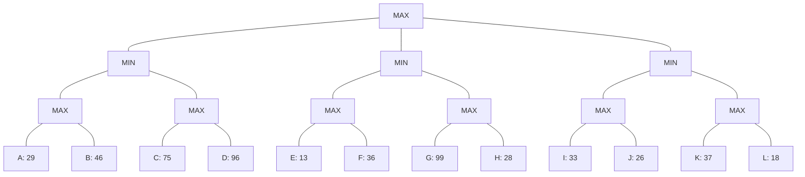

## The Question

3-ply game tree. Root = MAX, three MIN children, each with two MAX children, each with two horizon leaves A–L.

| # | Question | Official answer |
|---|----------|-----------------|
| 4.1 | Strategy for MAX (A: A,B · B: A,B,E,F,I,J · C: I,K · D: A,E,I,K) | **C** |
| 4.2 | Best strategy leaves | `B,D` |
| 4.3 | Alpha-Beta pruned | `D,G,H,K,L` |
| 4.4 | Force MinMax to 36 (one node, largest value) | `B,36` |

## The Topic in 60 Seconds

- **Back up**: MAX takes max, MIN takes min.
- **Strategy**: MAX commits to one child per MAX node; MIN branches everywhere.
- **Force MinMax**: change one leaf's eval to make the root value a target.

> Deep-dive: [Game Strategies](/concepts/week-07-game-search/03-game-strategies), [Force MinMax Value](/concepts/week-07-game-search/05-force-minmax-value), [Alpha-Beta Pruning](/concepts/week-07-game-search/02-alpha-beta-pruning).

## Step 0 — Back up

- $N_{11} = \max(29, 46) = 46$; $N_{12} = \max(75, 96) = 96$
- $N_{21} = \max(13, 36) = 36$; $N_{22} = \max(99, 28) = 99$
- $N_{31} = \max(33, 26) = 33$; $N_{32} = \max(37, 18) = 37$
- $N_1 = \min(46, 96) = 46$; $N_2 = \min(36, 99) = 36$; $N_3 = \min(33, 37) = 33$
- Root $= \max(46, 36, 33) = \mathbf{46}$ via $N_1$

## 4.1 — Strategy for MAX → **C (I,K)**

A strategy for MAX = one leaf per MAX node on a single root-to-horizon commitment: MAX fixes one child at the root, then one leaf inside each surviving MAX grandchild. Option C: (I, K) — Root → $N_3$ ✓; $N_3$ (MIN) keeps both $N_{31}$ and $N_{32}$ ✓; $N_{31}$ picks I ✓; $N_{32}$ picks K ✓. Two leaves, one per MAX node — valid.

Option A = (A, B): both leaves sit under $N_{11}$; $N_{12}$ is left without a move. Option B = (A, B, E, F, I, J): six leaves spread over all three subtrees — MAX cannot commit to three root children at once. Option D = (A, E, I, K): A forces the root to $N_1$ while E forces it to $N_2$ — contradiction. → **C** ✓

## 4.2 — Best strategy → `B,D`

Root → $N_1$ (46). $N_1$ keeps $N_{11}$ and $N_{12}$. $N_{11}$ picks **B** (46 beats 29). $N_{12}$ picks **D** (96 beats 75). Leaves **(B, D)**, guarantee min(46, 96) = 46 = game value ✓

## 4.3 — Alpha-Beta prunes → `D,G,H,K,L`

| Node | Window | Happening |
|------|--------|-----------|
| $N_1$ (MIN) | $(-\infty, \infty)$ | $N_{11}$ (MAX): A=29, B=46 → returns 46. $\beta = 46$ |
| $N_{12}$ (MAX) | $(-\infty, 46)$ | C = 75 ≥ 46 → **β-cutoff** — D pruned! |
| Root | α = 46 | |
| $N_2$ (MIN) | $(46, \infty)$ | $N_{21}$ (MAX): E=13, F=36 → returns 36 ≤ 46 → **α-cutoff** — $N_{22}$ (G, H) pruned! |
| Root | α = 46 | |
| $N_3$ (MIN) | $(46, \infty)$ | $N_{31}$ (MAX): I=33, J=26 → returns 33 ≤ 46 → **α-cutoff** — $N_{32}$ (K, L) pruned! |

Pruned: **D, G, H, K, L** ✓

## 4.4 — Force MinMax to 36 → `B,36`

Current root = 46 via $N_1 = \min(N_{11}, N_{12}) = \min(46, 96)$. To lower the root to 36:

- Lower $N_{11}$ to 36: $N_{11} = \max(A, B)$. Set **B = 36** → $N_{11} = \max(29, 36) = 36$. Then $N_1 = \min(36, 96) = 36$ → Root = max(36, 36, 33) = **36** ✓
- B = 36 is the **largest** value for B that achieves root = 36 (any higher and $N_{11} > 36$ → root > 36).

→ **B, 36** ✓

## Watch the whole tree resolve

<PaperTrace
  height={430}
  nodeWidth={64}
  nodeHeight={44}
  nodeFontSize={9.5}
  legend={[
    { color: "#b45309", label: "backing up" },
    { color: "#4b5563", label: "evaluated / backed up" },
    { color: "#dc2626", label: "pruned by alpha-beta" },
    { color: "#16a34a", label: "best line / force point" },
  ]}
  nodes={[
    { id: "R", label: "MAX", x: 361, y: 20 },
    { id: "N1", label: "MIN", x: 113, y: 105 },
    { id: "N2", label: "MIN", x: 361, y: 105 },
    { id: "N3", label: "MIN", x: 609, y: 105 },
    { id: "N11", label: "MAX", x: 51, y: 190 },
    { id: "N12", label: "MAX", x: 175, y: 190 },
    { id: "N21", label: "MAX", x: 299, y: 190 },
    { id: "N22", label: "MAX", x: 423, y: 190 },
    { id: "N31", label: "MAX", x: 547, y: 190 },
    { id: "N32", label: "MAX", x: 671, y: 190 },
    { id: "A", label: "A 29", x: 20, y: 290 },
    { id: "B", label: "B 46", x: 82, y: 350 },
    { id: "C", label: "C 75", x: 144, y: 290 },
    { id: "D", label: "D 96", x: 206, y: 350 },
    { id: "E", label: "E 13", x: 268, y: 290 },
    { id: "F", label: "F 36", x: 330, y: 350 },
    { id: "G", label: "G 99", x: 392, y: 290 },
    { id: "H", label: "H 28", x: 454, y: 350 },
    { id: "I", label: "I 33", x: 516, y: 290 },
    { id: "J", label: "J 26", x: 578, y: 350 },
    { id: "K", label: "K 37", x: 640, y: 290 },
    { id: "L", label: "L 18", x: 702, y: 350 },
  ]}
  edges={[
    { id: "rn1", from: "R", to: "N1" },
    { id: "rn2", from: "R", to: "N2" },
    { id: "rn3", from: "R", to: "N3" },
    { id: "n1a", from: "N1", to: "N11" },
    { id: "n1b", from: "N1", to: "N12" },
    { id: "n2a", from: "N2", to: "N21" },
    { id: "n2b", from: "N2", to: "N22" },
    { id: "n3a", from: "N3", to: "N31" },
    { id: "n3b", from: "N3", to: "N32" },
    { id: "eA", from: "N11", to: "A" },
    { id: "eB", from: "N11", to: "B" },
    { id: "eC", from: "N12", to: "C" },
    { id: "eD", from: "N12", to: "D" },
    { id: "eE", from: "N21", to: "E" },
    { id: "eF", from: "N21", to: "F" },
    { id: "eG", from: "N22", to: "G" },
    { id: "eH", from: "N22", to: "H" },
    { id: "eI", from: "N31", to: "I" },
    { id: "eJ", from: "N31", to: "J" },
    { id: "eK", from: "N32", to: "K" },
    { id: "eL", from: "N32", to: "L" },
  ]}
  steps={[
    { label: "Horizon evals", note: "Leaves A-L carry the static evaluations.\nNothing backed up yet.", nodes: { A: "terminal", B: "terminal", C: "terminal", D: "terminal", E: "terminal", F: "terminal", G: "terminal", H: "terminal", I: "terminal", J: "terminal", K: "terminal", L: "terminal" } },
    { label: "Back up MAX row", note: "N11 = max(29,46) = 46\nN12 = max(75,96) = 96\nN21 = max(13,36) = 36   N22 = max(99,28) = 99\nN31 = max(33,26) = 33   N32 = max(37,18) = 37", nodes: { N11: "current", N12: "current", N21: "current", N22: "current", N31: "current", N32: "current", A: "terminal", B: "terminal", C: "terminal", D: "terminal", E: "terminal", F: "terminal", G: "terminal", H: "terminal", I: "terminal", J: "terminal", K: "terminal", L: "terminal" } },
    { label: "Back up MIN + root", note: "N1 = min(46,96) = 46\nN2 = min(36,99) = 36\nN3 = min(33,37) = 33\nRoot = max(46,36,33) = 46 via N1.\nBest strategy leaves: B (from N11), D (from N12).", nodes: { R: "current", N1: "explored", N2: "explored", N3: "explored", N11: "explored", N12: "explored", N21: "explored", N22: "explored", N31: "explored", N32: "explored", A: "terminal", B: "terminal", C: "terminal", D: "terminal", E: "terminal", F: "terminal", G: "terminal", H: "terminal", I: "terminal", J: "terminal", K: "terminal", L: "terminal" } },
    { label: "Alpha-beta prunes", note: "N12: C=75 ≥ beta 46 → cutoff, D never read.\nN2 window (46,inf): N21 returns 36 ≤ 46 → prune N22 (G,H).\nN3 window (46,inf): N31 returns 33 ≤ 46 → prune N32 (K,L).\nPruned horizon: D, G, H, K, L.", nodes: { R: "current", N12: "pruned", N22: "pruned", N32: "pruned", D: "pruned", G: "pruned", H: "pruned", K: "pruned", L: "pruned", N1: "explored", N2: "explored", N3: "explored", N11: "explored", N21: "explored", N31: "explored" }, edges: { eD: "pruned", eG: "pruned", eH: "pruned", eK: "pruned", eL: "pruned", n1b: "pruned", n2b: "pruned", n3b: "pruned" } },
    { label: "Best line + force 36", note: "Best strategy: B,D guaranteeing 46.\nForce root=36: set B=36 → N11=max(29,36)=36\n→ N1=min(36,96)=36 → Root=max(36,36,33)=36.\nB=36 is the largest value that works (any higher keeps N11>36).", nodes: { R: "path", N1: "path", N11: "path", N12: "path", B: "goal", D: "goal" }, edges: { rn1: "path", n1a: "path", n1b: "path", eB: "path", eD: "path" } },
  ]}
/>

## Tricks & Tips

<Accordion title="Fast methods for this exact tree">
1. Back up the six MAX squares first (one max() each), then the three MINs, then the root — 46/36/33 → 46.
2. In α-β, the cutoff at $N_{12}$ fires on C = 75 alone (75 ≥ β = 46): D's 96 is never even looked at. Don't compute pruned leaves.
3. Force MinMax: only $N_1$ controls the root (46 > 36 > 33), so the change must land inside $N_1$; lowering via $N_{12}$ fails because C = 75 dominates — the lever is B.
4. "Largest value" answers sit exactly at the target: B must make $\max(29, B) = 36$, so B = 36, not 35, not anything above.
</Accordion>

**Answers:** 4.1 **C** · 4.2 `B,D` · 4.3 `D,G,H,K,L` · 4.4 `B,36`
