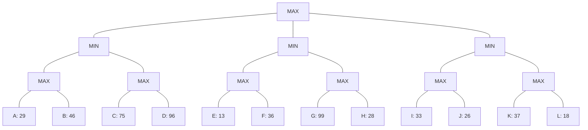

## The Question

3-ply game tree. Root = MAX, three MIN children, each with two MAX children, each with two horizon leaves A–L.

| # | Question | Official answer |
|---|----------|-----------------|
| 4.1 | Strategy for MAX (A: A,B · B: A,B,E,F,I,J · C: I,K · D: A,E,I,K) | **C** |
| 4.2 | Best strategy leaves | `B,D` |
| 4.3 | Alpha-Beta pruned | `D,G,H,K,L` |
| 4.4 | Force MinMax to 36 (one node, largest value) | `B,36` |

## The Topic in 60 Seconds

- **Back up**: MAX takes max, MIN takes min.
- **Strategy**: MAX commits to one child per MAX node; MIN branches everywhere.
- **Force MinMax**: change one leaf's eval to make the root value a target.

> Deep-dive: [Game Strategies](/concepts/week-07-game-search/03-game-strategies), [Force MinMax Value](/concepts/week-07-game-search/05-force-minmax-value), [Alpha-Beta Pruning](/concepts/week-07-game-search/02-alpha-beta-pruning).

## Step 0 — Back up

- $N_{11} = \max(29, 46) = 46$; $N_{12} = \max(75, 96) = 96$
- $N_{21} = \max(13, 36) = 36$; $N_{22} = \max(99, 28) = 99$
- $N_{31} = \max(33, 26) = 33$; $N_{32} = \max(37, 18) = 37$
- $N_1 = \min(46, 96) = 46$; $N_2 = \min(36, 99) = 36$; $N_3 = \min(33, 37) = 33$
- Root $= \max(46, 36, 33) = \mathbf{46}$ via $N_1$

## 4.1 — Strategy for MAX → **C (I,K)**

A strategy for MAX = one leaf per MAX node, no splitting. Option C: (I, K) — Root→$N_3$ ✓; $N_3$ (MIN) keeps both $N_(31)$ and $N_(32)$ ✓; $N_(31)$ picks I ✓; $N_(32)$ picks K ✓. Valid.

Options A and D split at Root (A via $N_1$, others via $N_2$/$N_3$). Option B has too many leaves for the tree shape. → **C** ✓

## 4.2 — Best strategy → `B,D`

Root → $N_1$ (46). $N_1$ keeps $N_(11)$ and $N_(12)$. $N_(11)$ picks **B** (46 beats 29). $N_(12)$ picks **D** (96 beats 75). Leaves **(B, D)**, guarantee min(46, 96) = 46 = game value ✓

## 4.3 — Alpha-Beta prunes → `D,G,H,K,L`

| Node | Window | Happening |
|------|--------|-----------|
| $N_1$ (MIN) | $(-\infty, \infty)$ | $N_{11}$ (MAX): A=29, B=46 → returns 46. $\beta = 46$ |
| $N_{12}$ (MAX) | $(-\infty, 46)$ | C = 75 ≥ 46 → **β-cutoff** — D pruned! |
| Root | α = 46 | |
| $N_2$ (MIN) | $(46, \infty)$ | $N_{21}$ (MAX): E=13, F=36 → returns 36 ≤ 46 → **α-cutoff** — $N_{22}$ (G, H) pruned! |
| Root | α = 46 | |
| $N_3$ (MIN) | $(46, \infty)$ | $N_{31}$ (MAX): I=33, J=26 → returns 33 ≤ 46 → **α-cutoff** — $N_{32}$ (K, L) pruned! |

Pruned: **D, G, H, K, L** ✓

## 4.4 — Force MinMax to 36 → `B,36`

Current root = 46 via $N_1 = \min(N_{11}, N_{12}) = \min(46, 96)$. To lower the root to 36:

- Lower $N_{11}$ to 36: $N_{11} = \max(A, B)$. Set **B = 36** → $N_{11} = \max(29, 36) = 36$. Then $N_1 = \min(36, 96) = 36$ → Root = max(36, 36, 33) = **36** ✓
- B = 36 is the **largest** value for B that achieves root = 36 (any higher and $N_{11} > 36$ → root > 36).

→ **B, 36** ✓

## Tricks & Tips

<Accordion title="Fast methods">
1. Back up MAX squares first, then MINs, then root.
2. Force MinMax: identify which MIN parent controls the root; adjust the MAX child's winning leaf.
3. The "largest possible value" is always at the boundary — the target value itself.
4. α-β on 3-ply trees: a low first leaf at a MIN node cuts the sibling MAX subtree.
</Accordion>

**Answers:** 4.1 **C** · 4.2 `B,D` · 4.3 `D,G,H,K,L` · 4.4 `B,36`
