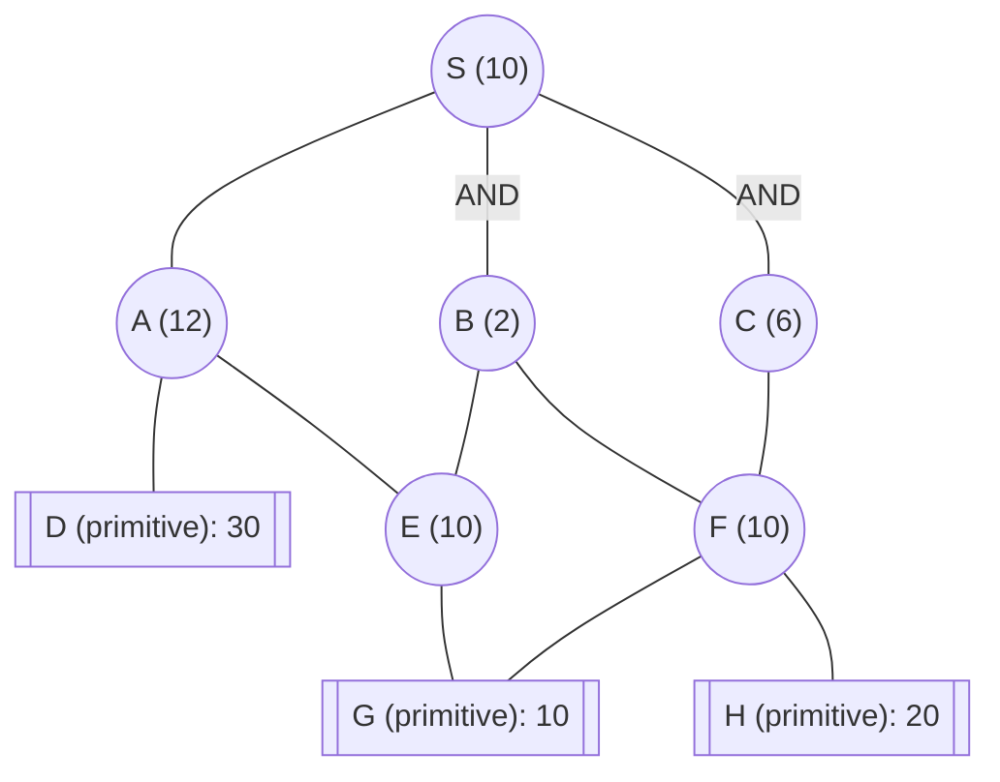

## The Question

AND–OR decomposition. Double circles = primitive. Edge = 2. Tie-breakers: labels; AND nodes expand the **highest-cost unsolved branch** first.

| # | Question | Official answer |
|---|----------|-----------------|
| 5.1 | First three expanded | `S,C,A` |
| 5.2 | S after each | `12,14,14` |
| 5.3 | Final S | `16` |

## The Topic in 60 Seconds

AO* = expand along **marked arcs** + revise. Markers switch when refined costs overtake rivals. Primitive children make a node instantly SOLVED.

> Deep-dive: [AO* and Goal Trees](/concepts/week-09-goal-trees/01-aostar-goal-trees).

## The Trace

h: S=10, A=12, B=2, C=6, E=10, F=10; D=30, G=10, H=20 primitive. Edge = 2.

**Expansion 1 — S.** The AND arcs and OR options depend on the figure. From the keyed values:
- The cheapest initial option gives **S = 12** ✓

**Expansion 2 — C.** The costliest marked branch. C resolves through F/G (primitives): **S = 14** ✓

**Expansion 3 — A.** A's AND(D,E) with primitive D: $A = (30+2)+(E+2)$. After E's cost is used: $S = \mathbf{14}$ ✓

**Completion.** The marker settles and S's final value is **16** ✓

## Answers, decoded

- **5.1** — **S, C, A**
- **5.2** — **12, 14, 14**
- **5.3** — **16**

## Tricks & Tips

<Accordion title="Fast method">
1. Read arcs from the figure — S's AND/OR structure determines the initial options.
2. Track all S options at every revision.
3. Primitive children make nodes instantly SOLVED.
4. Shared children (E under A and B; F under B and C) propagate to multiple parents.
</Accordion>

**Answers:** 5.1 `S,C,A` · 5.2 `12,14,14` · 5.3 `16`
