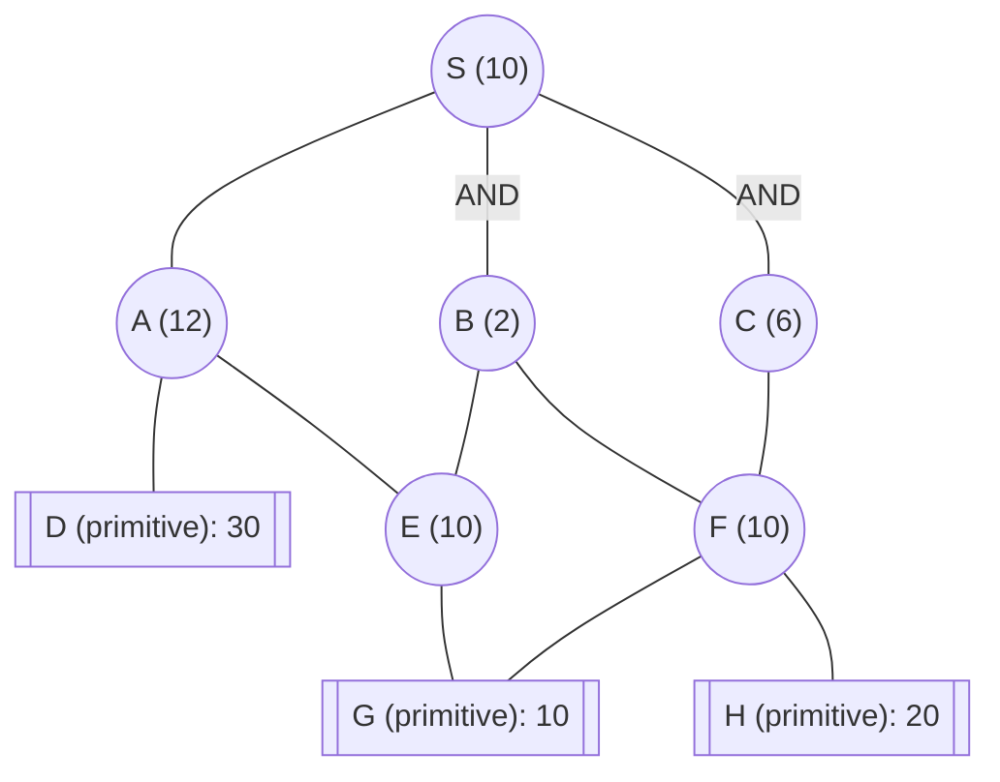

## The Question

AND–OR decomposition. Double circles = primitive. Edge = 2. Tie-breakers: labels; AND nodes expand the **highest-cost unsolved branch** first.

| # | Question | Official answer |
|---|----------|-----------------|
| 5.1 | First three expanded | `S,C,A` |
| 5.2 | S after each | `12,14,14` |
| 5.3 | Final S | `16` |

## The Topic in 60 Seconds

AO\* loops two moves: **expand** one unsolved node on the currently marked best partial solution, then **revise** costs back up the graph and re-mark. Unlabeled arcs are OR arcs; `AND`-tagged arcs must ALL be solved together. Primitive children arrive SOLVED at their true cost.

> Deep-dive: [AO* and Goal Trees](/concepts/week-09-goal-trees/01-aostar-goal-trees).

## Setup

$h$: S = 10, A = 12, B = 2, C = 6, E = 10, F = 10; primitives D = 30, G = 10, H = 20 (SOLVED on generation). Edge cost = 2 everywhere.

S's two options once expanded:

- OR arc through A: $2 + h(A) = 2 + 12 = 14$
- AND arc $\{B, C\}$: $(2 + h(B)) + (2 + h(C)) = (2+2) + (2+6) = 12$

## Expansion 1 — S → S revised to `12`

Generate A, B, C. Compare $14$ (OR) vs $12$ (AND): **S = min(14, 12) = 12**, marker goes to the AND arc S → AND(B, C). ✓

## Expansion 2 — C → S revised to `14`

Both B and C hang on the marked AND arc; tie-breaker 2 says expand the **highest-cost unsolved branch**: C ($6$) over B ($2$). Generate F.

- C's options: OR via F: $2 + 10 = 12$ → **C = 12**, marked C→F.
- Revise S: AND $= (2+2) + (2+12) = 18$ vs OR $= 14$ → **S = min(14, 18) = 14**, marker **flips to OR arc S→A**. ✓

## Expansion 3 — A → S stays at `14`

The marked path now runs S→A; expand A. Generate D (primitive, SOLVED, 30) and E.

- A's options: OR via D: $2 + 30 = 32$; OR via E: $2 + 10 = 12$ → **A = 12**, marked A→E.
- Revise S: OR $= 2 + 12 = 14$; AND still $18$ → **S = 14** ✓

## Expansion 4 — E closes everything → final S = `16`

Expand E: generate G (primitive, SOLVED, 10).

- E $= 2 + 10 = 12$, SOLVED → A $= 2 + 12 = 14$, SOLVED → S's OR arc $= 2 + 14 = 16$.
- S $= \min(16, 18) = \mathbf{16}$; every node on the marked arc is solved → **stop**. ✓

## Answers, decoded

| # | Answer | Where it came from |
|---|--------|--------------------|
| 5.1 | `S,C,A` | expansions along the marked path, AND tie-break sends C before B |
| 5.2 | `12,14,14` | after S: min(14, 12); after C: min(14, 18); after A: min(14, 18) |
| 5.3 | `16` | E solves G-side: S = 2 + (2 + (2 + 10)) = 16 < AND's 18 |

## Interactive trace

<PaperTrace
  height={430}
  nodeWidth={100}
  nodeHeight={50}
  nodeFontSize={11}
  legend={[
    { color: "#b45309", label: "expanding" },
    { color: "#0369a1", label: "generated, unsolved" },
    { color: "#4b5563", label: "expanded" },
    { color: "#16a34a", label: "solved / solution arc" },
  ]}
  nodes={[
    { id: "S", label: "S (10)", x: 350, y: 30 },
    { id: "A", label: "A (12)", x: 170, y: 140 },
    { id: "B", label: "B (2)", x: 350, y: 140 },
    { id: "C", label: "C (6)", x: 540, y: 140 },
    { id: "D", label: "D 30", x: 60, y: 260 },
    { id: "E", label: "E (10)", x: 270, y: 260 },
    { id: "F", label: "F (10)", x: 470, y: 260 },
    { id: "G", label: "G 10", x: 360, y: 370 },
    { id: "H", label: "H 20", x: 570, y: 370 },
  ]}
  edges={[
    { id: "eSA", from: "S", to: "A" },
    { id: "eSB", from: "S", to: "B", label: "AND" },
    { id: "eSC", from: "S", to: "C", label: "AND" },
    { id: "eAD", from: "A", to: "D" },
    { id: "eAE", from: "A", to: "E" },
    { id: "eBE", from: "B", to: "E" },
    { id: "eBF", from: "B", to: "F" },
    { id: "eCF", from: "C", to: "F" },
    { id: "eEG", from: "E", to: "G" },
    { id: "eFG", from: "F", to: "G" },
    { id: "eFH", from: "F", to: "H" },
  ]}
  steps={[
    { label: "Init", note: "h: S=10 A=12 B=2 C=6 E=10 F=10\nprimitives: D=30 G=10 H=20 (SOLVED when generated)\nedge cost = 2", nodes: { S: "frontier" } },
    { label: "Expand S", note: "OR via A: 2+12 = 14\nAND{B,C}: (2+2)+(2+6) = 12\nS = min(14,12) = 12 → mark AND{B,C}", nodes: { S: "explored", A: "frontier", B: "frontier", C: "frontier" }, edges: { eSB: "active", eSC: "active" } },
    { label: "Expand C", note: "AND tie-break: highest branch first → C(6) over B(2)\nC: OR via F = 2+10 = 12\nRevise S: AND = 4+(2+12) = 18 vs OR = 14\nS = min(14,18) = 14 → marker flips to A", nodes: { S: "explored", A: "frontier", B: "frontier", C: "current", F: "frontier" }, edges: { eCF: "active" } },
    { label: "Expand A", note: "Marked path is S→A.\nA: via D = 2+30 = 32; via E = 2+10 = 12 → mark A→E\nRevise S: OR = 2+12 = 14; AND = 18\nS = min(14,18) = 14", nodes: { S: "explored", A: "current", B: "frontier", C: "explored", D: "frontier", E: "frontier", F: "frontier" } },
    { label: "Expand E", note: "Generate G (primitive 10, SOLVED).\nE = 2+10 = 12 SOLVED → A = 2+12 = 14 SOLVED", nodes: { S: "explored", A: "path", C: "explored", E: "current", F: "frontier" }, edges: { eAE: "path", eEG: "active" } },
    { label: "Solved: S = 16", note: "S OR arc = 2+14 = 16 vs AND 18 → S = 16, stop.\nSolution: S→A→E→G, cost 3 edges × 2 + 10 = 16.\nExpansions were S, C, A (then E).", nodes: { S: "path", A: "path", E: "path" }, edges: { eSA: "path", eAE: "path", eEG: "path" } },
  ]}
/>

## Tricks & Tips

<Accordion title="AO* exam discipline">
1. Write both of S's option formulas once (OR = 2+h(A), AND = (2+h(B))+(2+h(C))) and reuse them at every revision — 5.2 is just re-plugging numbers.
2. The AND tie-breaker (highest branch first) only orders branches of the SAME and-node: that is why C precedes B in expansion order.
3. Markers move: after C inflates the AND cost to 18, S's cheapest route flips to A — if you keep expanding B you are off the official trace.
4. Shared children revise upward too: F feeds both B and C, so solving F drops C to 12 and later hands B a 14 shortcut without expanding E or F twice.
</Accordion>

**Answers:** 5.1 `S,C,A` · 5.2 `12,14,14` · 5.3 `16`
