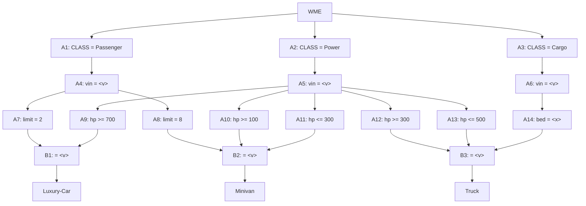

## The Question

A Rete net classifies vehicles. Working memory:

```text
101. (Cargo     ^vin A1 ^bed flat)
102. (Passenger ^vin A1 ^limit 2)
103. (Passenger ^vin B2 ^limit 8)
104. (Passenger ^vin C3 ^limit 2)
105. (Power     ^vin A1 ^hp 400)
106. (Power     ^vin B2 ^hp 250)
107. (Power     ^vin C3 ^hp 900)
108. (Wheel     ^vin B2 ^tyre regular)
109. (Wheel     ^vin C3 ^tyre regular)
```



| # | Question | Official answer |
|---|----------|-----------------|
| 6.1 | Conflict set (A: Luxury-Car,104,107 · B: Minivan,103,106 · C: Truck,101,102,105 · D: Minivan,103,106,108) | **A, B, C** |
| 6.2 | Specificity fires | **C** |
| 6.3 | Recency fires | **A** |

## The Topic in 60 Seconds

Alpha nodes filter single WMEs; beta nodes join on the shared `^vin`. Conflict set = all full tuples. **Specificity** = most conditions; **Recency** = newest max-timestamp.

> Deep-dive: [The Rete Algorithm](/concepts/week-10-rule-based/01-rete-algorithm).

## The joins

Net rules: **Luxury-Car** = Passenger limit-2 ⋈ Power hp ≥ 700 · **Minivan** = Passenger limit-8 ⋈ Power hp ≤ 300 · **Truck** = Cargo bed ⋈ Passenger limit-2 ⋈ Power hp ≤ 500 (all same vin).

| Rule | Join check | Tuple |
|------|------------|-------|
| Luxury-Car | limit-2 &#123;102: A1, 104: C3&#125; ⋈ hp≥700 &#123;107: C3&#125; → vin C3 | **(Luxury-Car, 104, 107)** ✓ |
| Minivan | limit-8 &#123;103: B2&#125; ⋈ hp≤300 &#123;106: B2&#125; → vin B2 | **(Minivan, 103, 106)** ✓ |
| Truck | bed &#123;101: A1&#125; ⋈ limit-2 &#123;102: A1&#125; ⋈ hp≤500 &#123;105: A1&#125; → vin A1 | **(Truck, 101, 102, 105)** ✓ |

**Conflict set** = options **A, B, C** ✓ (D is invalid — Minivan has no Wheel condition.)

## 6.2 — Specificity → **C**

Condition counts: Luxury = 2, Minivan = 2, **Truck = 3** → most conditions → option **C** ✓

## 6.3 — Recency → **A**

Max timestamps: Luxury → **107**; Minivan → 106; Truck → 105. Newest wins → option **A** ✓

## Tricks & Tips

<Accordion title="4-step recipe">
1. WME → alpha table.
2. Join on vin; mixed-vin tuples die (option D).
3. Specificity: Truck's three conditions beat the two-condition rivals.
4. Recency: max timestamp — 107 (the hp-900 Power WME) hands it to Luxury-Car.
</Accordion>

**Answers:** 6.1 **A, B, C** · 6.2 **C** · 6.3 **A**
