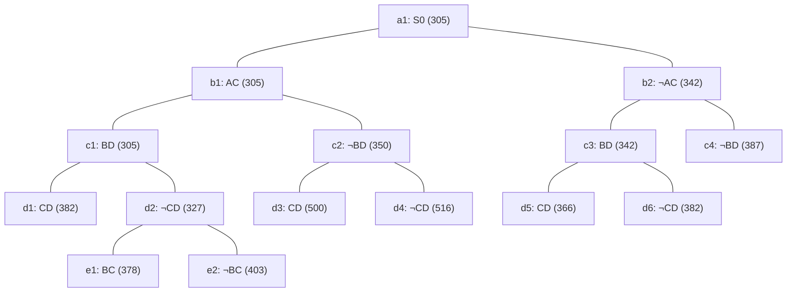

## The Question

TSP BnB algorithm is solving a TSP instance where the cities are A, B, C, .... and so on. The BnB search tree (at the point when the algorithm discovers the optimal tour) is provided below.

Each node in the search tree displays an edge (either XY or ¬XY), a cost value, and a unique reference number (a1, b1, ..., c1, ..., d1, ..., e1, e2). Use the reference numbers to break ties. When required, use reference numbers in short answers.

What information can you glean from the search tree? Answer the sub-questions based on the information gleaned from the search tree.

| # | Question | Official answer |
|---|----------|-----------------|
| 2.1 | Determine the number of cities in the TSP instance. Enter the number of cities i | `5` |
| 2.2 | Let S0 (ref. no. a1) be the first node to be refined, identify the next 4 nodes  | `b1,c1,d2,b2` |
| 2.3 | Which node represents the optimal tour? Enter the node reference number in the t | `d5` |
| 2.4 | What is the cost of the optimal tour? Enter the cost of the optimal tour in the  | `366` |
| 2.5 | Start from city A, what is the path representation of the optimal tour? Enter th | `A,B,D,C,E` |

## The Topic in 60 Seconds

> Deep-dive: browse the [Concepts](/concepts) section for the relevant topic page.

## Solutions

**2.1** — Determine the number of cities in the TSP instance. Enter the number of cities i  
**Answer:** `5`

**2.2** — Let S0 (ref. no. a1) be the first node to be refined, identify the next 4 nodes   
**Answer:** `b1,c1,d2,b2`

**2.3** — Which node represents the optimal tour? Enter the node reference number in the t  
**Answer:** `d5`

**2.4** — What is the cost of the optimal tour? Enter the cost of the optimal tour in the   
**Answer:** `366`

**2.5** — Start from city A, what is the path representation of the optimal tour? Enter th  
**Answer:** `A,B,D,C,E`

## Tricks & Tips

<Accordion title="Exam method">
1. Read the question carefully — identify the algorithm or technique.
2. Trace step by step, showing your working.
3. Verify your answer against the question constraints.
</Accordion>
