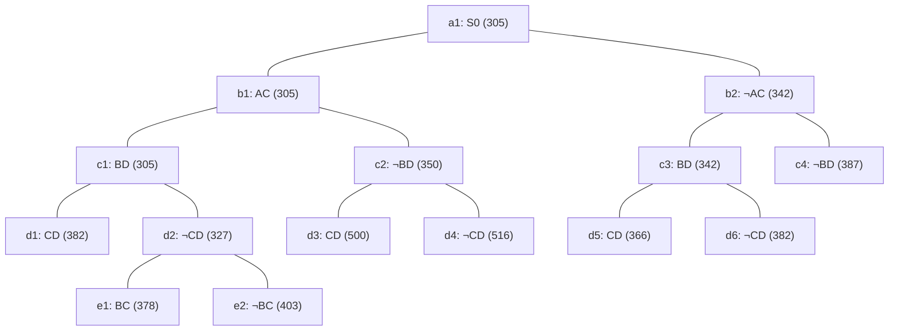

## The Question

TSP BnB algorithm is solving a TSP instance where the cities are A, B, C, .... and so on. The BnB search tree (at the point when the algorithm discovers the optimal tour) is provided below.

Each node in the search tree displays an edge (either XY or ¬XY), a cost value, and a unique reference number (a1, b1, ..., c1, ..., d1, ..., e1, e2). Use the reference numbers to break ties. When required, use reference numbers in short answers.

What information can you glean from the search tree? Answer the sub-questions based on the information gleaned from the search tree.

| # | Question | Official answer |
|---|----------|-----------------|
| 2.1 | Determine the number of cities in the TSP instance | `5` |
| 2.2 | Let S0 (ref. no. a1) be the first node to be refined, identify the next 4 nodes refined | `b1,c1,d2,b2` |
| 2.3 | Which node represents the optimal tour? | `d5` |
| 2.4 | What is the cost of the optimal tour? | `366` |
| 2.5 | Starting from city A, what is the path representation of the optimal tour? | `A,B,D,C,E` |

## The Topic in 60 Seconds

Every node = an edge decision (`XY` include / `¬XY` exclude) with a lower bound. **Refine** = pop the cheapest bound and branch both ways. A node with no children in the snapshot is a complete **tour**. When a tour pops while all open bounds are ≥ its cost, it is optimal.

> Deep-dive: [Reading BnB Trees](/concepts/week-05-optimal-tsp/01-bnb-tree-reading), [Branch and Bound](/concepts/week-03-heuristic-search/05-branch-and-bound).

## 2.1 — Number of cities → `5`

The deepest branch runs root → b → c → d → **e** (nodes e1, e2): four decision levels below the root. Each level settles one tour edge and the remainder is forced, so $N - 1$ levels ⇒ $N = 4 + 1 =$ **5 cities** ✓

## 2.2 — Refine order after a1 → `b1,c1,d2,b2`

Pop the minimum bound each round (ties → reference labels). Full ledger:

| Pop | Node : bound | Children created | OPEN after (cheapest first) |
|-----|--------------|------------------|------------------------------|
| 1 | a1 : 305 | b1 : 305, b2 : 342 | b1 305 · b2 342 |
| 2 | b1 : 305 | c1 : 305, c2 : 350 | c1 305 · b2 342 · c2 350 |
| 3 | c1 : 305 | d1 : 382, d2 : 327 | d2 327 · b2 342 · c2 350 · d1 382 |
| 4 | d2 : 327 | e1 : 378, e2 : 403 | b2 342 · c2 350 · e1 378 · d1 382 · e2 403 |
| 5 | b2 : 342 | c3 : 342, c4 : 387 | c3 342 · c2 350 · e1 378 · d1 382 · c4 387 · e2 403 |

Refined #2–#5 = **b1, c1, d2, b2** ✓ — note d2 (327) leapfrogs everything right after being created.

## 2.3 & 2.4 — Optimal node and cost → `d5`, `366`

Continue the ledger:

| Pop | Node : bound | Children created | OPEN after |
|-----|--------------|------------------|------------|
| 6 | c3 : 342 | d5 : 366, d6 : 382 | c2 350 · d5 366 · e1 378 · d1 382 · d6 382 · c4 387 · e2 403 |
| 7 | c2 : 350 | d3 : 500, d4 : 516 | d5 366 · e1 378 · d1 382 · d6 382 · c4 387 · e2 403 · d3 500 · d4 516 |
| 8 | **d5 : 366 — leaf ⇒ tour** | none | e1 378 · d1 382 · d6 382 · c4 387 · e2 403 · d3 500 · d4 516 |

d5 pops as a leaf with every open bound ≥ 366 → nothing can beat it → **d5 is the optimal tour at cost `366`** ✓

## 2.5 — Tour from city A → `A,B,D,C,E`

Walk a1 → d5: **¬AC** (b2), **BD in** (c3), **CD in** (d5). Fixed facts on the five cities:

| City | Degree from fixed edges | Note |
|------|-------------------------|------|
| B | 1 (BD) | needs 1 more |
| D | 2 (BD, CD) | full |
| C | 1 (CD) | AC excluded |
| A | 0 | AC excluded |
| E | 0 | free |

D is full, so A's two partners come from B and E → **AB and AE forced**, which fills B. C cannot use A (excluded) or B/D (full), leaving **CE forced**. Final edge set: AB, BD, DC, CE, EA → cycle **A-B-D-C-E-A** = `A,B,D,C,E`, five cities ✓

Sanity read-back: the tour uses BD ✓, CD ✓ and avoids AC ✓ exactly as d5's ancestry demands.

## Interactive refinement trace

<PaperTrace
  height={470}
  nodeWidth={88}
  nodeHeight={46}
  nodeFontSize={10}
  legend={[
    { color: "#b45309", label: "popping (min bound)" },
    { color: "#0369a1", label: "on OPEN" },
    { color: "#4b5563", label: "refined" },
    { color: "#16a34a", label: "optimal tour leaf" },
  ]}
  nodes={[
    { id: "a1", label: "a1 S0 305", x: 360, y: 25 },
    { id: "b1", label: "b1 AC 305", x: 180, y: 110 },
    { id: "b2", label: "b2 ¬AC 342", x: 540, y: 110 },
    { id: "c1", label: "c1 BD 305", x: 80, y: 195 },
    { id: "c2", label: "c2 ¬BD 350", x: 290, y: 195 },
    { id: "c3", label: "c3 BD 342", x: 480, y: 195 },
    { id: "c4", label: "c4 ¬BD 387", x: 650, y: 195 },
    { id: "d1", label: "d1 CD 382", x: 20, y: 280 },
    { id: "d2", label: "d2 ¬CD 327", x: 150, y: 280 },
    { id: "d3", label: "d3 CD 500", x: 250, y: 280 },
    { id: "d4", label: "d4 ¬CD 516", x: 340, y: 280 },
    { id: "d5", label: "d5 CD 366", x: 450, y: 280 },
    { id: "d6", label: "d6 ¬CD 382", x: 550, y: 280 },
    { id: "e1", label: "e1 BC 378", x: 100, y: 365 },
    { id: "e2", label: "e2 ¬BC 403", x: 200, y: 365 },
  ]}
  edges={[
    { id: "x1", from: "a1", to: "b1" },
    { id: "x2", from: "a1", to: "b2" },
    { id: "x3", from: "b1", to: "c1" },
    { id: "x4", from: "b1", to: "c2" },
    { id: "x5", from: "b2", to: "c3" },
    { id: "x6", from: "b2", to: "c4" },
    { id: "x7", from: "c1", to: "d1" },
    { id: "x8", from: "c1", to: "d2" },
    { id: "x9", from: "c2", to: "d3" },
    { id: "x10", from: "c2", to: "d4" },
    { id: "x11", from: "c3", to: "d5" },
    { id: "x12", from: "c3", to: "d6" },
    { id: "x13", from: "d2", to: "e1" },
    { id: "x14", from: "d2", to: "e2" },
  ]}
  steps={[
    { label: "Pop a1 : 305", note: "children b1:305, b2:342\nOPEN = [b1 305 · b2 342]", nodes: { a1: "explored", b1: "frontier", b2: "frontier" } },
    { label: "Pop b1 : 305", note: "children c1:305, c2:350\nOPEN = [c1 305 · b2 342 · c2 350]", nodes: { a1: "explored", b1: "current", b2: "frontier", c1: "frontier", c2: "frontier" } },
    { label: "Pop c1 : 305", note: "children d1:382, d2:327\nOPEN = [d2 327 · b2 342 · c2 350 · d1 382]", nodes: { a1: "explored", b1: "explored", b2: "frontier", c1: "current", c2: "frontier", d1: "frontier", d2: "frontier" } },
    { label: "Pop d2 : 327", note: "children e1:378, e2:403\nOPEN = [b2 342 · c2 350 · e1 378 · d1 382 · e2 403]\nRefined so far: b1, c1, d2", nodes: { a1: "explored", b1: "explored", b2: "frontier", c1: "explored", c2: "frontier", d1: "frontier", d2: "current", e1: "frontier", e2: "frontier" } },
    { label: "Pop b2 : 342", note: "children c3:342, c4:387\nOPEN = [c3 342 · c2 350 · e1 378 · d1 382 · c4 387 · e2 403]\nRefined: b1, c1, d2, b2", nodes: { a1: "explored", b1: "explored", b2: "current", c1: "explored", c2: "frontier", c3: "frontier", c4: "frontier", d1: "frontier", d2: "explored", e1: "frontier", e2: "frontier" } },
    { label: "Pop c3 : 342", note: "children d5:366, d6:382\nOPEN = [c2 350 · d5 366 · e1 378 · d1 382 · d6 382 · c4 387 · e2 403]", nodes: { a1: "explored", b1: "explored", b2: "explored", c1: "explored", c2: "frontier", c3: "current", c4: "frontier", d1: "frontier", d2: "explored", d5: "frontier", d6: "frontier", e1: "frontier", e2: "frontier" } },
    { label: "Pop c2 : 350", note: "children d3:500, d4:516\nOPEN = [d5 366 · e1 378 · d1 382 · d6 382 · c4 387 · e2 403 · d3 500 · d4 516]", nodes: { a1: "explored", b1: "explored", b2: "explored", c1: "explored", c2: "current", c3: "explored", c4: "frontier", d1: "frontier", d2: "explored", d3: "frontier", d4: "frontier", d5: "frontier", d6: "frontier", e1: "frontier", e2: "frontier" } },
    { label: "Pop d5 : 366 → TOUR", note: "d5 is a leaf = complete tour.\nMin remaining open bound = e1 378 ≥ 366 → STOP.\nOptimal cost 366 via a1→b2(¬AC)→c3(BD)→d5(CD).\nTour by degree-forcing: A,B,D,C,E", nodes: { a1: "path", b1: "explored", b2: "path", c1: "explored", c2: "explored", c3: "path", c4: "explored", d1: "explored", d2: "explored", d3: "explored", d4: "explored", d5: "goal", d6: "explored", e1: "explored", e2: "explored" }, edges: { x2: "path", x5: "path", x11: "path" } },
  ]}
/>

## Tricks & Tips

<Accordion title="Reading these trees fast">
1. Keep a running OPEN list sorted by bound; every pop's answer is just the head of that list. The ledger above IS the markscheme.
2. Leaf = tour. Stop refining the instant a leaf ties-or-beats the cheapest open bound (here 366 vs 378).
3. Cities = deepest level + 1: levels b–e give 5. Do not count nodes.
4. Tour reconstruction is degree bookkeeping: write each city's degree from the included edges, then force the rest (D full ⇒ A must use B and E ⇒ CE closes the loop).
</Accordion>

**Answers:** 2.1 `5` · 2.2 `b1,c1,d2,b2` · 2.3 `d5` · 2.4 `366` · 2.5 `A,B,D,C,E`
