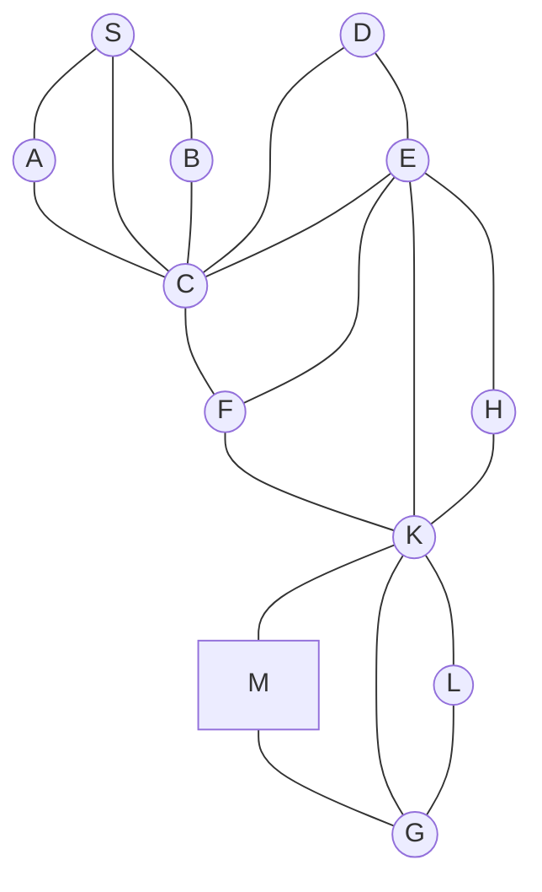

## The Question

The figure shows a map on a uniform grid where each tile is 10x10 in size. The start node is S and the goal node is G and the cost of each edge is 15 units. The MoveGen function returns nodes in alphabetical order. Use Manhattan Distance as the heuristic function. Where necessary, use node labels to break ties.

| # | Question | Official answer |
|---|----------|-----------------|
| 3.1 | What is the path found by A*? Enter the path as a comma separated list of node l | `S,C,F,K,G` |
| 3.2 | What is the cost of the path found by A*? | `60` |
| 3.3 | Is the Manhattan Distance admissible for the given problem? | `B` |

## The Topic in 60 Seconds

> Deep-dive: browse the [Concepts](/concepts) section for the relevant topic page.

## Solutions

**3.1** — What is the path found by A*? Enter the path as a comma separated list of node l  
**Answer:** `S,C,F,K,G`

**3.2** — What is the cost of the path found by A*?  
**Answer:** `60`

**3.3** — Is the Manhattan Distance admissible for the given problem?  
**Answer:** `B`

## Tricks & Tips

<Accordion title="Exam method">
1. Read the question carefully — identify the algorithm or technique.
2. Trace step by step, showing your working.
3. Verify your answer against the question constraints.
</Accordion>
