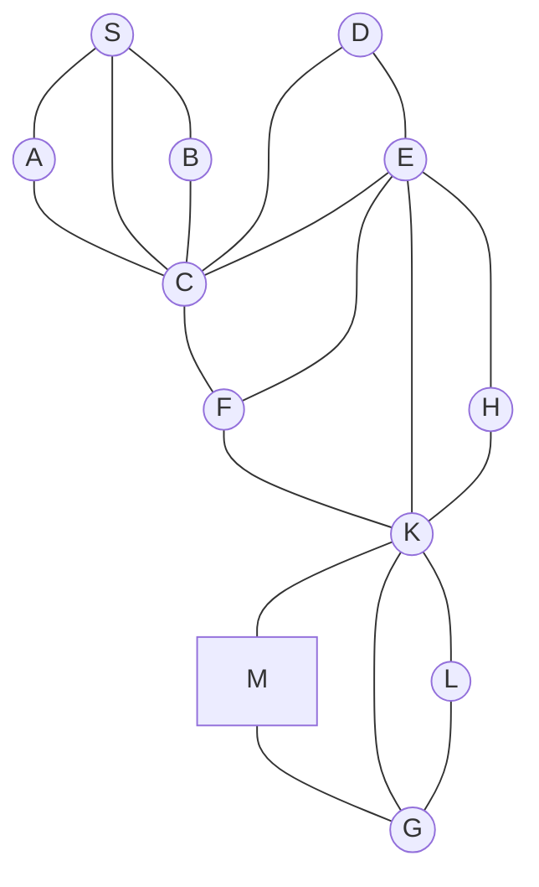

## The Question

The figure shows a map on a uniform grid where each tile is 10x10 in size. The start node is S and the goal node is G and the cost of each edge is 15 units. The MoveGen function returns nodes in alphabetical order. Use Manhattan Distance as the heuristic function. Where necessary, use node labels to break ties.

| # | Question | Official answer |
|---|----------|-----------------|
| 3.1 | What is the path found by A*? | `S,C,F,K,G` |
| 3.2 | What is the cost of the path found by A*? | `60` |
| 3.3 | Is the Manhattan Distance admissible for the given problem? | `B` — No |

## The Topic in 60 Seconds

A\* orders OPEN by $f(n) = g(n) + h(n)$. With every edge costing 15, $g$ = 15 × edges so far. Admissibility demands $h(n) \le h^*(n)$ for **every** node — one counterexample is enough to answer "No".

> Deep-dive: [A* Search](/concepts/week-03-heuristic-search/01-a-star-search).

## Step 0 — Grid coordinates and the h-table

Reading tile positions off the figure ($x$ rightward, $y$ downward); Manhattan distance measured in tiles and converted to cost units at 10 per tile:

| Node | (x, y) | Tiles to G | $h$ | Node | (x, y) | Tiles to G | $h$ |
|------|--------|------------|-----|------|--------|------------|-----|
| S | (1, 0) | 5 | 50 | F | (4, 0) | 2 | 20 |
| A | (2, 0) | 4 | 40 | H | (5, 1) | 2 | 20 |
| B | (2, 1) | 5 | 50 | K | (5, 0) | 1 | 10 |
| C | (3, 0) | 3 | 30 | M | (5, −1) | 2 | 20 |
| D | (3, 1) | 4 | 40 | L | (6, 1) | 1 | 10 |
| E | (4, 1) | 3 | 30 | G | (6, 0) | 0 | 0 |

## 3.1 — A* working → `S,C,F,K,G`

MoveGen alphabetical; each entry shows $g + h = f$ exactly.

| Step | Expanded ($f$) | Generate / update | OPEN after (cheapest first) |
|------|----------------|-------------------|------------------------------|
| 1 | S : $0+50=50$ | A : $15+40=55$ · B : $15+50=65$ · C : $15+30=45$ | C 45 · A 55 · B 65 |
| 2 | C : 45 | D : $30+40=70$ · E : $30+30=60$ · F : $30+20=50$ (A, B, S seen) | F 50 · A 55 · E 60 · B 65 · D 70 |
| 3 | F : 50 | K : $45+10=55$ (E already at 60, C closed) | A 55 · K 55 · E 60 · B 65 · D 70 |
| 4 | A : 55 (tie with K → labels) | nothing new (C, S seen) | K 55 · E 60 · B 65 · D 70 |
| 5 | K : 55 | L : $60+10=70$ · M : $60+20=80$ · G : $60+0=60$ · H : $60+20=80$ | G 60 · E 60 · B 65 · D 70 · L 70 · H 80 · M 80 |
| 6 | E : 60 (tie with G → labels) | H improves: $g$ $60 \to 45$, $f = 45+20 = 65$; D stays at 70 ($45+40 = 85$ worse) | G 60 · H 65 · B 65 · D 70 · L 70 · M 80 |
| 7 | **G : 60 — GOAL** | — | — |

Path: **S → C → F → K → G** ✓

## 3.2 — Cost of the path → `60`

Four edges × 15: $15 + 15 + 15 + 15 = \mathbf{60}$ ✓

## 3.3 — Admissible? → **No (`B`)**

| Node | $h$ | True cheapest cost $h^*$ | Verdict |
|------|-----|--------------------------|---------|
| M | 20 | $15$ (single edge M–G) | **overestimates** ✗ |
| H | 20 | $15$ (single edge H–K) | overestimates ✗ |

The figure joins nodes lying 2 Manhattan tiles apart (diagonal links) with a single cost-15 edge, while each tile counts as 10. So $h$ can exceed the true remaining cost → $h \not\le h^*$ → **not admissible → B** ✓ (A\* still returned a cheapest path here because the offenders hang off the main corridor.)

## Interactive A* trace

<StepGraph
  height={420}
  nodeWidth={100}
  nodeHeight={50}
  nodeFontSize={12}
  legend={[
    { color: "#b45309", label: "expanding" },
    { color: "#0369a1", label: "in OPEN (f = g+h)" },
    { color: "#4b5563", label: "expanded" },
    { color: "#16a34a", label: "returned path" },
  ]}
  steps={[
    {
      label: "Init",
      note: "OPEN = { S(g=0, h=50, f=50) }",
      elements: [
        { data: { id: "S", label: "S f=50", type: "frontier" }, position: { x: 30, y: 190 } },
        { data: { id: "A", label: "A", type: "unassigned" }, position: { x: 150, y: 70 } },
        { data: { id: "B", label: "B", type: "unassigned" }, position: { x: 150, y: 310 } },
        { data: { id: "C", label: "C", type: "unassigned" }, position: { x: 280, y: 190 } },
        { data: { id: "D", label: "D", type: "unassigned" }, position: { x: 320, y: 320 } },
        { data: { id: "E", label: "E", type: "unassigned" }, position: { x: 420, y: 190 } },
        { data: { id: "F", label: "F", type: "unassigned" }, position: { x: 420, y: 60 } },
        { data: { id: "H", label: "H", type: "unassigned" }, position: { x: 480, y: 300 } },
        { data: { id: "K", label: "K", type: "unassigned" }, position: { x: 560, y: 130 } },
        { data: { id: "M", label: "M", type: "unassigned" }, position: { x: 600, y: 20 } },
        { data: { id: "L", label: "L", type: "unassigned" }, position: { x: 620, y: 230 } },
        { data: { id: "G", label: "G", type: "goal" }, position: { x: 700, y: 130 } },
        { data: { id: "e1", source: "S", target: "A", label: "15" } },
        { data: { id: "e2", source: "S", target: "B", label: "15" } },
        { data: { id: "e3", source: "S", target: "C", label: "15" } },
        { data: { id: "e4", source: "A", target: "C", label: "15" } },
        { data: { id: "e5", source: "B", target: "C", label: "15" } },
        { data: { id: "e6", source: "D", target: "C", label: "15" } },
        { data: { id: "e7", source: "E", target: "C", label: "15" } },
        { data: { id: "e8", source: "D", target: "E", label: "15" } },
        { data: { id: "e9", source: "E", target: "F", label: "15" } },
        { data: { id: "e10", source: "E", target: "K", label: "15" } },
        { data: { id: "e11", source: "E", target: "H", label: "15" } },
        { data: { id: "e12", source: "F", target: "K", label: "15" } },
        { data: { id: "e13", source: "H", target: "K", label: "15" } },
        { data: { id: "e14", source: "F", target: "C", label: "15" } },
        { data: { id: "e15", source: "K", target: "L", label: "15" } },
        { data: { id: "e16", source: "K", target: "M", label: "15" } },
        { data: { id: "e17", source: "K", target: "G", label: "15" } },
        { data: { id: "e18", source: "L", target: "G", label: "15" } },
        { data: { id: "e19", source: "M", target: "G", label: "15" } },
      ],
    },
    {
      label: "Expand S",
      note: "Pick S (f=50).\nA: g=15, h=40 → f=55\nB: g=15, h=50 → f=65\nC: g=15, h=30 → f=45\nOPEN = { C(45), A(55), B(65) }",
      elements: [
        { data: { id: "S", label: "S", type: "explored" }, position: { x: 30, y: 190 } },
        { data: { id: "A", label: "A f=55", type: "frontier" }, position: { x: 150, y: 70 } },
        { data: { id: "B", label: "B f=65", type: "frontier" }, position: { x: 150, y: 310 } },
        { data: { id: "C", label: "C f=45", type: "frontier" }, position: { x: 280, y: 190 } },
        { data: { id: "D", label: "D", type: "unassigned" }, position: { x: 320, y: 320 } },
        { data: { id: "E", label: "E", type: "unassigned" }, position: { x: 420, y: 190 } },
        { data: { id: "F", label: "F", type: "unassigned" }, position: { x: 420, y: 60 } },
        { data: { id: "H", label: "H", type: "unassigned" }, position: { x: 480, y: 300 } },
        { data: { id: "K", label: "K", type: "unassigned" }, position: { x: 560, y: 130 } },
        { data: { id: "M", label: "M", type: "unassigned" }, position: { x: 600, y: 20 } },
        { data: { id: "L", label: "L", type: "unassigned" }, position: { x: 620, y: 230 } },
        { data: { id: "G", label: "G", type: "goal" }, position: { x: 700, y: 130 } },
        { data: { id: "e1", source: "S", target: "A", label: "15" } },
        { data: { id: "e2", source: "S", target: "B", label: "15" } },
        { data: { id: "e3", source: "S", target: "C", label: "15" } },
        { data: { id: "e4", source: "A", target: "C", label: "15" } },
        { data: { id: "e5", source: "B", target: "C", label: "15" } },
        { data: { id: "e6", source: "D", target: "C", label: "15" } },
        { data: { id: "e7", source: "E", target: "C", label: "15" } },
        { data: { id: "e8", source: "D", target: "E", label: "15" } },
        { data: { id: "e9", source: "E", target: "F", label: "15" } },
        { data: { id: "e10", source: "E", target: "K", label: "15" } },
        { data: { id: "e11", source: "E", target: "H", label: "15" } },
        { data: { id: "e12", source: "F", target: "K", label: "15" } },
        { data: { id: "e13", source: "H", target: "K", label: "15" } },
        { data: { id: "e14", source: "F", target: "C", label: "15" } },
        { data: { id: "e15", source: "K", target: "L", label: "15" } },
        { data: { id: "e16", source: "K", target: "M", label: "15" } },
        { data: { id: "e17", source: "K", target: "G", label: "15" } },
        { data: { id: "e18", source: "L", target: "G", label: "15" } },
        { data: { id: "e19", source: "M", target: "G", label: "15" } },
      ],
    },
    {
      label: "Expand C",
      note: "Pick C (f=45).\nD: g=30, h=40 → f=70\nE: g=30, h=30 → f=60\nF: g=30, h=20 → f=50\nOPEN = { F(50), A(55), E(60), B(65), D(70) }",
      elements: [
        { data: { id: "S", label: "S", type: "explored" }, position: { x: 30, y: 190 } },
        { data: { id: "A", label: "A f=55", type: "frontier" }, position: { x: 150, y: 70 } },
        { data: { id: "B", label: "B f=65", type: "frontier" }, position: { x: 150, y: 310 } },
        { data: { id: "C", label: "C", type: "current" }, position: { x: 280, y: 190 } },
        { data: { id: "D", label: "D f=70", type: "frontier" }, position: { x: 320, y: 320 } },
        { data: { id: "E", label: "E f=60", type: "frontier" }, position: { x: 420, y: 190 } },
        { data: { id: "F", label: "F f=50", type: "frontier" }, position: { x: 420, y: 60 } },
        { data: { id: "H", label: "H", type: "unassigned" }, position: { x: 480, y: 300 } },
        { data: { id: "K", label: "K", type: "unassigned" }, position: { x: 560, y: 130 } },
        { data: { id: "M", label: "M", type: "unassigned" }, position: { x: 600, y: 20 } },
        { data: { id: "L", label: "L", type: "unassigned" }, position: { x: 620, y: 230 } },
        { data: { id: "G", label: "G", type: "goal" }, position: { x: 700, y: 130 } },
        { data: { id: "e1", source: "S", target: "A", label: "15" } },
        { data: { id: "e2", source: "S", target: "B", label: "15" } },
        { data: { id: "e3", source: "S", target: "C", label: "15" } },
        { data: { id: "e4", source: "A", target: "C", label: "15" } },
        { data: { id: "e5", source: "B", target: "C", label: "15" } },
        { data: { id: "e6", source: "D", target: "C", label: "15" } },
        { data: { id: "e7", source: "E", target: "C", label: "15" } },
        { data: { id: "e8", source: "D", target: "E", label: "15" } },
        { data: { id: "e9", source: "E", target: "F", label: "15" } },
        { data: { id: "e10", source: "E", target: "K", label: "15" } },
        { data: { id: "e11", source: "E", target: "H", label: "15" } },
        { data: { id: "e12", source: "F", target: "K", label: "15" } },
        { data: { id: "e13", source: "H", target: "K", label: "15" } },
        { data: { id: "e14", source: "F", target: "C", label: "15" } },
        { data: { id: "e15", source: "K", target: "L", label: "15" } },
        { data: { id: "e16", source: "K", target: "M", label: "15" } },
        { data: { id: "e17", source: "K", target: "G", label: "15" } },
        { data: { id: "e18", source: "L", target: "G", label: "15" } },
        { data: { id: "e19", source: "M", target: "G", label: "15" } },
      ],
    },
    {
      label: "Expand F",
      note: "Pick F (f=50).\nK: g=45, h=10 → f=55\n(E stays at 60; C closed)\nOPEN = { A(55), K(55), E(60), B(65), D(70) }",
      elements: [
        { data: { id: "S", label: "S", type: "explored" }, position: { x: 30, y: 190 } },
        { data: { id: "A", label: "A f=55", type: "frontier" }, position: { x: 150, y: 70 } },
        { data: { id: "B", label: "B f=65", type: "frontier" }, position: { x: 150, y: 310 } },
        { data: { id: "C", label: "C", type: "explored" }, position: { x: 280, y: 190 } },
        { data: { id: "D", label: "D f=70", type: "frontier" }, position: { x: 320, y: 320 } },
        { data: { id: "E", label: "E f=60", type: "frontier" }, position: { x: 420, y: 190 } },
        { data: { id: "F", label: "F", type: "current" }, position: { x: 420, y: 60 } },
        { data: { id: "H", label: "H", type: "unassigned" }, position: { x: 480, y: 300 } },
        { data: { id: "K", label: "K f=55", type: "frontier" }, position: { x: 560, y: 130 } },
        { data: { id: "M", label: "M", type: "unassigned" }, position: { x: 600, y: 20 } },
        { data: { id: "L", label: "L", type: "unassigned" }, position: { x: 620, y: 230 } },
        { data: { id: "G", label: "G", type: "goal" }, position: { x: 700, y: 130 } },
        { data: { id: "e1", source: "S", target: "A", label: "15" } },
        { data: { id: "e2", source: "S", target: "B", label: "15" } },
        { data: { id: "e3", source: "S", target: "C", label: "15" } },
        { data: { id: "e4", source: "A", target: "C", label: "15" } },
        { data: { id: "e5", source: "B", target: "C", label: "15" } },
        { data: { id: "e6", source: "D", target: "C", label: "15" } },
        { data: { id: "e7", source: "E", target: "C", label: "15" } },
        { data: { id: "e8", source: "D", target: "E", label: "15" } },
        { data: { id: "e9", source: "E", target: "F", label: "15" } },
        { data: { id: "e10", source: "E", target: "K", label: "15" } },
        { data: { id: "e11", source: "E", target: "H", label: "15" } },
        { data: { id: "e12", source: "F", target: "K", label: "15" } },
        { data: { id: "e13", source: "H", target: "K", label: "15" } },
        { data: { id: "e14", source: "F", target: "C", label: "15" } },
        { data: { id: "e15", source: "K", target: "L", label: "15" } },
        { data: { id: "e16", source: "K", target: "M", label: "15" } },
        { data: { id: "e17", source: "K", target: "G", label: "15" } },
        { data: { id: "e18", source: "L", target: "G", label: "15" } },
        { data: { id: "e19", source: "M", target: "G", label: "15" } },
      ],
    },
    {
      label: "Expand A then K",
      note: "Tie A=K at 55 → labels: expand A first (nothing new).\nThen pick K (f=55):\nL: g=60, h=10 → f=70\nM: g=60, h=20 → f=80\nG: g=60, h=0 → f=60\nH: g=60, h=20 → f=80\nOPEN = { G(60), E(60), B(65), D(70), L(70), H(80), M(80) }",
      elements: [
        { data: { id: "S", label: "S", type: "explored" }, position: { x: 30, y: 190 } },
        { data: { id: "A", label: "A", type: "explored" }, position: { x: 150, y: 70 } },
        { data: { id: "B", label: "B f=65", type: "frontier" }, position: { x: 150, y: 310 } },
        { data: { id: "C", label: "C", type: "explored" }, position: { x: 280, y: 190 } },
        { data: { id: "D", label: "D f=70", type: "frontier" }, position: { x: 320, y: 320 } },
        { data: { id: "E", label: "E f=60", type: "frontier" }, position: { x: 420, y: 190 } },
        { data: { id: "F", label: "F", type: "explored" }, position: { x: 420, y: 60 } },
        { data: { id: "H", label: "H f=80", type: "frontier" }, position: { x: 480, y: 300 } },
        { data: { id: "K", label: "K", type: "current" }, position: { x: 560, y: 130 } },
        { data: { id: "M", label: "M f=80", type: "frontier" }, position: { x: 600, y: 20 } },
        { data: { id: "L", label: "L f=70", type: "frontier" }, position: { x: 620, y: 230 } },
        { data: { id: "G", label: "G f=60", type: "frontier" }, position: { x: 700, y: 130 } },
        { data: { id: "e1", source: "S", target: "A", label: "15" } },
        { data: { id: "e2", source: "S", target: "B", label: "15" } },
        { data: { id: "e3", source: "S", target: "C", label: "15" } },
        { data: { id: "e4", source: "A", target: "C", label: "15" } },
        { data: { id: "e5", source: "B", target: "C", label: "15" } },
        { data: { id: "e6", source: "D", target: "C", label: "15" } },
        { data: { id: "e7", source: "E", target: "C", label: "15" } },
        { data: { id: "e8", source: "D", target: "E", label: "15" } },
        { data: { id: "e9", source: "E", target: "F", label: "15" } },
        { data: { id: "e10", source: "E", target: "K", label: "15" } },
        { data: { id: "e11", source: "E", target: "H", label: "15" } },
        { data: { id: "e12", source: "F", target: "K", label: "15" } },
        { data: { id: "e13", source: "H", target: "K", label: "15" } },
        { data: { id: "e14", source: "F", target: "C", label: "15" } },
        { data: { id: "e15", source: "K", target: "L", label: "15" } },
        { data: { id: "e16", source: "K", target: "M", label: "15" } },
        { data: { id: "e17", source: "K", target: "G", label: "15" } },
        { data: { id: "e18", source: "L", target: "G", label: "15" } },
        { data: { id: "e19", source: "M", target: "G", label: "15" } },
      ],
    },
    {
      label: "Expand E",
      note: "Tie E=G at 60 → labels: expand E first.\nH improves: g 60→45 via E, f = 45+20 = 65\n(D via E would be 45+40 = 85 > 70, keep 70)\nOPEN = { G(60), H(65), B(65), D(70), L(70), M(80) }",
      elements: [
        { data: { id: "S", label: "S", type: "explored" }, position: { x: 30, y: 190 } },
        { data: { id: "A", label: "A", type: "explored" }, position: { x: 150, y: 70 } },
        { data: { id: "B", label: "B f=65", type: "frontier" }, position: { x: 150, y: 310 } },
        { data: { id: "C", label: "C", type: "explored" }, position: { x: 280, y: 190 } },
        { data: { id: "D", label: "D f=70", type: "frontier" }, position: { x: 320, y: 320 } },
        { data: { id: "E", label: "E", type: "current" }, position: { x: 420, y: 190 } },
        { data: { id: "F", label: "F", type: "explored" }, position: { x: 420, y: 60 } },
        { data: { id: "H", label: "H f=65", type: "frontier" }, position: { x: 480, y: 300 } },
        { data: { id: "K", label: "K", type: "explored" }, position: { x: 560, y: 130 } },
        { data: { id: "M", label: "M f=80", type: "frontier" }, position: { x: 600, y: 20 } },
        { data: { id: "L", label: "L f=70", type: "frontier" }, position: { x: 620, y: 230 } },
        { data: { id: "G", label: "G f=60", type: "frontier" }, position: { x: 700, y: 130 } },
        { data: { id: "e1", source: "S", target: "A", label: "15" } },
        { data: { id: "e2", source: "S", target: "B", label: "15" } },
        { data: { id: "e3", source: "S", target: "C", label: "15" } },
        { data: { id: "e4", source: "A", target: "C", label: "15" } },
        { data: { id: "e5", source: "B", target: "C", label: "15" } },
        { data: { id: "e6", source: "D", target: "C", label: "15" } },
        { data: { id: "e7", source: "E", target: "C", label: "15" } },
        { data: { id: "e8", source: "D", target: "E", label: "15" } },
        { data: { id: "e9", source: "E", target: "F", label: "15" } },
        { data: { id: "e10", source: "E", target: "K", label: "15" } },
        { data: { id: "e11", source: "E", target: "H", label: "15" } },
        { data: { id: "e12", source: "F", target: "K", label: "15" } },
        { data: { id: "e13", source: "H", target: "K", label: "15" } },
        { data: { id: "e14", source: "F", target: "C", label: "15" } },
        { data: { id: "e15", source: "K", target: "L", label: "15" } },
        { data: { id: "e16", source: "K", target: "M", label: "15" } },
        { data: { id: "e17", source: "K", target: "G", label: "15" } },
        { data: { id: "e18", source: "L", target: "G", label: "15" } },
        { data: { id: "e19", source: "M", target: "G", label: "15" } },
      ],
    },
    {
      label: "Goal: S,C,F,K,G",
      note: "Pick G (f=60) → GOAL.\nPath: S,C,F,K,G   cost = 15×4 = 60\nh(M)=20 > 15 and h(H)=20 > 15 → Manhattan\noverestimates → NOT admissible (answer B).",
      elements: [
        { data: { id: "S", label: "S", type: "path" }, position: { x: 30, y: 190 } },
        { data: { id: "A", label: "A", type: "explored" }, position: { x: 150, y: 70 } },
        { data: { id: "B", label: "B", type: "explored" }, position: { x: 150, y: 310 } },
        { data: { id: "C", label: "C", type: "path" }, position: { x: 280, y: 190 } },
        { data: { id: "D", label: "D", type: "explored" }, position: { x: 320, y: 320 } },
        { data: { id: "E", label: "E", type: "explored" }, position: { x: 420, y: 190 } },
        { data: { id: "F", label: "F", type: "path" }, position: { x: 420, y: 60 } },
        { data: { id: "H", label: "H", type: "explored" }, position: { x: 480, y: 300 } },
        { data: { id: "K", label: "K", type: "path" }, position: { x: 560, y: 130 } },
        { data: { id: "M", label: "M", type: "explored" }, position: { x: 600, y: 20 } },
        { data: { id: "L", label: "L", type: "explored" }, position: { x: 620, y: 230 } },
        { data: { id: "G", label: "G ✓", type: "goal" }, position: { x: 700, y: 130 } },
        { data: { id: "e1", source: "S", target: "A", label: "15" } },
        { data: { id: "e2", source: "S", target: "B", label: "15" } },
        { data: { id: "e3", source: "S", target: "C", label: "15", type: "path" } },
        { data: { id: "e4", source: "A", target: "C", label: "15" } },
        { data: { id: "e5", source: "B", target: "C", label: "15" } },
        { data: { id: "e6", source: "D", target: "C", label: "15" } },
        { data: { id: "e7", source: "E", target: "C", label: "15" } },
        { data: { id: "e8", source: "D", target: "E", label: "15" } },
        { data: { id: "e9", source: "E", target: "F", label: "15" } },
        { data: { id: "e10", source: "E", target: "K", label: "15" } },
        { data: { id: "e11", source: "E", target: "H", label: "15" } },
        { data: { id: "e12", source: "F", target: "K", label: "15", type: "path" } },
        { data: { id: "e13", source: "H", target: "K", label: "15" } },
        { data: { id: "e14", source: "F", target: "C", label: "15" } },
        { data: { id: "e15", source: "K", target: "L", label: "15" } },
        { data: { id: "e16", source: "K", target: "M", label: "15" } },
        { data: { id: "e17", source: "K", target: "G", label: "15", type: "path" } },
        { data: { id: "e18", source: "L", target: "G", label: "15" } },
        { data: { id: "e19", source: "M", target: "G", label: "15" } },
      ],
    },
  ]}
/>

## Tricks & Tips

<Accordion title="Fast method">
1. Uniform cost ⇒ $g = 15 \times$ depth. Fill the g-column mechanically; spend your brain on h and ties.
2. Two f-ties occur (A/K at 55, E/G at 60) and both resolve alphabetically — always write the OPEN list sorted, or you will expand G early and still get the same path but a muddled write-up.
3. Step 6 matters: expanding E drops H from 80 to 65 before G pops. Noting that update is what earns "complete trace" marks.
4. Admissibility needs one counterexample only: M is one 15-edge from G but 2 tiles away, so $h(M) = 20 > 15$. Done.
</Accordion>

**Answers:** 3.1 `S,C,F,K,G` · 3.2 `60` · 3.3 **B**
