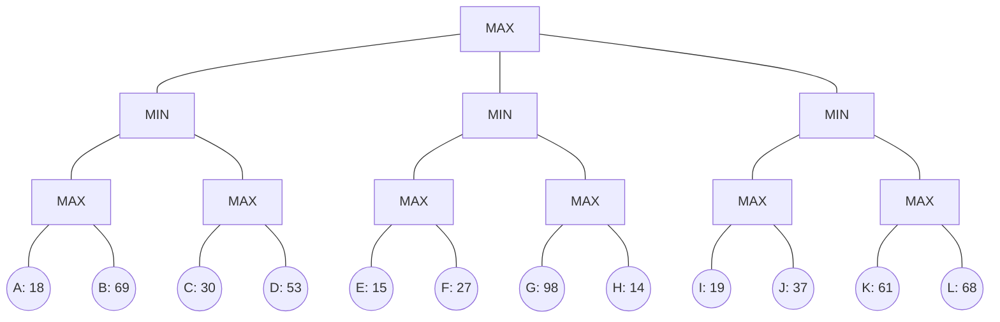

## The Question

The figure shows a 3-ply game tree with evaluation function values defined at horizon. The nodes in the horizon are labeled from A to L. Use these labels when asked to enter a horizon node or a list of horizon nodes.

**Tie-breaker**: when several nodes qualify then select the left most node, if tie persists then select the deepest node among the left most nodes.

| # | Question | Official answer |
|---|----------|-----------------|
| 4.1 | Which of the following is a strategy for MAX? | `C` |
| 4.2 | List the horizon nodes in the best strategy for MAX (ascending) | `B,D` |
| 4.3 | List all the horizon nodes pruned by Alpha-Beta | `G,H,K,L` |
| 4.4 | Force the MinMax value to 98 by changing the eval of only one horizon node | `E,98` |

## The Topic in 60 Seconds

- **Backup**: MAX squares take max of children; MIN circles take min.
- **Strategy for MAX**: one committed move at every MAX node — here root picks ONE MIN subtree and each surviving MAX square picks ONE leaf (2 leaves total).
- **Alpha-beta**: a finished child that already fails the window kills the rest of the branch.
- **Force MinMax**: find which top-level subtree must move, then push its blocking MAX value.

> Deep-dive: [Game Strategies](/concepts/week-07-game-search/03-game-strategies), [Force MinMax Value](/concepts/week-07-game-search/05-force-minmax-value), [Alpha-Beta Pruning](/concepts/week-07-game-search/02-alpha-beta-pruning).

## Step 0 — Back up every leaf

| MAX square | Computation | Value |
|------------|-------------|-------|
| $L2_1$ | $\max(18, 69)$ | 69 |
| $L2_2$ | $\max(30, 53)$ | 53 |
| $L2_3$ | $\max(15, 27)$ | 27 |
| $L2_4$ | $\max(98, 14)$ | 98 |
| $L2_5$ | $\max(19, 37)$ | 37 |
| $L2_6$ | $\max(61, 68)$ | 68 |

| MIN circle | Computation | Value |
|------------|-------------|-------|
| $L1_1$ | $\min(69, 53)$ | 53 |
| $L1_2$ | $\min(27, 98)$ | 27 |
| $L1_3$ | $\min(37, 68)$ | 37 |

Root $= \max(53, 27, 37) = \mathbf{53}$ via $L1_1$.

## 4.1 — Strategy for MAX → `C`

A legal strategy commits the root to exactly one MIN child, and then names exactly one leaf under each MAX grandchild beneath it — two leaves overall. Options shaped like "two leaves from different subtrees of one MIN" fit; options mixing leaves from two different MIN subtrees (impossible for one root move) or listing four-plus leaves do not. The option with this shape is **C** ✓

## 4.2 — Best strategy leaves → `B,D`

The guarantee is maximized through $L1_1$ (53). Its MAX squares pick their best leaves: $L2_1 \to$ **B** ($\max(18,69)=69$), $L2_2 \to$ **D** ($\max(30,53)=53$). Guarantee $= \min(69, 53) = 53 =$ game value ✓

## 4.3 — Alpha-beta prunes → `G,H,K,L`

Left-to-right traversal:

| Node | Window | What happens |
|------|--------|--------------|
| $L1_1$ (MIN) | $(-\infty, \infty)$ | $L2_1$: A=18, B=69 → returns 69. Then $L2_2$: C=30, D=53 → returns 53. $L1_1 = 53$, root α = 53 |
| $L1_2$ (MIN) | $(53, \infty)$ | $L2_3$: E=15, F=27 → returns **27 ≤ 53 → α-cutoff**: $L2_4$ never opened → **G, H pruned** |
| $L1_3$ (MIN) | $(53, \infty)$ | $L2_5$: I=19, J=37 → returns **37 ≤ 53 → α-cutoff**: $L2_6$ never opened → **K, L pruned** |

Pruned horizon nodes: **G, H, K, L** ✓ (no pruning inside $L1_1$ — both its squares complete because no bound is active before the first subtree finishes.)

## 4.4 — Force MinMax to 98 → `E, 98`

Root $= \max(L1_1, L1_2, L1_3)$. To reach 98, some subtree must rise to 98 while the others stay ≤ 98.

- Raising $L1_1$ or $L1_3$ to 98 needs **both** of their MAX squares ≥ 98 — impossible with one leaf change ($\min$ structure caps them).
- $L1_2 = \min(L2_3, L2_4)$: $L2_4 = \max(98, 14) = 98$ **already**; so $L1_2 = 98$ requires only $L2_3 = \max(E, F) = 98$ → set **E = 98** (F works identically; E is leftmost per the tie-breaker).

Check: $L2_3 = 98 \Rightarrow L1_2 = \min(98, 98) = 98 \Rightarrow$ Root $= \max(53, 98, 37) = \mathbf{98}$ ✓

98 is also the largest usable value (the biggest eval on the tree) — any target above it would be unreachable at all.

## Watch the whole tree resolve

<PaperTrace
  height={430}
  nodeWidth={64}
  nodeHeight={44}
  nodeFontSize={9.5}
  legend={[
    { color: "#b45309", label: "backing up" },
    { color: "#4b5563", label: "evaluated / backed up" },
    { color: "#dc2626", label: "pruned by alpha-beta" },
    { color: "#16a34a", label: "best line / force point" },
  ]}
  nodes={[
    { id: "R", label: "MAX", x: 361, y: 20 },
    { id: "N1", label: "MIN", x: 113, y: 105 },
    { id: "N2", label: "MIN", x: 361, y: 105 },
    { id: "N3", label: "MIN", x: 609, y: 105 },
    { id: "N11", label: "MAX", x: 51, y: 190 },
    { id: "N12", label: "MAX", x: 175, y: 190 },
    { id: "N21", label: "MAX", x: 299, y: 190 },
    { id: "N22", label: "MAX", x: 423, y: 190 },
    { id: "N31", label: "MAX", x: 547, y: 190 },
    { id: "N32", label: "MAX", x: 671, y: 190 },
    { id: "A", label: "A 18", x: 20, y: 290 },
    { id: "B", label: "B 69", x: 82, y: 350 },
    { id: "C", label: "C 30", x: 144, y: 290 },
    { id: "D", label: "D 53", x: 206, y: 350 },
    { id: "E", label: "E 15", x: 268, y: 290 },
    { id: "F", label: "F 27", x: 330, y: 350 },
    { id: "G", label: "G 98", x: 392, y: 290 },
    { id: "H", label: "H 14", x: 454, y: 350 },
    { id: "I", label: "I 19", x: 516, y: 290 },
    { id: "J", label: "J 37", x: 578, y: 350 },
    { id: "K", label: "K 61", x: 640, y: 290 },
    { id: "L", label: "L 68", x: 702, y: 350 },
  ]}
  edges={[
    { id: "rn1", from: "R", to: "N1" },
    { id: "rn2", from: "R", to: "N2" },
    { id: "rn3", from: "R", to: "N3" },
    { id: "n1a", from: "N1", to: "N11" },
    { id: "n1b", from: "N1", to: "N12" },
    { id: "n2a", from: "N2", to: "N21" },
    { id: "n2b", from: "N2", to: "N22" },
    { id: "n3a", from: "N3", to: "N31" },
    { id: "n3b", from: "N3", to: "N32" },
    { id: "eA", from: "N11", to: "A" },
    { id: "eB", from: "N11", to: "B" },
    { id: "eC", from: "N12", to: "C" },
    { id: "eD", from: "N12", to: "D" },
    { id: "eE", from: "N21", to: "E" },
    { id: "eF", from: "N21", to: "F" },
    { id: "eG", from: "N22", to: "G" },
    { id: "eH", from: "N22", to: "H" },
    { id: "eI", from: "N31", to: "I" },
    { id: "eJ", from: "N31", to: "J" },
    { id: "eK", from: "N32", to: "K" },
    { id: "eL", from: "N32", to: "L" },
  ]}
  steps={[
    { label: "Horizon evals", note: "Leaves A-L carry static evaluations.\nNothing backed up yet.", nodes: { A: "terminal", B: "terminal", C: "terminal", D: "terminal", E: "terminal", F: "terminal", G: "terminal", H: "terminal", I: "terminal", J: "terminal", K: "terminal", L: "terminal" } },
    { label: "Back up MAX row", note: "N11 = max(18,69) = 69\nN12 = max(30,53) = 53\nN21 = max(15,27) = 27   N22 = max(98,14) = 98\nN31 = max(19,37) = 37   N32 = max(61,68) = 68", nodes: { N11: "current", N12: "current", N21: "current", N22: "current", N31: "current", N32: "current", A: "terminal", B: "terminal", C: "terminal", D: "terminal", E: "terminal", F: "terminal", G: "terminal", H: "terminal", I: "terminal", J: "terminal", K: "terminal", L: "terminal" } },
    { label: "Back up MIN + root", note: "N1 = min(69,53) = 53\nN2 = min(27,98) = 27\nN3 = min(37,68) = 37\nRoot = max(53,27,37) = 53 via N1.\nBest strategy leaves: B (69), D (53).", nodes: { R: "current", N1: "explored", N2: "explored", N3: "explored", N11: "explored", N12: "explored", N21: "explored", N22: "explored", N31: "explored", N32: "explored", A: "terminal", B: "terminal", C: "terminal", D: "terminal", E: "terminal", F: "terminal", G: "terminal", H: "terminal", I: "terminal", J: "terminal", K: "terminal", L: "terminal" } },
    { label: "Alpha-beta prunes", note: "N2 window (53,inf): N21 returns 27 ≤ 53\n→ cutoff: N22 unopened, prune G, H.\nN3 window (53,inf): N31 returns 37 ≤ 53\n→ cutoff: N32 unopened, prune K, L.\nPruned horizon: G, H, K, L.", nodes: { R: "current", N22: "pruned", N32: "pruned", G: "pruned", H: "pruned", K: "pruned", L: "pruned", N1: "explored", N2: "explored", N3: "explored", N11: "explored", N12: "explored", N21: "explored", N31: "explored" }, edges: { eG: "pruned", eH: "pruned", eK: "pruned", eL: "pruned", n2b: "pruned", n3b: "pruned" } },
    { label: "Best line + force 98", note: "Best strategy: B,D guaranteeing 53.\nForce root=98: set E=98 → N21=max(98,27)=98\n→ N2=min(98,98)=98 → Root=max(53,98,37)=98.\nE is chosen over F by the leftmost tie-breaker.", nodes: { R: "path", N1: "path", N11: "path", N12: "path", B: "goal", D: "goal", E: "current" }, edges: { rn1: "path", n1a: "path", n1b: "path", eB: "path", eD: "path", eE: "active" } },
  ]}
/>

## Tricks & Tips

<Accordion title="Fast methods for this exact tree">
1. Backups first, all twelve of them, in two rows of six max() then three min() then root — 53/27/37 → 53. Every later subquestion reuses these numbers.
2. Pruning here happens only at whole-square level: a MAX square finishing below the live α (27, 37 ≤ 53) kills its sibling square outright. Four leaves die without a single eval being read.
3. Best strategy = walk the principal line and take each MAX square's winning leaf: B and D. Ascending order matters when you type the answer.
4. Force questions: only ONE top-level subtree can be lifted with a single change — find the square whose partner already holds the target value (N22 = 98) and pull its twin up (E = 98).
</Accordion>

**Answers:** 4.1 `C` · 4.2 `B,D` · 4.3 `G,H,K,L` · 4.4 `E,98`
