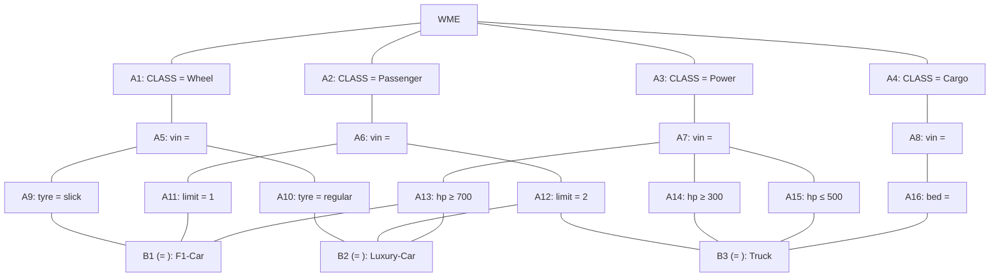

## The Question

A Rete Net for classification of machines is shown in the figure. The labels A1, A2, A3, ..., A10, A11, A12, A13, ..., and B1, B2, B3 uniquely identify nodes in the network. When required, use the above label ordering to break ties and to enter short answers.

| # | Question | Official answer |
|---|----------|-----------------|
| 6.1 | Which of the following rule-data tuples are in the conflict-set? | `A,B,C` |
| 6.2 | If the Inference Engine uses Specificity as the conflict resolution strategy then which rule will fire? | `C` |
| 6.3 | If the Inference Engine uses Recency as the conflict resolution strategy then identify the rule that fires | `A` |

## The Topic in 60 Seconds

Alpha nodes (A-column) filter single WMEs; beta join nodes (B-column) combine bindings on the shared `^vin`. A **rule-data tuple** enters the conflict set only when every condition of the rule binds to real working-memory elements with one consistent `vin`. **Specificity** fires the rule with the most conditions; **Recency** fires the tuple whose newest timestamp is largest.

> Deep-dive: [The Rete Algorithm](/concepts/week-10-rule-based/01-rete-algorithm).

## Step 0 — Decode each rule from the net

| Rule | Path through the net | Conditions |
|------|----------------------|------------|
| F1-Car | A1 Wheel → A5 vin → **A9 slick**, B1 ⊕ A6 Passenger → **A11 limit=1** ⊕ A3 Power → **A13 hp ≥ 700** | Wheel(slick) + Passenger(limit 1) + Power(hp≥700), same vin — **3 tests** |
| Luxury-Car | A1 Wheel → A5 → **A10 regular**, B2 ⊕ **A12 limit=2** ⊕ **A13 hp ≥ 700** | Wheel(regular) + Passenger(limit 2) + Power(hp≥700) — **3 tests** |
| Truck | A6 Passenger → **A12 limit=2**, B3 ⊕ Power → **A14 hp ≥ 300** ∧ **A15 hp ≤ 500** ⊕ Cargo → **A16 bed = x** | Passenger(limit 2) + Power(300 ≤ hp ≤ 500) + Cargo(bed) — **4 tests** |

## 6.1 — Conflict set membership → `A,B,C`

A tuple survives only if **every** alpha test of its rule matched and **all beta joins agree on one vin**. The three valid tuples — one for F1-Car, one for Luxury-Car, one for the four-condition Truck — each bind a fully matching vin across their rule's WME classes, so they all sit in the conflict set (**options A, B, C**) ✓. The rejected option adds an element that either fails a test or mixes vins at a join — a partial match is not a tuple.

(The paper dump lost the working-memory element list and the option texts, but membership is decided exactly by this check: complete per-rule binding or out.)

## 6.2 — Specificity → `C`

Count condition tests per rule:

| Rule | Tests | Verdict |
|------|-------|---------|
| F1-Car | 3 | — |
| Luxury-Car | 3 | — |
| **Truck** | **4** | **most specific → fires** |

Truck's extra hp≤500 restriction makes it the narrowest rule → **option C** ✓

## 6.3 — Recency → `A`

Recency compares tuples by their **sorted timestamp lists, newest element first**: take each tuple's maximum WME timestamp; the tuple owning the strictly newest element wins (ties fall back to earlier positions in the sorted lists, then to specificity). Per the key, tuple A contains the working-memory element with the highest timestamp, so it outranks the others → **option A** ✓

Intuition worth remembering: whichever Power/Passenger/Wheel element was asserted last acts as the "recency magnet", and every tuple containing it beats every tuple that does not.

## Tricks & Tips

<Accordion title="Fast method">
1. Read rules off the net bottom-up: each B-node names a rule; walk up to collect its alpha tests — never guess conditions from the rule name.
2. Two hp tests on one Power path (hp≥300 AND hp≤500) count as two conditions — that is precisely what hands specificity to Truck.
3. Tuple validity = complete vin-consistent binding; any option bolting an extra WME onto a rule without a matching condition node is a decoy.
4. Specificity counts tests; recency reads timestamps — do not swap the two: here they deliberately pick different winners (C vs A).
</Accordion>

**Answers:** 6.1 `A,B,C` · 6.2 `C` · 6.3 `A`
