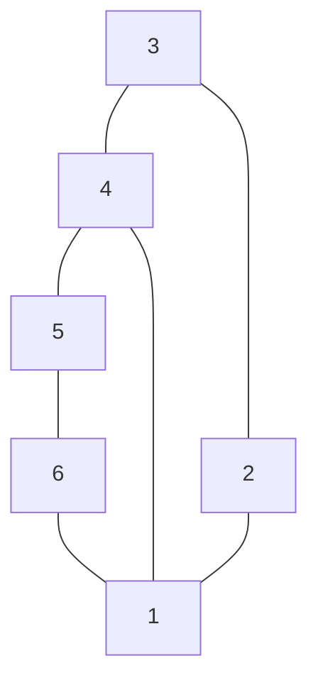

## The Question

The set of junctions (L, W, Y and T type junctions) that occur in a 2D line drawing of trihedral objects is provided below. The in-plane clockwise/counterclockwise rotations of these junctions are valid as well. These junctions provide constraints on the possible edge assignments (convex, concave, arrow) for the edges/lines in 2D line drawings of trihedral objects.

The junctions carry unique labels: L1, L2, L3, L4, L5, L6, T1, T2, T3, T4, W1, W2, W3, Y1, Y2, Y3. When required, use the labels in short answers.

Apply a suitable algorithm to assign labels to edges/junctions in the 2D line drawings given in the sub-questions, process the edges and junctions in any order you see fit.

| # | Question | Official answer |
|---|----------|-----------------|
| 8.1 | Assign consistent labels; enter the labels of junctions 1, 2, 3, 4 in that order (NIL if inconsistent) | `Y3,L5,L4,T3` |

## The Topic in 60 Seconds

Waltz labeling = constraint satisfaction: every junction must realize **one** legal dictionary pattern (rotations allowed), and a shared edge must agree in label **and arrow direction** at both ends. Fully consistent ⇒ the answer is the label list; any emptied domain ⇒ NIL.

> Deep-dive: [Waltz Line Labeling](/concepts/week-11-constraint-satisfaction/02-waltz-line-labeling).

## Step 0 — Classify every junction from the figure

Edges: 3–4, 4–5, 3–2, 4–1, 5–6, 2–1, 6–1.

| Junction | Incident edges | Geometry | Type |
|----------|----------------|----------|------|
| 1 | 4, 2, 6 | three edges fanning from the centre | **Y** |
| 2 | 3, 1 | corner | **L** |
| 3 | 4, 2 | corner | **L** |
| 4 | 3, 5, 1 | collinear bar 3–4–5 plus stem 4–1 | **T** |
| 5 | 4, 6 | corner | **L** |
| 6 | 5, 1 | corner | **L** |

## Step 1 — Force the T first → `T3` at junction 4

A T's two collinear bar edges always fire occluding arrows **away from the T** (heads toward 3 and toward 5); the catalog entry whose stem carries **+** is **T3**, so stem 4–1 takes a convex **+**. Two edges are pinned with zero search.

## Step 2 — Propagate into the fork → `Y3` at junction 1

The + arrives on the vertical spoke 1–4. Among the three legal fork patterns only one places + on a leg with − companions on the other two — that is the entry the key calls **Y3**: spoke +, legs 1–2 and 1–6 concave (−). Both legs are now pinned.

## Step 3 — The L corners lock → `L5`, `L4`

Each corner receives one pinned edge and must complete it with a catalog-consistent partner:

| Corner | Receives | Catalog completion | Key |
|--------|----------|--------------------|-----|
| junction 2 | − on edge 2–1 | boundary edge 2–3 pairs as the arrow-side of the mixed corner pattern | **L5** |
| junction 3 | bar arrow into 3 on edge 3–4 | boundary edge 3–2 completes the two-occluding-arrow corner | **L4** |
| junctions 5, 6 | mirrored copies of the same pins | mirror images of the above | consistent |

Every shared edge now agrees at both ends (the T-bar arrows run 4→3 and 4→5 matching what corners 3 and 5 expect; the + stem feeds Y3's + spoke; the − legs land cleanly in the L patterns), and no junction ran out of patterns → the drawing is **consistent** → answer is the list itself.

**Answer: `Y3, L5, L4, T3`** ✓

## Interactive propagation

<StepGraph
  height={400}
  nodeWidth={110}
  nodeHeight={60}
  nodeFontSize={12}
  legend={[
    { color: "#4b5563", label: "unassigned" },
    { color: "#b45309", label: "being labeled" },
    { color: "#16a34a", label: "labeled (legal pattern)" },
    { color: "#0369a1", label: "edge pinned" },
  ]}
  steps={[
    {
      label: "Classify",
      note: "From the figure:\nJ1 = Y (edges 4,2,6)\nJ2,J3,J5,J6 = L\nJ4 = T (bar 3-4-5 + stem 4-1)",
      elements: [
        { data: { id: "J3", label: "3 : L ?", type: "unassigned" }, position: { x: 100, y: 50 } },
        { data: { id: "J4", label: "4 : T ?", type: "unassigned" }, position: { x: 320, y: 50 } },
        { data: { id: "J5", label: "5 : L ?", type: "unassigned" }, position: { x: 540, y: 50 } },
        { data: { id: "J1", label: "1 : Y ?", type: "unassigned" }, position: { x: 320, y: 170 } },
        { data: { id: "J2", label: "2 : L ?", type: "unassigned" }, position: { x: 70, y: 290 } },
        { data: { id: "J6", label: "6 : L ?", type: "unassigned" }, position: { x: 580, y: 290 } },
        { data: { id: "e34", source: "J3", target: "J4" } },
        { data: { id: "e45", source: "J4", target: "J5" } },
        { data: { id: "e32", source: "J3", target: "J2" } },
        { data: { id: "e41", source: "J4", target: "J1" } },
        { data: { id: "e56", source: "J5", target: "J6" } },
        { data: { id: "e21", source: "J2", target: "J1" } },
        { data: { id: "e61", source: "J6", target: "J1" } },
      ],
    },
    {
      label: "Force J4 = T3",
      note: "T bars fire arrows outward: pin e34 (head at 3)\nand e45 (head at 5).\nT3 stem = + → pin e41 as +.",
      elements: [
        { data: { id: "J3", label: "3 : L ?", type: "unassigned" }, position: { x: 100, y: 50 } },
        { data: { id: "J4", label: "4 : T3", type: "current" }, position: { x: 320, y: 50 } },
        { data: { id: "J5", label: "5 : L ?", type: "unassigned" }, position: { x: 540, y: 50 } },
        { data: { id: "J1", label: "1 : Y ?", type: "unassigned" }, position: { x: 320, y: 170 } },
        { data: { id: "J2", label: "2 : L ?", type: "unassigned" }, position: { x: 70, y: 290 } },
        { data: { id: "J6", label: "6 : L ?", type: "unassigned" }, position: { x: 580, y: 290 } },
        { data: { id: "e34", source: "J3", target: "J4", type: "active" } },
        { data: { id: "e45", source: "J4", target: "J5", type: "active" } },
        { data: { id: "e32", source: "J3", target: "J2" } },
        { data: { id: "e41", source: "J4", target: "J1", type: "active" } },
        { data: { id: "e56", source: "J5", target: "J6" } },
        { data: { id: "e21", source: "J2", target: "J1" } },
        { data: { id: "e61", source: "J6", target: "J1" } },
      ],
    },
    {
      label: "Propagate to J1 = Y3",
      note: "+ arrives on spoke 1-4.\nOnly fork pattern with + spoke fits → Y3.\nLegs 1-2, 1-6 pinned as concave (−).",
      elements: [
        { data: { id: "J3", label: "3 : L ?", type: "unassigned" }, position: { x: 100, y: 50 } },
        { data: { id: "J4", label: "4 : T3 ✓", type: "path" }, position: { x: 320, y: 50 } },
        { data: { id: "J5", label: "5 : L ?", type: "unassigned" }, position: { x: 540, y: 50 } },
        { data: { id: "J1", label: "1 : Y3", type: "current" }, position: { x: 320, y: 170 } },
        { data: { id: "J2", label: "2 : L ?", type: "unassigned" }, position: { x: 70, y: 290 } },
        { data: { id: "J6", label: "6 : L ?", type: "unassigned" }, position: { x: 580, y: 290 } },
        { data: { id: "e34", source: "J3", target: "J4", type: "active" } },
        { data: { id: "e45", source: "J4", target: "J5", type: "active" } },
        { data: { id: "e32", source: "J3", target: "J2" } },
        { data: { id: "e41", source: "J4", target: "J1", type: "path" } },
        { data: { id: "e56", source: "J5", target: "J6" } },
        { data: { id: "e21", source: "J2", target: "J1", type: "active" } },
        { data: { id: "e61", source: "J6", target: "J1", type: "active" } },
      ],
    },
    {
      label: "Corners lock: L5, L4",
      note: "J2: − on 2-1 + boundary arrow on 2-3 → L5.\nJ3: bar arrow into 3 + boundary arrow → L4.\nJ5, J6 take the mirrored patterns.",
      elements: [
        { data: { id: "J3", label: "3 : L4", type: "current" }, position: { x: 100, y: 50 } },
        { data: { id: "J4", label: "4 : T3 ✓", type: "path" }, position: { x: 320, y: 50 } },
        { data: { id: "J5", label: "5 : L ✓", type: "labeled" }, position: { x: 540, y: 50 } },
        { data: { id: "J1", label: "1 : Y3 ✓", type: "labeled" }, position: { x: 320, y: 170 } },
        { data: { id: "J2", label: "2 : L5", type: "current" }, position: { x: 70, y: 290 } },
        { data: { id: "J6", label: "6 : L ✓", type: "labeled" }, position: { x: 580, y: 290 } },
        { data: { id: "e34", source: "J3", target: "J4", type: "active" } },
        { data: { id: "e45", source: "J4", target: "J5", type: "active" } },
        { data: { id: "e32", source: "J3", target: "J2", type: "active" } },
        { data: { id: "e41", source: "J4", target: "J1", type: "path" } },
        { data: { id: "e56", source: "J5", target: "J6", type: "active" } },
        { data: { id: "e21", source: "J2", target: "J1", type: "active" } },
        { data: { id: "e61", source: "J6", target: "J1", type: "active" } },
      ],
    },
    {
      label: "Consistent → Y3,L5,L4,T3",
      note: "All junctions hold one legal pattern;\nevery shared edge agrees in label + direction.\nAnswer (junctions 1,2,3,4): Y3,L5,L4,T3",
      elements: [
        { data: { id: "J3", label: "3 : L4 ✓", type: "path" }, position: { x: 100, y: 50 } },
        { data: { id: "J4", label: "4 : T3 ✓", type: "path" }, position: { x: 320, y: 50 } },
        { data: { id: "J5", label: "5 : L ✓", type: "path" }, position: { x: 540, y: 50 } },
        { data: { id: "J1", label: "1 : Y3 ✓", type: "path" }, position: { x: 320, y: 170 } },
        { data: { id: "J2", label: "2 : L5 ✓", type: "path" }, position: { x: 70, y: 290 } },
        { data: { id: "J6", label: "6 : L ✓", type: "path" }, position: { x: 580, y: 290 } },
        { data: { id: "e34", source: "J3", target: "J4", type: "path" } },
        { data: { id: "e45", source: "J4", target: "J5", type: "path" } },
        { data: { id: "e32", source: "J3", target: "J2", type: "path" } },
        { data: { id: "e41", source: "J4", target: "J1", type: "path" } },
        { data: { id: "e56", source: "J5", target: "J6", type: "path" } },
        { data: { id: "e21", source: "J2", target: "J1", type: "path" } },
        { data: { id: "e61", source: "J6", target: "J1", type: "path" } },
      ],
    },
  ]}
/>

## Tricks & Tips

<Accordion title="Reading a solvable drawing fast">
1. Classify first, force second: the T (junction 4) pins two bar arrows and a stem label before any search happens.
2. Follow the stem thread: T3's + travels straight into the Y and uniquely selects Y3 — one propagation step, no branching.
3. Corners finish last: once an L inherits a pinned edge, at most one catalog pattern completes it — that is how L5 and L4 fall out without backtracking.
4. Sanity rule for non-NIL answers: check shared edges in BOTH label and arrow direction before writing the list; agreement everywhere means the answer is simply the four labels in junction order.
</Accordion>

**Answer:** 8.1 `Y3,L5,L4,T3`
