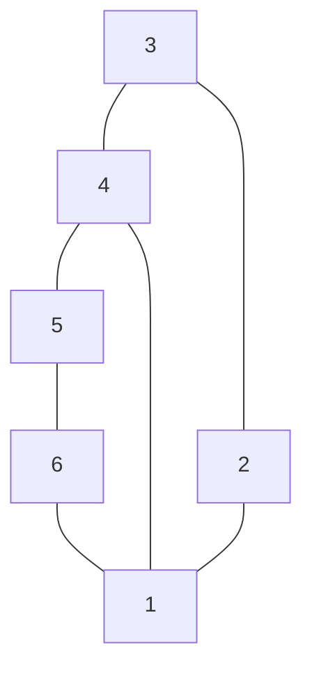

## The Question

The set of junctions (L, W, Y and T type junctions) that occur in a 2D line drawing of trihedral objects is provided below. The in-plane clockwise/counterclockwise rotations of these junctions are valid as well. These junctions provide constraints on the possible edge assignments (convex, concave, arrow) for the edges/lines in 2D line drawings of trihedral objects.

The junctions carry unique labels: L1, L2, L3, L4, L5, L6, T1, T2, T3, T4, W1, W2, W3, Y1, Y2, Y3. When required, use the labels in short answers.

Apply a suitable algorithm to assign labels to edges/junctions in the 2D line drawings given in the sub-questions, process the edges and junctions in any order you see fit.

| # | Question | Official answer |
|---|----------|-----------------|
| 8.1 | For the 2D line drawing, assign consistent labels to all edges and junctions. Enter the labels of the junctions 1, 2, 3, 4 in that order (NIL if inconsistent) | `Y3,L5,L4,T3` |

## The Topic in 60 Seconds

> Deep-dive: browse the [Concepts](/concepts) section for the relevant topic page.

## Solutions

**8.1** — For the 2D line drawing, assign consistent labels to all edges and junctions  
**Answer:** `Y3,L5,L4,T3`

## Tricks & Tips

<Accordion title="Exam method">
1. Read the question carefully — identify the algorithm or technique.
2. Trace step by step, showing your working.
3. Verify your answer against the question constraints.
</Accordion>
