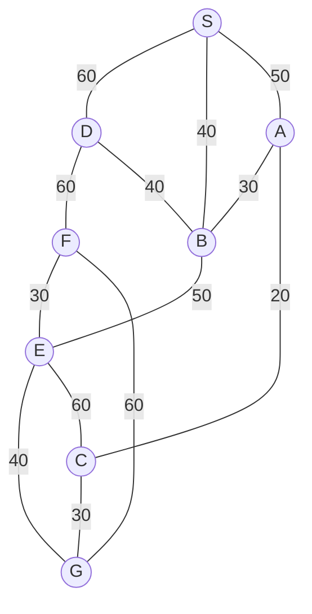

## The Question

The figure shows a map on a uniform grid where each tile is 10x10 in size.

The start node is S and the goal node is G.
The MoveGen function returns nodes in alphabetical order.
Use Manhattan Distance as the heuristic function.

**Tie-breaker**: If several nodes have the same cost, use node labels to break the tie.

Node coordinates on the 10x10 grid (relative to origin):
- S: (0, 20)
- A: (20, 0)
- B: (20, 20)
- C: (40, 0)
- D: (10, 40)
- E: (30, 40)
- F: (30, 60)
- G: (50, 40)

| # | Question | Official answer |
|---|----------|-----------------|
| 1.1 | What is the path found by the Depth First Search algorithm? Enter the path as a  | `S,A,C,G` |
| 1.2 | What is the path found by the Best First Search algorithm? Enter the path as a c | `S,D,F,G` |
| 1.3 | What is the path found by A* search algorithm? Enter the path as a comma separat | `S,B,E,G` |
| 1.4 | What is the path found by Branch-and-Bound search algorithm? Enter the path as a | `S,A,C,G` |
| 1.5 | For the given map, which algorithm finds the shortest path from S to G? | `B` |

## The Topic in 60 Seconds

> Deep-dive: browse the [Concepts](/concepts) section for the relevant topic page.

## Solutions

**1.1** — What is the path found by the Depth First Search algorithm? Enter the path as a   
**Answer:** `S,A,C,G`

**1.2** — What is the path found by the Best First Search algorithm? Enter the path as a c  
**Answer:** `S,D,F,G`

**1.3** — What is the path found by A* search algorithm? Enter the path as a comma separat  
**Answer:** `S,B,E,G`

**1.4** — What is the path found by Branch-and-Bound search algorithm? Enter the path as a  
**Answer:** `S,A,C,G`

**1.5** — For the given map, which algorithm finds the shortest path from S to G?  
**Answer:** `B`

## Tricks & Tips

<Accordion title="Exam method">
1. Read the question carefully — identify the algorithm or technique.
2. Trace step by step, showing your working.
3. Verify your answer against the question constraints.
</Accordion>
