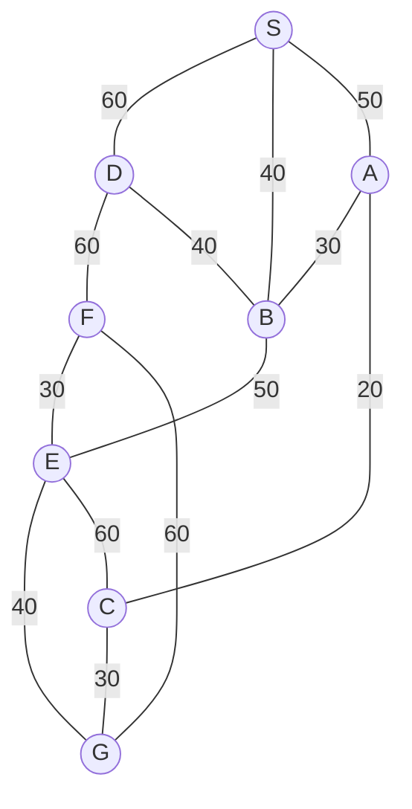

## The Question

The figure shows a map on a uniform grid where each tile is 10x10 in size.

The start node is S and the goal node is G.
The MoveGen function returns nodes in alphabetical order.
Use Manhattan Distance as the heuristic function.

**Tie-breaker**: If several nodes have the same cost, use node labels to break the tie.

Node coordinates on the 10x10 grid (relative to origin):
- S: (0, 20)
- A: (20, 0)
- B: (20, 20)
- C: (40, 0)
- D: (10, 40)
- E: (30, 40)
- F: (30, 60)
- G: (50, 40)

| # | Question | Official answer |
|---|----------|-----------------|
| 1.1 | What is the path found by the Depth First Search algorithm? Enter the path as a  | `S,A,C,G` |
| 1.2 | What is the path found by the Best First Search algorithm? Enter the path as a c | `S,D,F,G` |
| 1.3 | What is the path found by A* search algorithm? Enter the path as a comma separat | `S,B,E,G` |
| 1.4 | What is the path found by Branch-and-Bound search algorithm? Enter the path as a | `S,A,C,G` |
| 1.5 | For the given map, which algorithm finds the shortest path from S to G? | `B` |

## The Topic in 60 Seconds

| Algorithm | Sorts frontier by | Ignores |
|-----------|-------------------|---------|
| DFS | deepest node (dive alphabetically) | all costs |
| Best First | $h(n)$ | $g(n)$ |
| A* | $f(n) = g(n) + h(n)$ | nothing |
| Branch-and-Bound | $g(n)$ on whole paths | $h(n)$ |

> Deep-dive: [Depth First Search](/concepts/week-02-blind-search/02-depth-first-search), [Best First Search](/concepts/week-03-heuristic-search/09-best-first-search), [A* Search](/concepts/week-03-heuristic-search/01-a-star-search), [Branch and Bound](/concepts/week-03-heuristic-search/05-branch-and-bound).

## Step 0 — Heuristic table

Manhattan units to G at (50, 40), scaled ×2 to match the edge-cost scale:

| Node | $\Delta x + \Delta y$ | $h$ | Node | $\Delta x + \Delta y$ | $h$ |
|------|------------------------|-----|------|------------------------|-----|
| S | 50 + 20 = 70 | **140** | D | 40 + 0 = 40 | **80** |
| A | 30 + 40 = 70 | **140** | E | 20 + 0 = 20 | **40** |
| B | 30 + 20 = 50 | **100** | F | 20 + 20 = 40 | **80** |
| C | 10 + 40 = 50 | **100** | G | 0 | **0** |

Any common positive scaling of these $h$ values produces the same picks below.

## 1.1 — Depth First Search → `S,A,C,G`

DFS dives into the alphabetically-first fresh neighbour and never re-enters a node already generated; the goal test fires the moment G is generated.

| Step | Action |
|------|--------|
| 1 | Expand S → MoveGen gives A, B, D (all new). OPEN = \{A, B, D\}. Dive into **A** |
| 2 | At A: S closed, **B already generated** from S → skip. Fresh branch = **C**. Dive into C |
| 3 | At C: A closed, E new, G new → generate G → **goal test fires** |

Path: **S → A → C → G**. Note B and D sit unexpanded in OPEN forever — DFS never looks at them.

## 1.2 — Best First Search → `S,D,F,G`

Sort OPEN by $h$ only:

| Step | OPEN (node : $h$) | Pick |
|------|-------------------|------|
| 1 | S : 140 | **S** → A(140), B(100), D(80) |
| 2 | D : 80, B : 100, A : 140 | **D** → F(80) |
| 3 | F : 80, B : 100, A : 140 | **F** → E(40), G(0) |
| 4 | G : 0, E : 40, B : 100, A : 140 | **G** — goal! |

Path: **S → D → F → G**, cost $60+60+30+40 = 190$. Greedy on $h$ walks straight "towards" G geometrically — and straight into the expensive eastern route.

## 1.3 — A* Search → `S,B,E,G`

Sort OPEN by $f = g + h$:

| Step | OPEN (node : $f$) | Pick |
|------|-------------------|------|
| 1 | S : 0+140 = **140** | **S** → A : 50+140 = 190, B : 40+100 = 140, D : 60+80 = 140 |
| 2 | B : 140, D : 140, A : 190 | **B** (tie B=D at 140 → labels) → A stays 190 (via B costs 210), D : 80+80 = 160, E : 90+40 = **130** |
| 3 | E : 130, D : 160, A : 190 | **E** → F : 120+80 = 200, G : 130+0 = **130**, C : 150+100 = 250 |
| 4 | G : 130, D : 160, A : 190, F : 200, C : 250 | **G** — goal! |

Path: **S → B → E → G**, cost $40+50+40 = 130$.

Interactive trace (labels show the current best $f$):

<StepGraph
  height={480}
  nodeWidth={110}
  nodeHeight={60}
  nodeFontSize={12}
  legend={[
    { color: "#b45309", label: "expanding" },
    { color: "#0369a1", label: "in OPEN (f = g+h)" },
    { color: "#4b5563", label: "expanded" },
    { color: "#16a34a", label: "returned path" },
  ]}
  steps={[
    {
      label: "Init",
      note: "h: S=140, A=140, B=100, C=100, D=80, E=40, F=80, G=0\nOPEN = { S(g=0, f=0+140=140) }",
      elements: [
        { data: { id: "S", label: "S f=140", type: "frontier" }, position: { x: 40, y: 160 } },
        { data: { id: "A", label: "A", type: "explored" }, position: { x: 300, y: 30 } },
        { data: { id: "B", label: "B", type: "explored" }, position: { x: 300, y: 170 } },
        { data: { id: "C", label: "C", type: "explored" }, position: { x: 560, y: 30 } },
        { data: { id: "D", label: "D", type: "explored" }, position: { x: 170, y: 310 } },
        { data: { id: "E", label: "E", type: "explored" }, position: { x: 430, y: 310 } },
        { data: { id: "F", label: "F", type: "explored" }, position: { x: 430, y: 450 } },
        { data: { id: "G", label: "G", type: "explored" }, position: { x: 690, y: 310 } },
        { data: { id: "e1", source: "S", target: "D", label: "60" } },
        { data: { id: "e2", source: "S", target: "B", label: "40" } },
        { data: { id: "e3", source: "S", target: "A", label: "50" } },
        { data: { id: "e4", source: "D", target: "F", label: "60" } },
        { data: { id: "e5", source: "D", target: "B", label: "40" } },
        { data: { id: "e6", source: "A", target: "B", label: "30" } },
        { data: { id: "e7", source: "A", target: "C", label: "20" } },
        { data: { id: "e8", source: "B", target: "E", label: "50" } },
        { data: { id: "e9", source: "F", target: "E", label: "30" } },
        { data: { id: "e10", source: "F", target: "G", label: "60" } },
        { data: { id: "e11", source: "E", target: "G", label: "40" } },
        { data: { id: "e12", source: "E", target: "C", label: "60" } },
        { data: { id: "e13", source: "C", target: "G", label: "30" } },
      ],
    },
    {
      label: "Expand S",
      note: "Pick S (f=140).\nA: g=50, h=140 → f=190\nB: g=40, h=100 → f=140\nD: g=60, h=80 → f=140\nTie B = D at 140 → labels → B next.",
      elements: [
        { data: { id: "S", label: "S", type: "current" }, position: { x: 40, y: 160 } },
        { data: { id: "A", label: "A f=190", type: "frontier" }, position: { x: 300, y: 30 } },
        { data: { id: "B", label: "B f=140", type: "frontier" }, position: { x: 300, y: 170 } },
        { data: { id: "C", label: "C", type: "explored" }, position: { x: 560, y: 30 } },
        { data: { id: "D", label: "D f=140", type: "frontier" }, position: { x: 170, y: 310 } },
        { data: { id: "E", label: "E", type: "explored" }, position: { x: 430, y: 310 } },
        { data: { id: "F", label: "F", type: "explored" }, position: { x: 430, y: 450 } },
        { data: { id: "G", label: "G", type: "explored" }, position: { x: 690, y: 310 } },
        { data: { id: "e1", source: "S", target: "D", label: "60" } },
        { data: { id: "e2", source: "S", target: "B", label: "40" } },
        { data: { id: "e3", source: "S", target: "A", label: "50" } },
        { data: { id: "e4", source: "D", target: "F", label: "60" } },
        { data: { id: "e5", source: "D", target: "B", label: "40" } },
        { data: { id: "e6", source: "A", target: "B", label: "30" } },
        { data: { id: "e7", source: "A", target: "C", label: "20" } },
        { data: { id: "e8", source: "B", target: "E", label: "50" } },
        { data: { id: "e9", source: "F", target: "E", label: "30" } },
        { data: { id: "e10", source: "F", target: "G", label: "60" } },
        { data: { id: "e11", source: "E", target: "G", label: "40" } },
        { data: { id: "e12", source: "E", target: "C", label: "60" } },
        { data: { id: "e13", source: "C", target: "G", label: "30" } },
      ],
    },
    {
      label: "Expand B",
      note: "Pick B (f=140, beats D on tie-break).\nA via B: g=70 → f=210 > 190, keep 190\nD via B: g=80, h=80 → f=160\nE: g=90, h=40 → f=130\nOPEN = { E(130), D(160), A(190) }",
      elements: [
        { data: { id: "S", label: "S", type: "explored" }, position: { x: 40, y: 160 } },
        { data: { id: "A", label: "A f=190", type: "frontier" }, position: { x: 300, y: 30 } },
        { data: { id: "B", label: "B", type: "current" }, position: { x: 300, y: 170 } },
        { data: { id: "C", label: "C", type: "explored" }, position: { x: 560, y: 30 } },
        { data: { id: "D", label: "D f=160", type: "frontier" }, position: { x: 170, y: 310 } },
        { data: { id: "E", label: "E f=130", type: "frontier" }, position: { x: 430, y: 310 } },
        { data: { id: "F", label: "F", type: "explored" }, position: { x: 430, y: 450 } },
        { data: { id: "G", label: "G", type: "explored" }, position: { x: 690, y: 310 } },
        { data: { id: "e1", source: "S", target: "D", label: "60" } },
        { data: { id: "e2", source: "S", target: "B", label: "40", type: "path" } },
        { data: { id: "e3", source: "S", target: "A", label: "50" } },
        { data: { id: "e4", source: "D", target: "F", label: "60" } },
        { data: { id: "e5", source: "D", target: "B", label: "40" } },
        { data: { id: "e6", source: "A", target: "B", label: "30" } },
        { data: { id: "e7", source: "A", target: "C", label: "20" } },
        { data: { id: "e8", source: "B", target: "E", label: "50" } },
        { data: { id: "e9", source: "F", target: "E", label: "30" } },
        { data: { id: "e10", source: "F", target: "G", label: "60" } },
        { data: { id: "e11", source: "E", target: "G", label: "40" } },
        { data: { id: "e12", source: "E", target: "C", label: "60" } },
        { data: { id: "e13", source: "C", target: "G", label: "30" } },
      ],
    },
    {
      label: "Expand E",
      note: "Pick E (f=130).\nF: g=120, h=80 → f=200\nG: g=130, h=0 → f=130\nC: g=150, h=100 → f=250\nOPEN = { G(130), D(160), A(190), F(200), C(250) }",
      elements: [
        { data: { id: "S", label: "S", type: "explored" }, position: { x: 40, y: 160 } },
        { data: { id: "A", label: "A f=190", type: "frontier" }, position: { x: 300, y: 30 } },
        { data: { id: "B", label: "B", type: "explored" }, position: { x: 300, y: 170 } },
        { data: { id: "C", label: "C f=250", type: "frontier" }, position: { x: 560, y: 30 } },
        { data: { id: "D", label: "D f=160", type: "frontier" }, position: { x: 170, y: 310 } },
        { data: { id: "E", label: "E", type: "current" }, position: { x: 430, y: 310 } },
        { data: { id: "F", label: "F f=200", type: "frontier" }, position: { x: 430, y: 450 } },
        { data: { id: "G", label: "G f=130", type: "frontier" }, position: { x: 690, y: 310 } },
        { data: { id: "e1", source: "S", target: "D", label: "60" } },
        { data: { id: "e2", source: "S", target: "B", label: "40" } },
        { data: { id: "e3", source: "S", target: "A", label: "50" } },
        { data: { id: "e4", source: "D", target: "F", label: "60" } },
        { data: { id: "e5", source: "D", target: "B", label: "40" } },
        { data: { id: "e6", source: "A", target: "B", label: "30" } },
        { data: { id: "e7", source: "A", target: "C", label: "20" } },
        { data: { id: "e8", source: "B", target: "E", label: "50", type: "path" } },
        { data: { id: "e9", source: "F", target: "E", label: "30" } },
        { data: { id: "e10", source: "F", target: "G", label: "60" } },
        { data: { id: "e11", source: "E", target: "G", label: "40" } },
        { data: { id: "e12", source: "E", target: "C", label: "60" } },
        { data: { id: "e13", source: "C", target: "G", label: "30" } },
      ],
    },
    {
      label: "Goal: S,B,E,G",
      note: "Pick G (f=130) → GOAL.\nPath S,B,E-G, cost = 40+50+40 = 130\nNot optimal! h(C)=100 overestimates h*(C)=30 (C-G edge).\nBranch-and-Bound still returns the true shortest: S,A,C,G = 100.",
      elements: [
        { data: { id: "S", label: "S", type: "path" }, position: { x: 40, y: 160 } },
        { data: { id: "A", label: "A", type: "explored" }, position: { x: 300, y: 30 } },
        { data: { id: "B", label: "B", type: "path" }, position: { x: 300, y: 170 } },
        { data: { id: "C", label: "C", type: "explored" }, position: { x: 560, y: 30 } },
        { data: { id: "D", label: "D", type: "explored" }, position: { x: 170, y: 310 } },
        { data: { id: "E", label: "E", type: "path" }, position: { x: 430, y: 310 } },
        { data: { id: "F", label: "F", type: "explored" }, position: { x: 430, y: 450 } },
        { data: { id: "G", label: "G ✓", type: "goal" }, position: { x: 690, y: 310 } },
        { data: { id: "e1", source: "S", target: "D", label: "60" } },
        { data: { id: "e2", source: "S", target: "B", label: "40", type: "path" } },
        { data: { id: "e3", source: "S", target: "A", label: "50" } },
        { data: { id: "e4", source: "D", target: "F", label: "60" } },
        { data: { id: "e5", source: "D", target: "B", label: "40" } },
        { data: { id: "e6", source: "A", target: "B", label: "30" } },
        { data: { id: "e7", source: "A", target: "C", label: "20" } },
        { data: { id: "e8", source: "B", target: "E", label: "50", type: "path" } },
        { data: { id: "e9", source: "F", target: "E", label: "30" } },
        { data: { id: "e10", source: "F", target: "G", label: "60" } },
        { data: { id: "e11", source: "E", target: "G", label: "40", type: "path" } },
        { data: { id: "e12", source: "E", target: "C", label: "60" } },
        { data: { id: "e13", source: "C", target: "G", label: "30" } },
      ],
    },
  ]}
/>

## 1.4 — Branch-and-Bound → `S,A,C,G`

Pop whole paths by $g$; discard any path reaching a node already cheaper reached:

| Pop | New paths (path : $g$) |
|-----|------------------------|
| S : 0 | SB : 40, SA : 50, SD : 60 |
| SB : 40 | SBA : 70, SBD : 80, SBE : 90 |
| SA : 50 | SAC : 70 (SAB : 80 discarded — B already at 40) |
| SD : 60 | SDF : 120 (B via D = 100 discarded) |
| SAC : 70 (tie with SBA at 70 → labels: S-A-C first) | SACG : **100** ← goal queued |
| SBA : 70 | nothing survives (A@70 > 50, D@110 > 80) |
| SBD : 80 | SBDF : 140 |
| SAB : 80 | nothing |
| SBE : 90 | SBEF : 120, SBEG : 130, SBEC : 150 |
| SACG : **100** — cheapest left in OPEN is 120 | complete → **optimal, stop** |

Path: **S → A → C → G**, cost $50+20+30 = 100$ ✓ the true shortest.

## Answers, decoded

- **1.5 → B (Branch-and-Bound).** Enumerate every route: S-A-C-G = **100**, S-B-E-G = 130, S-B-D-E-G = 160, S-B-E-C-G = 230, S-D-F-G = 190, S-D-B-E-G = 210… The shortest is 100. Best First returns 190 and A* returns 130 — both miss it because $h(C) = 100$ grossly overestimates the true remaining cost $h^*(C) = 30$ (inadmissible heuristic ⇒ no optimality guarantee). Only Branch-and-Bound sorts by real accumulated cost $g$, so its first complete path is provably cheapest → keyed answer **B**.
- **Why DFS also lands on S,A,C,G here:** pure alphabetical luck — the western letters come first, so the dive happens to ride the cheap route. No cost bookkeeping backs it up, which is why the key credits BnB alone.
- **Why A* fails despite using costs:** one poisoned $h$ value is enough. With $h(C) = 100 \gg 30$, every $f$ through C looks terrible ($f(C) = 250$), so G pops at 130 before the C-route can win.

## Tricks & Tips

<Accordion title="Exam shortcuts">
1. Build the h-table first — spot the outlier immediately: h(C) = 100 vs true 30. One overestimate kills A*'s optimality guarantee.
2. DFS with alphabetical MoveGen: cross out any neighbour already generated (B from S blocks B from A) — that single rule turns A's dive to C.
3. Best First ignores g completely: it happily walks S-D-F-G at cost 190 because each step lowers h.
4. In BnB, prune aggressively: any partial path reaching a node with a worse g than an existing entry dies instantly — that keeps the table tiny.
5. For "which algorithm is shortest": compute all four answers' costs (100, 190, 130, 100) and remember only BnB certifies optimality.
</Accordion>

**Answers:** 1.1 `S,A,C,G` · 1.2 `S,D,F,G` · 1.3 `S,B,E,G` · 1.4 `S,A,C,G` · 1.5 **B**
