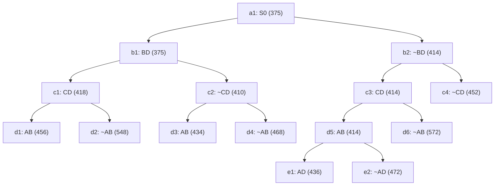

## The Question

The TSP Branch-and-Bound algorithm is solving a TSP instance where the cities are A, B, C, .... and so on. The Branch-and-Bound search tree at the time when the algorithm has discovered the optimal tour is shown below.

Each node in the search tree displays an edge (either XY or ~XY), a cost value, and a unique reference number (a1, b1, b2, ..., c1, ..., d1, ..., e1, e2). Use the reference numbers to break ties. When required, enter the reference numbers in short answers.

What information can you glean from the search tree? Answer the sub-questions based on the information gleaned from the se

| # | Question | Official answer |
|---|----------|-----------------|
| 2.1 | Let S0 (ref. no. a1) be the first node to be refined, identify the next 4 nodes  | `b1,c2,b2,c3` |
| 2.2 | Which node represents the optimal tour and what is the cost of the optimal tour? | `d3,434` |
| 2.3 | Determine the number of cities in the TSP instance. Enter the number of cities i | `5` |
| 2.4 | Start from city A, what is the path representation of the optimal tour? Enter th | `A,B,D,E,C` |

## The Topic in 60 Seconds

Every tree node carries a **lower bound**. The loop:

1. Pick the **live node with the smallest bound** (ties → reference number).
2. **Refine** it: split on the next edge — child `XY` = edge included, child `~XY` = edge excluded.
3. A child whose constraints already force a **unique complete tour** becomes a leaf with the tour cost.
4. **Stop** when the smallest live bound ≥ best complete tour found → that tour is optimal.

> Deep-dive: [BnB Tree Reading](/concepts/week-05-optimal-tsp/01-bnb-tree-reading), [Branch and Bound](/concepts/week-03-heuristic-search/05-branch-and-bound).

## The Trace

Always refine the cheapest live node:

| Refined | Bound | Children created | Live set after (ref : bound) |
|---------|-------|------------------|------------------------------|
| a1 : 375 | 375 | b1 = BD∈ (375), b2 = BD∉ (414) | b1(375), b2(414) → pick b1 |
| b1 : 375 | 375 | c1 = CD∈ (418), c2 = CD∉ (410) | **c2(410)** < b2(414) < c1(418) → pick c2 |
| c2 : 410 | 410 | d3 = AB∈ (**complete tour, 434**), d4 = AB∉ (468) | **b2(414)** < c1(418) < incumbent 434 → pick b2 |
| b2 : 414 | 414 | c3 = CD∈ (414), c4 = CD∉ (452) | **c3(414)** < c1(418) < 434 → pick c3 |
| c3 : 414 | 414 | d5 = AB∈ (414), d6 = AB∉ (572) | **d5(414)** < c1(418) < 434 → pick d5 |
| d5 : 414 | 414 | e1 = AD∈ (436), e2 = AD∉ (472) | **c1(418)** < 434 → pick c1 |
| c1 : 418 | 418 | d1 = AB∈ (456), d2 = AB∉ (548) | min live bound = incumbent **434** → STOP |

The next four refinements after a1 are exactly **b1 (375), c2 (410), b2 (414), c3 (414)** ✓ — each time the whole live set is compared and the smallest bound wins.

Watch the tree grow (orange = refining now, blue = live in the queue):

<StepGraph
  height={520}
  nodeWidth={100}
  nodeHeight={50}
  nodeFontSize={11}
  legend={[
    { color: "#b45309", label: "refining now" },
    { color: "#0369a1", label: "live (waiting)" },
    { color: "#4b5563", label: "already refined" },
    { color: "#16a34a", label: "optimal tour" },
    { color: "#7f1d1d", label: "pruned (bound >= 434)" },
  ]}
  steps={[
    {
      label: "0 · refine a1",
      note: "Live = { a1(375) }. Split on edge BD:\nb1 = include BD, LB 375 | b2 = exclude BD, LB 414.",
      elements: [
        { data: { id: "a1", label: "a1 · 375", type: "explored" }, position: { x: 430, y: 20 } },
        { data: { id: "b1", label: "b1 BD 375", type: "frontier" }, position: { x: 230, y: 125 } },
        { data: { id: "b2", label: "b2 ~BD 414", type: "frontier" }, position: { x: 640, y: 125 } },
        { data: { id: "e1x", source: "a1", target: "b1" } },
        { data: { id: "e2x", source: "a1", target: "b2" } },
      ],
    },
    {
      label: "1 · refine b1",
      note: "Smallest live = b1(375). Split on CD:\nc1 = include CD, LB 418 | c2 = exclude CD, LB 410.\nLive = { c2(410), b2(414), c1(418) }.",
      elements: [
        { data: { id: "a1", label: "a1 · 375", type: "explored" }, position: { x: 430, y: 20 } },
        { data: { id: "b1", label: "b1 BD 375", type: "explored" }, position: { x: 230, y: 125 } },
        { data: { id: "b2", label: "b2 ~BD 414", type: "frontier" }, position: { x: 640, y: 125 } },
        { data: { id: "c1", label: "c1 CD 418", type: "frontier" }, position: { x: 100, y: 235 } },
        { data: { id: "c2", label: "c2 ~CD 410", type: "frontier" }, position: { x: 370, y: 235 } },
        { data: { id: "e1x", source: "a1", target: "b1" } },
        { data: { id: "e2x", source: "a1", target: "b2" } },
        { data: { id: "e3x", source: "b1", target: "c1" } },
        { data: { id: "e4x", source: "b1", target: "c2" } },
      ],
    },
    {
      label: "2 · refine c2 → tour!",
      note: "Smallest live = c2(410). Split on AB:\nd3 = include AB → constraints force the full tour A,B,D,E,C = 434\nd4 = exclude AB, LB 468.\nIncumbent = 434.",
      elements: [
        { data: { id: "a1", label: "a1 · 375", type: "explored" }, position: { x: 430, y: 20 } },
        { data: { id: "b1", label: "b1 BD 375", type: "explored" }, position: { x: 230, y: 125 } },
        { data: { id: "b2", label: "b2 ~BD 414", type: "frontier" }, position: { x: 640, y: 125 } },
        { data: { id: "c1", label: "c1 CD 418", type: "frontier" }, position: { x: 100, y: 235 } },
        { data: { id: "c2", label: "c2 ~CD 410", type: "explored" }, position: { x: 370, y: 235 } },
        { data: { id: "d3", label: "d3 AB 434", type: "path" }, position: { x: 300, y: 345 } },
        { data: { id: "d4", label: "d4 ~AB 468", type: "frontier" }, position: { x: 445, y: 345 } },
        { data: { id: "e1x", source: "a1", target: "b1" } },
        { data: { id: "e2x", source: "a1", target: "b2" } },
        { data: { id: "e3x", source: "b1", target: "c1" } },
        { data: { id: "e4x", source: "b1", target: "c2" } },
        { data: { id: "e7x", source: "c2", target: "d3" } },
        { data: { id: "e8x", source: "c2", target: "d4" } },
      ],
    },
    {
      label: "3 · refine b2",
      note: "b2(414) < incumbent 434, still promising.\nSplit on CD: c3 = include, LB 414 | c4 = exclude, LB 452.\nLive = { c3(414), c1(418), d3(434), ... }.",
      elements: [
        { data: { id: "a1", label: "a1 · 375", type: "explored" }, position: { x: 430, y: 20 } },
        { data: { id: "b1", label: "b1 BD 375", type: "explored" }, position: { x: 230, y: 125 } },
        { data: { id: "b2", label: "b2 ~BD 414", type: "explored" }, position: { x: 640, y: 125 } },
        { data: { id: "c1", label: "c1 CD 418", type: "frontier" }, position: { x: 100, y: 235 } },
        { data: { id: "c2", label: "c2 ~CD 410", type: "explored" }, position: { x: 370, y: 235 } },
        { data: { id: "c3", label: "c3 CD 414", type: "frontier" }, position: { x: 540, y: 235 } },
        { data: { id: "c4", label: "c4 ~CD 452", type: "frontier" }, position: { x: 770, y: 235 } },
        { data: { id: "d3", label: "d3 AB 434", type: "path" }, position: { x: 300, y: 345 } },
        { data: { id: "d4", label: "d4 ~AB 468", type: "frontier" }, position: { x: 445, y: 345 } },
        { data: { id: "e1x", source: "a1", target: "b1" } },
        { data: { id: "e2x", source: "a1", target: "b2" } },
        { data: { id: "e3x", source: "b1", target: "c1" } },
        { data: { id: "e4x", source: "b1", target: "c2" } },
        { data: { id: "e5x", source: "b2", target: "c3" } },
        { data: { id: "e6x", source: "b2", target: "c4" } },
        { data: { id: "e7x", source: "c2", target: "d3" } },
        { data: { id: "e8x", source: "c2", target: "d4" } },
      ],
    },
    {
      label: "4 · refine c3",
      note: "Smallest live = c3(414). Split on AB:\nd5 = include, LB 414 | d6 = exclude, LB 572.\nLive = { d5(414), c1(418), d3(434), ... }.",
      elements: [
        { data: { id: "a1", label: "a1 · 375", type: "explored" }, position: { x: 430, y: 20 } },
        { data: { id: "b1", label: "b1 BD 375", type: "explored" }, position: { x: 230, y: 125 } },
        { data: { id: "b2", label: "b2 ~BD 414", type: "explored" }, position: { x: 640, y: 125 } },
        { data: { id: "c1", label: "c1 CD 418", type: "frontier" }, position: { x: 100, y: 235 } },
        { data: { id: "c2", label: "c2 ~CD 410", type: "explored" }, position: { x: 370, y: 235 } },
        { data: { id: "c3", label: "c3 CD 414", type: "explored" }, position: { x: 540, y: 235 } },
        { data: { id: "c4", label: "c4 ~CD 452", type: "frontier" }, position: { x: 770, y: 235 } },
        { data: { id: "d3", label: "d3 AB 434", type: "path" }, position: { x: 300, y: 345 } },
        { data: { id: "d4", label: "d4 ~AB 468", type: "frontier" }, position: { x: 445, y: 345 } },
        { data: { id: "d5", label: "d5 AB 414", type: "frontier" }, position: { x: 545, y: 345 } },
        { data: { id: "d6", label: "d6 ~AB 572", type: "frontier" }, position: { x: 665, y: 345 } },
        { data: { id: "e1x", source: "a1", target: "b1" } },
        { data: { id: "e2x", source: "a1", target: "b2" } },
        { data: { id: "e3x", source: "b1", target: "c1" } },
        { data: { id: "e4x", source: "b1", target: "c2" } },
        { data: { id: "e5x", source: "b2", target: "c3" } },
        { data: { id: "e6x", source: "b2", target: "c4" } },
        { data: { id: "e7x", source: "c2", target: "d3" } },
        { data: { id: "e8x", source: "c2", target: "d4" } },
        { data: { id: "e9x", source: "c3", target: "d5" } },
        { data: { id: "e10x", source: "c3", target: "d6" } },
      ],
    },
    {
      label: "5 · refine d5",
      note: "Smallest live = d5(414). Split on AD:\ne1 = include, LB 436 | e2 = exclude, LB 472.\nLive = { c1(418), d3(434), e1(436), ... }.",
      elements: [
        { data: { id: "a1", label: "a1 · 375", type: "explored" }, position: { x: 430, y: 20 } },
        { data: { id: "b1", label: "b1 BD 375", type: "explored" }, position: { x: 230, y: 125 } },
        { data: { id: "b2", label: "b2 ~BD 414", type: "explored" }, position: { x: 640, y: 125 } },
        { data: { id: "c1", label: "c1 CD 418", type: "frontier" }, position: { x: 100, y: 235 } },
        { data: { id: "c2", label: "c2 ~CD 410", type: "explored" }, position: { x: 370, y: 235 } },
        { data: { id: "c3", label: "c3 CD 414", type: "explored" }, position: { x: 540, y: 235 } },
        { data: { id: "c4", label: "c4 ~CD 452", type: "frontier" }, position: { x: 770, y: 235 } },
        { data: { id: "d3", label: "d3 AB 434", type: "path" }, position: { x: 300, y: 345 } },
        { data: { id: "d4", label: "d4 ~AB 468", type: "frontier" }, position: { x: 445, y: 345 } },
        { data: { id: "d5", label: "d5 AB 414", type: "explored" }, position: { x: 545, y: 345 } },
        { data: { id: "d6", label: "d6 ~AB 572", type: "frontier" }, position: { x: 665, y: 345 } },
        { data: { id: "f1", label: "e1 AD 436", type: "frontier" }, position: { x: 480, y: 455 } },
        { data: { id: "f2", label: "e2 ~AD 472", type: "frontier" }, position: { x: 615, y: 455 } },
        { data: { id: "e1x", source: "a1", target: "b1" } },
        { data: { id: "e2x", source: "a1", target: "b2" } },
        { data: { id: "e3x", source: "b1", target: "c1" } },
        { data: { id: "e4x", source: "b1", target: "c2" } },
        { data: { id: "e5x", source: "b2", target: "c3" } },
        { data: { id: "e6x", source: "b2", target: "c4" } },
        { data: { id: "e7x", source: "c2", target: "d3" } },
        { data: { id: "e8x", source: "c2", target: "d4" } },
        { data: { id: "e9x", source: "c3", target: "d5" } },
        { data: { id: "e10x", source: "c3", target: "d6" } },
        { data: { id: "e11x", source: "d5", target: "f1" } },
        { data: { id: "e12x", source: "d5", target: "f2" } },
      ],
    },
    {
      label: "6 · refine c1 → stop",
      note: "Last live node below 434 refined:\nd1 = AB in, LB 456 | d2 = ~AB, LB 548.\nMin live bound = 434 = incumbent → OPTIMAL.\nOptimal tour = d3, cost 434: A,B,D,E,C.",
      elements: [
        { data: { id: "a1", label: "a1 · 375", type: "explored" }, position: { x: 430, y: 20 } },
        { data: { id: "b1", label: "b1 BD 375", type: "explored" }, position: { x: 230, y: 125 } },
        { data: { id: "b2", label: "b2 ~BD 414", type: "explored" }, position: { x: 640, y: 125 } },
        { data: { id: "c1", label: "c1 CD 418", type: "explored" }, position: { x: 100, y: 235 } },
        { data: { id: "c2", label: "c2 ~CD 410", type: "explored" }, position: { x: 370, y: 235 } },
        { data: { id: "c3", label: "c3 CD 414", type: "explored" }, position: { x: 540, y: 235 } },
        { data: { id: "c4", label: "c4 ~CD 452", type: "pruned" }, position: { x: 770, y: 235 } },
        { data: { id: "d1", label: "d1 AB 456", type: "pruned" }, position: { x: 25, y: 345 } },
        { data: { id: "d2", label: "d2 ~AB 548", type: "pruned" }, position: { x: 175, y: 345 } },
        { data: { id: "d3", label: "d3 AB 434 ✓", type: "goal" }, position: { x: 300, y: 345 } },
        { data: { id: "d4", label: "d4 ~AB 468", type: "pruned" }, position: { x: 445, y: 345 } },
        { data: { id: "d5", label: "d5 AB 414", type: "explored" }, position: { x: 545, y: 345 } },
        { data: { id: "d6", label: "d6 ~AB 572", type: "pruned" }, position: { x: 665, y: 345 } },
        { data: { id: "f1", label: "e1 AD 436", type: "pruned" }, position: { x: 480, y: 455 } },
        { data: { id: "f2", label: "e2 ~AD 472", type: "pruned" }, position: { x: 615, y: 455 } },
        { data: { id: "e1x", source: "a1", target: "b1" } },
        { data: { id: "e2x", source: "a1", target: "b2" } },
        { data: { id: "e3x", source: "b1", target: "c1" } },
        { data: { id: "e4x", source: "b1", target: "c2" } },
        { data: { id: "e5x", source: "b2", target: "c3" } },
        { data: { id: "e6x", source: "b2", target: "c4" } },
        { data: { id: "e13x", source: "c1", target: "d1" } },
        { data: { id: "e14x", source: "c1", target: "d2" } },
        { data: { id: "e7x", source: "c2", target: "d3" } },
        { data: { id: "e8x", source: "c2", target: "d4" } },
        { data: { id: "e9x", source: "c3", target: "d5" } },
        { data: { id: "e10x", source: "c3", target: "d6" } },
        { data: { id: "e11x", source: "d5", target: "f1" } },
        { data: { id: "e12x", source: "d5", target: "f2" } },
      ],
    },
  ]}
/>

## Answers, decoded

- **2.1 → `b1,c2,b2,c3`.** After a1 splits, the queue holds b1(375) vs b2(414) → b1. Refining b1 drops c2(410), which undercuts everything → c2 next. Then b2(414) beats c1(418); then c3(414) beats c1(418). Always compare the **whole live set**, not just siblings.
- **2.2 → `d3,434`.** d3's constraint chain: BD∈ (b1), CD∉ (c2), AB∈ (d3) forces the path A–B–D outright — a leaf with no children means the remaining edges were forced, so its bound **is** a complete tour cost. Termination: after c1 is refined, every live bound (436, 452, 468, 472, 548, 572) ≥ 434.
- **2.3 → `5`.** The optimal tour visits five distinct cities — A, B, D, E, C — so the instance has 5 cities; a Hamiltonian cycle here has 5 edges, and the tree fixes them one branching at a time (BD, CD, AB, AD explicit — the fifth edge CA comes for free).
- **2.4 → `A,B,D,E,C`.** From d3's forced path A–B–D, the only unvisited cities are E and C; CD∉ forbids closing D→C directly, so D must go to E, leaving C to close the cycle: $A \to B \to D \to E \to C \to A$, cost 434 ✓.

## Tricks & Tips

<Accordion title="Exam shortcuts">
1. Write XY as "+edge" and ~XY as "-edge" on the tree margin — reconstructing the tour is just reading the + signs down the trunk.
2. Refinement order = cheapest live bound anywhere in the queue; ref numbers only break exact ties (they never fire here).
3. A leaf with no children = forced complete tour; its bound is an upper bound you now compare against all live nodes.
4. Stop condition, verbatim: smallest live bound ≥ incumbent tour cost. Here 436 ≥ 434 ends it — e1/e2 never get refined.
5. Count cities from the tour letters, not from the tree depth — branchings skip edges that were never competitive.
</Accordion>

**Answers:** 2.1 `b1,c2,b2,c3` · 2.2 `d3,434` · 2.3 `5` · 2.4 `A,B,D,E,C`
