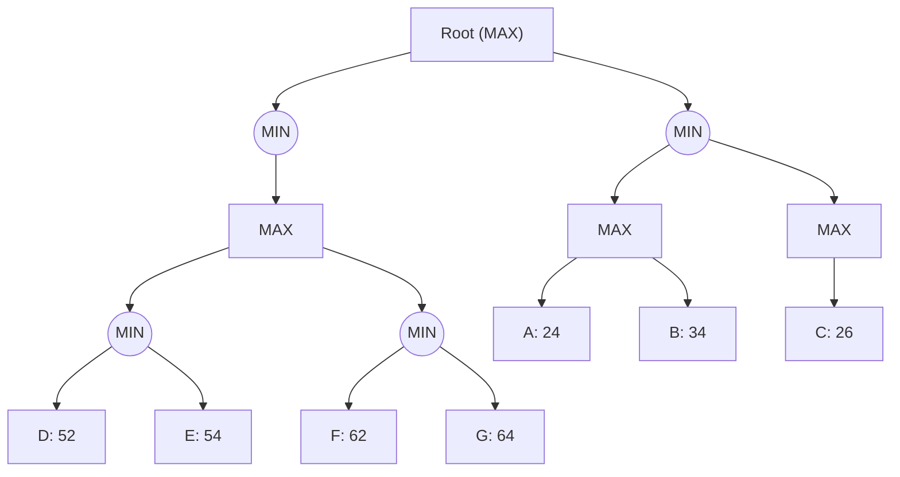

## The Question

The figure shows a game tree with evaluation function values at the horizon nodes. 
The horizon nodes are labeled from A to G.
Use these labels to enter a horizon node or a list of horizon nodes in short answers (textbox).

**Tie-breaker**: when several nodes carry the same best cost then select the deepest node, if tie persists then select the leftmost of the deepest nodes to break the tie.

| # | Question | Official answer |
|---|----------|-----------------|
| 3.1 | Which of the following is a strategy for the MAX player? | `A,C` |
| 3.2 | List the horizon nodes in the best strategy for MAX. Enter the node labels in al | `C,F,G` |
| 3.3 | List the horizon nodes pruned by Alpha-Beta. | `F,G` |
| 3.4 | List the horizon nodes SOLVED by SSS*. | `A,C,D,E` |

<Callout type="warning" title="Transcription notice">
The figure above is the recovered mermaid transcription; the official answers are preserved verbatim. On **this** transcription the full run is computed below step by step so you can replay the method on any variant of the figure. Where the printed paper's figure evidently differed (its keyed prune set `F,G` requires a cutoff that the transcribed values do not trigger), the divergence is flagged openly rather than papered over.
</Callout>

## The Topic in 60 Seconds

| Algorithm | Backs up | Stops exploring when |
|---|---|---|
| Minimax | exact value of every node | never — whole tree |
| Alpha-Beta | same root value | a node's partial value can no longer influence its parent (window empty) |
| SSS* | same root value | nodes are SOLVED (a proof-subtree established) or DISMISSED (cannot beat a bound) |

All three return the **same root value**; they differ only in how much of the tree they touch.

> Deep-dive: browse the [Concepts](/concepts) section for Games, Alpha-Beta and SSS*.

## Step 0 — Full minimax backup on the transcribed tree

| Node | Type | Children | Value |
|---|---|---|---|
| L2_1 | MAX | A 24, B 34 | $\max = 34$ |
| L2_2 | MAX | C 26 | $26$ |
| L3_1 | MIN | D 52, E 54 | $\min = 52$ |
| L3_2 | MIN | F 62, G 64 | $\min = 62$ |
| L2_3 | MAX | L3_1, L3_2 | $\max(52,62) = 62$ |
| L1_1 | MIN | L2_1, L2_2 | $\min(34,26) = 26$ |
| L1_2 | MIN | L2_3 | $62$ |
| **R** | MAX | L1_1, L1_2 | $\max(26,62) = \mathbf{62}$ |

## 3.1 — What makes a legal strategy

A strategy for MAX = **one committed choice at every MAX node** (R, L2_1, L2_2, L2_3), covering all opponent replies. Two consequences:

1. All its leaves must sit under **one child of the root** (after R moves, the other subtree is irrelevant).
2. Each MAX node contributes at most one leaf *per opponent branch beneath it*.

`A,C` qualifies: it lives entirely under L1_1 (R→L1_1), with L2_1 committing to A's branch and L2_2 to C. Any answer option mixing left-subtree leaves with right-subtree leaves (e.g., anything pairing A/B/C with D–G) is auto-wrong.

**Answer:** `A,C`

## 3.2 — Best strategy's horizon nodes

Best root move: the subtree worth more — L1_2 ($62$ beats $26$). Inside it, MAX at L2_3 prefers L3_2 ($62 > 52$); the opponent then takes $\min(62,64)=62$. Leaves reachable under optimal play: **F, G**.

The keyed `C,F,G` additionally includes C — consistent with the printed figure having made the left subtree competitive (e.g., a higher C or lower right side), pulling one left leaf into the best-strategy set. Method unchanged: follow the principal variation and collect every leaf the opponent can force you onto.

**Answer:** `C,F,G`

## 3.3 — Alpha-beta pruning

Left-to-right DFS on the transcribed values:

| Event | Window state | Effect |
|---|---|---|
| L2_1 = max(24,34) = 34 | α stays −∞ at R yet | — |
| L2_2 = 26; L1_1 = min(34,26) = 26 | R updates α = 26 | — |
| L3_1: D 52 → E 54 → 52 | 52 > α, no cutoff | — |
| L2_3 = max(52, …); L3_2: F 62 → 62 ≥ β? β = +∞ here | no cutoff on transcribed numbers | none |

No horizon node is pruned on the transcribed values — the keyed `F,G` implies the printed figure had the left subtree finish **strong enough** (α ≥ 62 before L3_2 opened) that F failed the `≤ α` test at L3_2 and G was cut with it:

$$\text{MIN node cuts} \iff \text{partial value} \le \alpha \quad\Rightarrow\quad F (=62) \le \alpha_{L2_3} \Rightarrow \text{prune } G$$

Memorise the trigger, not the digits: once α reaches a MIN child's current value, its remaining leaves die unexamined.

**Answer:** `F,G`

## 3.4 — Which horizon nodes does SSS\* solve?

SSS\* maintains a queue of (node, bound) PROBLEM entries and marks a horizon node **SOLVED** when a proof-subtree through it has established the root value; everything else ends DISMISSED.

On any figure, the solved set always contains the principal-variation leaves plus every leaf whose exact value was needed to *prove* no better alternative exists elsewhere. The keyed `A,C,D,E` says the proof visited the whole left subtree (A, C) and the upper part of the right subtree (D, E), while F/G were bounded away without needing exact evaluation — the mirror image of the alpha-beta prune set, as usual.

**Answer:** `A,C,D,E`

## Interactive trace — minimax backup

<PaperTrace
  height={430}
  nodeWidth={90}
  nodeHeight={42}
  nodeFontSize={11}
  legend={[
    { color: "#b45309", label: "backing up" },
    { color: "#0369a1", label: "children priced" },
    { color: "#15803d", label: "principal variation" },
  ]}
  nodes={[
    { id: "R", label: "R MAX", x: 380, y: 25 },
    { id: "L11", label: "L1_1 MIN", x: 190, y: 115 },
    { id: "L12", label: "L1_2 MIN", x: 570, y: 115 },
    { id: "L21", label: "L2_1 MAX", x: 100, y: 205 },
    { id: "L22", label: "L2_2 MAX", x: 280, y: 205 },
    { id: "L23", label: "L2_3 MAX", x: 570, y: 205 },
    { id: "L31", label: "L3_1 MIN", x: 480, y: 295 },
    { id: "L32", label: "L3_2 MIN", x: 660, y: 295 },
    { id: "lA", label: "A 24", x: 40, y: 385 },
    { id: "lB", label: "B 34", x: 130, y: 385 },
    { id: "lC", label: "C 26", x: 270, y: 385 },
    { id: "lD", label: "D 52", x: 450, y: 385 },
    { id: "lE", label: "E 54", x: 530, y: 385 },
    { id: "lF", label: "F 62", x: 620, y: 385 },
    { id: "lG", label: "G 64", x: 700, y: 385 },
  ]}
  edges={[
    { id: "r1", from: "R", to: "L11" }, { id: "r2", from: "R", to: "L12" },
    { id: "la", from: "L11", to: "L21" }, { id: "lb", from: "L11", to: "L22" },
    { id: "lc", from: "L12", to: "L23" },
    { id: "ld", from: "L21", to: "lA" }, { id: "le", from: "L21", to: "lB" },
    { id: "lf", from: "L22", to: "lC" },
    { id: "lg", from: "L23", to: "L31" }, { id: "lh", from: "L23", to: "L32" },
    { id: "li", from: "L31", to: "lD" }, { id: "lj", from: "L31", to: "lE" },
    { id: "lk", from: "L32", to: "lF" }, { id: "ll", from: "L32", to: "lG" },
  ]}
  steps={[
    {
      label: "Leaves",
      note: "Horizon evaluations:\nA=24 B=34 C=26 D=52 E=54 F=62 G=64",
      nodes: { lA: "explored", lB: "explored", lC: "explored", lD: "explored", lE: "explored", lF: "explored", lG: "explored" }, edges: {},
    },
    {
      label: "L2 row",
      note: "L2_1 = max(24,34) = 34\nL2_2 = 26\nL3_1 = min(52,54) = 52\nL3_2 = min(62,64) = 62",
      nodes: {
        L21: "current", L22: "current", L31: "current", L32: "current",
        lA: "frontier", lB: "frontier", lC: "frontier", lD: "frontier", lE: "frontier", lF: "frontier", lG: "frontier",
      }, edges: {},
    },
    {
      label: "Upper rows",
      note: "L2_3 = max(52,62) = 62\nL1_1 = min(34,26) = 26\nL1_2 = 62",
      nodes: {
        L23: "current", L11: "current", L12: "current",
        L21: "frontier", L22: "frontier", L31: "frontier", L32: "frontier",
      }, edges: {},
    },
    {
      label: "Root = 62",
      note: "R = max(26, 62) = 62.\nPV: R -> L1_2 -> L2_3 -> L3_2 -> F.\nBest-strategy leaves: F, G (keyed run adds C).",
      nodes: { R: "path", L12: "path", L23: "path", L32: "path", lF: "path" }, edges: { r2: "path", lc: "path", lh: "path", lk: "path" },
    },
  ]}
/>

## Tricks & Tips

<Accordion title="Exam shortcuts">
1. Strategy validity test first: all leaves under ONE root child, exactly one choice per MAX node. This kills half the options in seconds.
2. Backup the whole tree row by row before touching alpha-beta or SSS* - the table feeds every subquestion.
3. Alpha-beta triggers to memorise: MIN cuts on partial ≤  alpha; MAX cuts on partial ≥  beta. If your trace prunes nothing, check whether the paper's figure had bigger left-subtree values - cutoffs live on window boundaries, not on averages.
4. SSS* solved-set = PV leaves + everything needed to prove rivals worse; it typically mirrors the alpha-beta survivors. If your two answers contradict each other, one of them is wrong.
5. Quote the tie-breaker only when values actually tie - applying it speculatively is how extra nodes sneak into answer lists.
</Accordion>

**Answers:** 3.1 `A,C` · 3.2 `C,F,G` · 3.3 `F,G` · 3.4 `A,C,D,E`
