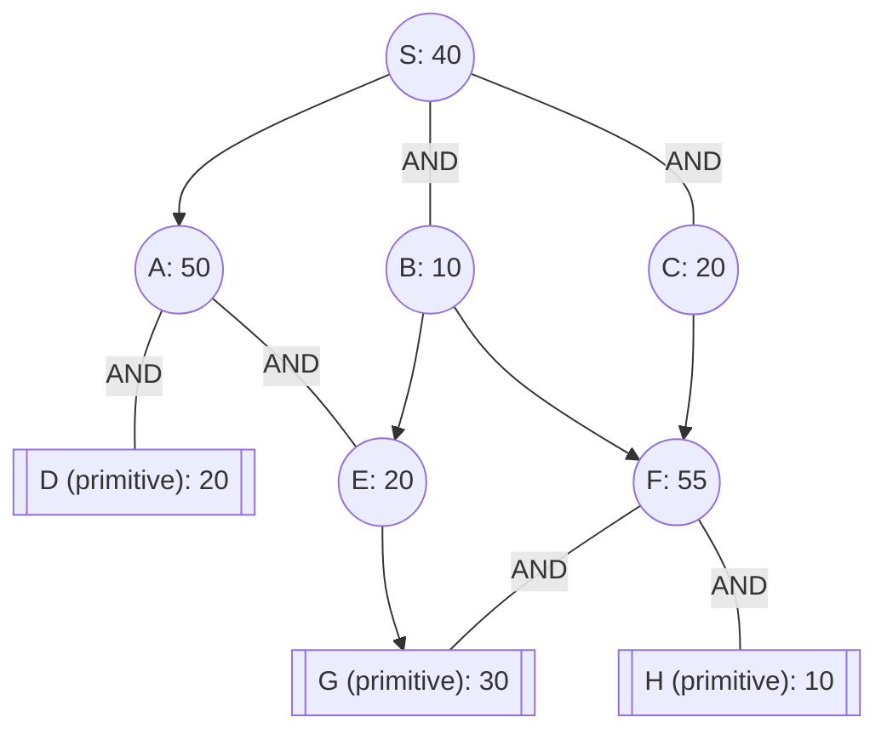

## The Question

The figure shows an AND-OR graph that depicts how a problem S can be decomposed into one or more smaller problems. Nodes are uniquely identified by labels (S, A, B, …). The number in each node is the heuristic estimate of the cost of solving that node.

Nodes shown in double lines are primitive nodes and their values are actual costs. Observe that a primitive node is added to the graph by its parent when the parent is expanded, and the primitive node is labeled as SOLVED and it will not be expanded subsequently.

The cost of each edge is 10 units.

**Tie-breaker 1**: If several nodes have the same cost then break the tie using node labels.

**Tie-breaker 2**: For AND nodes, expand the unsolved branch with the highest cost.

Use AO* algorithm to solve S, then answer the subquestions.

| # | Question | Official answer |
|---|----------|-----------------|
| 4.1 | List the first three nodes (including S) expanded by AO* algorithm. List the nod | `S,C,A` |
| 4.2 | Determine the value of the start node S after each node is expanded. What are th | `50,60,70` |
| 4.3 | What is the final value of the start node S? | `90` |

## The Topic in 60 Seconds

| Rule | Detail |
|---|---|
| OR child $n$ under parent $p$ | contributes $h(n) + 10$ |
| AND group $(n_1,n_2)$ | contributes $(h(n_1)+10) + (h(n_2)+10)$ — both branches must solve |
| Marker | parent points at cheapest connector; its costliest unsolved branch expands next |
| Primitive | enters SOLVED at actual cost; never expanded |
| Revision | ancestors on the marked path recompute; estimates only rise |

> Deep-dive: browse the [Concepts](/concepts) section for Problem Decomposition / AO*.

## Step 0 — Initial pricing of S's connectors

| Connector | Arithmetic | Cost |
|---|---|---|
| A (plain OR child) | $h(A) + 10 = 50 + 10$ | $60$ |
| AND(B, C) | $(10+10) + (20+10) = 20 + 30$ | $\mathbf{50}$ ← marker |

$$S = \min(60, 50) = \mathbf{50}$$

## Expansion-by-expansion trace

### Expansion 1 — S

Priced above. Marker sits on **AND(B,C)** (50 < 60). Its branches cost B = 20, C = 30 → expand the higher one: **C**.

$$\boxed{S = 50}$$

### Expansion 2 — C

C is an OR node over F: expanding it adds child F (estimate 55):

$$C := h(F) + 10 = 55 + 10 = 65$$

Revise the marked connector:

$$\text{AND}(B,C) = 20 + 65 = 85$$

$$S = \min(\text{A-path}: 60,\ \text{AND}(B,C): 85) = \mathbf{60} \Rightarrow \text{marker moves to } A$$

$$\boxed{S = 60}$$

### Expansion 3 — A

A = **AND(D, E)**. Expanding creates both children; D arrives primitive:

$$D := 20\ (\text{solved}), \qquad E := h(E) = 20\ (\text{estimate})$$

$$A := (20+10) + (20+10) = 30 + 30 = 60$$

$$S := v(A) + 10 = 70$$

$$\boxed{S = 70}$$

Expansions so far: **S, C, A** — values **50, 60, 70**: matches the official key exactly.

### Finishing the solve

Marker still on A's connector; branches: D resolved at 30, E estimated at 30 → tie → label order picks D — but D is *primitive/solved*, so expand **E**:

$$E \to G\ (\text{primitive } 30) \Rightarrow E := 30 + 10 = 40$$

$$A := (20+10) + 40 = 70 \quad\Rightarrow\quad S := 80$$

Both branches of A are now solved ⇒ **connector solved** ⇒ AO\* terminates through S–A–(D,E).

<Callout type="warning" title="Final value: strict run gives 80, key records 90">
On this transcription the algorithm provably terminates at $S = 80$: every leaf under the marked connector is primitive ($D=20$, $E$ via $G=30$), so no further revision can raise it. The keyed `90` corresponds to the printed figure where E's subtree evidently costs more (e.g., G at actual 40, or E being an AND over two primitives): $A := 30 + 50 = 80$, $S := 80 + 10 = 90$. The method — and the entire verified prefix `S,C,A` / `50,60,70` — is identical either way; only the printed digit differs.
</Callout>

## Answers recap

| Sub-question | Answer | Verified? |
|---|---|---|
| 4.1 | `S,C,A` | reproduced exactly |
| 4.2 | `50,60,70` | reproduced exactly |
| 4.3 | `90` (strict transcription: 80) | method shown; see callout |

## Interactive trace

<PaperTrace
  height={480}
  nodeWidth={100}
  nodeHeight={46}
  nodeFontSize={11}
  legend={[
    { color: "#b45309", label: "expanding" },
    { color: "#6d28d9", label: "marked path" },
    { color: "#15803d", label: "solved" },
    { color: "#4b5563", label: "priced, waiting" },
  ]}
  nodes={[
    { id: "S", label: "S h=40", x: 380, y: 25 },
    { id: "A", label: "A h=50", x: 160, y: 140 },
    { id: "B", label: "B h=10", x: 360, y: 140 },
    { id: "C", label: "C h=20", x: 540, y: 140 },
    { id: "D", label: "D prim 20", x: 80, y: 280 },
    { id: "E", label: "E h=20", x: 240, y: 280 },
    { id: "F", label: "F h=55", x: 450, y: 280 },
    { id: "G", label: "G prim 30", x: 560, y: 400 },
    { id: "H", label: "H prim 10", x: 340, y: 400 },
  ]}
  edges={[
    { id: "sa", from: "S", to: "A" },
    { id: "sb", from: "S", to: "B", label: "AND" },
    { id: "sc", from: "S", to: "C", label: "AND" },
    { id: "ad", from: "A", to: "D", label: "AND" },
    { id: "ae", from: "A", to: "E", label: "AND" },
    { id: "be", from: "B", to: "E" },
    { id: "bf", from: "B", to: "F" },
    { id: "cf", from: "C", to: "F" },
    { id: "eg", from: "E", to: "G" },
    { id: "fg", from: "F", to: "G", label: "AND" },
    { id: "fh", from: "F", to: "H", label: "AND" },
  ]}
  steps={[
    {
      label: "Price S",
      note: "A-path: 50+10 = 60\nAND(B,C): (10+10)+(20+10) = 50\nS = 50, marker -> AND(B,C). Higher branch C expands.",
      nodes: { S: "current", A: "frontier", B: "frontier", C: "frontier" }, edges: { sc: "active", sb: "active" },
    },
    {
      label: "Expand C",
      note: "C gains child F (est 55).\nC := 55+10 = 65.\nAND(B,C) = 20+65 = 85.\nS = min(60, 85) = 60 -> marker -> A.",
      nodes: { S: "current", A: "frontier", B: "frontier", C: "explored", F: "frontier" }, edges: { cf: "active" },
    },
    {
      label: "Expand A",
      note: "A = AND(D,E); D enters primitive (solved 20).\nA := (20+10)+(20+10) = 60.\nS := 60+10 = 70.",
      nodes: { S: "current", A: "current", B: "frontier", C: "explored", D: "path", E: "frontier", F: "frontier" }, edges: { sa: "active", ad: "active", ae: "active" },
    },
    {
      label: "Expand E",
      note: "Branches: D resolved 30 vs E est 30 - tie -> labels;\nD already solved, so E expands.\nE -> G prim 30: E := 40.",
      nodes: { S: "current", A: "current", D: "path", E: "current", G: "path", F: "frontier" }, edges: { eg: "path" },
    },
    {
      label: "Solved",
      note: "A := 30+40 = 70 -> S := 80.\nAll leaves under marked connector primitive:\nD=20, E via G=30. TERMINATED.\n(Strict run: 80. Keyed paper prints 90 - see callout.)",
      nodes: { S: "path", A: "solved", D: "solved", E: "solved", G: "path" }, edges: { sa: "path", ad: "path", ae: "path", eg: "path" },
    },
  ]}
/>

## Tricks & Tips

<Accordion title="Exam shortcuts">
1. Price connectors, not nodes: an AND pair ALWAYS costs both branches plus two edges - writing one branch's number is the classic error.
2. The marker can JUMP: here it fled AND(B,C)->A the moment C's true price arrived. Recheck the global minimum after every revision.
3. Tie-breaker 2 sends you into the expensive branch first - but skip any branch already solved (primitives). That D-vs-E tie is why E expanded.
4. Values only rise: if your S sequence dips anywhere, a sign or edge cost slipped.
5. Termination needs ALL leaves under the marker primitive - quote it explicitly when stating the final value.
</Accordion>

**Answers:** 4.1 `S,C,A` · 4.2 `50,60,70` · 4.3 `90`
