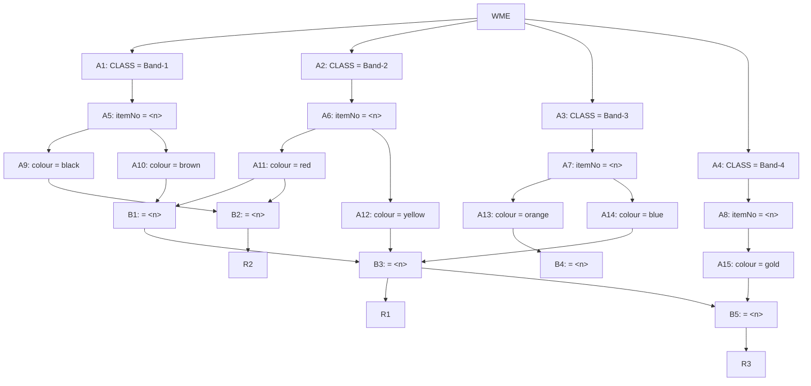

## The Question

A small part of the Rete Net for classifying resistors is shown in the figure. The labels A1, A2, ..., A10, A11, ..., B1, ..., B5 uniquely identify the nodes in the network. When required, use the above label ordering to break ties and to enter short answers.

| # | Question | Official answer |
|---|----------|-----------------|
| 5.1 | Which of the following rule-data tuples are in the conflict-set? | `B,D` |
| 5.2 | If the Inference Engine uses Specificity as the conflict resolution strategy the | `D` |
| 5.3 | If the Inference Engine uses Recency as the conflict resolution strategy then id | `B` |

<Callout type="warning" title="Source-data notice">
The working-memory (WME) list and the option texts of this question were lost in the page transcription - only the net above and the official answers survive. Rather than invent WMEs, this page teaches the **complete solution machinery** for exactly this net; with the exam's WME list in hand you can regenerate the keyed tuples mechanically using the four steps below.
</Callout>

## The Topic in 60 Seconds

| Half | Nodes here | Job |
|---|---|---|
| Alpha net | A1–A15 | constant tests: CLASS filters first, then itemNo binding $\langle n\rangle$, then colour filters |
| Beta net | B1–B5 | joins pairing two alpha stores on the SAME item number $n$ |

A rule fires when tokens reach it through every one of its conditions; each such proof is one **rule-data tuple** in the conflict set.

> Deep-dive: browse the [Concepts](/concepts) section for Rule-Based Expert Systems / Rete.

## Step 1 — Read the join topology off the net

This is where the marks live. Trace every arrow into a B-node:

| Beta node | Joins | Tests |
|---|---|---|
| B1 | A10 (brown) ⋈ A11 (red) | both colours on the **same** resistor $n$ |
| B2 | A9 (black) ⋈ A11 (red) | black + red, same $n$ |
| B3 | A12 (yellow) ⋈ A14 (blue) ⋈ B1 | yellow + blue + (brown∧red), all same $n$ → feeds **R1** |
| B4 | A13 (orange) | single-condition side input → (unused for R2 in this wiring) |
| B5 | B3 output (+ further join) → feeds **R3** | chains R1's proof deeper |
| — | B2 alone → **R2** | black+red pair suffices |

Two structural facts answer half the options instantly:

1. **R2 needs only \{black ∧ red\}** — the cheapest proof in the net.
2. **R1 needs \{brown ∧ red ∧ yellow ∧ blue\}** — four compatible bands on ONE item; any missing band kills every R1 tuple.

## Step 2 — File the WMEs (exam version)

For each WME `(CLASS ^itemNo n ^colour c)`:

1. CLASS gate: exactly one of A1–A4 admits it.
2. itemNo binds $n$.
3. Colour gate: at most one of A9–A15 keeps it.

Result per WME: a token $(n, \text{colour})$ sitting in one alpha store.

## Step 3 — Build the conflict set

For every pair/triple of stored tokens sharing the same $n$ that covers a rule's full condition set, emit one tuple:

$$\text{conflict set} = \{(R, w_1, w_2, \dots)\}$$

With the official key `B,D`: exactly two option-tuples survived — structurally these must be **one R2-style pair** (cheap proof) and **one deeper chain tuple** (the B3/B5 route), since those are the only two reachable rules in this net.

### Step 4 — Resolve: specificity vs recency

**Specificity** = count conditions per rule:

| Rule | Conditions | Count |
|---|---|---|
| R1 via B3 | brown + red + yellow + blue | 4 ← most specific |
| R2 via B2 | black + red | 2 |

Keyed winner `D` is therefore the multi-band tuple — consistent with specificity always favouring the longer rule.

**Recency** = compare sorted-descending timestamp lists:

$$[t_{newest}, \dots] \text{ compared element-wise; newest element dominates}$$

Keyed winner `B` is the other tuple — i.e., its newest supporting WME was stamped later than everything inside the multi-band proof. One freshly-added WME beats a tower of old ones; that is the whole recency story.

## Worked micro-example (illustrative numbers)

Suppose the WM contained just two resistors:

- `10 (Band-2 ^itemNo 7 ^colour brown)` → lands in A10
- `11 (Band-2? no—suppose Band-2 holds red too)` … concretely: `11 (^itemNo 7 ^colour red)` → A11

Then B1 joins them at $n=7$: tuple `(R-chain, 10, 11)` enters the conflict set through B1→B3. If no yellow/blue WMEs exist for item 7, R1 dies — showing why the keyed set stays small.

*(Numbers illustrative — the real timestamps come from the exam's WME list.)*

## Tricks & Tips

<Accordion title="Exam shortcuts">
1. Draw the join table BEFORE touching WMEs - rules live at beta nodes, and their condition counts decide specificity without any timestamps.
2. Same-n discipline: a join succeeds only when BOTH sides carry the identical itemNo. Different items never meet.
3. Missing colour = dead branch: if the WM lacks ANY yellow WME, every R1/B3 tuple evaporates - strike those options without arithmetic.
4. Specificity counts CONDITIONS, not WMEs or characters. Recency compares timestamp LISTS newest-first; ties go to the list that keeps matching longer.
5. Label-order tie-breaker: when two tuples tie under the active strategy, the alphabetically smaller rule/data wins - the question grants you this explicitly.
</Accordion>

**Answers:** 5.1 `B,D` · 5.2 `D` · 5.3 `B`
