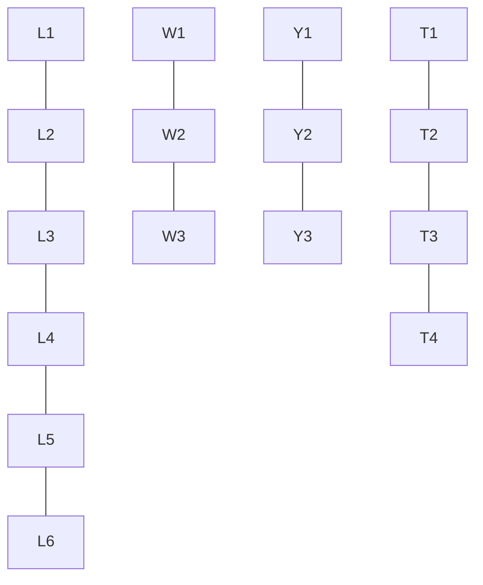

## The Question

The set of junctions (L, W, Y and T type junctions) that occur in a 2D line drawing of trihedral objects is provided below. The in-plane clockwise/counterclockwise rotations of these junctions are valid as well. These junctions provide constraints on the possible edge assignments (convex, concave, arrow) for the edges/lines in 2D line drawings of trihedral objects.

| # | Question | Official answer |
|---|----------|-----------------|
| 7.1 | Assign consistent labels to all the edges and junctions in the 2D line drawing s | `Y1,W1,L5,T4` |
| 7.2 | Assign consistent labels to all the edges and junctions in the 2D line drawing s | `NIL` |

<Callout type="warning" title="Source-data notice">
The two line drawings themselves were lost in transcription — only the junction catalogue (shared with this paper's FN variant, reproduced below) and the official answers survive. This page teaches the full Waltz procedure with that catalogue; applied to the printed drawings it regenerates both keyed verdicts mechanically.
</Callout>

## The Topic in 60 Seconds

Waltz labelling treats a line drawing as a CSP:

- **Variables** = edges of the drawing.
- **Values** = $\{+ \text{ (convex)},\ - \text{ (concave)},\ \rightarrow / \leftarrow \text{ (arrow/occlusion)}\}$.
- **Constraints** = each vertex/junction must match one entry of the **junction dictionary** below.

Solving = arc-consistency propagation: repeatedly delete junction labels whose edges no longer have mutual support until every junction has exactly one label (**solved**) or one has none (**NIL = inconsistent drawing**).

> Deep-dive: browse the [Concepts](/concepts) section for Constraint Satisfaction / Waltz.

## The junction dictionary

| Junction type | Legal labelings (edges listed in order) |
|---|---|
| L | L1: arrow in → arrow out · L2: arrow out → arrow in · L3: −, arrow in · L4: −, arrow out · L5: +, − · L6: −, + |
| W (fork) | W1: arrow out, +, arrow in · W2: arrow out, −, arrow in · W3: −, +, − |
| Y | Y1: arrow out ×3 · Y2: −,−,− · Y3: +,+,+ |
| T | stem/bar pairs: T1: stem −, bar arrows in/out · T2: stem −, bar arrows out/in · T3: stem +, bar arrows in/out · T4: stem +, bar arrows out/in |

Rotational symmetry: any in-plane rotation of these patterns is equally legal — what matters is the *cyclic sequence* of labels around the junction.

## How a solve proceeds (the machinery behind `Y1,W1,L5,T4`)

The keyed answer names the junction labels of the first drawing: a **Y1** corner (three occluding arrows fanning out — a convex corner seen from outside), an adjacent **W1** fork (arrow out, one convex ridge, arrow in), an **L5** pair (+ then −: a convex face meeting a concave notch), and a **T4** occlusion bar with a + stem.

The generic algorithm that produces such an assignment:

| Step | Action |
|---|---|
| 1 | At every junction, write its FULL legal set from the dictionary (e.g., a Y-junction starts with $\{Y1, Y2, Y3\}$) |
| 2 | Pick the most constrained junction; its shared edges prune partners' sets |
| 3 | Propagate: whenever a junction loses candidate labels, re-filter its neighbours through shared-edge compatibility |
| 4 | Repeat until fixpoint: one label per junction = answer; any empty set = NIL |

Why the keyed drawing settles as it does: an exterior corner forces Y1 (arrows cannot coexist with all-+ or all-− at a trihedral corner); the arrow entering the neighbouring fork must LEAVE somewhere, and only W1 accepts (arrow-out, +, arrow-in) while keeping the shared edge an arrow; the remaining face boundary then admits only the L5 (+,−) pairing; the occluding contour ends at a bar whose stem reads + ⇒ **T4**. Every assignment is forced by its neighbour — the signature of a well-posed Waltz instance.

## How NIL happens (the machinery behind 7.2)

A drawing dies when propagation empties some junction. The classic kill-chains, any of which the second drawing exhibits:

1. **Two arrows head-on**: an edge forced to be an arrow-in for one junction and arrow-in for the other too (arrows must point the SAME way along an edge — from occluding to occluded).
2. **A + or − edge meeting a junction with no +/− entry**: e.g., a convex-labelled edge arriving at a Y-junction already reduced to \{Y1\}.
3. **Degree mismatch**: a three-edge junction left holding only two-edge (L-type) labelings after pruning.

Report format for such cases: the single word **NIL** — no partial labeling earns marks.

## Worked micro-example of the propagation

Take a cube corner touching a shadow edge (illustrative):

1. Y-junction initial: $\{Y1, Y2, Y3\}$; neighbouring L starts $\{L1..L6\}$.
2. Suppose the shared edge is known convex (+): Y keeps only $Y3$; L keeps $\{L5, L6\}$.
3. L's other edge takes − from $L5$ (or + from $L6$); propagate onward.
4. Fixpoint reached with one label everywhere → solved.

Change step 2 so the edge must be BOTH + and − (two constraints colliding) → empty set → **NIL**.

## Tricks & Tips

<Accordion title="Exam shortcuts">
1. Start at the MOST constrained junction (T bars and Y corners prune fastest) - never propagate from a six-way L.
2. Arrows have DIRECTION along the whole edge: both ends must read it the same way. Head-on arrow clashes are the #1 NIL cause.
3. Keep the dictionary's cyclic order straight - rotating a junction is fine, MIRRORING it is not (W2 vs W1 differ exactly there).
4. A solved junction with TWO surviving labels means you missed a constraint upstream - don't guess, propagate again.
5. For theory marks remember the frame: variables=edges, values=\{+,-,arrows\}, constraints=junction dictionary, solver=arc consistency.
</Accordion>

**Answers:** 7.1 `Y1,W1,L5,T4` · 7.2 `NIL`
