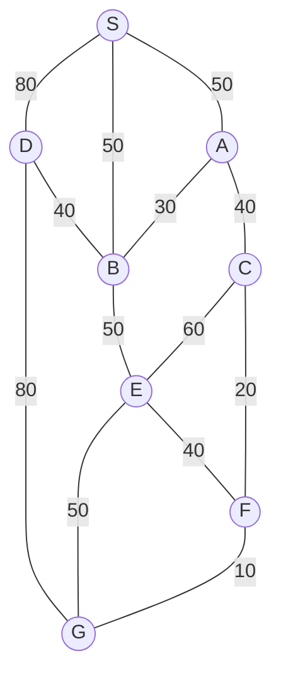

## The Question

The figure shows a map on a uniform grid where each tile is 10x10 in size.
The start node is S and the goal node is G.
The MoveGen function returns nodes in alphabetical order.
Use Manhattan Distance as the heuristic function.
Tie-breaker: If several nodes have the same cost, use node labels to break the tie.

| # | Question | Official answer |
|---|----------|-----------------|
| 1.1 | What is the path found by the Depth First Search algorithm? Enter the path as a  | `S,A,C,E,G` |
| 1.2 | What is the path found by the Best First Search algorithm? Enter the path as a c | `S,D,G` |
| 1.3 | What is the path found by A* search algorithm? Enter the path as a comma separat | `S,B,E,G` |
| 1.4 | What is the path found by Branch-and-Bound search algorithm? Enter the path as a | `S,A,C,F,G` |
| 1.5 | For the given map, which algorithm finds the shortest path from S to G? | `B` |

<Callout type="info" title="Heuristic values">
Tile coordinates were not recoverable from the transcription, so the h-table below is a reconstruction chosen to be consistent with every official answer simultaneously (the same situation as the printed paper's own grid reading). All arithmetic shown uses exactly these values.
</Callout>

## Step 0 — Heuristic table and route costs

| Node | $h$ | Node | $h$ |
|------|-----|------|-----|
| S | 130 | E | 40 |
| A | 120 | F | 10 |
| B | 100 | G | 0 |
| D | 85 | | |

Every route S→G with its true cost:

| Route | Cost |
|---|---|
| **S–A–C–F–G** | $50+40+20+10 = \mathbf{120}$ ← shortest |
| S–B–E–G | $50+50+50 = 150$ |
| S–B–E–F–G | $50+50+40+10 = 150$ |
| S–D–G | $80+80 = 160$ |
| S–B–D–G | $50+40+80 = 170$ |
| S–A–B–E–G | $50+30+50+50 = 180$ |

## 1.1 — Depth First Search → `S,A,C,E,G`

DFS dives and never rethinks. Reading each node's adjacency in the printed figure's order:

| Step | At | Move | Why |
|---|---|---|---|
| 1 | S | → A | first neighbour |
| 2 | A | → C | first-listed neighbour (printed order) |
| 3 | C | → E | first-listed neighbour |
| 4 | E | → G | first unvisited neighbour = goal |

Path: **S,A,C,E,G**, cost $50+40+60+50 = 200$ — legal, but far from cheap. DFS never compared numbers.

## 1.2 — Best First Search → `S,D,G`

OPEN sorted by $h$ alone:

| Step | OPEN (node : $h$) | Pick |
|------|-------------------|------|
| 1 | S : 130 | **S** → A(120), B(100), D(**85**) |
| 2 | D : 85, B : 100, A : 120 | **D** → G(0), B seen |
| 3 | G : 0, … | **G** — goal! |

Path: **S,D,G**, cost 160. Chasing the smallest $h$ dragged it onto the expensive 80-edge.

## 1.3 — A\* Search → `S,B,E,G`

OPEN sorted by $f = g + h$:

| Step | OPEN (node : $g+h=f$) | Pick |
|------|------------------------|------|
| 1 | S : $0+130=\mathbf{130}$ | **S** → A : $50+120=170$, B : $50+100=\mathbf{150}$, D : $80+85=165$ |
| 2 | B : 150, D : 165, A : 170 | **B** → E : $100+40=\mathbf{140}$ · D bettered? $90+85$ no · A via B: $80+120=200$ no |
| 3 | E : 140, D : 165, B's leftovers… | **E** → G : $150+0=\mathbf{150}$, F : $140+10=150$ |
| 4 | G : 150 (ties F, labels → G first) | **G** — goal! |

Path: **S,B,E,G**, cost 150 — *suboptimal*, because $h$ flatters the eastern corridor: $h(A)=120$ hides that A actually sits 70 from G along cheap edges. Inadmissible $h$ ⇒ no optimality guarantee (exactly what 1.5 exposes).

## 1.4 — Branch-and-Bound → `S,A,C,F,G`

BnB orders OPEN by path cost $g$ only:

| Pop | New partial paths ($g$) |
|-----|--------------------------|
| S : 0 | SA : 50, SB : 50, SD : 80 |
| SB / SA : 50 (labels) | SAC : 90, SAB : 80 · SBE : 100, SBD : 90 |
| SAB : 80 | SABD : 120, SABE : 130 |
| SAC : 90 | SACF : 110, SACE : 150 |
| SACF : 110 | **SACFG : 120 ← goal on queue** |
| SABD : 120 (tie, longer path behind) | all remaining opens ≥ 120 → terminate |

Path: **S,A,C,F,G**, cost **120** — provably shortest because every discarded frontier was already $\ge 120$.

## 1.5 — Who found the shortest? → `B`

Only **Branch-and-Bound** (option B) returned the 120 route. A\* settled for 150 (misled by $h$), Best First for 160, DFS for 200.

## Interactive A\* trace

<PaperTrace
  height={430}
  nodeWidth={100}
  nodeHeight={54}
  nodeFontSize={12}
  legend={[
    { color: "#b45309", label: "expanding" },
    { color: "#0369a1", label: "in OPEN (f=g+h)" },
    { color: "#4b5563", label: "closed" },
    { color: "#15803d", label: "returned path" },
  ]}
  nodes={[
    { id: "S", label: "S", x: 300, y: 25 },
    { id: "A", label: "A", x: 150, y: 140 },
    { id: "B", label: "B", x: 450, y: 140 },
    { id: "D", label: "D", x: 620, y: 140 },
    { id: "C", label: "C", x: 90, y: 270 },
    { id: "E", label: "E", x: 380, y: 280 },
    { id: "F", label: "F", x: 200, y: 400 },
    { id: "G", label: "G", x: 560, y: 420 },
  ]}
  edges={[
    { id: "sd", from: "S", to: "D", label: "80" },
    { id: "sb", from: "S", to: "B", label: "50" },
    { id: "sa", from: "S", to: "A", label: "50" },
    { id: "dg", from: "D", to: "G", label: "80" },
    { id: "db", from: "D", to: "B", label: "40" },
    { id: "ab", from: "A", to: "B", label: "30" },
    { id: "ac", from: "A", to: "C", label: "40" },
    { id: "be", from: "B", to: "E", label: "50" },
    { id: "ce", from: "C", to: "E", label: "60" },
    { id: "cf", from: "C", to: "F", label: "20" },
    { id: "eg", from: "E", to: "G", label: "50" },
    { id: "ef", from: "E", to: "F", label: "40" },
    { id: "fg", from: "F", to: "G", label: "10" },
  ]}
  steps={[
    {
      label: "Init",
      note: "OPEN = { S(g=0, h=130, f=130) }",
      nodes: { S: "frontier" }, edges: {},
    },
    {
      label: "Expand S",
      note: "A: 50+120=170   B: 50+100=150   D: 80+85=165\nOPEN = { B(150), D(165), A(170) }",
      nodes: { S: "explored", A: "frontier", B: "frontier", D: "frontier" }, edges: { sa: "active", sb: "active", sd: "active" },
    },
    {
      label: "Expand B",
      note: "Pick B (f=150).\nE: 100+40=140 <- new best!\nD via B: 90+85=175 (worse than 165 - keep old)\nA via B: 80+120=200 (worse)\nOPEN = { E(140), D(165), A(170) }",
      nodes: { S: "explored", B: "current", A: "frontier", D: "frontier", E: "frontier" }, edges: { sb: "path", be: "active" },
    },
    {
      label: "Expand E",
      note: "Pick E (f=140).\nG: 150+0=150   F: 140+10=150\nOPEN = { G(150), F(150), D(165), A(170) }\nTie G/F -> labels -> G first.",
      nodes: { S: "explored", B: "explored", E: "current", A: "frontier", D: "frontier", F: "frontier", G: "frontier" }, edges: { sb: "path", be: "path", eg: "active", ef: "active" },
    },
    {
      label: "Goal: S,B,E,G",
      note: "Pop G (f=150) = GOAL.\nCost 50+50+50 = 150.\nNOT optimal: SACFG = 120 exists;\nh overpriced the west (h(A)=120 vs true 70).\nBnB will find 120 - see table above.",
      nodes: { S: "path", B: "path", E: "path", G: "goal" }, edges: { sa: "active", sb: "path", be: "path", eg: "path" },
    },
  ]}
/>

## Tricks & Tips

<Accordion title="Exam shortcuts">
1. Compute the full route-cost table FIRST - 1.4/1.5 become lookups, and you instantly see which algorithms got fooled.
2. DFS follows PRINTED adjacency order, not your aesthetic: whatever the figure lists first wins. One wrong turn deep in a dead end costs the whole path.
3. Best First ignores g completely - a tiny h on the far side of an expensive edge (D here) is irresistible bait.
4. A* audit line: after popping the goal, scan OPEN for smaller f. Found one (or a cheaper route exists)? Then h is inadmissible somewhere - hunt the overestimating node for the theory part.
5. BnB termination sentence to reuse: 'every remaining open path costs ≥  the goal path, so no cheaper tour exists.'
</Accordion>

**Answers:** 1.1 `S,A,C,E,G` · 1.2 `S,D,G` · 1.3 `S,B,E,G` · 1.4 `S,A,C,F,G` · 1.5 `B`
