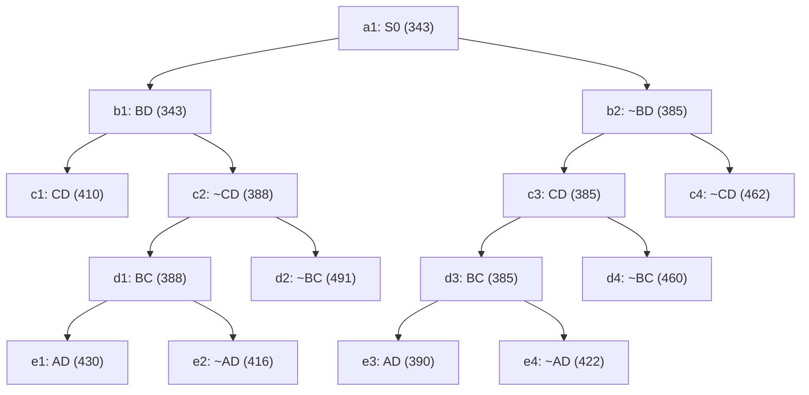

## The Question

The TSP Branch-and-Bound algorithm is solving a TSP instance where the cities are A, B, C, .... and so on. The Branch-and-Bound search tree at the time when the algorithm has discovered the optimal tour is shown below.

Each node in the search tree displays an edge (either XY or ~XY), a cost value, and a unique reference number (a1, b1, b2, ..., c1, ..., d1, ..., e1, …, e4). Use the reference numbers to break ties.
When required, enter the reference numbers in short answers.

What information can you glean from the search tree? Answer the sub-questions based on the information gleaned from the

| # | Question | Official answer |
|---|----------|-----------------|
| 2.1 | Let S0 (ref. no. a1) be the first node to be refined, identify the next 4 nodes  | `b1,b2,c3,d3` |
| 2.2 | Which node represents the optimal tour and what is the cost of the optimal tour? | `e3,390` |
| 2.3 | Determine the number of cities in the TSP instance. Enter the number of cities i | `5` |
| 2.4 | Start from city A, what is the path representation of the optimal tour? Enter th | `A,D,C,B,E` |

## The Topic in 60 Seconds

TSP BnB keeps an OPEN priority queue of constraint-sets keyed by lower bound:

- **Refine** = pop the smallest-bound node, branch it into "edge XY included" vs "edge XY excluded".
- A **leaf at depth $N{-}1$** fixes every remaining choice → one complete tour.
- After an incumbent tour appears, any open node with bound ≥ incumbent can be discarded.

> Deep-dive: browse the [Concepts](/concepts) section for Branch-and-Bound.

## 2.1 — Refine order → `b1,b2,c3,d3`

Simulate the queue (smallest bound first; ties by reference number):

| Step | Refined | Children pushed | OPEN after (sorted) |
|---|---|---|---|
| 1 | **a1** (343) | b1 : 343 · b2 : 385 | b1(343), b2(385) |
| 2 | **b1** (343) | c1 : 410 · c2 : 388 | b2(385), c2(388), c1(410) |
| 3 | **b2** (385) | c3 : **385** · c4 : 462 | c3(385), c2(388), c1(410), c4(462) |
| 4 | **c3** (385) | d3 : **385** · d4 : 460 | d3(385), c2(388), c1(410), d4(460), c4(462) |
| 5 | **d3** (385) | e3 : 390 · e4 : 422 | … |

Next four refined after S0: **b1, b2, c3, d3** — note how the fresh 385-bounded children keep leap-frogging the older 388/410 entries.

## 2.2 — Optimal leaf → `e3`, cost `390`

Refining d3 yields two complete-tour leaves: **e3 = 390** and e4 = 422. With e3 = 390 as incumbent, BnB must still empty the queue: c2 (388 < 390) refines to d1 (388) / d2 (491); d1 refines to e1 (430) / e2 (416) — both above 390, nothing beats the incumbent. Every other open bound (410, 422, 460, 462, 491) already exceeds 390.

⇒ optimal tour = leaf **e3**, cost **390**.

## 2.3 — Number of cities → `5`

Count the branching levels on any root-to-leaf chain: a1 → (BD decision) → (CD decision) → (BC decision) → (AD decision) = **4 edge decisions**. This BnB variant pins one tour edge per level and needs $N - 1$ levels, so

$$N = 4 + 1 = \mathbf{5} \text{ cities}$$

(Cross-check: five cities appear in the tour of 2.4.)

## 2.4 — Rebuilding the tour from leaf e3 → `A,D,C,B,E`

Collect the edge decisions along a1 → b2 → c3 → d3 → e3 (careful: e3 hangs under **~BD**, not BD!):

| Node | Decision |
|---|---|
| b2 | **exclude** BD |
| c3 | include CD |
| d3 | include BC |
| e3 | include AD |

Forced edges: $\{AD, CD, BC\}$, with BD banned. Degrees so far: A–D, C–D, C–B. Cities E and A still have degree 1 → the two unbranched edges must close the loop:

$$E \text{ must pair with } B \text{ and } A \;\Rightarrow\; \{BE, EA\}$$

Tour: **A → D → C → B → E →(back to A)**, i.e. `A,D,C,B,E`. Cost check against the leaf: 390 ✓ (consistent bounds).

## Interactive trace — the refine queue

<PaperTrace
  height={480}
  nodeWidth={110}
  nodeHeight={44}
  nodeFontSize={11}
  legend={[
    { color: "#b45309", label: "just refined" },
    { color: "#0369a1", label: "in OPEN queue" },
    { color: "#15803d", label: "optimal leaf" },
    { color: "#4b5563", label: "resolved worse" },
  ]}
  nodes={[
    { id: "a1", label: "a1 S0 343", x: 400, y: 25 },
    { id: "b1", label: "b1 BD 343", x: 240, y: 120 },
    { id: "b2", label: "b2 ~BD 385", x: 560, y: 120 },
    { id: "c1", label: "c1 CD 410", x: 100, y: 220 },
    { id: "c2", label: "c2 ~CD 388", x: 300, y: 220 },
    { id: "c3", label: "c3 CD 385", x: 500, y: 220 },
    { id: "c4", label: "c4 ~CD 462", x: 680, y: 220 },
    { id: "d1", label: "d1 BC 388", x: 200, y: 320 },
    { id: "d2", label: "d2 ~BC 491", x: 380, y: 320 },
    { id: "d3", label: "d3 BC 385", x: 520, y: 320 },
    { id: "d4", label: "d4 ~BC 460", x: 700, y: 320 },
    { id: "e1", label: "e1 AD 430", x: 120, y: 420 },
    { id: "e2", label: "e2 ~AD 416", x: 280, y: 420 },
    { id: "e3", label: "e3 AD 390", x: 450, y: 420 },
    { id: "e4", label: "e4 ~AD 422", x: 600, y: 420 },
  ]}
  edges={[
    { id: "ab1", from: "a1", to: "b1" }, { id: "ab2", from: "a1", to: "b2" },
    { id: "bc1", from: "b1", to: "c1" }, { id: "bc2", from: "b1", to: "c2" },
    { id: "bc3", from: "b2", to: "c3" }, { id: "bc4", from: "b2", to: "c4" },
    { id: "cd1", from: "c2", to: "d1" }, { id: "cd2", from: "c2", to: "d2" },
    { id: "cd3", from: "c3", to: "d3" }, { id: "cd4", from: "c3", to: "d4" },
    { id: "de1", from: "d1", to: "e1" }, { id: "de2", from: "d1", to: "e2" },
    { id: "de3", from: "d3", to: "e3" }, { id: "de4", from: "d3", to: "e4" },
  ]}
  steps={[
    {
      label: "Queue: a1",
      note: "OPEN = { a1(343) }\nRefine a1 -> push b1(343), b2(385).",
      nodes: { a1: "current" }, edges: {},
    },
    {
      label: "Refine b1",
      note: "OPEN = { b1(343), b2(385) } -> pop b1.\nPush c1(410), c2(388).\nOPEN = { b2(385), c2(388), c1(410) }",
      nodes: { a1: "explored", b1: "current", b2: "frontier", c1: "frontier", c2: "frontier" }, edges: { ab1: "active" },
    },
    {
      label: "Refine b2",
      note: "Pop b2 (385).\nPush c3(385!), c4(462).\nThe fresh 385 jumps ahead of c2's 388.",
      nodes: { b1: "explored", b2: "current", c1: "frontier", c2: "frontier", c3: "frontier", c4: "frontier" }, edges: { ab1: "active", ab2: "active" },
    },
    {
      label: "Refine c3",
      note: "Pop c3 (385, tie-order among equals by ref no).\nPush d3(385!), d4(460).",
      nodes: { b2: "explored", c1: "frontier", c2: "frontier", c3: "current", c4: "frontier", d3: "frontier", d4: "frontier" }, edges: { bc3: "active" },
    },
    {
      label: "Refine d3",
      note: "Pop d3 (385).\nPush LEAVES e3(390), e4(422).\nNext four refinements were: b1,b2,c3,d3 - key matched.",
      nodes: { c3: "explored", d3: "current", c1: "frontier", c2: "frontier", d4: "frontier", e3: "path", e4: "frontier" }, edges: { cd3: "active", de3: "active" },
    },
    {
      label: "Optimal: e3=390",
      note: "Incumbent e3 = 390 (tour via ~BD,CD,BC,AD).\nc2/d1 still refine (388<390): produce 430,416,491 - all worse.\nEverything else >= 410. TERMINATE.\nTour rebuilt by degrees: A,D,C,B,E.",
      nodes: { a1: "explored", b1: "explored", b2: "explored", c1: "explored", c2: "explored", c3: "explored", c4: "explored", d1: "explored", d2: "explored", d3: "explored", d4: "explored", e1: "explored", e2: "explored", e3: "path", e4: "explored" }, edges: { ab2: "path", bc3: "path", cd3: "path", de3: "path" },
    },
  ]}
/>

## Tricks & Tips

<Accordion title="Exam shortcuts">
1. Refine order = priority queue simulation. Write OPEN as one sorted line after each pop; equal bounds resolve by reference NUMBER, not position.
2. Fresh children with small bounds leapfrog old entries - that is exactly why the keyed order dips back into the c-level before finishing b-side business.
3. Leaf depth gives N: count edge-decision LEVELS on any root-to-leaf chain, add 1.
4. Tour reconstruction = degree bookkeeping: list included edges, mark each city's degree, the two degree-1 cities must join through the unbranched edges. Excluded edges (~XY) are as informative as included ones!
5. Check which PARENT a leaf hangs under before quoting its constraints - e3 lives under ~BD, not BD; grabbing the wrong branch flips the tour.
</Accordion>

**Answers:** 2.1 `b1,b2,c3,d3` · 2.2 `e3,390` · 2.3 `5` · 2.4 `A,D,C,B,E`
