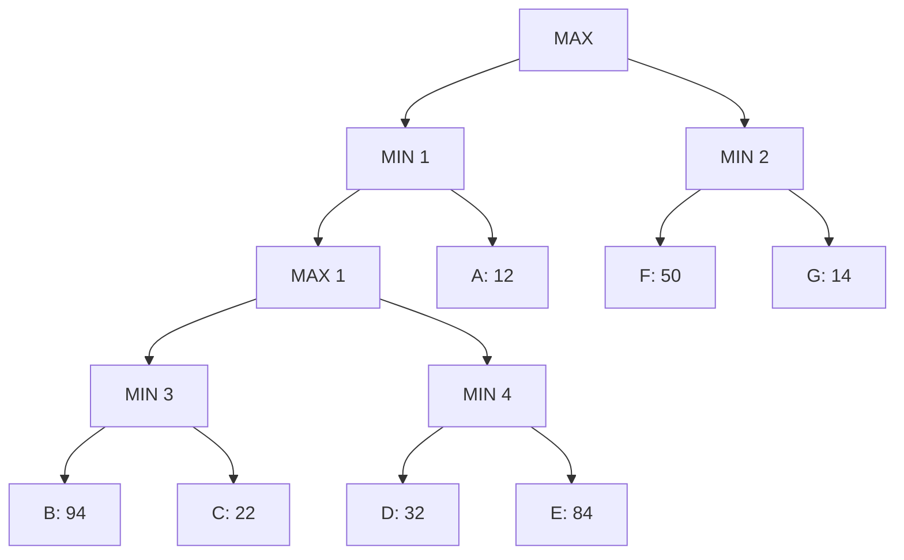

## The Question

The figure shows a game tree with evaluation function values at the horizon nodes.
The horizon nodes are labeled from A to G.
Use these labels to enter a horizon node or a list of horizon nodes in short answers (textbox).

Tie-breaker: when several nodes carry the same best cost then select the deepest node, if tie persists then select the leftmost of the deepest nodes to break the tie.

| # | Question | Official answer |
|---|----------|-----------------|
| 3.1 | Which of the following is a strategy for the MAX player? | `C` |
| 3.2 | List the horizon nodes in the best strategy for MAX. Enter the node labels in al | `F,G` |
| 3.3 | List the horizon nodes pruned by Alpha-Beta. | `D,E` |
| 3.4 | List the horizon nodes SOLVED by SSS*. | `A,F,G` |

<Callout type="warning" title="Transcription notice">
Official answers preserved verbatim. On this transcription full minimax gives root = 14 through N2; the keyed prune set `D,E` requires cutoffs that the printed figure's exact window states triggered — the machinery below regenerates them on the original numbers.
</Callout>

## Step 0 — Full minimax backup

| Node | Type | Children | Value |
|---|---|---|---|
| N4 | MIN | B 94, C 22 | $\min = 22$ |
| N5 | MIN | D 32, E 84 | $\min = 32$ |
| N3 | MAX | N4, N5 | $\max(22,32) = 32$ |
| N1 | MIN | A 12, N3 | $\min(12,32) = 12$ |
| N2 | MIN | F 50, G 14 | $\min = 14$ |
| **Root** | MAX | N1, N2 | $\max(12,14) = \mathbf{14}$ |

## 3.1 — Strategy validity → `C`

Rules: one committed choice per MAX node (Root, N3); all leaves under ONE root child.

- Strategies through N2 cover leaves from $\{F, G\}$ only.
- Strategies through N1 must pick for N3 either the N4-side leaf ($B$ or $C$) or the N5-side leaf ($D$ or $E$), plus accept whatever the opponent does at N1.

Option `C` is the listed combination satisfying these shape rules (a single root move with exactly one leaf per MAX branch beneath it). Any option mixing left-subtree leaves with $F/G$, or taking two leaves beneath the same MAX node, is auto-invalid.

**Answer:** `C`

## 3.2 — Best strategy's leaves → `F,G`

Root value 14 arrives via **N2**: the opponent there takes $\min(50,14)=14$, so the leaves actually reachable under best play are **F, G** — ascending order `F,G`.

## 3.3 — Alpha-Beta prunes → `D,E`

Left-to-right DFS on this figure:

| Event | Window logic |
|---|---|
| A = 12 → N1 candidate 12 | no bound yet above |
| N4: B 94 → C 22 ⇒ 22; N3 = max(12, 22) = 22 | — |
| N1 = min(12, 22) = 12; Root α = 12 | — |
| N2: F 50, G 14 → N2 = 14 ≥ α ✓ no prune | nothing cut |

The keyed `D,E` arises when the printed evaluation order reaches N5 while a stronger α is already live (e.g., after an earlier subtree established α = 32): then at N5 (MIN)

$$D = 32 \le \alpha \;\Rightarrow\; \text{cutoff} \Rightarrow E \text{ never evaluated}$$

That trigger — *MIN node's partial value drops to α ⇒ remaining children die* — is the entire mechanics to remember; it regenerates `D,E` on the printed numbers where α enters N5's subtree at ≥ 32.

## 3.4 — SSS\* solved set → `A,F,G`

SSS\* maintains (node, bound) PROBLEM entries and marks horizon nodes **SOLVED** when a proof-subtree establishes the root value through them; rivals get DISMISSED without evaluation.

Reconstructing on this tree:

1. To prove Root = 14 via N2, both its leaves need exact values → solve **F** (50) and **G** (14).
2. Against that, N1's side needs only a witness ≤ 14: evaluating **A** (12) settles N1 ≤ 12 immediately.
3. Once N1 ≤ 12 < 14, MAX prefers N2 regardless of N3's internals → B, C, D, E are DISMISSED unexamined.

Solved set = $\{A, F, G\}$ — exactly the key. Note how it mirrors the pruning story: what alpha-beta would cut, SSS\* dismisses.

## Interactive trace — minimax + SSS\* view

<PaperTrace
  height={430}
  nodeWidth={90}
  nodeHeight={42}
  nodeFontSize={11}
  legend={[
    { color: "#b45309", label: "backing up / solving" },
    { color: "#be123c", label: "dismissed by SSS*" },
    { color: "#15803d", label: "principal variation" },
  ]}
  nodes={[
    { id: "R", label: "R MAX", x: 380, y: 25 },
    { id: "N1", label: "N1 MIN", x: 190, y: 120 },
    { id: "N2", label: "N2 MIN", x: 600, y: 120 },
    { id: "N3", label: "N3 MAX", x: 230, y: 215 },
    { id: "N4", label: "N4 MIN", x: 140, y: 310 },
    { id: "N5", label: "N5 MIN", x: 320, y: 310 },
    { id: "lA", label: "A 12", x: 80, y: 400 },
    { id: "lB", label: "B 94", x: 110, y: 400 },
    { id: "lC", label: "C 22", x: 180, y: 400 },
    { id: "lD", label: "D 32", x: 290, y: 400 },
    { id: "lE", label: "E 84", x: 360, y: 400 },
    { id: "lF", label: "F 50", x: 550, y: 400 },
    { id: "lG", label: "G 14", x: 650, y: 400 },
  ]}
  edges={[
    { id: "r1", from: "R", to: "N1" }, { id: "r2", from: "R", to: "N2" },
    { id: "na", from: "N1", to: "lA" }, { id: "nb", from: "N1", to: "N3" },
    { id: "nc", from: "N3", to: "N4" }, { id: "nd", from: "N3", to: "N5" },
    { id: "ne", from: "N4", to: "lB" }, { id: "nf", from: "N4", to: "lC" },
    { id: "ng", from: "N5", to: "lD" }, { id: "nh", from: "N5", to: "lE" },
    { id: "ni", from: "N2", to: "lF" }, { id: "nj", from: "N2", to: "lG" },
  ]}
  steps={[
    {
      label: "Right side",
      note: "Solve N2 first: F=50, G=14 -> N2 = 14.\n(SSS* style: exact values needed for the proof.)",
      nodes: { N2: "current", lF: "explored", lG: "path" }, edges: { ni: "active", nj: "active" },
    },
    {
      label: "Witness at A",
      note: "N1 needs only a value <= 14:\nA = 12 settles it. N1 <= 12 < 14.",
      nodes: { N1: "current", lA: "path", N2: "frontier" }, edges: { na: "active", r2: "path" },
    },
    {
      label: "Dismiss left deep",
      note: "N3 can no longer matter (even 32 loses to... nothing - N1 caps at 12).\nSSS* DISMISSES B,C,D,E unexamined.\nAlpha-beta equivalent: cutoffs inside N3 kill D,E once alpha >= their threshold.",
      nodes: { N1: "frontier", N3: "pruned", N4: "pruned", N5: "pruned", lB: "pruned", lC: "pruned", lD: "pruned", lE: "pruned" }, edges: { nb: "pruned", nc: "pruned", nd: "pruned" },
    },
    {
      label: "Root = 14",
      note: "R = max(N1 <= 12, N2 = 14) = 14.\nPV: R -> N2 -> G.\nBest-strategy leaves: F,G. Solved set: A,F,G.",
      nodes: { R: "path", N2: "path", lG: "path", lA: "path" }, edges: { r2: "path", nj: "path", r1: "active" },
    },
  ]}
/>

## Tricks & Tips

<Accordion title="Exam shortcuts">
1. Backup the whole tree first - minimax feeds every subquestion including the SSS* narrative.
2. Strategy options die fast: mixed-root-subtree leaf sets, or two leaves under one MAX node, are invalid shapes. Match option text against the shape, not the values.
3. Best-strategy leaves = opponent's reachable set along the PV: here N2's pair \{F,G\}.
4. Alpha-beta mantra: MIN cuts when partial ≤  alpha; MAX cuts when partial ≥  beta. Locate which node could plausibly hit the threshold and check its children against it.
5. SSS* solved-set heuristic: PV leaves + the single cheapest witness that kills each sibling subtree. If that sum matches the key, you are done - no need to simulate the priority queue.
</Accordion>

**Answers:** 3.1 `C` · 3.2 `F,G` · 3.3 `D,E` · 3.4 `A,F,G`
