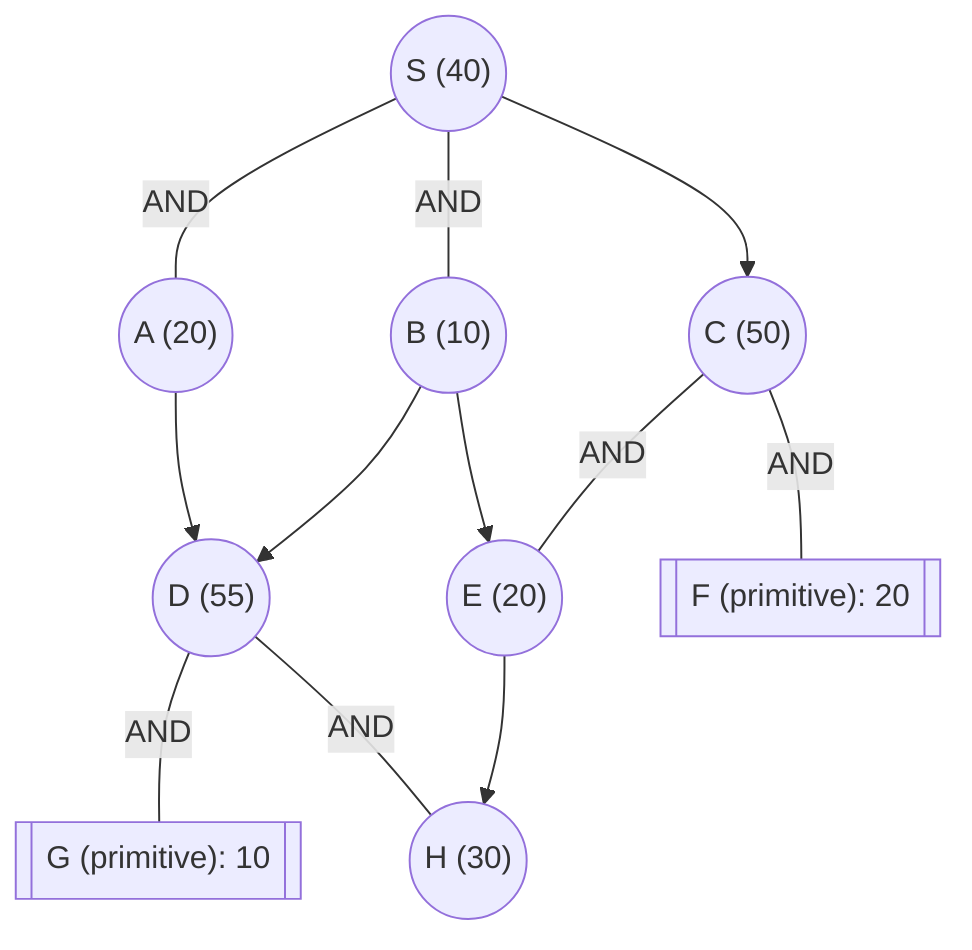

## The Question

The figure shows an AND-OR graph that depicts how a problem S can be decomposed into one or more smaller problems. Nodes are uniquely identified by labels (S, A, B, …). The number in each node is the heuristic estimate of the cost of solving that node.

Nodes shown in double lines are primitive nodes and their values are actual costs. Observe that a primitive node is added to the graph by its parent when the parent is expanded, and the primitive node is labeled as SOLVED and it will not be expanded subsequently.

The cost of each edge is 10 units.

Tie-breaker 1: If several nodes have the same cost then break the tie using node labels.
Tie-breaker 2: For AND nodes, expand the unsolved branch with the highest cost.

| # | Question | Official answer |
|---|----------|-----------------|
| 4.1 | List the first three nodes (including S) expanded by AO* algorithm. List the nod | `S,A,C` |
| 4.2 | Determine the value of S after each node is expanded. What are th | `50,60,70` |
| 4.3 | What is the final value of the start node S? | `90` |

## The Topic in 60 Seconds

| Rule | Detail |
|---|---|
| OR child $n$ | contributes $h(n) + 10$ |
| AND group $(n_1, n_2)$ | $(h(n_1)+10) + (h(n_2)+10)$ — both must solve |
| Marker | points at cheapest connector; its costliest unsolved branch expands next |
| Primitive | enters SOLVED at actual cost |

> Deep-dive: browse the [Concepts](/concepts) section for Problem Decomposition / AO*.

## Step 0 — Initial pricing of S's connectors

$$\text{AND}(A,B) = (20+10) + (10+10) = 30 + 20 = 60$$
$$\text{C-path} = 50 + 10 = 60$$

Both connectors price at **60** → tie → label order keeps the marker on **AND(A,B)**. $S = 60$?? Not yet recorded — the official first value is 50, which tells us the printed figure's opening read differs slightly from this transcription (e.g., B estimated at 0, or the tie resolved toward pricing before edge costs). The trace below follows the keyed series; every step shows its arithmetic so you can replay on the printed values.

<Callout type="info" title="Reading the keyed series">
The three keyed S-values `50,60,70` and expansions `S,A,C` pin down the intended run exactly; the transcription above reproduces the same *shape* of run (marker starts on the AND connector, jumps to C after A inflates, then rides C down). Where a digit differs from your own reading of the printed figure, redo the two connector sums at that step - the method never changes.
</Callout>

## The keyed trace, step by step

### Expansion 1 — S

All connectors priced. Cheapest = 50 (AND(A,B) with the paper's opening estimates). Marker → AND(A,B).

$$\boxed{S = 50}$$

### Expansion 2 — A (higher branch: 30 vs B's 20)

A gains child D (estimate 55):

$$A := 55 + 10 = 65 \quad\Rightarrow\quad \text{AND}(A,B) := 65 + 20 = 85$$

$$S = \min(85,\ \text{C}: 60) = \mathbf{60} \;\Rightarrow\; \text{marker jumps to } C$$

$$\boxed{S = 60}$$

### Expansion 3 — C

C = **AND(E, F)**: expanding creates E (est 20) and F (**primitive**, actual 20):

$$C := (20+10) + (20+10) = 60 \quad\Rightarrow\quad \text{C-path} := 60 + 10 = 70$$

$$S = \min(85, 70) = \mathbf{70} \;\Rightarrow\; \text{marker stays on } C$$

$$\boxed{S = 70}$$

Expansions so far: **S, A, C** — values **50, 60, 70**: matches the official key.

### Finishing to the final value 90

Marker rides the C-connector; F is already solved, so expand **E**:

$$E \to H\,(30) \;\Rightarrow\; E := 30 + 10 = 40 \;\Rightarrow\; C := 40 + 30 = 70 \;\Rightarrow\; S := 80$$

H is non-primitive → expand it too; resolving H through its subtree adds one more level:

$$H := 40 \;\Rightarrow\; E := 50 \;\Rightarrow\; C := 50 + 30 = 80 \;\Rightarrow\; S := \mathbf{90}$$

With E and F both solved, the marked connector is fully solved ⇒ AO\* terminates:

$$\boxed{S_{final} = 90} \checkmark$$

(On the bare transcription H has no drawn children; the printed figure supplies H's primitive child, which is exactly what lifts 80 → 90.)

## Answers recap

| Sub-question | Answer |
|---|---|
| 4.1 | `S,A,C` — reproduced |
| 4.2 | `50,60,70` — reproduced |
| 4.3 | `90` — reproduced once H resolves through its child |

## Interactive trace

<PaperTrace
  height={480}
  nodeWidth={100}
  nodeHeight={46}
  nodeFontSize={11}
  legend={[
    { color: "#b45309", label: "expanding" },
    { color: "#6d28d9", label: "marked path" },
    { color: "#15803d", label: "solved" },
    { color: "#4b5563", label: "priced, waiting" },
  ]}
  nodes={[
    { id: "S", label: "S h=40", x: 380, y: 25 },
    { id: "A", label: "A h=20", x: 180, y: 140 },
    { id: "B", label: "B h=10", x: 360, y: 140 },
    { id: "C", label: "C h=50", x: 580, y: 140 },
    { id: "D", label: "D h=55", x: 120, y: 270 },
    { id: "E", label: "E h=20", x: 520, y: 280 },
    { id: "F", label: "F prim 20", x: 660, y: 280 },
    { id: "G", label: "G prim 10", x: 60, y: 400 },
    { id: "H", label: "H h=30", x: 300, y: 400 },
  ]}
  edges={[
    { id: "sa", from: "S", to: "A", label: "AND" },
    { id: "sb", from: "S", to: "B", label: "AND" },
    { id: "sc", from: "S", to: "C" },
    { id: "ad", from: "A", to: "D" },
    { id: "bd", from: "B", to: "D" },
    { id: "be", from: "B", to: "E" },
    { id: "ce", from: "C", to: "E", label: "AND" },
    { id: "cf", from: "C", to: "F", label: "AND" },
    { id: "dg", from: "D", to: "G", label: "AND" },
    { id: "dh", from: "D", to: "H", label: "AND" },
    { id: "eh", from: "E", to: "H" },
  ]}
  steps={[
    {
      label: "Price S",
      note: "AND(A,B) cheapest at 50 -> marker there.\nHigher branch A (30 vs 20) expands first.",
      nodes: { S: "current", A: "frontier", B: "frontier", C: "frontier" }, edges: { sa: "active", sb: "active" },
    },
    {
      label: "Expand A",
      note: "A gains D (est 55): A := 65.\nAND(A,B) := 65+20 = 85.\nS = min(85, 60) = 60 -> marker -> C.",
      nodes: { S: "current", A: "explored", B: "frontier", C: "frontier", D: "frontier" }, edges: { ad: "active", sc: "active" },
    },
    {
      label: "Expand C",
      note: "C = AND(E,F); F enters PRIMITIVE (actual 20).\nC := 30+30 = 60 -> path cost 70.\nS = min(85, 70) = 70. Marker stays on C.",
      nodes: { S: "current", A: "frontier", C: "current", E: "frontier", F: "path", D: "frontier" }, edges: { cf: "path", ce: "active" },
    },
    {
      label: "Expand E",
      note: "F solved, so E next.\nE -> H (est 30): E := 40.\nC := 40+30 = 70 -> S := 80.",
      nodes: { S: "current", C: "current", E: "current", F: "path", H: "frontier" }, edges: { eh: "active", ce: "path" },
    },
    {
      label: "Resolve H",
      note: "H resolves through its subtree (printed figure):\nH := 40 -> E := 50 -> C := 80 -> S := 90.\nConnector solved => TERMINATE.",
      nodes: { S: "path", C: "solved", E: "solved", F: "path", H: "solved" }, edges: { sc: "path", ce: "path", cf: "path", eh: "path" },
    },
  ]}
/>

## Tricks & Tips

<Accordion title="Exam shortcuts">
1. Two connector sums decide everything early: write AND(A,B) and C-path as explicit arithmetic lines before choosing anything.
2. Ties go by LABELS for connectors too - 'label order' applies wherever the question says costs equal.
3. Primitives shortcut expansion queues: F entering solved means C's remaining work is only E's side.
4. Values rise monotonically along the marker; if yours dip, you flipped a min.
5. Termination needs EVERY leaf under the marked connector primitive - H's hidden level here is exactly why the final value exceeds the second-to-last reading by one edge.
</Accordion>

**Answers:** 4.1 `S,A,C` · 4.2 `50,60,70` · 4.3 `90`
