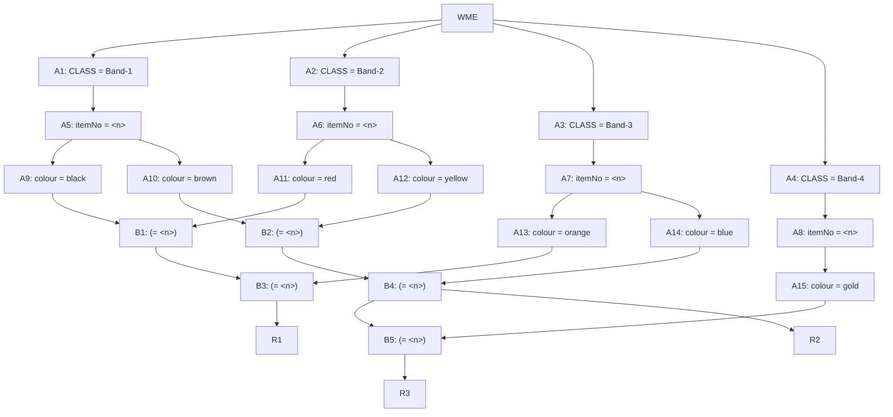

## The Question

A small part of the Rete Net for classifying resistors is shown in the figure. The labels A1, A2, ..., A10, A11, ..., B1, ..., B5 uniquely identify the nodes in the network. When required, use the above label ordering to break ties and to enter short answers.

| # | Question | Official answer |
|---|----------|-----------------|
| 5.1 | Which of the following rule-data tuples are in the conflict-set? | `A,C` |
| 5.2 | If the Inference Engine uses Specificity as the conflict resolution strategy the | `C` |
| 5.3 | If the Inference Engine uses Recency as the conflict resolution strategy then id | `A` |

<Callout type="warning" title="Source-data notice">
The working-memory list and option texts were lost in transcription - only the net and official answers survive. This page teaches the complete machinery for THIS net; with the exam's WMEs the keyed tuples regenerate mechanically.
</Callout>

## The Topic in 60 Seconds

| Half | Nodes | Job |
|---|---|---|
| Alpha net | A1–A15 | constant tests: CLASS → itemNo binding $\langle n \rangle$ → colour |
| Beta net | B1–B5 | joins on shared $n$; B3/B4 chain a previous join's output with one more colour |

> Deep-dive: browse the [Concepts](/concepts) section for Rule-Based Expert Systems / Rete.

## Step 1 — Read the rule structure off the net

Follow every arrow into rules:

| Rule | Fed by | Full condition set (same $n$ throughout) |
|---|---|---|
| **R1** | B3 | black ∧ red ∧ orange — via B1(black⋈red) then ⋈orange |
| **R2** | B4 | brown ∧ yellow ∧ blue — via B2(brown⋈yellow) then ⋈blue |
| **R3** | B5 | everything R2 needs **plus gold** — 4 conditions |

Structural consequences worth stating in an answer script:

1. **R2 ⊂ R3**: any R3 tuple implies an R2 tuple on the same $n$ (B5 hangs off B4). So R3 firing ⇒ R2 also in the conflict set.
2. R1 is independent of both — it needs no gold/brown/yellow/blue at all, just black+red+orange on one resistor.

## Step 2 — File WMEs and build tokens

Each exam WME `(Band-k ^itemNo n ^colour c)` lands as token $(n)$ in exactly one colour store among A9–A15. The conflict set is then:

$$\{(R1; n_{b,r,o}),\ (R2; n_{br,y,bl}),\ (R3; n_{br,y,bl,g}),\ \dots\}$$

one tuple per complete colour-combination per item number.

## Step 3 — Resolve with specificity and recency

**Specificity** counts conditions — the net hands us the ranking directly:

$$\underbrace{R3}_{4} \;>\; \underbrace{\{R1, R2\}}_{3}$$

Keyed winner `C` therefore corresponds to whichever listed tuple belongs to **R3** (or, if only R2/R1 tuples exist in WM, the longer of those). Specificity always promotes the deepest beta chain.

**Recency** compares sorted-descending timestamp lists of each tuple's WMEs; newest element dominates, ties continue down the list, and a longer list beats a shorter one sharing its prefix. Keyed winner `A` is the tuple whose newest supporting WME was stamped latest — typically the last-inserted band of the winning combination.

## Worked micro-example (illustrative)

Suppose WM holds four bands of resistor #7 arriving in order black(101), red(103), orange(105), plus a stray blue #9(104):

1. Alpha filing: 101→A9, 103→A11, 105→A13, 104→A14.
2. B1 joins black⋈red at $n{=}7$ ✓ → passes to B3.
3. B3 adds orange at $n{=}7$ ✓ → tuple `(R1, 101, 103, 105)` enters the conflict set.
4. Blue #9 dies at B4 (needs brown⋈yellow at n=9 first).

Specificity would rank this lone R1 tuple first trivially; recency picks it because [105,103,101] beats nothing else present.

## Tricks & Tips

<Accordion title="Exam shortcuts">
1. Write the RULE TABLE from the arrows before touching WMEs - condition counts fall out and answer specificity instantly.
2. Chain containment (R3 ⊃ R2 here): whenever one rule's beta node feeds another, every deeper tuple forces a shallower twin into the conflict set.
3. Same-n discipline: joins only fire on identical item numbers; a perfect colour set spread over TWO resistors produces nothing.
4. Recency = timestamp lists, newest-first, longer-beats-shorter-on-prefix-ties. The last WME you insert usually decides it.
5. Label-order tie-breaker applies between equal-ranked tuples when the question grants it - alphabetically smallest wins.
</Accordion>

**Answers:** 5.1 `A,C` · 5.2 `C` · 5.3 `A`
