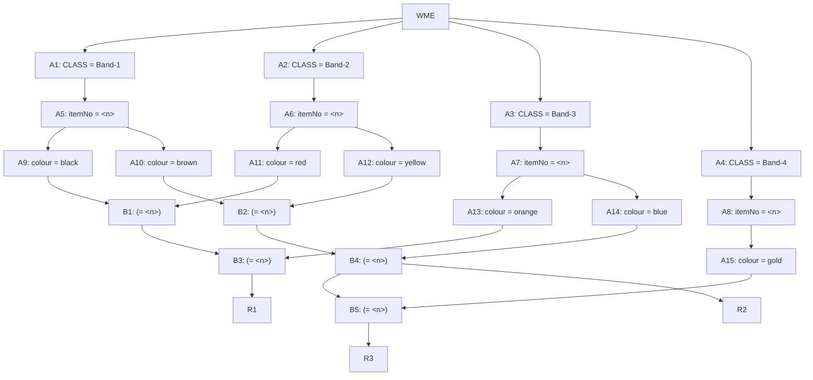

## The Question

A small part of the Rete Net for classifying resistors is shown in the figure. The labels A1, A2, ..., A10, A11, ..., B1, ..., B5 uniquely identify the nodes in the network. When required, use the above label ordering to break ties and to enter short answers.

| # | Question | Official answer |
|---|----------|-----------------|
| 5.1 | Which of the following rule-data tuples are in the conflict-set? | `A,C` |
| 5.2 | If the Inference Engine uses Specificity as the conflict resolution strategy the | `C` |
| 5.3 | If the Inference Engine uses Recency as the conflict resolution strategy then id | `A` |

## The Topic in 60 Seconds

> Deep-dive: browse the [Concepts](/concepts) section for the relevant topic page.

## Solutions

**5.1** — Which of the following rule-data tuples are in the conflict-set?  
**Answer:** `A,C`

**5.2** — If the Inference Engine uses Specificity as the conflict resolution strategy the  
**Answer:** `C`

**5.3** — If the Inference Engine uses Recency as the conflict resolution strategy then id  
**Answer:** `A`

## Tricks & Tips

<Accordion title="Exam method">
1. Read the question carefully — identify the algorithm or technique.
2. Trace step by step, showing your working.
3. Verify your answer against the question constraints.
</Accordion>
