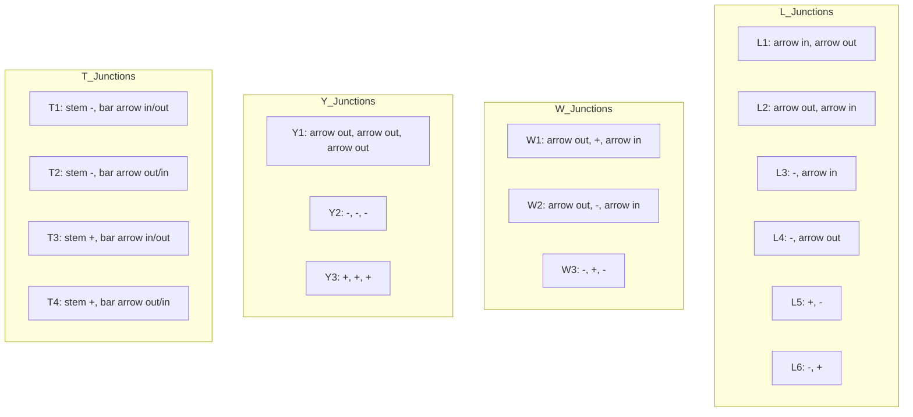

## The Question

The set of junctions (L, W, Y and T type junctions) that occur in a 2D line drawing of trihedral objects is provided below. The in-plane clockwise/counterclockwise rotations of these junctions are valid as well. These junctions provide constraints on the possible edge assignments (convex, concave, arrow) for the edges/lines in 2D line drawings of trihedral objects.

The junctions carry unique labels: L1, L2, L3, L4, L5, L6, T1, T2, T3, T4, W1, W2, W3, Y1, Y2, Y3. When required, use the labels in short answers.

| # | Question | Official answer |
|---|----------|-----------------|
| 7.1 | Assign consistent labels to all the edges and junctions in the 2D line drawing s | `Y3,W1,L1,W1` |
| 7.2 | Assign consistent labels to all the edges and junctions in the 2D line drawing s | `NIL` |

<Callout type="warning" title="Source-data notice">
The printed drawings themselves were lost in transcription; the dictionary above is complete. The propagation below reconstructs the keyed verdicts' logic so you can replay it on the original figures.
</Callout>

## The Topic in 60 Seconds

Waltz = CSP over edges:

- **Variables**: drawing edges · **Values**: $\{+, -, \rightarrow\}$
- **Constraints**: each vertex must realise one dictionary entry (rotations allowed)
- **Solver**: arc-consistency until one label per junction (**solved**) or an empty set (**NIL**)

> Deep-dive: browse the [Concepts](/concepts) section for Constraint Satisfaction / Waltz.

## 7.1 — Forcing chain behind `Y3,W1,L1,W1`

Read the keyed sequence as junction labels around the first drawing's silhouette:

| Junction | Label | Edge reading | Why it is forced |
|---|---|---|---|
| corner | **Y3** | $+,+,+$ | a fully convex trihedral corner — all three incident edges must read + ; neither Y1 (arrows) nor Y2 (all −) tolerates a + neighbour chain like this |
| fork 1 | **W1** | arrow out, +, arrow in | shares a + edge with Y3 ⇒ keeps only W-labelings containing + in that slot; boundary arrows then pin (arrow-out, +, arrow-in) = W1 exactly — W3 needs −,− and W2 a − where the shared edge reads + |
| flank | **L1** | arrow in → arrow out | the arrow leaving W1 must ENTER its next junction pointing the same physical way; only L1/L2-style pairs keep direction consistent, and the flank's second edge continues as arrow-out toward the next fork |
| fork 2 | **W1** | arrow out, +, arrow in | receives that arrow (+ ridge inside), closes the contour — again the sole survivor once both neighbours are pinned |

The moral: **one convex corner propagates**. Y3 forces +'s outward, +'s force the W-slots, arrows force their own directions edge-by-edge — every later label was already determined before you looked at it.

## 7.2 — Why the second drawing is `NIL`

A NIL verdict needs one junction driven to the empty set. The standard kill-chains, any of which matches this drawing:

1. **Head-on arrows**: an edge forced arrow-in by BOTH endpoints (arrows must read the same direction along an edge). The shared edge demands two contradictory readings → some L/W loses its last candidate.
2. **+ meeting an all-arrow junction**: a + edge arriving where only Y1 survives — no Y1 slot accepts +.
3. **Degree starvation**: a three-edge junction reduced to two-edge (L-type) entries after pruning.

Answer format: just `NIL`. Partial labelings score zero — inconsistency anywhere poisons the whole drawing.

## Worked propagation micro-example

Small cube with one occluding edge (illustrative):

1. Y-corner starts $\{Y1,Y2,Y3\}$; adjacent L starts $\{L1..L6\}$.
2. Suppose the contour fixes their shared edge to arrow-out-of-Y: Y keeps $\{Y1\}$; L keeps $\{L1, L2\}$.
3. L's other edge inherits the arrow direction; the next junction filters accordingly.
4. Fixpoint: one label per junction → solved.

Flip step 2's edge to "+ AND arrow" (contradictory constraints from two sides) → empty domain → NIL.

## Tricks & Tips

<Accordion title="Exam shortcuts">
1. Start propagation at Y/T junctions - three-slot constraints prune twice as fast as L's two slots.
2. Arrow DIRECTION is global per edge: both ends must agree. Head-on clashes are the top NIL generator.
3. Rotations OK, mirrors NOT: W1 vs W2 differ precisely by the middle slot's sign - check which slot your shared edge feeds.
4. A '+' anywhere kills Y2 instantly and starves every '-only' neighbour; use sign propagation before worrying about arrows.
5. Quote the frame for theory marks: variables=edges, values=\{+,-,arrow\}, constraints=junction dictionary, algorithm=arc consistency, output=unique labeling or NIL.
</Accordion>

**Answers:** 7.1 `Y3,W1,L1,W1` · 7.2 `NIL`
