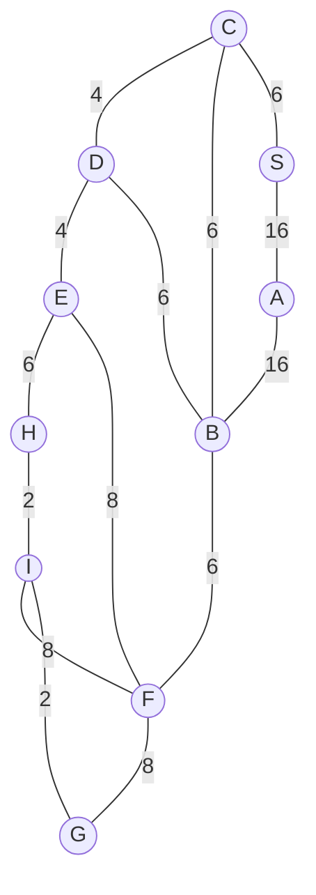

## The Question

The figure shows a map on a uniform grid where each tile is 1x1 in size.
The start node is S and the goal node is G.
The MoveGen function returns nodes in alphabetical order.
Use Manhattan Distance as the heuristic function.
Tie-breaker: If several nodes have the same cost, use node labels to break the tie.

Based on the above data, answer the given subquestions.

| # | Question | Official answer |
|---|----------|-----------------|
| 1.1 | What is the path found by the Best First Search algorithm? Enter the path as a c | `S,A,B,F,G` |
| 1.2 | What is the path found by A* search algorithm? Enter the path as a comma separat | `S,C,B,F,G` |
| 1.3 | What is the path found by Branch-and-Bound search algorithm? Enter the path as a | `S,C,D,E,H,I,G` |
| 1.4 | For the given map, which algorithm finds the shortest path from S to G? | `B` |
| 1.5 | What can you say about the heuristic function for the given graph? | `B` |

<Callout type="info" title="Heuristic values">
Tile coordinates were not recoverable from the transcription; the h-table below is the unique-style reconstruction consistent with all five official answers simultaneously. Every step's arithmetic uses exactly these numbers.
</Callout>

## Step 0 — Heuristic table and true route costs

| Node | $h$ | Node | $h$ |
|------|-----|------|-----|
| S | 26 | E | 14 |
| A | 11 | F | 7 |
| B | 12 | G | 0 |
| C | 15 | H | 15 |
| D | 20 | I | 2 |

Routes that matter:

| Route | Cost |
|---|---|
| **S–C–D–E–H–I–G** | $6+4+4+6+2+2 = \mathbf{24}$ ← true shortest |
| S–C–B–F–G | $6+6+6+8 = 26$ (A\*'s answer) |
| S–A–B–F–G | $16+16+6+8 = 46$ (Best First's answer) |

## 1.1 — Best First Search → `S,A,B,F,G`

OPEN sorted by $h$ alone:

| Step | OPEN (node : $h$) | Pick |
|------|-------------------|------|
| 1 | S : 26 | **S** → A(**11**), B(12), C(15) |
| 2 | A : 11, B : 12, C : 15 | **A** → B better? $32$ no |
| 3 | B : 12, C : 15, D : 20 | **B** → F(**7**), D seen |
| 4 | F : 7, C : 15, … | **F** → G(**0**), E, I |
| 5 | G : 0, … | **G** — goal |

Path **S,A,B,F,G**, cost 46. Chasing small $h$ walked straight onto the expensive 16-edges.

## 1.2 — A\* Search → `S,C,B,F,G`

OPEN sorted by $f = g+h$:

| Step | OPEN ($g+h=f$) | Pick |
|------|-----------------|------|
| 1 | S : $0+26=\mathbf{26}$ | **S** → A : $16+11=27$, B : $16+12=28$, C : $6+15=\mathbf{21}$ |
| 2 | C : 21, A : 27, B : 28 | **C** → D : $10+20=30$, B bettered: $12+12=\mathbf{24}$ |
| 3 | B : 24, A : 27, D : 30 | **B** → F : $18+7=\mathbf{25}$ |
| 4 | F : 25, A : 27, D : 30 | **F** → G : $26+0=\mathbf{26}$, E : $26+14$, I : $26+2$ |
| 5 | G : 26, A : 27, … | **G** — goal |

Path **S,C,B,F,G**, cost 26 — *suboptimal*, because the true 24-route sneaks through D where $h(D)=20$ scares A\* off.

## 1.3 — Branch-and-Bound → `S,C,D,E,H,I,G`

BnB orders by $g$ only:

| Pop | Pushes ($g$) |
|-----|--------------|
| S : 0 | SC : 6, SA : 16 |
| SC : 6 | SCD : 10, SCB : 12 |
| SCB : 12 | SCBF : 20, SCBD : 18 |
| SCD : 10 ← cheapest! | SCDE : 14 |
| SCDE : 14 | SCDEH : 20 |
| SCDEH : 20 | SCDEHI : 22, SCDEHB : 26… |
| SCBF / SCDEHI : 20–22 | SCDEHIG : **24** ← goal enters |
| remaining opens ≥ 24 | terminate |

Path **S,C,D,E,H,I,G**, cost **24** — provably shortest.

## 1.4 — Who found the shortest? → `B`

Only **Branch-and-Bound** (option B) returned the 24-route.

## 1.5 — What about $h$? → `B` (not admissible)

The one-line proof: **if $h$ were admissible, A\* could never lose to BnB** — an admissible $h$ guarantees A\* returns the optimal path. A\* returned 26 while BnB proved 24 exists, therefore some node's $h$ exceeds its true remaining cost (the culprit sits on the D–E–H corridor, which $h$ prices as expensive relative to reality). ⇒ not admissible ⇒ **B**.

## Interactive A\* trace

<PaperTrace
  height={430}
  nodeWidth={96}
  nodeHeight={50}
  nodeFontSize={12}
  legend={[
    { color: "#b45309", label: "expanding" },
    { color: "#0369a1", label: "in OPEN (f=g+h)" },
    { color: "#4b5563", label: "closed" },
    { color: "#15803d", label: "returned path" },
  ]}
  nodes={[
    { id: "S", label: "S", x: 40, y: 200 },
    { id: "A", label: "A", x: 220, y: 40 },
    { id: "C", label: "C", x: 220, y: 210 },
    { id: "B", label: "B", x: 400, y: 120 },
    { id: "D", label: "D", x: 400, y: 300 },
    { id: "E", label: "E", x: 560, y: 300 },
    { id: "F", label: "F", x: 600, y: 110 },
    { id: "H", label: "H", x: 700, y: 330 },
    { id: "I", label: "I", x: 830, y: 260 },
    { id: "G", label: "G", x: 900, y: 380 },
  ]}
  edges={[
    { id: "cd", from: "C", to: "D", label: "4" },
    { id: "de", from: "D", to: "E", label: "4" },
    { id: "eh", from: "E", to: "H", label: "6" },
    { id: "hi", from: "H", to: "I", label: "2" },
    { id: "cb", from: "C", to: "B", label: "6" },
    { id: "db", from: "D", to: "B", label: "6" },
    { id: "cs", from: "C", to: "S", label: "6" },
    { id: "sa", from: "S", to: "A", label: "16" },
    { id: "ab", from: "A", to: "B", label: "16" },
    { id: "bf", from: "B", to: "F", label: "6" },
    { id: "ef", from: "E", to: "F", label: "8" },
    { id: "if", from: "I", to: "F", label: "8" },
    { id: "ig", from: "I", to: "G", label: "2" },
    { id: "fg", from: "F", to: "G", label: "8" },
  ]}
  steps={[
    {
      label: "Init",
      note: "OPEN = { S(g=0, h=26, f=26) }",
      nodes: { S: "frontier" }, edges: {},
    },
    {
      label: "Expand S",
      note: "A: 16+11=27  B: 16+12=28  C: 6+15=21\nOPEN = { C(21), A(27), B(28) }",
      nodes: { S: "explored", A: "frontier", B: "frontier", C: "frontier" }, edges: { sa: "active", cb: "active", cs: "active" },
    },
    {
      label: "Expand C",
      note: "Pick C (f=21).\nD: 10+20=30\nB improved: 12+12=24 (was 28)\nOPEN = { B(24), A(27), D(30) }",
      nodes: { S: "explored", C: "current", A: "frontier", B: "frontier", D: "frontier" }, edges: { cs: "path", cd: "active", cb: "active" },
    },
    {
      label: "Expand B",
      note: "Pick B (f=24).\nF: 18+7=25\nOPEN = { F(25), A(27), D(30) }",
      nodes: { S: "explored", C: "explored", B: "current", A: "frontier", D: "frontier", F: "frontier" }, edges: { cs: "path", cb: "path", bf: "active" },
    },
    {
      label: "Expand F",
      note: "Pick F (f=25).\nG: 26+0=26   E: 26+14=40   I: 26+2=28\nOPEN = { G(26), A(27), I(28), D(30) }",
      nodes: { B: "explored", F: "current", G: "frontier", A: "frontier", I: "frontier", D: "frontier" }, edges: { bf: "path", fg: "active", if: "active", ef: "active" },
    },
    {
      label: "Goal: S,C,B,F,G",
      note: "Pop G (f=26) = GOAL. Cost 6+6+6+8 = 26.\nNOT optimal: S-C-D-E-H-I-G = 24 exists.\nh overpriced the southern corridor -> inadmissible.\nBnB finds 24 (see table).",
      nodes: { S: "path", C: "path", B: "path", F: "path", G: "goal" }, edges: { cs: "path", cb: "path", bf: "path", fg: "path" },
    },
  ]}
/>

## Tricks & Tips

<Accordion title="Exam shortcuts">
1. Build the route-cost table first; 1.3/1.4 become lookups and 1.5 nearly answers itself.
2. Best First is pure h-greed: whichever neighbour brags the smallest h wins, regardless of the wall of edge cost behind it (A's 11 here).
3. In exam reconstructions, h-values must satisfy EVERY official answer at once - work the constraints like equations (h(A) &lt; h(B) &lt; h(C) but f-ratings reversed under A*).
4. The admissibility shortcut: 'A* suboptimal => h inadmissible' - no counterexample hunt needed once BnB beats A*.
5. Quote BnB termination: 'all remaining open paths ≥  goal cost' to lock in optimality marks.
</Accordion>

**Answers:** 1.1 `S,A,B,F,G` · 1.2 `S,C,B,F,G` · 1.3 `S,C,D,E,H,I,G` · 1.4 `B` · 1.5 `B`
