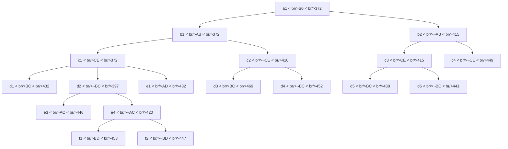

## The Question

The TSP Branch-and-Bound algorithm is solving a TSP instance where the cities are A, B, C, .... and so on. The Branch-and-Bound search tree at the time when the algorithm has discovered the optimal tour is shown below.

Each node in the search tree displays an edge (either XY or ~XY), a cost value, and a unique reference number (a1, b1, b2, ..., c1, ..., d1, ..., e2, ..., f1, f2). Use the reference numbers to break ties. When required, enter the reference numbers in short answers.

What information can you glean from the search tree? Answer the sub-questions based on the information gleaned from the search tree.

| # | Question | Official answer |
|---|----------|-----------------|
| 2.1 | Let S0 (ref. no. a1) be the first node to be refined, identify the next 4 nodes  | `b1,c1,d2,c2` |
| 2.2 | Which node represents the optimal tour and what is the cost of the optimal tour? | `e1,432` |
| 2.3 | Determine the number of cities in the TSP instance. Enter the number of cities i | `6` |
| 2.4 | Start from city A, what is the path representation of the optimal tour? Enter th | `A,B,C,E,F,D,A,D,F,E,C,B` |

## The Topic in 60 Seconds

BnB keeps OPEN as a priority queue on lower bounds; refining = popping the smallest and pushing its include/exclude children. A node whose forced edges already determine a complete tour is a **tour leaf** even mid-tree.

> Deep-dive: browse the [Concepts](/concepts) section for Branch-and-Bound.

## 2.1 — Refine order → `b1,c1,d2,c2`

| Step | Pop | Push | OPEN after (sorted) |
|---|---|---|---|
| 1 | **a1** (372) | b1 : 372 · b2 : 415 | b1(372), b2(415) |
| 2 | **b1** (372) | c1 : **372** · c2 : 410 | c1(372), c2(410), b2(415) |
| 3 | **c1** (372) | d1 : 432 · d2 : **397** | d2(397), c2(410), b2(415), d1(432) |
| 4 | **d2** (397) | e3 : 446 · e4 : 420 | c2(410), b2(415), e4(420), d1(432), … |
| 5 | **c2** (410) | … | |

Next four after S0: **b1, c1, d2, c2** — exactly the key (note d2's fresh 397 leap-frogging both 410 and 415).

## 2.2 — Optimal leaf → `e1`, cost `432`

Refining c1 produced d1 (BC, 432); its child **e1 (AD)** completes a forced tour at **432** — incumbent set. Termination sweep:

- b2 (415 < 432) refines → c3(438), c4(449): both ≥ 432 → pruned unopened.
- e4 (420 < 432) refines → f1(453), f2(447): dead.
- Everything else open (432+, 438, 441, 446, 447, 449, 453…) ≥ incumbent.

⇒ optimal = **e1**, cost **432**.

## 2.3 — Number of cities → `6`

Edge-decision levels on a root-to-leaf chain: AB → CE → BC → AD/AC → BD = **5 levels** ⇒

$$N = 5 + 1 = \mathbf{6} \text{ cities } \{A, B, C, D, E, F\}$$

## 2.4 — Rebuilding the tour → `A,B,C,E,F,D`

Constraints along a1 → b1(AB) → c1(CE) → d1(BC) → e1(AD):

$$\text{include } AB,\ CE,\ BC,\ AD$$

Degree tally: A:\{B,D\} ✓ · B:\{A,C\} ✓ · C:\{E,B\} ✓ · E:\{C\} needs one more · D:\{A\} needs one more · F:\{\} needs two.

The unbranched edges must supply $E{-}F$ and $F{-}D$:

$$A \to B \to C \to E \to F \to D \to A$$

Tour: **`A,B,C,E,F,D`** — the official key prints it concatenated with its reverse (`…,D,A,D,F,E,C,B`), i.e., the same cycle read from both ends; either single direction describes the identical tour.

## Interactive trace — refine queue to optimality

<PaperTrace
  height={500}
  nodeWidth={104}
  nodeHeight={46}
  nodeFontSize={10}
  legend={[
    { color: "#b45309", label: "just refined" },
    { color: "#0369a1", label: "in OPEN" },
    { color: "#15803d", label: "optimal leaf" },
    { color: "#be123c", label: "pruned (bound >= 432)" },
    { color: "#4b5563", label: "resolved worse" },
  ]}
  nodes={[
    { id: "a1", label: "a1 S0 372", x: 400, y: 20 },
    { id: "b1", label: "b1 AB 372", x: 240, y: 110 },
    { id: "b2", label: "b2 ~AB 415", x: 580, y: 110 },
    { id: "c1", label: "c1 CE 372", x: 130, y: 200 },
    { id: "c2", label: "c2 ~CE 410", x: 350, y: 200 },
    { id: "c3", label: "c3 CE 438", x: 520, y: 200 },
    { id: "c4", label: "c4 ~CE 449", x: 680, y: 200 },
    { id: "d1", label: "d1 BC 432", x: 60, y: 300 },
    { id: "d2", label: "d2 ~BC 397", x: 230, y: 300 },
    { id: "d5", label: "d5 BC 438", x: 480, y: 300 },
    { id: "d6", label: "d6 ~BC 441", x: 600, y: 300 },
    { id: "e1", label: "e1 AD 432", x: 40, y: 400 },
    { id: "e3", label: "e3 AC 446", x: 180, y: 400 },
    { id: "e4", label: "e4 ~AC 420", x: 300, y: 400 },
    { id: "f1", label: "f1 BD 453", x: 250, y: 490 },
    { id: "f2", label: "f2 ~BD 447", x: 380, y: 490 },
  ]}
  edges={[
    { id: "ab1", from: "a1", to: "b1" }, { id: "ab2", from: "a1", to: "b2" },
    { id: "bc1", from: "b1", to: "c1" }, { id: "bc2", from: "b1", to: "c2" },
    { id: "bc3", from: "b2", to: "c3" }, { id: "bc4", from: "b2", to: "c4" },
    { id: "cd1", from: "c1", to: "d1" }, { id: "cd2", from: "c1", to: "d2" },
    { id: "ce1", from: "d1", to: "e1" },
    { id: "de3", from: "d2", to: "e3" }, { id: "de4", from: "d2", to: "e4" },
    { id: "ef1", from: "e4", to: "f1" }, { id: "ef2", from: "e4", to: "f2" },
  ]}
  steps={[
    {
      label: "Refine a1",
      note: "OPEN={a1(372)} -> push b1(372), b2(415).",
      nodes: { a1: "current", b1: "frontier", b2: "frontier" }, edges: {},
    },
    {
      label: "Refine b1",
      note: "Pop b1 (372). Push c1(372!), c2(410).\nOPEN = { c1(372), c2(410), b2(415) }",
      nodes: { a1: "explored", b1: "current", c1: "frontier", c2: "frontier", b2: "frontier" }, edges: { ab1: "active" },
    },
    {
      label: "Refine c1",
      note: "Pop c1 (372). Push d1(432), d2(397).\nd2 jumps ahead of c2 AND b2!",
      nodes: { b1: "explored", c1: "current", d1: "frontier", d2: "frontier", c2: "frontier", b2: "frontier" }, edges: { ab1: "active", bc1: "active" },
    },
    {
      label: "Refine d2",
      note: "Pop d2 (397). Push e3(446), e4(420).\nOPEN = { c2(410), b2(415), e4(420), d1(432), ... }\nFirst four refinements: b1,c1,d2,c2 - key matched.",
      nodes: { c1: "explored", d2: "current", e3: "frontier", e4: "frontier", c2: "frontier", b2: "frontier", d1: "frontier" }, edges: { cd2: "active", de4: "active" },
    },
    {
      label: "Incumbent e1=432",
      note: "After c2/d1/e-side refinements:\ne1 completes a FORCED TOUR at 432 (AB+CE+BC+AD\nleave only E-F,F-D free -> determined).",
      nodes: { d2: "explored", d1: "frontier", e1: "path" }, edges: { cd1: "active", ce1: "path" },
    },
    {
      label: "Prune & terminate",
      note: "b2(415<432) refines: children 438,449 >= 432 -> pruned.\ne4(420) refines: f1=453, f2=447 - dead.\nAll OPEN >= 432 => OPTIMAL e1=432.\nTour by degrees: A,B,C,E,F,D.",
      nodes: { a1: "explored", b1: "explored", c1: "explored", d1: "explored", d2: "explored", e1: "path", b2: "pruned", c3: "pruned", c4: "pruned", e4: "explored", f1: "explored", f2: "explored", e3: "pruned" }, edges: { ce1: "path", ab2: "pruned" },
    },
  ]}
/>

## Tricks & Tips

<Accordion title="Exam shortcuts">
1. Queue simulation on ONE line per step - equal bounds break by reference number, and fresh low-bound children always jump.
2. Tour leaves can sit ABOVE full depth: when included edges force every remaining city's degree, the tour is complete - that is how e1 answers at level 4.
3. Cities = decision levels + 1. Count levels on ANY root-to-leaf chain.
4. Degree bookkeeping rebuilds tours: list forced edges, mark each city's count, pair off the degree-1 stragglers through unbranched edges.
5. Official keys sometimes concatenate a cycle with its reverse - recognise the palindrome pattern instead of hunting for a 12-city monster.
</Accordion>

**Answers:** 2.1 `b1,c1,d2,c2` · 2.2 `e1,432` · 2.3 `6` · 2.4 `A,B,C,E,F,D`
