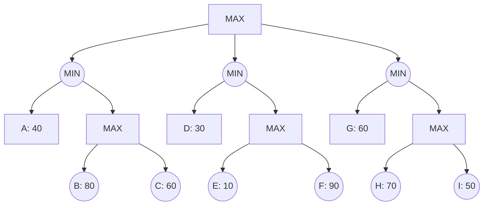

## The Question

The figure shows a game tree with evaluation function values at the horizon nodes.
The horizon nodes are labeled from A to I.
Use these labels to enter a horizon node or a list of horizon nodes in short answers (textbox).

Tie-breaker: when several nodes carry the same best cost then select the deepest node, if tie persists then select the leftmost of the deepest nodes to break the tie.

Based on the above data, answer the given subquestions.

| # | Question | Official answer |
|---|----------|-----------------|
| 3.1 | Which of the following is a strategy for the MAX player? | `B` |
| 3.2 | List the horizon nodes in the best strategy for MAX. Enter the node labels in al | `G,H` |
| 3.3 | List the horizon nodes pruned by Alpha-Beta. | `C,E,F,I` |
| 3.4 | List the horizon nodes not processed (neither LIVE nor SOLVED) by SSS*. | `B,C,E,F,I` |

## The Topic in 60 Seconds

> Deep-dive: browse the [Concepts](/concepts) section for the relevant topic page.

## Solutions

**3.1** — Which of the following is a strategy for the MAX player?  
**Answer:** `B`

**3.2** — List the horizon nodes in the best strategy for MAX. Enter the node labels in al  
**Answer:** `G,H`

**3.3** — List the horizon nodes pruned by Alpha-Beta.  
**Answer:** `C,E,F,I`

**3.4** — List the horizon nodes not processed (neither LIVE nor SOLVED) by SSS*.  
**Answer:** `B,C,E,F,I`

## Tricks & Tips

<Accordion title="Exam method">
1. Read the question carefully — identify the algorithm or technique.
2. Trace step by step, showing your working.
3. Verify your answer against the question constraints.
</Accordion>
