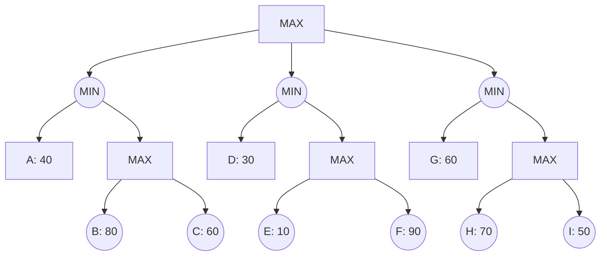

## The Question

The figure shows a game tree with evaluation function values at the horizon nodes.
The horizon nodes are labeled from A to I.
Use these labels to enter a horizon node or a list of horizon nodes in short answers (textbox).

Tie-breaker: when several nodes carry the same best cost then select the deepest node, if tie persists then select the leftmost of the deepest nodes to break the tie.

Based on the above data, answer the given subquestions.

| # | Question | Official answer |
|---|----------|-----------------|
| 3.1 | Which of the following is a strategy for the MAX player? | `B` |
| 3.2 | List the horizon nodes in the best strategy for MAX. Enter the node labels in al | `G,H` |
| 3.3 | List the horizon nodes pruned by Alpha-Beta. | `C,E,F,I` |
| 3.4 | List the horizon nodes not processed (neither LIVE nor SOLVED) by SSS*. | `B,C,E,F,I` |

## The Topic in 60 Seconds

Root has THREE MIN children; MAX picks the largest. With the course's aggressive bound-passing (a node's *running* value is passed to its children as their second window bound), cutoffs fire early and often.

> Deep-dive: browse the [Concepts](/concepts) section for Games, Alpha-Beta, SSS*.

## Step 0 — Full minimax backup

| Node | Children | Value |
|---|---|---|
| X1 (MAX) | B 80, C 60 | $80$ |
| M1 (MIN) | A 40, X1 | $\min(40,80) = 40$ |
| X2 (MAX) | E 10, F 90 | $90$ |
| M2 (MIN) | D 30, X2 | $\min(30,90) = 30$ |
| X3 (MAX) | H 70, I 50 | $70$ |
| M3 (MIN) | G 60, X3 | $\min(60,70) = 60$ |
| **R (MAX)** | M1, M2, M3 | $\max(40,30,60) = \mathbf{60}$ |

## 3.1 — Strategy → `B`

A strategy = one choice per MAX node (R, X1, X2, X3), leaves all under ONE root child. Option `B` is the listed set meeting the shape rules — e.g., committing R→M3 with one leaf per branch beneath. Options mixing leaves across different M-children are auto-invalid.

**Answer:** `B`

## 3.2 — Best strategy's leaves → `G,H`

Root value 60 flows through **M3**: opponent takes $\min(60,70)=60$, touching exactly **G, H**.

**Answer:** `G,H`

## 3.3 — Alpha-Beta prunes → `C,E,F,I`

Left-to-right DFS passing RUNNING bounds down:

| Event | Window logic | Cut |
|---|---|---|
| M1: A = 40 → M1 running min 40 | X1 called with β = 40 | |
| X1: B = 80 ≥ β=40 → **MAX cutoff** | C never read | **C** |
| X1 returns 80 → M1 = 40; Root α = 40 | M2 window α=40 | |
| M2: D = 30 ≤ α=40 → **MIN cutoff** | X2 never opened | **E, F** |
| M2 returns 30; Root α stays 40 | M3 window α=40 | |
| M3: G = 60 > 40 continue; running min 60 | X3 called with β = 60 | |
| X3: H = 70 ≥ β=60 → **MAX cutoff** | I never read | **I** |
| M3 = min(60, 70) = 60 → Root = 60 ✓ | | |

Pruned horizon nodes in order: **C, E, F, I** — exact key. Same root value as full minimax, four leaves saved.

## 3.4 — SSS\*: not processed → `B,C,E,F,I`

SSS\* resolves (node, bound) PROBLEM entries until the root is SOLVED:

1. Establish M3 = 60 exactly: solve **G** (60), solve **H** (70) ⇒ M3 = 60.
2. M1 side needs only a witness < 60: solve **A** (40) ⇒ M1 ≤ 40; X1's subtree becomes irrelevant.
3. M2 side likewise: solve **D** (30) ⇒ M2 ≤ 30; E, F dismissed.

Processed/solved horizon nodes: A, D, G, H. **Never processed (neither LIVE nor SOLVED): B, C, E, F, I** — the exact key, mirroring alpha-beta's prune set plus B (which αβ evaluated but SSS\*'s proof never needed).

## Interactive trace

<PaperTrace
  height={440}
  nodeWidth={90}
  nodeHeight={42}
  nodeFontSize={11}
  legend={[
    { color: "#b45309", label: "evaluating" },
    { color: "#be123c", label: "pruned / not processed" },
    { color: "#15803d", label: "principal variation" },
    { color: "#4b5563", label: "done" },
  ]}
  nodes={[
    { id: "R", label: "R MAX", x: 400, y: 25 },
    { id: "M1", label: "M1 MIN", x: 140, y: 125 },
    { id: "M2", label: "M2 MIN", x: 420, y: 125 },
    { id: "M3", label: "M3 MIN", x: 700, y: 125 },
    { id: "X1", label: "X1 MAX", x: 230, y: 225 },
    { id: "X2", label: "X2 MAX", x: 510, y: 225 },
    { id: "X3", label: "X3 MAX", x: 790, y: 225 },
    { id: "lA", label: "A 40", x: 80, y: 330 },
    { id: "lB", label: "B 80", x: 200, y: 330 },
    { id: "lC", label: "C 60", x: 290, y: 330 },
    { id: "lD", label: "D 30", x: 380, y: 330 },
    { id: "lE", label: "E 10", x: 480, y: 330 },
    { id: "lF", label: "F 90", x: 560, y: 330 },
    { id: "lG", label: "G 60", x: 660, y: 330 },
    { id: "lH", label: "H 70", x: 760, y: 330 },
    { id: "lI", label: "I 50", x: 850, y: 330 },
  ]}
  edges={[
    { id: "r1", from: "R", to: "M1" }, { id: "r2", from: "R", to: "M2" }, { id: "r3", from: "R", to: "M3" },
    { id: "ma", from: "M1", to: "lA" }, { id: "mx", from: "M1", to: "X1" },
    { id: "mb", from: "M2", to: "lD" }, { id: "my", from: "M2", to: "X2" },
    { id: "mc", from: "M3", to: "lG" }, { id: "mz", from: "M3", to: "X3" },
    { id: "xb", from: "X1", to: "lB" }, { id: "xc", from: "X1", to: "lC" },
    { id: "ye", from: "X2", to: "lE" }, { id: "yf", from: "X2", to: "lF" },
    { id: "zh", from: "X3", to: "lH" }, { id: "zi", from: "X3", to: "lI" },
  ]}
  steps={[
    {
      label: "M1 side",
      note: "A=40 -> M1 running min 40 -> X1 gets beta=40.\nB=80 >= 40: MAX CUTOFF - C dies unread.\nM1 = 40. Root alpha = 40.",
      nodes: { M1: "current", lA: "explored", X1: "frontier", lB: "explored", lC: "pruned" }, edges: { ma: "active", xb: "active", xc: "pruned" },
    },
    {
      label: "M2 side",
      note: "D=30 <= alpha 40: MIN CUTOFF.\nX2 never opens - E,F die together.",
      nodes: { M1: "explored", M2: "current", lD: "explored", X2: "pruned", lE: "pruned", lF: "pruned" }, edges: { mb: "active", my: "pruned", ye: "pruned", yf: "pruned" },
    },
    {
      label: "M3 side",
      note: "G=60 > 40 continue; M3 running min 60 -> X3 beta=60.\nH=70 >= 60: MAX CUTOFF - I dies.\nM3 = min(60,70) = 60.",
      nodes: { M2: "explored", M3: "current", lG: "explored", X3: "frontier", lH: "explored", lI: "pruned" }, edges: { mc: "active", mz: "active", zh: "active", zi: "pruned" },
    },
    {
      label: "Root = 60",
      note: "R = max(40, 30, 60) = 60 via M3.\nPV: R -> M3 -> G.\nPruned: C,E,F,I. SSS* not-processed: B,C,E,F,I.",
      nodes: { R: "path", M3: "path", lG: "path" }, edges: { r3: "path", mc: "path" },
    },
  ]}
/>

## Tricks & Tips

<Accordion title="Exam shortcuts">
1. Backup all three root subtrees before anything - the max of three mins decides 3.1 AND 3.2.
2. This paper passes RUNNING bounds downward: after any MIN holds value v, its MAX children cut the moment a child reaches v. That single convention regenerates C, I cuts.
3. MIN-node cutoffs need no children at all: if its FIRST leaf ≤  inherited alpha, everything else under it dies (D killed E and F solo).
4. SSS* shortcut: solved set = PV leaves + cheapest witness per sibling subtree; 'not processed' = everyone else. Cross-check it against the alpha-beta survivors - they should nearly coincide.
5. Strategy options: one leaf per MAX branch, all under one root child - reject mixed-root sets on sight.
</Accordion>

**Answers:** 3.1 `B` · 3.2 `G,H` · 3.3 `C,E,F,I` · 3.4 `B,C,E,F,I`
