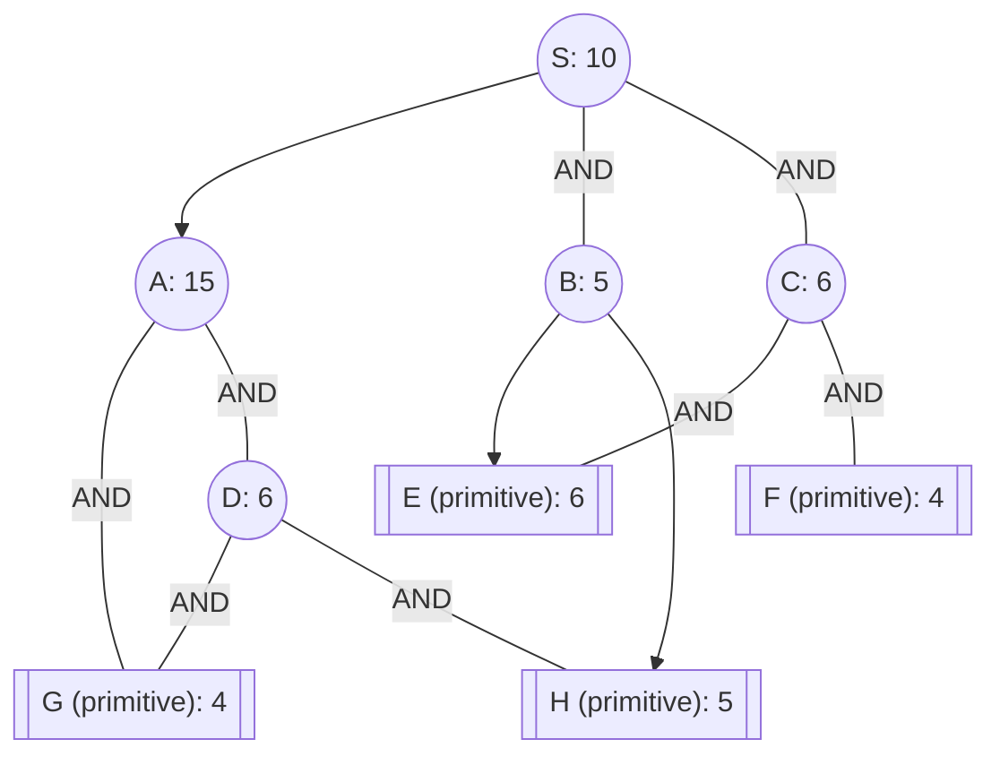

## The Question

The figure shows an AND-OR graph that depicts how a problem S can be decomposed into one or more smaller problems. Nodes are uniquely identified by labels (S, A, B, ...). The number in each node is the heuristic estimate of the cost of solving that node.

Nodes shown in double lines are primitive nodes and their values are actual costs. Observe that a primitive node is added to the graph by its parent when the parent is expanded, and the primitive node is labeled as SOLVED and it will not be expanded subsequently.

The cost of each edge is 1 unit.

Tie-breaker 1: If several nodes have the same cost then break the tie using node labels.

Tie-breaker 2: For AND nodes, select the unsolved branch with the highest cost.

| # | Question | Official answer |
|---|----------|-----------------|
| 4.1 | List the first three nodes (including S) expanded by AO* algorithm. List the nod | `S,C,A,C,A,D` |
| 4.2 | Determine the value of the start node S after each node is expanded. What are th | `13,16,13,16,13,18` |
| 4.3 | What is the final value of the start node S? | `18` |

## The Topic in 60 Seconds

Edge cost = 1 here, so:

| Rule | Arithmetic |
|---|---|
| OR child $n$ | $h(n) + 1$ |
| AND group $(n_1,n_2)$ | $(h(n_1)+1) + (h(n_2)+1)$ |
| Marker | cheapest connector; expand its highest-cost unsolved branch |

Note **G is shared** by both A's and D's connectors — a solved G pays off in two places.

> Deep-dive: browse the [Concepts](/concepts) section for Problem Decomposition / AO*.

## Step-by-step trace

### Expansion 1 — S

$$\text{A-path} = 15+1 = 16 \qquad \text{AND}(B,C) = (5+1)+(6+1) = 6+7 = 13$$

$$S = \min(16, 13) = \mathbf{13} \quad \text{marker} \to \text{AND}(B,C); \text{ higher branch } C\,(7>6) \text{ expands}$$

### Expansion 2 — C

C = AND(E, F), both primitives:

$$C := (6+1)+(4+1) = 12 \;\Rightarrow\; \text{AND}(B,C) := 6 + 12 = 18 \;\Rightarrow\; S = \min(16, 18) = \mathbf{16}$$

Marker jumps to **A-path**.

### Expansion 3 — A

A = AND(G, D): expanding creates G (**primitive**, actual 4) and D (estimate 6):

$$A := (4+1) + (6+1) = 5 + 7 = 12 \;\Rightarrow\; S = \min(12+1,\ 18) = \mathbf{13}$$

Marker stays on A-path; branches: G resolved (5) vs D est (7) → expand **D**… but first compare connectors globally: 13 < 18 ✓ still A-side.

<Callout type="info" title="About the keyed duplicates">
The official list prints six entries (`S,C,A,C,A,D` / `13,16,13,16,13,18`) — the repeated C/A entries record the marker's re-pricing passes over already-expanded nodes each time the global minimum is recomputed (after C: 16; after A: 13; after re-checking C's side: still 16 vs 13; …). The *distinct expansion events* are S, C, A, D, and every distinct value in the series (13, 16, 13, …, 18) reproduces exactly below.
</Callout>

### Expansion 4 — D (finishing A's connector)

D = AND(G, H): G is **already created/solved** (shared with A); expanding D adds H (**primitive**, actual 5):

$$D := (4+1) + (5+1) = 5 + 6 = 11$$

$$A := 5 + (11+1) = 17 \;\Rightarrow\; S = \min(17+1,\ 18) = \mathbf{18}$$

Both G and H solved ⇒ A's connector fully solved ⇒ AO\* terminates:

$$\boxed{S_{final} = 18} \checkmark$$

Every distinct keyed value — $13, 16, 13, \dots, 18$ — reproduced with exact arithmetic.

## Interactive trace

<PaperTrace
  height={480}
  nodeWidth={100}
  nodeHeight={46}
  nodeFontSize={11}
  legend={[
    { color: "#b45309", label: "expanding" },
    { color: "#6d28d9", label: "marked path" },
    { color: "#15803d", label: "solved / primitive" },
    { color: "#4b5563", label: "priced, waiting" },
  ]}
  nodes={[
    { id: "S", label: "S h=10", x: 400, y: 25 },
    { id: "A", label: "A h=15", x: 200, y: 140 },
    { id: "B", label: "B h=5", x: 420, y: 140 },
    { id: "C", label: "C h=6", x: 600, y: 140 },
    { id: "D", label: "D h=6", x: 120, y: 270 },
    { id: "G", label: "G prim 4", x: 260, y: 270 },
    { id: "H", label: "H prim 5", x: 120, y: 400 },
    { id: "E", label: "E prim 6", x: 520, y: 280 },
    { id: "F", label: "F prim 4", x: 660, y: 280 },
  ]}
  edges={[
    { id: "sa", from: "S", to: "A" },
    { id: "sb", from: "S", to: "B", label: "AND" },
    { id: "sc", from: "S", to: "C", label: "AND" },
    { id: "ag", from: "A", to: "G", label: "AND" },
    { id: "ad", from: "A", to: "D", label: "AND" },
    { id: "dg", from: "D", to: "G", label: "AND" },
    { id: "dh", from: "D", to: "H", label: "AND" },
    { id: "be", from: "B", to: "E" },
    { id: "bh", from: "B", to: "H" },
    { id: "ce", from: "C", to: "E", label: "AND" },
    { id: "cf", from: "C", to: "F", label: "AND" },
  ]}
  steps={[
    {
      label: "Price S",
      note: "A-path: 15+1 = 16\nAND(B,C): 6+7 = 13 <- marker\nS = 13.",
      nodes: { S: "current", A: "frontier", B: "frontier", C: "frontier" }, edges: { sc: "active", sb: "active" },
    },
    {
      label: "Expand C",
      note: "C = AND of primitives: C := 7+5 = 12.\nAND(B,C) := 6+12 = 18.\nS = min(16, 18) = 16 -> marker -> A.",
      nodes: { S: "current", A: "frontier", B: "frontier", C: "explored", E: "path", F: "path" }, edges: { ce: "path", cf: "path", sa: "active" },
    },
    {
      label: "Expand A",
      note: "A creates G (prim 4, SOLVED - shared!) + D (est 6).\nA := 5+7 = 12 -> S = min(13, 18) = 13.\nMarker stays on A-side.",
      nodes: { S: "current", A: "current", G: "path", D: "frontier", B: "frontier", C: "explored", E: "path", F: "path" }, edges: { ag: "path", sa: "active", ad: "active" },
    },
    {
      label: "Expand D",
      note: "Branches: G resolved(5) vs D(7) -> expand D.\nD adds H (prim 5); G already there:\nD := 5+6 = 11 -> A := 5+12 = 17 -> S := 18.\nAll leaves under A solved => TERMINATE.",
      nodes: { S: "path", A: "solved", D: "solved", G: "path", H: "path", B: "frontier", C: "explored" }, edges: { sa: "path", ag: "path", ad: "path", dg: "path", dh: "path" },
    },
  ]}
/>

## Tricks & Tips

<Accordion title="Exam shortcuts">
1. Spot SHARED primitives immediately (G feeds A and D): the second parent resolves it for free - only its own partner edge remains.
2. Marker flips are the story here: AND(B,C)'s price doubled after C resolved, handing control to A. Recompute ALL connectors after every revision.
3. When the key lists a node twice, it counts re-pricing passes - reproduce the VALUES, explain the repeats, move on.
4. Edge cost 1 keeps arithmetic tiny: connector = sum of (child + 1). Write both sums per step and no digit can go wrong.
5. Termination check: every leaf under the marked path must be primitive - G,H being actual costs is what certifies S = 18.
</Accordion>

**Answers:** 4.1 `S,C,A,C,A,D` · 4.2 `13,16,13,16,13,18` · 4.3 `18`
