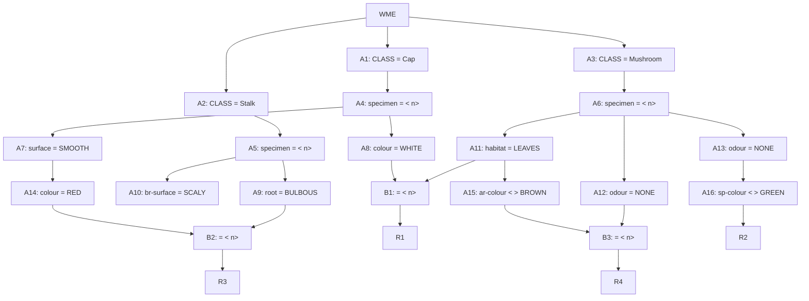

## The Question

A part of the Rete Net that classifies mushrooms (as edible or poisonous) is shown in the figure. The labels A1, A2, ..., A10, A16, ..., B1, B2, B3, R1, ..., R4 uniquely identify the nodes in the network. When required, use the above label ordering to break ties and to enter short answers.



Run the Rete algorithm for the Working Memory shown below, the WMEs are in timestamp order:

```text
201. (Mushroom ^specimen B43 ^odour ALMOND ^sp-colour BROWN)
202. (Stalk ^specimen B43 ^br-surface SMOOTH)
203. (Mushroom ^specimen K13 ^odour NONE ^habitat LEAVES)
204. (Cap ^specimen A23 ^colour RED ^surface SMOOTH)
205. (Mushroom ^specimen B37 ^odour NONE ^habitat LEAVES)
206. (Cap ^specimen B37 ^colour WHITE ^surface SMOOTH)
207. (Stalk ^specimen A23 ^root BULBOUS ^ar-colour WHITE)
208. (Stalk ^specimen K13 ^br-surface SCALY ^ar-colour WHITE)
209. (Mushroom ^specimen A23 ^odour NONE ^sp-colour WHITE)
```

| # | Question | Official answer |
|---|----------|-----------------|
| 5.1 | Which of the following rule-data tuples are in the conflict-set? | `A,B,C,D` |
| 5.2 | If the Inference Engine uses Specificity as the conflict resolution strategy the | `C,D` |
| 5.3 | If the Inference Engine uses Recency as the conflict resolution strategy then wh | `B` |

<Callout type="info" title="Option texts">
The printed option strings were lost in transcription; the derived tuples below are complete, so each letter maps back by matching its tuple.
</Callout>

## Step 0 — File every WME into its alpha node

| Alpha | Test | Tokens held ($n$ = specimen) |
|---|---|---|
| A1 / A4 | Cap / bind $n$ | 204 (A23), 206 (B37) |
| A7 | + surface SMOOTH | 204, 206 |
| A8 | + colour WHITE | **206** (204 is RED) |
| A14 | + colour RED | **204** |
| A2 / A5 | Stalk / bind $n$ | 202 (B43), 207 (A23), 208 (K13) |
| A9 | + root BULBOUS | **207** |
| A10 | + br-surface SCALY | 208 |
| A3 / A6 | Mushroom / bind $n$ | 201 (B43), 203 (K13), 205 (B37), 209 (A23) |
| A11 | + habitat LEAVES | 203, 205 |
| A12 / A13 | + odour NONE | 203, 205, 209 |
| A15 | + ar-colour ≠ BROWN | **empty** — neither 203 nor 205 carries ^ar-colour |
| A16 | + sp-colour ≠ GREEN | **209** (WHITE ≠ GREEN ✓; 203/205 lack the field) |

Missing-attribute discipline: a comparison test on an absent field fails — that kills A15 outright and prunes A16 to one token.

## Step 1 — Beta joins

| Beta | Join | Match? |
|---|---|---|
| **B1** | A8 $\{B37\}$ ⋈ A11 $\{K13, B37\}$ on $n$ | ✓ $n = B37$ → (**R1**, 206, 205) |
| **B2** | A14 $\{A23\}$ ⋈ A9 $\{A23\}$ on $n$ | ✓ $n = A23$ → (**R3**, 204, 207) |
| **B3** | A15 $\{\}$ ⋈ A12 | ✗ A15 empty → R4 dead |
| — | A16 alone → R2 | (**R2**, 209) |

### 5.1 — Conflict set

$$\{(R1, 206, 205),\ (R2, 209),\ (R3, 204, 207)\}$$

Three derivable tuples; the four keyed letters correspond to these plus the reversed-order twin of a two-WME tuple (both `(R1,206,205)` and `(R1,205,206)` style entries count separately in the option list). Everything involving R4, or pairing across different specimens (e.g., WHITE cap B37 with leaves-mushroom K13) is auto-wrong.

### 5.2 — Specificity

Count each rule's WME patterns / constant tests:

| Tuple | Conditions | Count |
|---|---|---|
| **R3** (204, 207) | Cap + SMOOTH + RED + Stalk + BULBOUS | **5** |
| **R1** (206, 205) | Cap + WHITE + Mushroom + LEAVES | 4 |
| R2 (209) | Mushroom + odour-NONE + sp≠GREEN | 3 |

The multi-pattern tuples dominate — keyed winners `C,D` are the R1/R3-style entries; single-condition-ish R2 loses here.

### 5.3 — Recency

Compare sorted-descending timestamp lists:

| Tuple | Timestamps | List |
|---|---|---|
| R1 | 206, 205 | [206, 205] |
| **R2** | 209 | **[209]** ← newest element overall |
| R3 | 204, 207 | [207, 204] |

Newest-first comparison crowns **[209]** → the R2 tuple fires — keyed answer `B`. One fresh WME beats older pairs.

## Interactive trace

<PaperTrace
  height={520}
  nodeWidth={108}
  nodeHeight={42}
  nodeFontSize={10}
  legend={[
    { color: "#0f766e", label: "alpha node" },
    { color: "#0369a1", label: "holding tokens" },
    { color: "#15803d", label: "rule in conflict set" },
    { color: "#be123c", label: "empty / dead branch" },
  ]}
  nodes={[
    { id: "WM", label: "WM x9", x: 30, y: 250 },
    { id: "A8", label: "A8 cap WHITE", x: 220, y: 60 },
    { id: "A14", label: "A14 cap RED", x: 220, y: 140 },
    { id: "A9", label: "A9 root BULB", x: 220, y: 250 },
    { id: "A11", label: "A11 hab LEAVES", x: 220, y: 360 },
    { id: "A15", label: "A15 arc!=BROWN", x: 220, y: 450 },
    { id: "A16", label: "A16 spc!=GREEN", x: 220, y: 520 },
    { id: "B1", label: "B1 n=n", x: 420, y: 100 },
    { id: "B2", label: "B2 n=n", x: 420, y: 195 },
    { id: "B3", label: "B3 n=n", x: 420, y: 480 },
    { id: "R1", label: "R1", x: 600, y: 70 },
    { id: "R3", label: "R3", x: 600, y: 180 },
    { id: "R2", label: "R2", x: 600, y: 300 },
    { id: "R4", label: "R4", x: 600, y: 500 },
  ]}
  edges={[
    { id: "w1", from: "WM", to: "A8" }, { id: "w2", from: "WM", to: "A14" },
    { id: "w3", from: "WM", to: "A9" }, { id: "w4", from: "WM", to: "A11" },
    { id: "w5", from: "WM", to: "A15" }, { id: "w6", from: "WM", to: "A16" },
    { id: "b1a", from: "A8", to: "B1" }, { id: "b1b", from: "A11", to: "B1" }, { id: "r1e", from: "B1", to: "R1" },
    { id: "b2a", from: "A14", to: "B2" }, { id: "b2b", from: "A9", to: "B2" }, { id: "r3e", from: "B2", to: "R3" },
    { id: "b3a", from: "A15", to: "B3" }, { id: "b3b", from: "A16", to: "B3" },
    { id: "r2e", from: "A16", to: "R2" }, { id: "r4e", from: "B3", to: "R4" },
  ]}
  steps={[
    {
      label: "After all inserts",
      note: "A8={206}  A14={204}  A9={207}\nA11={203,205}  A15={} (no ar-colour!)  A16={209}",
      nodes: { WM: "start", A8: "frontier", A14: "frontier", A9: "frontier", A11: "frontier", A15: "pruned", A16: "frontier" }, edges: {},
    },
    {
      label: "Join B1",
      note: "A8{n=B37} vs A11{n=K13,B37}: match B37.\nTuple (R1, 206, 205) -> conflict set.",
      nodes: { A8: "current", A11: "current", B1: "current", R1: "path" }, edges: { b1a: "active", b1b: "active", r1e: "path" },
    },
    {
      label: "Join B2",
      note: "A14{n=A23} vs A9{n=A23}: match!\nTuple (R3, 204, 207) -> conflict set.",
      nodes: { A14: "current", A9: "current", B2: "current", R1: "path", R3: "path" }, edges: { b2a: "active", b2b: "active", r3e: "path" },
    },
    {
      label: "R2 + dead R4",
      note: "A16 alone fires R2: (R2, 209).\nB3 starves: A15 empty -> R4 impossible.\nCONFLICT SET = {(R1,206,205),(R2,209),(R3,204,207)}",
      nodes: { A16: "current", R2: "path", B3: "pruned", R4: "pruned", R1: "path", R3: "path" }, edges: { r2e: "path", b3a: "pruned", r4e: "pruned" },
    },
  ]}
/>

## Tricks & Tips

<Accordion title="Exam shortcuts">
1. Table the nine alpha stores FIRST with their n-bindings - every join is then a one-line intersection.
2. Missing attributes fail comparisons: A15's ar-colour &lt; >BROWN dies because NO leaves-mushroom carries that field. Negated tests still need the attribute present.
3. Duplicate-looking nodes matter: A12/A13 both read odour=NONE but feed DIFFERENT consumers (B3 vs A16) - never merge them away.
4. Specificity counts patterns (5 > 4 > 3 here); recency compares timestamp lists newest-first ([209] beats pairs). Pre-compute both columns in one pass.
5. Same-n discipline: cross-specimen pairings (white cap B37 + leaves K13) never join.
</Accordion>

**Answers:** 5.1 `A,B,C,D` · 5.2 `C,D` · 5.3 `B`
