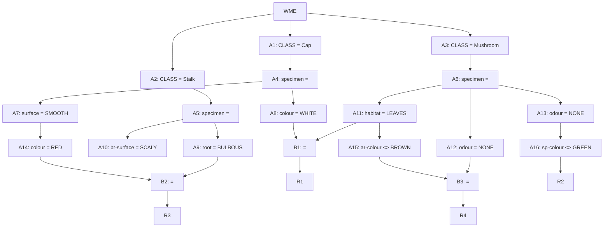

## The Question

A part of the Rete Net that classifies mushrooms (as edible or poisonous) is shown in the figure. The labels A1, A2, ..., A10, A16, ..., B1, B2, B3, R1, ..., R4 uniquely identify the nodes in the network. When required, use the above label ordering to break ties and to enter short answers.



Run the Rete algorithm for the Working Memory shown below, the WMEs are in timestamp order. Assume that WMEs reside at appropriate Alpha nodes, and the Beta nodes point to WMEs residing in Alpha nodes.

```text
201. (Mushroom ^specimen B43 ^odour ALMOND ^sp-colour BROWN)
202. (Stalk ^specimen B43 ^br-surface SMOOTH)
203. (Mushroom ^specimen K13 ^odour NONE ^habitat LEAVES)
204. (Cap ^specimen A23 ^colour RED ^surface SMOOTH)
205. (Mushroom ^specimen B37 ^odour NONE ^habitat LEAVES)
206. (Cap ^specimen B37 ^colour WHITE ^surface SMOOTH)
207. (Stalk ^specimen A23 ^root BULBOUS ^ar-colour WHITE)
208. (Stalk ^specimen K13 ^br-surface SCALY ^ar-colour WHITE)
209. (Mushroom ^specimen A23 ^odour NONE ^sp-colour WHITE)
```

For each WME identify its location (node label) in the Rete Net, and prepare the conflict set for the first cycle, then answer the given subquestions.

| # | Question | Official answer |
|---|----------|-----------------|
| 5.1 | Which of the following rule-data tuples are in the conflict-set? | `A,B,C,D` |
| 5.2 | If the Inference Engine uses Specificity as the conflict resolution strategy the | `C,D` |
| 5.3 | If the Inference Engine uses Recency as the conflict resolution strategy then wh | `B` |

## The Topic in 60 Seconds

> Deep-dive: browse the [Concepts](/concepts) section for the relevant topic page.

## Solutions

**5.1** — Which of the following rule-data tuples are in the conflict-set?  
**Answer:** `A,B,C,D`

**5.2** — If the Inference Engine uses Specificity as the conflict resolution strategy the  
**Answer:** `C,D`

**5.3** — If the Inference Engine uses Recency as the conflict resolution strategy then wh  
**Answer:** `B`


## Tricks & Tips

<Accordion title="Exam method">
1. Read the question carefully — identify the algorithm or technique.
2. Trace step by step, showing your working.
3. Verify your answer against the question constraints.
</Accordion>
