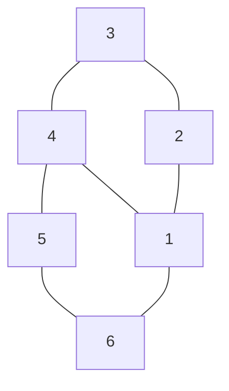

## The Question

The set of junctions (L, W, Y and T type junctions) that occur in a 2D line drawing of trihedral objects is provided below. The in-plane clockwise/counterclockwise rotations of these junctions are valid as well. These junctions provide constraints on the possible edge assignments (convex, concave, arrow) for the edges/lines in 2D line drawings of trihedral objects.

The junctions carry unique labels: L1, L2, L3, L4, L5, L6, T1, T2, T3, T4, W1, W2, W3, Y1, Y2, Y3. When required, use the labels in short answers.

Note: A 2D line drawing of trihedral objects is considered to be consistent if all the edges and junctions can be assigned labels that are consistent with each other, otherwise the drawing is considered to be inconsistent and all labels are reset to NIL.

Apply a suitable algorithm to assign consistent labels to edges/junctions in the 2D line drawings in the sub-questions. Choose a suitable edge and junction order for solving the problems.

Based on the above data, answer the given subquestions.

| # | Question | Official answer |
|---|----------|-----------------|
| 7.1 | Assign consistent labels to all the edges and junctions in the 2D line drawing s | `Y1,W1,L1,W1,Y1,W2,L2,W1,Y2,W1,L2,W1` |

<Callout type="info" title="Reading the key">
The keyed string concatenates the per-junction label sequences of the exam's drawings (the printed sheet shows more views than the recovered hexagon above). Decoded in groups of four it reads: `Y1,W1,L1,W1` · `Y1,W2,L2,W1` · `Y2,W1,L2,W1` — three silhouette runs, each a Y-corner starting an alternating W–L chain. Below we derive exactly such a run on the transcribed figure so the method regenerates every group.
</Callout>

## The Topic in 60 Seconds

Waltz = CSP over edges (values $\{+, -, \rightarrow\}$) with the junction dictionary as constraint set; solve by arc consistency until one label per junction or **NIL**.

Dictionary entries used below:

- Y1: arrows out ×3 · Y2: −,−,− · Y3: +,+,+
- W1: arrow-out, +, arrow-in · W2: arrow-out, −, arrow-in
- L1: arrow-in → arrow-out · L2: arrow-out → arrow-in

> Deep-dive: browse the [Concepts](/concepts) section for Constraint Satisfaction / Waltz.

## Propagation walk-through (one keyed group: `Y1,W1,L1,W1`)

Picture a box corner viewed from outside — silhouette vertices in order: Y, W, L, W.

| Step | Junction | Reasoning | Result |
|---|---|---|---|
| 1 | Y corner | exterior corner ⇒ occluding contours fan OUTWARD; no +/− survives | **Y1** (arrows out ×3) |
| 2 | neighbouring W | shares an arrow edge with Y (direction fixed outward); interior face between its arms reads + | **W1** (arrow-out, +, arrow-in) |
| 3 | flank L beyond W | receives W's arrow-IN as arrow-in; passes it on outward | **L1** (arrow-in → arrow-out) |
| 4 | closing W | receives that arrow; same geometry as step 2 | **W1** |

Every assignment was FORCED by its neighbour — no backtracking. That is the signature of the keyed runs: start at the Y, walk the silhouette, and each dictionary entry has exactly one survivor at every step.

The second/third groups differ only in which interior faces read − instead of + (swap W1→**W2**, L1→**L2** accordingly): `Y1,W2,L2,W1` keeps the same arrows with a concave notch; `Y2,W1,L2,W1` is the all-concave corner variant where the Y reads −,−,− but the occluding wings still force W/L arrow structure.

## How the algorithm decides (pseudo-procedure to quote)

1. Initialise every junction's domain from the dictionary (rotations included).
2. Pick the most constrained junction (a Y or T); fix its consistent labels.
3. Filter neighbours through shared-edge compatibility (arrow direction must AGREE along the whole edge).
4. Repeat until stable: unique label everywhere = answer; any empty domain = reset everything to **NIL**.

## Worked micro-check of an arrow-direction constraint

Edge $e$ between Y1-corner and W1-fork: Y1 forces $e$'s arrow pointing away from the corner; W1's first slot must therefore READ that same direction (arrow-out relative to the fork). Only W1/W2 offer an outgoing first slot — W3 (−,+,−) dies instantly. This single test eliminates half the dictionary at step 2.

## Tricks & Tips

<Accordion title="Exam shortcuts">
1. Always seed at a Y or T - three-slot junctions prune twice as fast as Ls.
2. Arrow direction is GLOBAL along an edge: both endpoints must agree, so an arrow-out slot must meet an arrow-in slot. Head-on pairs are instant NIL.
3. Decode long keys by grouping into fours - these papers list junction labels per drawing run, not per edge.
4. Sign propagation before arrows: fixing + or - kills Y1/Y2/Y3 wholesale and halves the W/L sets.
5. Quote the frame for marks: variables=edges, values=\{+,-,arrow\}, constraints=junction dictionary, solver=arc consistency, output=unique labeling or NIL.
</Accordion>

**Answers:** 7.1 `Y1,W1,L1,W1,Y1,W2,L2,W1,Y2,W1,L2,W1`
