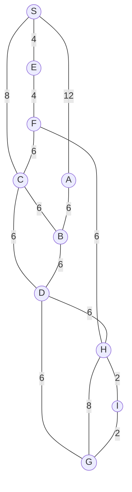

## The Question

The figure shows a map on a uniform grid where each tile is 1x1 in size.
The start node is S and the goal node is G.
The MoveGen function returns nodes in alphabetical order.
Use Manhattan Distance as the heuristic function.
**Tie-breaker**: If several nodes have the same cost, use node labels to break the tie.

| # | Question | Official answer |
|---|----------|-----------------|
| 1.1 | What is the path found by the Best First Search algorithm? Enter the path as a comma separated list | `S,A,B,D,G` |
| 1.2 | What is the path found by A* search algorithm? Enter the path as a comma separated list | `S,C,D,G` |
| 1.3 | What is the path found by Branch-and-Bound search algorithm? Enter the path as a comma separated list | `S,E,F,H,I,G` |
| 1.4 | For the given map, which algorithm finds the shortest path from S to G? | `B` |
| 1.5 | What can you say about the heuristic function for the given graph? | `B` |

## The Topic in 60 Seconds

| Algorithm | Sorts OPEN by | Ignores |
|-----------|---------------|---------|
| Best First | $h(n)$ | $g(n)$ |
| A* | $f(n) = g(n) + h(n)$ | nothing |
| Branch-and-Bound | $g(n)$ of the whole path | $h(n)$ |

All three pop the cheapest entry, generate children, and stop when they pop **G** — only the sorting key differs. Tie-break: smaller node label first.

> Deep-dive: [A* Search](/concepts/week-03-heuristic-search/01-a-star-search), [Best First Search](/concepts/week-03-heuristic-search/09-best-first-search), [Branch and Bound](/concepts/week-03-heuristic-search/05-branch-and-bound).

## Step 0 — Heuristic table (Manhattan distance to G, read off the grid)

| Node | $h$ | Node | $h$ |
|------|-----|------|-----|
| S | 18 | D | 6 |
| A | 9 | E | 16 |
| B | 6 | F | 8 |
| C | 10 | H | 4 |
| G | 0 | I | 2 |

Memorize two numbers before tracing: $h(A) = 9$ (small!) and $h(E) = 16$ (big). Everything that happens below is driven by them.

## 1.1 — Best First Search → `S,A,B,D,G`

Sort purely by $h$. Costs of edges are ignored completely.

| Step | OPEN (node : $h$) | Pick |
|------|-------------------|------|
| 1 | S : 18 | **S** → A(9), C(10), E(16) |
| 2 | A : 9, C : 10, E : 16 | **A** → B(6) |
| 3 | B : 6, C : 10, E : 16 | **B** → D(6) |
| 4 | D : 6, C : 10, E : 16 | **D** → G(0), H(4) |
| 5 | G : 0, H : 4, C : 10, E : 16 | **G** — goal! |

Path: **S → A → B → D → G**, cost $12+6+6+6 = 30$.

Best First chased the small $h$ values ($9 \to 6 \to 6 \to 0$) and never noticed it was paying huge $g$ costs — the S–A edge alone is 12.

## 1.2 — A* search → `S,C,D,G`

Sort by $f(n) = g(n) + h(n)$.

| Step | OPEN (node : $f = g+h$) | Pick |
|------|-------------------------|------|
| 1 | S : $0+18$ = **18** | **S** → A : $12+9$ = 21, C : $8+10$ = **18**, E : $4+16$ = 20 |
| 2 | C : **18**, E : 20, A : 21 | **C** → D : $14+6$ = 20, B : $14+6$ = 20 |
| 3 | B : 20, D : 20, E : 20, A : 21 | **B** (tie at 20 → labels) — generates nothing new |
| 4 | D : 20, E : 20, A : 21 | **D** (tie at 20 → labels) → G : $20+0$ = **20**, H : $20+4$ = 24 |
| 5 | G : **20**, E : 20, A : 21, H : 24 | **G** — goal! (tie with E broken by label) |

Path: **S → C → D → G**, cost $8+6+6 = 20$.

Note the trap: E sits in OPEN with a tempting $g = 4$, but $h(E) = 16$ inflates $f(E)$ to 20, so A* never expands it. A* returned cost **20** while a cost-**18** route exists — remember this for 1.4/1.5.

## 1.3 — Branch-and-Bound → `S,E,F,H,I,G`

Sort full paths by $g$ only. Extend paths until G is popped as the cheapest.

| Pop # | Popped (path : $g$) | New paths added |
|-------|--------------------|-----------------|
| 1 | S : 0 | SE : 4, SC : 8, SA : 12 |
| 2 | SE : 4 | SEF : $4+4$ = 8 |
| 3 | SC : 8 (tie with SEF → label) | SCB : 14, SCD : 14 |
| 4 | SEF : 8 | SEFC : 14, SEFH : 14 |
| 5 | SA : 12 | SAB : $12+6$ = 18 |
| 6 | SCB : 14 | SCBD : 20 |
| 7 | SCD : 14 | SCDH : 20, SCDG : 20 |
| 8 | SEFC : 14 | SEFCB : 20, SEFCD : 20 |
| 9 | SEFH : 14 | SEFHI : $14+2$ = **16**, SEFHD : 20, SEFHG : 22 |
| 10 | SEFHI : 16 | SEFHIG : $16+2$ = **18** |
| 11 | SAB : 18 (tie with SEFHIG → label) | SABD : 24 |
| 12 | SEFHIG : **18** — reaches G; every other open path ≥ 20 | **stop — optimal** |

Path: **S → E → F → H → I → G**, cost $4+4+6+2+2 = 18$ ✓ the true shortest.

BnB never looked at any $h$ value, so the misleading heuristic could not hurt it. It popped cheap partial paths (SE at 4, SEF at 8) and let the cheap edges accumulate into the winning route.

## 1.4 — Who finds the shortest path? → **B**

Full route census:

| Route | Cost |
|-------|------|
| **S-E-F-H-I-G** | **18** ← shortest |
| S-C-D-G | 20 |
| S-E-F-H-G | 22 |
| S-C-D-H-I-G | 24 |
| S-C-B-D-G | 26 |
| S-A-B-D-G | 30 |

Returned paths: Best First 30, A* 20, BnB 18. Only **Branch-and-Bound** returns the shortest → option **B** ✓.

## 1.5 — Admissibility → **B (not admissible)**

An admissible $h$ never overestimates the true remaining cost $h^*(n)$.

Check the suspects against true cheapest distances:

| Node | $h$ | $h^*$ (true cheapest to G) | Verdict |
|------|-----|----------------------------|---------|
| E | 16 | E-F-H-I-G = $4+6+2+2$ = **14** | **overestimates!** |
| F | 8 | F-H-I-G = 10 | ok |
| C | 10 | C-D-G = 12 | ok |
| A | 9 | A-B-D-G = 18 | ok |

$h(E) = 16 > h^*(E) = 14$ → the heuristic **overestimates at E** → not admissible → **B** ✓. That single overestimate is exactly why A* deprioritized E (f = 20 instead of a true-deserved lower value) and settled for the cost-20 route while BnB collected the cost-18 one.

## Interactive A* trace

Step through the A* run — watch how $f(E)=20$ keeps the truly cheap region frozen while the C-route finishes:

<StepGraph
  height={430}
  nodeWidth={100}
  nodeHeight={50}
  nodeFontSize={13}
  legend={[
    { color: "#b45309", label: "expanding" },
    { color: "#0369a1", label: "in OPEN (f = g+h)" },
    { color: "#4b5563", label: "expanded" },
    { color: "#16a34a", label: "returned path" },
  ]}
  steps={[
    {
      label: "Init",
      note: "OPEN = { S(g=0, h=18, f=18) }",
      elements: [
        { data: { id: "S", label: "S f=18", type: "frontier" }, position: { x: 340, y: 30 } },
        { data: { id: "A", label: "A", type: "explored" }, position: { x: 80, y: 150 } },
        { data: { id: "C", label: "C", type: "explored" }, position: { x: 340, y: 150 } },
        { data: { id: "E", label: "E", type: "explored" }, position: { x: 640, y: 150 } },
        { data: { id: "B", label: "B", type: "explored" }, position: { x: 60, y: 280 } },
        { data: { id: "D", label: "D", type: "explored" }, position: { x: 330, y: 280 } },
        { data: { id: "F", label: "F", type: "explored" }, position: { x: 640, y: 280 } },
        { data: { id: "G", label: "G", type: "explored" }, position: { x: 180, y: 400 } },
        { data: { id: "H", label: "H", type: "explored" }, position: { x: 480, y: 400 } },
        { data: { id: "I", label: "I", type: "explored" }, position: { x: 760, y: 400 } },
        { data: { id: "e1", source: "S", target: "E", label: "4" } },
        { data: { id: "e2", source: "S", target: "C", label: "8" } },
        { data: { id: "e3", source: "S", target: "A", label: "12" } },
        { data: { id: "e4", source: "E", target: "F", label: "4" } },
        { data: { id: "e5", source: "F", target: "C", label: "6" } },
        { data: { id: "e6", source: "F", target: "H", label: "6" } },
        { data: { id: "e7", source: "C", target: "D", label: "6" } },
        { data: { id: "e8", source: "C", target: "B", label: "6" } },
        { data: { id: "e9", source: "A", target: "B", label: "6" } },
        { data: { id: "e10", source: "B", target: "D", label: "6" } },
        { data: { id: "e11", source: "D", target: "H", label: "6" } },
        { data: { id: "e12", source: "D", target: "G", label: "6" } },
        { data: { id: "e13", source: "H", target: "G", label: "8" } },
        { data: { id: "e14", source: "H", target: "I", label: "2" } },
        { data: { id: "e15", source: "I", target: "G", label: "2" } },
      ],
    },
    {
      label: "Expand S",
      note: "Pick S (f=18).\nA: g=12, h=9 → f=21\nC: g=8, h=10 → f=18\nE: g=4, h=16 → f=20\nOPEN = { C(18), E(20), A(21) }",
      elements: [
        { data: { id: "S", label: "S", type: "explored" }, position: { x: 340, y: 30 } },
        { data: { id: "A", label: "A f=21", type: "frontier" }, position: { x: 80, y: 150 } },
        { data: { id: "C", label: "C f=18", type: "frontier" }, position: { x: 340, y: 150 } },
        { data: { id: "E", label: "E f=20", type: "frontier" }, position: { x: 640, y: 150 } },
        { data: { id: "B", label: "B", type: "explored" }, position: { x: 60, y: 280 } },
        { data: { id: "D", label: "D", type: "explored" }, position: { x: 330, y: 280 } },
        { data: { id: "F", label: "F", type: "explored" }, position: { x: 640, y: 280 } },
        { data: { id: "G", label: "G", type: "explored" }, position: { x: 180, y: 400 } },
        { data: { id: "H", label: "H", type: "explored" }, position: { x: 480, y: 400 } },
        { data: { id: "I", label: "I", type: "explored" }, position: { x: 760, y: 400 } },
        { data: { id: "e1", source: "S", target: "E", label: "4" } },
        { data: { id: "e2", source: "S", target: "C", label: "8" } },
        { data: { id: "e3", source: "S", target: "A", label: "12" } },
        { data: { id: "e4", source: "E", target: "F", label: "4" } },
        { data: { id: "e5", source: "F", target: "C", label: "6" } },
        { data: { id: "e6", source: "F", target: "H", label: "6" } },
        { data: { id: "e7", source: "C", target: "D", label: "6" } },
        { data: { id: "e8", source: "C", target: "B", label: "6" } },
        { data: { id: "e9", source: "A", target: "B", label: "6" } },
        { data: { id: "e10", source: "B", target: "D", label: "6" } },
        { data: { id: "e11", source: "D", target: "H", label: "6" } },
        { data: { id: "e12", source: "D", target: "G", label: "6" } },
        { data: { id: "e13", source: "H", target: "G", label: "8" } },
        { data: { id: "e14", source: "H", target: "I", label: "2" } },
        { data: { id: "e15", source: "I", target: "G", label: "2" } },
      ],
    },
    {
      label: "Expand C",
      note: "Pick C (f=18).\nD: g=8+6=14, h=6 → f=20\nB: g=8+6=14, h=6 → f=20\nOPEN = { B(20), D(20), E(20), A(21) }",
      elements: [
        { data: { id: "S", label: "S", type: "explored" }, position: { x: 340, y: 30 } },
        { data: { id: "A", label: "A f=21", type: "frontier" }, position: { x: 80, y: 150 } },
        { data: { id: "C", label: "C", type: "current" }, position: { x: 340, y: 150 } },
        { data: { id: "E", label: "E f=20", type: "frontier" }, position: { x: 640, y: 150 } },
        { data: { id: "B", label: "B f=20", type: "frontier" }, position: { x: 60, y: 280 } },
        { data: { id: "D", label: "D f=20", type: "frontier" }, position: { x: 330, y: 280 } },
        { data: { id: "F", label: "F", type: "explored" }, position: { x: 640, y: 280 } },
        { data: { id: "G", label: "G", type: "explored" }, position: { x: 180, y: 400 } },
        { data: { id: "H", label: "H", type: "explored" }, position: { x: 480, y: 400 } },
        { data: { id: "I", label: "I", type: "explored" }, position: { x: 760, y: 400 } },
        { data: { id: "e1", source: "S", target: "E", label: "4" } },
        { data: { id: "e2", source: "S", target: "C", label: "8" } },
        { data: { id: "e3", source: "S", target: "A", label: "12" } },
        { data: { id: "e4", source: "E", target: "F", label: "4" } },
        { data: { id: "e5", source: "F", target: "C", label: "6" } },
        { data: { id: "e6", source: "F", target: "H", label: "6" } },
        { data: { id: "e7", source: "C", target: "D", label: "6" } },
        { data: { id: "e8", source: "C", target: "B", label: "6" } },
        { data: { id: "e9", source: "A", target: "B", label: "6" } },
        { data: { id: "e10", source: "B", target: "D", label: "6" } },
        { data: { id: "e11", source: "D", target: "H", label: "6" } },
        { data: { id: "e12", source: "D", target: "G", label: "6" } },
        { data: { id: "e13", source: "H", target: "G", label: "8" } },
        { data: { id: "e14", source: "H", target: "I", label: "2" } },
        { data: { id: "e15", source: "I", target: "G", label: "2" } },
      ],
    },
    {
      label: "Pop B (dead end)",
      note: "Tie at f=20 → label order picks B.\nVia B: A would be g=20 (>12), D would be g=20 (>14).\nNothing improves — B expanded, no new entries.",
      elements: [
        { data: { id: "S", label: "S", type: "explored" }, position: { x: 340, y: 30 } },
        { data: { id: "A", label: "A f=21", type: "frontier" }, position: { x: 80, y: 150 } },
        { data: { id: "C", label: "C", type: "explored" }, position: { x: 340, y: 150 } },
        { data: { id: "E", label: "E f=20", type: "frontier" }, position: { x: 640, y: 150 } },
        { data: { id: "B", label: "B", type: "current" }, position: { x: 60, y: 280 } },
        { data: { id: "D", label: "D f=20", type: "frontier" }, position: { x: 330, y: 280 } },
        { data: { id: "F", label: "F", type: "explored" }, position: { x: 640, y: 280 } },
        { data: { id: "G", label: "G", type: "explored" }, position: { x: 180, y: 400 } },
        { data: { id: "H", label: "H", type: "explored" }, position: { x: 480, y: 400 } },
        { data: { id: "I", label: "I", type: "explored" }, position: { x: 760, y: 400 } },
        { data: { id: "e1", source: "S", target: "E", label: "4" } },
        { data: { id: "e2", source: "S", target: "C", label: "8" } },
        { data: { id: "e3", source: "S", target: "A", label: "12" } },
        { data: { id: "e4", source: "E", target: "F", label: "4" } },
        { data: { id: "e5", source: "F", target: "C", label: "6" } },
        { data: { id: "e6", source: "F", target: "H", label: "6" } },
        { data: { id: "e7", source: "C", target: "D", label: "6" } },
        { data: { id: "e8", source: "C", target: "B", label: "6" } },
        { data: { id: "e9", source: "A", target: "B", label: "6" } },
        { data: { id: "e10", source: "B", target: "D", label: "6" } },
        { data: { id: "e11", source: "D", target: "H", label: "6" } },
        { data: { id: "e12", source: "D", target: "G", label: "6" } },
        { data: { id: "e13", source: "H", target: "G", label: "8" } },
        { data: { id: "e14", source: "H", target: "I", label: "2" } },
        { data: { id: "e15", source: "I", target: "G", label: "2" } },
      ],
    },
    {
      label: "Expand D",
      note: "Pick D (tie f=20 → label).\nG: g=14+6=20, h=0 → f=20\nH: g=14+6=20, h=4 → f=24\nOPEN = { G(20), E(20), A(21), H(24) }",
      elements: [
        { data: { id: "S", label: "S", type: "explored" }, position: { x: 340, y: 30 } },
        { data: { id: "A", label: "A f=21", type: "frontier" }, position: { x: 80, y: 150 } },
        { data: { id: "C", label: "C", type: "explored" }, position: { x: 340, y: 150 } },
        { data: { id: "E", label: "E f=20", type: "frontier" }, position: { x: 640, y: 150 } },
        { data: { id: "B", label: "B", type: "explored" }, position: { x: 60, y: 280 } },
        { data: { id: "D", label: "D", type: "current" }, position: { x: 330, y: 280 } },
        { data: { id: "F", label: "F", type: "explored" }, position: { x: 640, y: 280 } },
        { data: { id: "G", label: "G f=20", type: "frontier" }, position: { x: 180, y: 400 } },
        { data: { id: "H", label: "H f=24", type: "frontier" }, position: { x: 480, y: 400 } },
        { data: { id: "I", label: "I", type: "explored" }, position: { x: 760, y: 400 } },
        { data: { id: "e1", source: "S", target: "E", label: "4" } },
        { data: { id: "e2", source: "S", target: "C", label: "8" } },
        { data: { id: "e3", source: "S", target: "A", label: "12" } },
        { data: { id: "e4", source: "E", target: "F", label: "4" } },
        { data: { id: "e5", source: "F", target: "C", label: "6" } },
        { data: { id: "e6", source: "F", target: "H", label: "6" } },
        { data: { id: "e7", source: "C", target: "D", label: "6" } },
        { data: { id: "e8", source: "C", target: "B", label: "6" } },
        { data: { id: "e9", source: "A", target: "B", label: "6" } },
        { data: { id: "e10", source: "B", target: "D", label: "6" } },
        { data: { id: "e11", source: "D", target: "H", label: "6" } },
        { data: { id: "e12", source: "D", target: "G", label: "6" } },
        { data: { id: "e13", source: "H", target: "G", label: "8" } },
        { data: { id: "e14", source: "H", target: "I", label: "2" } },
        { data: { id: "e15", source: "I", target: "G", label: "2" } },
      ],
    },
    {
      label: "Goal: S,C,D,G",
      note: "Pick G (f=20, tie with E → label) → GOAL.\nPath: S,C,D,G   cost = 8+6+6 = 20\nNot optimal: h(E)=16 overestimates h*(E)=14,\nso E was frozen out. True shortest = 18 (found by BnB).",
      elements: [
        { data: { id: "S", label: "S", type: "path" }, position: { x: 340, y: 30 } },
        { data: { id: "A", label: "A", type: "explored" }, position: { x: 80, y: 150 } },
        { data: { id: "C", label: "C", type: "path" }, position: { x: 340, y: 150 } },
        { data: { id: "E", label: "E", type: "explored" }, position: { x: 640, y: 150 } },
        { data: { id: "B", label: "B", type: "explored" }, position: { x: 60, y: 280 } },
        { data: { id: "D", label: "D", type: "path" }, position: { x: 330, y: 280 } },
        { data: { id: "F", label: "F", type: "explored" }, position: { x: 640, y: 280 } },
        { data: { id: "G", label: "G ✓", type: "goal" }, position: { x: 180, y: 400 } },
        { data: { id: "H", label: "H", type: "explored" }, position: { x: 480, y: 400 } },
        { data: { id: "I", label: "I", type: "explored" }, position: { x: 760, y: 400 } },
        { data: { id: "e1", source: "S", target: "E", label: "4" } },
        { data: { id: "e2", source: "S", target: "C", label: "8", type: "path" } },
        { data: { id: "e3", source: "S", target: "A", label: "12" } },
        { data: { id: "e4", source: "E", target: "F", label: "4" } },
        { data: { id: "e5", source: "F", target: "C", label: "6" } },
        { data: { id: "e6", source: "F", target: "H", label: "6" } },
        { data: { id: "e7", source: "C", target: "D", label: "6", type: "path" } },
        { data: { id: "e8", source: "C", target: "B", label: "6" } },
        { data: { id: "e9", source: "A", target: "B", label: "6" } },
        { data: { id: "e10", source: "B", target: "D", label: "6" } },
        { data: { id: "e11", source: "D", target: "H", label: "6" } },
        { data: { id: "e12", source: "D", target: "G", label: "6", type: "path" } },
        { data: { id: "e13", source: "H", target: "G", label: "8" } },
        { data: { id: "e14", source: "H", target: "I", label: "2" } },
        { data: { id: "e15", source: "I", target: "G", label: "2" } },
      ],
    },
  ]}
/>

## Tricks & Tips

<Accordion title="Exam shortcuts for this map">
1. Build the h-table first and eyeball it for an overestimate. E looks far from G ($h=16$) yet the E-side exit is actually the cheap side — spot $h(E) > h^*(E)$ early and you already know 1.5 = B and 1.4 ≠ "all three".
2. Best First ignores edge costs: with $h(A)=9 < h(C)=10$, it walks straight into the expensive S-A (12) edge and outputs S,A,B,D,G without ever looking at g.
3. In A*, compute all three children of S at once: f(A)=21, f(C)=18, f(E)=20. C wins immediately; E's small g=4 is wasted because h(E) buries it.
4. BnB sorts by path-g only: SE=4 pops before everything, so the E-region gets explored first — the exact opposite of what A* did. Cheap edges accumulate: 4+4+6+2+2 = 18.
5. Consistency check that costs 10 seconds: if 1.4 says only BnB is optimal, then A*'s path must be provably suboptimal (20 > 18) — and a suboptimal A* forces 1.5 = not admissible. The three subanswers must tell one story.
</Accordion>

**Answers:** 1.1 `S,A,B,D,G` · 1.2 `S,C,D,G` · 1.3 `S,E,F,H,I,G` · 1.4 **B** · 1.5 **B**
