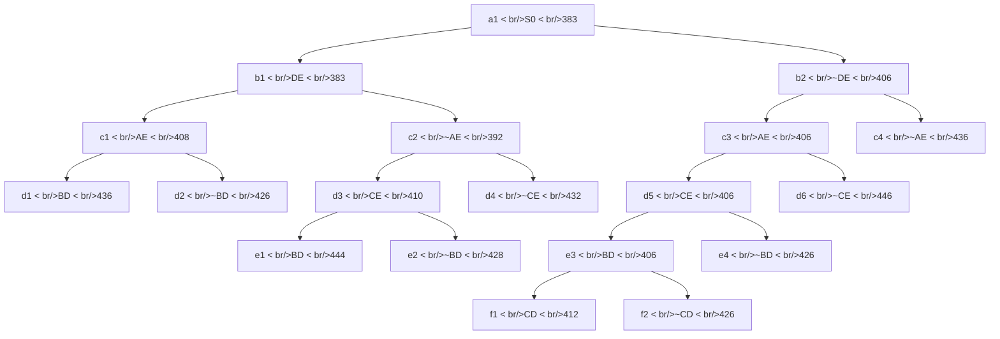

## The Question

The TSP Branch-and-Bound algorithm is solving a TSP instance where the cities are A, B, C, .... and so on. The Branch-and-Bound search tree at the time when the algorithm has discovered the optimal tour is shown below.

Each node in the search tree displays an edge (either XY or ~XY), a cost value, and a unique reference number (a1, b1, b2, ..., c1, ..., d1, ..., e1, …, f1, f2). Use the reference numbers to break ties. When required, enter the reference numbers in short answers.

| # | Question | Official answer |
|---|----------|-----------------|
| 2.1 | Let S0 (ref. no. a1) be the first node to be refined, identify the next 4 nodes refined | `b1,c2,b2,c3` |
| 2.2 | Which node represents the optimal tour and what is the cost of the optimal tour? | `f1,412` |
| 2.3 | Determine the number of cities in the TSP instance. Enter the number of cities in the text box | `5` |
| 2.4 | Start from city A, what is the path representation of the optimal tour? Enter the tour in the text box | `A,B,D,C,E` |

## The Topic in 60 Seconds

- Every tree node = a set of candidate tours sharing the include (`DE`) / exclude (`~DE`) decisions on the path from the root; its number is a **lower bound** on all tours in that set.
- **Refining** = pop the cheapest open node and insert its two children (include / exclude one more edge).
- A **childless** node in the snapshot is a finished branch: either a complete **tour** or pruned.
- Stop condition: when a *tour* is popped and every remaining open bound is ≥ its cost → that tour is optimal.

> Deep-dive: [Reading BnB Trees](/concepts/week-05-optimal-tsp/01-bnb-tree-reading), [Branch and Bound](/concepts/week-03-heuristic-search/05-branch-and-bound).

## 2.1 — Refinement order → `b1,c2,b2,c3`

Simulate one priority queue (min bound first; ties by reference number). Internal nodes get refined; leaves get selected.

| Pop # | Queue at pop time (bound : ref) | Action |
|-------|--------------------------------|--------|
| 1 | a1 : 383 | refine → add b1(383), b2(406) |
| 2 | **b1 : 383**, b2 : 406 | refine → add c1(408), c2(392) |
| 3 | **c2 : 392**, b2 : 406, c1 : 408 | refine → add d3(410), d4(432) |
| 4 | **b2 : 406**, c1 : 408, d3 : 410, d4 : 432 | refine → add c3(406), c4(436) |
| 5 | **c3 : 406**, c1 : 408, d3 : 410, d4 : 432, c4 : 436 | refine → add d5(406), d6(446) |

Next four refined after a1: **b1, c2, b2, c3** ✓. Note how `~AE` (392) jumped ahead of everything after pop 2 — excluding an edge can raise the bound less than including it.

## 2.2 — Optimal tour node and cost → `f1,412`

Continue the simulation:

| Pop # | Popped (ref : bound) | Action |
|-------|----------------------|--------|
| 6 | d5 : 406 | refine → add e3(406), e4(426) |
| 7 | e3 : 406 | refine → add f1(412), f2(426) |
| 8 | c1 : 408 | refine → add d1(436), d2(426) |
| 9 | d3 : 410 | refine → add e1(444), e2(428) |
| 10 | **f1 : 412** — childless in the snapshot = complete tour | every open node ≥ 426 > 412 → **optimal, stop** |

Order check for pops 6–9: the 406-chain keeps regenerating itself (b2 → c3 → d5 → e3 all carry bound 406, so they pop in ref-number order ahead of everything else); refining e3 finally inserts f1(412)/f2(426), after which c1(408) and d3(410) are still cheaper than f1 and get refined first — exactly why the snapshot shows children under c1 and d3 but f1 stays childless. When f1 surfaces at 412 with the whole queue ≥ 426, no cheaper tour can exist anywhere → **f1, cost 412** ✓.

## 2.3 — Number of cities → `5`

Reconstruct the tour forced by f1's decision chain (root → b2 → c3 → d5 → e3 → f1):

| Decision | Effect |
|----------|--------|
| ~DE (b2) | edge D–E forbidden |
| AE (c3) | edge A–E included |
| CE (d5) | edge C–E included |
| BD (e3) | edge B–D included |
| CD (f1) | edge C–D included |

Degrees so far: A–1, B–1, C–2 (full), D–2 (full), E–2 (full). Only A and B still need one edge each → the closing edge **AB** is forced. That yields a cycle through **5 distinct letters** \{A, B, C, D, E\} → the instance has **5 cities** ✓.

## 2.4 — Optimal tour from A → `A,B,D,C,E`

Chain the forced edges: A–B (closing edge), B–D, D–C, C–E, E–A:

$$A \to B \to D \to C \to E \to A$$

Tour **A,B,D,C,E** (return to A implied), total cost **412** ✓. Note it uses both excluded-edge logic (~DE is why the tour detours through C between D and E... rather D–C–E instead of D–E) and the included edges verbatim.

Interactive view of the run — step through the refinements and the final tour pop:

<PaperTrace
  height={560}
  nodeWidth={110}
  nodeHeight={56}
  nodeFontSize={12}
  legend={[
    { color: "#b45309", label: "popping now" },
    { color: "#0369a1", label: "waiting in OPEN" },
    { color: "#4b5563", label: "already refined" },
    { color: "#16a34a", label: "optimal tour (412)" },
    { color: "#9ca3af", label: "not yet discovered" },
  ]}
  nodes={[
    { id: "a1", label: "a1: S0 383", x: 430, y: 30, kind: "unassigned" },
    { id: "b1", label: "b1: DE 383", x: 230, y: 120, kind: "unassigned" },
    { id: "b2", label: "b2: ~DE 406", x: 650, y: 120, kind: "unassigned" },
    { id: "c1", label: "c1: AE 408", x: 100, y: 210, kind: "unassigned" },
    { id: "c2", label: "c2: ~AE 392", x: 350, y: 210, kind: "unassigned" },
    { id: "c3", label: "c3: AE 406", x: 570, y: 210, kind: "unassigned" },
    { id: "c4", label: "c4: ~AE 436", x: 770, y: 210, kind: "unassigned" },
    { id: "d1", label: "d1: BD 436", x: 30, y: 300, kind: "unassigned" },
    { id: "d2", label: "d2: ~BD 426", x: 170, y: 300, kind: "unassigned" },
    { id: "d3", label: "d3: CE 410", x: 290, y: 300, kind: "unassigned" },
    { id: "d4", label: "d4: ~CE 432", x: 420, y: 300, kind: "unassigned" },
    { id: "d5", label: "d5: CE 406", x: 520, y: 300, kind: "unassigned" },
    { id: "d6", label: "d6: ~CE 446", x: 650, y: 300, kind: "unassigned" },
    { id: "e1", label: "e1: BD 444", x: 250, y: 400, kind: "unassigned" },
    { id: "e2", label: "e2: ~BD 428", x: 360, y: 400, kind: "unassigned" },
    { id: "e3", label: "e3: BD 406", x: 480, y: 400, kind: "unassigned" },
    { id: "e4", label: "e4: ~BD 426", x: 590, y: 400, kind: "unassigned" },
    { id: "f1", label: "f1: CD 412", x: 430, y: 500, kind: "unassigned" },
    { id: "f2", label: "f2: ~CD 426", x: 550, y: 500, kind: "unassigned" },
  ]}
  edges={[
    { id: "t1", from: "a1", to: "b1" },
    { id: "t2", from: "a1", to: "b2" },
    { id: "t3", from: "b1", to: "c1" },
    { id: "t4", from: "b1", to: "c2" },
    { id: "t5", from: "b2", to: "c3" },
    { id: "t6", from: "b2", to: "c4" },
    { id: "t7", from: "c1", to: "d1" },
    { id: "t8", from: "c1", to: "d2" },
    { id: "t9", from: "c2", to: "d3" },
    { id: "t10", from: "c2", to: "d4" },
    { id: "t11", from: "c3", to: "d5" },
    { id: "t12", from: "c3", to: "d6" },
    { id: "t13", from: "d3", to: "e1" },
    { id: "t14", from: "d3", to: "e2" },
    { id: "t15", from: "d5", to: "e3" },
    { id: "t16", from: "d5", to: "e4" },
    { id: "t17", from: "e3", to: "f1" },
    { id: "t18", from: "e3", to: "f2" },
  ]}
  steps={[
    {
      label: "1 · refine a1: 383",
      note: "OPEN = [a1:383]\nInsert b1(DE):383, b2(~DE):406.\nOPEN = [b1:383, b2:406]",
      nodes: { a1: "current", b1: "frontier", b2: "frontier" },
    },
    {
      label: "2 · refine b1: 383",
      note: "Min b1:383.\nInsert c1(AE):408, c2(~AE):392.\nOPEN = [c2:392, b2:406, c1:408]",
      nodes: { a1: "explored", b1: "current", b2: "frontier", c1: "frontier", c2: "frontier" },
    },
    {
      label: "3 · refine c2: 392",
      note: "~AE (392) beats everything!\nInsert d3(CE):410, d4(~CE):432.\nOPEN = [b2:406, c1:408, d3:410, d4:432]",
      nodes: { a1: "explored", b1: "explored", b2: "frontier", c1: "frontier", c2: "current", d3: "frontier", d4: "frontier" },
    },
    {
      label: "4 · refine b2: 406",
      note: "Min b2:406 (~DE branch).\nInsert c3(AE):406, c4(~AE):436.\nOPEN = [c3:406, c1:408, d3:410, d4:432, c4:436]",
      nodes: { a1: "explored", b1: "explored", b2: "current", c1: "frontier", c2: "explored", c3: "frontier", c4: "frontier", d3: "frontier", d4: "frontier" },
    },
    {
      label: "5 · refine c3: 406",
      note: "Min c3:406 (tie with none — sole 406).\nInsert d5(CE):406, d6(~CE):446.\nOPEN = [d5:406, c1:408, d3:410, d4:432, c4:436, d6:446]",
      nodes: { a1: "explored", b1: "explored", b2: "explored", c1: "frontier", c2: "explored", c3: "current", c4: "frontier", d3: "frontier", d4: "frontier", d5: "frontier", d6: "frontier" },
    },
    {
      label: "6 · refine d5: 406",
      note: "Min d5:406.\nInsert e3(BD):406, e4(~BD):426.\nOPEN = [e3:406, c1:408, d3:410, e4:426, d4:432, c4:436, d6:446]",
      nodes: { a1: "explored", b1: "explored", b2: "explored", c1: "frontier", c2: "explored", c3: "explored", c4: "frontier", d3: "frontier", d4: "frontier", d5: "current", d6: "frontier", e3: "frontier", e4: "frontier" },
    },
    {
      label: "7 · refine e3: 406",
      note: "Min e3:406 (third generation of 406s).\nInsert f1(CD):412, f2(~CD):426.\nOPEN = [c1:408, d3:410, f1:412, e4:426, f2:426, d4:432, c4:436, d6:446]",
      nodes: { a1: "explored", b1: "explored", b2: "explored", c1: "frontier", c2: "explored", c3: "explored", c4: "frontier", d3: "frontier", d4: "frontier", d5: "explored", d6: "frontier", e3: "current", e4: "frontier", f1: "frontier", f2: "frontier" },
    },
    {
      label: "8 · refine c1: 408",
      note: "c1(408) pops before f1(412).\nInsert d1(BD):436, d2(~BD):426.\nOPEN = [d3:410, f1:412, e4:426, f2:426, d2:426, d4:432, c4:436, d1:436, d6:446]",
      nodes: { a1: "explored", b1: "explored", b2: "explored", c1: "current", c2: "explored", c3: "explored", c4: "frontier", d1: "frontier", d2: "frontier", d3: "frontier", d4: "frontier", d5: "explored", d6: "frontier", e3: "explored", e4: "frontier", f1: "frontier", f2: "frontier" },
    },
    {
      label: "9 · refine d3: 410",
      note: "d3(410) also pops before f1(412).\nInsert e1(BD):444, e2(~BD):428.\nOPEN = [f1:412, e4:426, f2:426, d2:426, e2:428, d4:432, c4:436, d1:436, d6:446, e1:444]",
      nodes: { a1: "explored", b1: "explored", b2: "explored", c1: "explored", c2: "explored", c3: "explored", c4: "frontier", d1: "frontier", d2: "frontier", d3: "current", d4: "frontier", d5: "explored", d6: "frontier", e1: "frontier", e2: "frontier", e3: "explored", e4: "frontier", f1: "frontier", f2: "frontier" },
    },
    {
      label: "10 · pop f1: 412 = TOUR",
      note: "Minimum f1:412 is childless = complete tour.\nEverything open ≥ 426 > 412 → optimal, stop.\nForced edges: AE, CE, BD, CD + closing AB.\nTour: A-B-D-C-E-A, cost 412.",
      nodes: {
        a1: "explored",
        b1: "explored",
        b2: "path",
        c1: "explored",
        c2: "explored",
        c3: "path",
        c4: "frontier",
        d1: "frontier",
        d2: "frontier",
        d3: "explored",
        d4: "frontier",
        d5: "path",
        d6: "frontier",
        e1: "frontier",
        e2: "frontier",
        e3: "path",
        e4: "frontier",
        f1: "path",
        f2: "frontier",
      },
      edges: { t2: "path", t5: "path", t11: "path", t15: "path", t17: "path" },
    },
  ]}
/>

*Amber marks each pop in order (a1, b1, c2, b2, c3, d5, e3, c1, d3, then f1); green traces the winning include-chain b2 → c3 → d5 → e3 → f1.*

## Tricks & Tips

<Accordion title="The 4 standard subquestions — fast routes to each">
1. **Refine order:** keep a sorted list of (bound, ref#). Pop → if the snapshot shows children under it, it counts as refined. Here the 406-bound chain (b2 → c3 → d5 → e3) keeps regenerating 406s — follow the chain, not the row order.
2. **Optimal tour:** cheapest *childless* node that gets popped. Cross-check its bound ≤ every remaining open bound (f1 : 412 vs next-best 426 ✓). Don't be fooled by smaller numbers higher up (d5 : 406) — those were refined, not tours.
3. **Number of cities:** tally degrees from the winner's include/exclude chain. Two half-degree vertices force the closing edge; count distinct letters (here A, B, C, D, E = 5).
4. **Tour path:** walk the included edges, insert the forced closing edge, rotate to the requested start city.
</Accordion>

<Accordion title="Common pitfalls">
- Thinking f1 (412) should pop before c1 (408) and d3 (410). Bounds beat position in the tree — c1 and d3 must be refined first, which is precisely why the snapshot shows children under them but not under f1.
- Forgetting that "~" nodes are also candidates: c2 (~AE, 392) was refined 3rd even though its sibling c1 (AE, 408) looks more natural.
- Reading the leaf bound as anything other than the tour cost: for a complete tour the lower bound equals the tour length, so f1's 412 IS the answer to "cost of the optimal tour".
</Accordion>

**Answers:** 2.1 `b1,c2,b2,c3` · 2.2 `f1,412` · 2.3 `5` · 2.4 `A,B,D,C,E`
