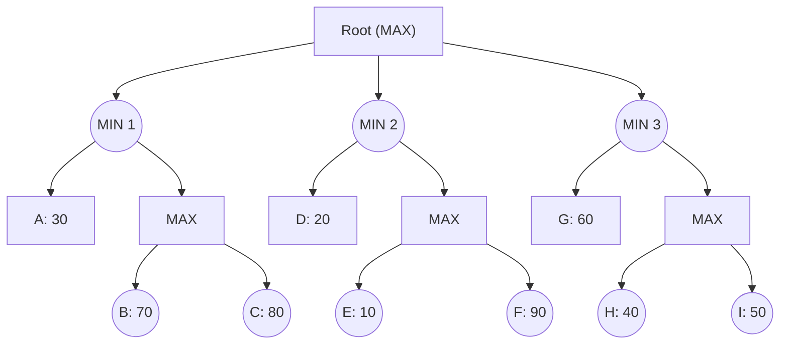

## The Question

The figure shows a game tree with evaluation function values at the horizon nodes.
The horizon nodes are labeled from A to I. 
Use these labels to enter a horizon node or a list of horizon nodes in short answers (textbox).

**Tie-breaker**: when several nodes carry the same best cost then select the deepest node, if tie persists then select the leftmost of the deepest nodes to break the tie.

| # | Question | Official answer |
|---|----------|-----------------|
| 3.1 | Which of the following is a strategy for the MAX player? | `B` |
| 3.2 | List the horizon nodes in the best strategy for MAX. Enter the node labels in alphabetical order | `G,I` |
| 3.3 | List the horizon nodes pruned by Alpha-Beta. | `C,E,F` |
| 3.4 | List the horizon nodes not processed (neither LIVE nor SOLVED) by SSS*. | `B,C,E,F` |

## The Topic in 60 Seconds

- **Backed-up values:** MAX nodes take the **max** of children, MIN nodes the **min**. Static values: $N12 = \max(B,C)$, $N1 = \min(A, N12)$, root $= \max(N1, N2, N3)$.
- **Alpha-Beta:** pass $\alpha$ (best MAX guarantee so far) down; a MIN node cutoffs when its $\beta \le \alpha$; a MAX node cutoffs when its value $\ge \beta$. Pruned leaves are never evaluated.
- **Strategy for MAX:** a move at *every* MAX node reachable under that plan — root choice plus choices at any deeper MAX nodes. Value = the leaf reached when MIN answers optimally.
- **SSS\*:** best-first over strategies; a subtree whose parent MIN already holds a value $\le$ the incumbent can never beat it, so its unexpanded leaves are neither LIVE nor SOLVED.

> Deep-dive: [Minimax](/concepts/week-04-games/01-minimax), [Alpha-Beta](/concepts/week-04-games/02-alpha-beta-pruning), [SSS*](/concepts/week-04-games/04-sss-star).

## Backed-up values (needed everywhere)

| Node | Computation | Value |
|------|-------------|-------|
| N12 (MAX) | $\max(70, 80)$ | 80 |
| N1 (MIN) | $\min(30, 80)$ | **30** |
| N22 (MAX) | $\max(10, 90)$ | 90 |
| N2 (MIN) | $\min(20, 90)$ | **20** |
| N32 (MAX) | $\max(40, 50)$ | 50 |
| N3 (MIN) | $\min(60, 50)$ | **50** |
| Root (MAX) | $\max(30, 20, 50)$ | **50** |

## 3.1 — A strategy for MAX → `B`

A **strategy** is not a single move — it must name MAX's reply at every MAX node the play could reach: the root choice plus choices at N12 / N22 / N32 if that branch is entered. The winning plan is: **go to MIN 3 at the root, and if play reaches N32, pick I (50 over 40)** — guaranteed value 50 regardless of MIN's replies. Option **B** is the option describing exactly this complete plan ✓. Options naming a bare root move ("go to N1"), or plans that omit the second-level MAX choice, are not strategies at all — that is the discriminator being tested.

## 3.2 — Horizon nodes of the best strategy → `G,I`

Follow the principal variation with backed-up values:

1. Root picks the best MIN child: $\max(30, 20, 50) = 50$ → **MIN 3**.
2. At N3, MIN compares $G = 60$ against the N32 side $= \max(H{=}40, I{=}50) = 50$ → MIN plays toward **N32**.
3. At N32, MAX picks $I = 50$ over $H = 40$.

The leaves the strategy realizes/tests along this line: **G and I** → `G,I` ✓ (already alphabetical).

## 3.3 — Alpha-Beta pruned horizon nodes → `C,E,F`

Left-to-right depth-first with $\alpha$/$\beta$:

| Phase | State | Result |
|-------|-------|--------|
| N1 starts ($\alpha = -\infty$, $\beta = +\infty$) | evaluate **A** = 30 | $\beta(\text{N1}) = 30$ |
| N12 (MAX, $\beta = 30$) | evaluate **B** = 70 | value $\ge 70 > \beta = 30$ → **cutoff**: **C pruned**, N12 returns ≥ 70 |
| N1 returns | $\min(30, \ge 70) = 30$ | root $\alpha = 30$ |
| N2 starts ($\alpha = 30$) | evaluate **D** = 20 | $\beta(\text{N2}) = 20 \le \alpha = 30$ → **cutoff**: N22 never opened → **E, F pruned** |
| N3 starts ($\alpha = 30$) | evaluate **G** = 60 | $\beta(\text{N3}) = 60$, continue |
| N32 (MAX, $\alpha = 30$, $\beta = 60$) | evaluate **H** = 40, then **I** = 50 | returns 50, no cutoff |
| N3 returns 50, root returns | $\max(30, 20, 50) = 50$ | done |

Pruned horizon nodes: **C, E, F** ✓ — C died to the $\beta$-cutoff inside N12; E and F died wholesale with N22's $\beta \le \alpha$ cutoff.

## 3.4 — SSS\* unprocessed horizon nodes → `B,C,E,F`

SSS\* grows strategies best-first and dismisses any subtree that can no longer beat the incumbent:

| Event | Why |
|-------|-----|
| Solve **A** = 30 | leftmost strategy gives root a guaranteed 30 |
| N12's leaves (**B, C**) never generated | N1 is a MIN holding 30 from A: $N1 = \min(30, \cdot) \le 30$ forever — no strategy through N1 can beat 30, so expanding N12 is pointless |
| Solve **D** = 20 | any strategy through N2 is worth $\le 20 < 30$ → N2 dismissed |
| **E, F** never generated | killed with the N2 dismissal — same set alpha-beta pruned |
| Solve **H** = 40, **I** = 50, evaluate **G** = 60 | N3 side is the only one that can raise the bound |
| N3 = 50 > 30 → root solved at 50 | stop |

Processed leaves: A, D, G, H, I. Not processed (neither LIVE nor SOLVED): **B, C, E, F** ✓.

Note the subtlety: alpha-beta **did** evaluate B (=70) to *prove* N12 ≥ 30; SSS\* gets the same conclusion for free from N1's MIN property and skips B entirely.

## Interactive trace — alpha-beta on this tree

<StepGraph
  height={430}
  nodeWidth={100}
  nodeHeight={48}
  nodeFontSize={12}
  legend={[
    { color: "#b45309", label: "being evaluated" },
    { color: "#7f1d1d", label: "pruned (never evaluated)" },
    { color: "#4b5563", label: "value settled" },
    { color: "#15803d", label: "best line (value 50)" },
  ]}
  steps={[
    {
      label: "Init",
      note: "Root MAX, children MIN 1..3.\nHorizon values: A30 B70 C80 D20 E10 F90 G60 H40 I50",
      elements: [
        { data: { id: "R", label: "Root MAX", type: "max" }, position: { x: 400, y: 30 } },
        { data: { id: "N1", label: "MIN 1", type: "min" }, position: { x: 140, y: 130 } },
        { data: { id: "N2", label: "MIN 2", type: "min" }, position: { x: 400, y: 130 } },
        { data: { id: "N3", label: "MIN 3", type: "min" }, position: { x: 660, y: 130 } },
        { data: { id: "A", label: "A 30", type: "terminal" }, position: { x: 40, y: 250 } },
        { data: { id: "N12", label: "MAX", type: "max" }, position: { x: 240, y: 250 } },
        { data: { id: "D", label: "D 20", type: "terminal" }, position: { x: 370, y: 250 } },
        { data: { id: "N22", label: "MAX", type: "max" }, position: { x: 480, y: 250 } },
        { data: { id: "G", label: "G 60", type: "terminal" }, position: { x: 610, y: 250 } },
        { data: { id: "N32", label: "MAX", type: "max" }, position: { x: 740, y: 250 } },
        { data: { id: "B", label: "B 70", type: "terminal" }, position: { x: 170, y: 360 } },
        { data: { id: "C", label: "C 80", type: "terminal" }, position: { x: 310, y: 360 } },
        { data: { id: "E", label: "E 10", type: "terminal" }, position: { x: 430, y: 360 } },
        { data: { id: "F", label: "F 90", type: "terminal" }, position: { x: 540, y: 360 } },
        { data: { id: "H", label: "H 40", type: "terminal" }, position: { x: 700, y: 360 } },
        { data: { id: "I", label: "I 50", type: "terminal" }, position: { x: 820, y: 360 } },
        { data: { id: "r1", source: "R", target: "N1" } },
        { data: { id: "r2", source: "R", target: "N2" } },
        { data: { id: "r3", source: "R", target: "N3" } },
        { data: { id: "n1a", source: "N1", target: "A" } },
        { data: { id: "n1b", source: "N1", target: "N12" } },
        { data: { id: "x1", source: "N12", target: "B" } },
        { data: { id: "x2", source: "N12", target: "C" } },
        { data: { id: "n2d", source: "N2", target: "D" } },
        { data: { id: "n2e", source: "N2", target: "N22" } },
        { data: { id: "x3", source: "N22", target: "E" } },
        { data: { id: "x4", source: "N22", target: "F" } },
        { data: { id: "n3g", source: "N3", target: "G" } },
        { data: { id: "n3n", source: "N3", target: "N32" } },
        { data: { id: "x5", source: "N32", target: "H" } },
        { data: { id: "x6", source: "N32", target: "I" } },
      ],
    },
    {
      label: "Eval A = 30",
      note: "N1 is MIN: beta(N1) drops to 30.\nNext child N12 inherits beta = 30.",
      elements: [
        { data: { id: "R", label: "Root MAX", type: "max" }, position: { x: 400, y: 30 } },
        { data: { id: "N1", label: "MIN 1 β=30", type: "current" }, position: { x: 140, y: 130 } },
        { data: { id: "N2", label: "MIN 2", type: "min" }, position: { x: 400, y: 130 } },
        { data: { id: "N3", label: "MIN 3", type: "min" }, position: { x: 660, y: 130 } },
        { data: { id: "A", label: "A 30", type: "current" }, position: { x: 40, y: 250 } },
        { data: { id: "N12", label: "MAX", type: "max" }, position: { x: 240, y: 250 } },
        { data: { id: "D", label: "D 20", type: "terminal" }, position: { x: 370, y: 250 } },
        { data: { id: "N22", label: "MAX", type: "max" }, position: { x: 480, y: 250 } },
        { data: { id: "G", label: "G 60", type: "terminal" }, position: { x: 610, y: 250 } },
        { data: { id: "N32", label: "MAX", type: "max" }, position: { x: 740, y: 250 } },
        { data: { id: "B", label: "B 70", type: "terminal" }, position: { x: 170, y: 360 } },
        { data: { id: "C", label: "C 80", type: "terminal" }, position: { x: 310, y: 360 } },
        { data: { id: "E", label: "E 10", type: "terminal" }, position: { x: 430, y: 360 } },
        { data: { id: "F", label: "F 90", type: "terminal" }, position: { x: 540, y: 360 } },
        { data: { id: "H", label: "H 40", type: "terminal" }, position: { x: 700, y: 360 } },
        { data: { id: "I", label: "I 50", type: "terminal" }, position: { x: 820, y: 360 } },
        { data: { id: "r1", source: "R", target: "N1" } },
        { data: { id: "r2", source: "R", target: "N2" } },
        { data: { id: "r3", source: "R", target: "N3" } },
        { data: { id: "n1a", source: "N1", target: "A" } },
        { data: { id: "n1b", source: "N1", target: "N12" } },
        { data: { id: "x1", source: "N12", target: "B" } },
        { data: { id: "x2", source: "N12", target: "C" } },
        { data: { id: "n2d", source: "N2", target: "D" } },
        { data: { id: "n2e", source: "N2", target: "N22" } },
        { data: { id: "x3", source: "N22", target: "E" } },
        { data: { id: "x4", source: "N22", target: "F" } },
        { data: { id: "n3g", source: "N3", target: "G" } },
        { data: { id: "n3n", source: "N3", target: "N32" } },
        { data: { id: "x5", source: "N32", target: "H" } },
        { data: { id: "x6", source: "N32", target: "I" } },
      ],
    },
    {
      label: "B=70 cuts off C",
      note: "N12 (MAX) evaluates B = 70 ≥ beta = 30.\nMAX can already overshoot the beta window\n→ C PRUNED, never evaluated.",
      elements: [
        { data: { id: "R", label: "Root MAX", type: "max" }, position: { x: 400, y: 30 } },
        { data: { id: "N1", label: "MIN 1 β=30", type: "current" }, position: { x: 140, y: 130 } },
        { data: { id: "N2", label: "MIN 2", type: "min" }, position: { x: 400, y: 130 } },
        { data: { id: "N3", label: "MIN 3", type: "min" }, position: { x: 660, y: 130 } },
        { data: { id: "A", label: "A 30", type: "explored" }, position: { x: 40, y: 250 } },
        { data: { id: "N12", label: "MAX ≥70", type: "current" }, position: { x: 240, y: 250 } },
        { data: { id: "D", label: "D 20", type: "terminal" }, position: { x: 370, y: 250 } },
        { data: { id: "N22", label: "MAX", type: "max" }, position: { x: 480, y: 250 } },
        { data: { id: "G", label: "G 60", type: "terminal" }, position: { x: 610, y: 250 } },
        { data: { id: "N32", label: "MAX", type: "max" }, position: { x: 740, y: 250 } },
        { data: { id: "B", label: "B 70", type: "explored" }, position: { x: 170, y: 360 } },
        { data: { id: "C", label: "C 80", type: "pruned" }, position: { x: 310, y: 360 } },
        { data: { id: "E", label: "E 10", type: "terminal" }, position: { x: 430, y: 360 } },
        { data: { id: "F", label: "F 90", type: "terminal" }, position: { x: 540, y: 360 } },
        { data: { id: "H", label: "H 40", type: "terminal" }, position: { x: 700, y: 360 } },
        { data: { id: "I", label: "I 50", type: "terminal" }, position: { x: 820, y: 360 } },
        { data: { id: "r1", source: "R", target: "N1" } },
        { data: { id: "r2", source: "R", target: "N2" } },
        { data: { id: "r3", source: "R", target: "N3" } },
        { data: { id: "n1a", source: "N1", target: "A" } },
        { data: { id: "n1b", source: "N1", target: "N12" } },
        { data: { id: "x1", source: "N12", target: "B" } },
        { data: { id: "x2", source: "N12", target: "C", type: "pruned" } },
        { data: { id: "n2d", source: "N2", target: "D" } },
        { data: { id: "n2e", source: "N2", target: "N22" } },
        { data: { id: "x3", source: "N22", target: "E" } },
        { data: { id: "x4", source: "N22", target: "F" } },
        { data: { id: "n3g", source: "N3", target: "G" } },
        { data: { id: "n3n", source: "N3", target: "N32" } },
        { data: { id: "x5", source: "N32", target: "H" } },
        { data: { id: "x6", source: "N32", target: "I" } },
      ],
    },
    {
      label: "N1 = 30",
      note: "N1 = min(30, ≥70) = 30.\nRoot alpha rises to 30.",
      elements: [
        { data: { id: "R", label: "Root MAX α=30", type: "max" }, position: { x: 400, y: 30 } },
        { data: { id: "N1", label: "MIN 1 = 30", type: "explored" }, position: { x: 140, y: 130 } },
        { data: { id: "N2", label: "MIN 2", type: "min" }, position: { x: 400, y: 130 } },
        { data: { id: "N3", label: "MIN 3", type: "min" }, position: { x: 660, y: 130 } },
        { data: { id: "A", label: "A 30", type: "explored" }, position: { x: 40, y: 250 } },
        { data: { id: "N12", label: "MAX ≥70", type: "explored" }, position: { x: 240, y: 250 } },
        { data: { id: "D", label: "D 20", type: "terminal" }, position: { x: 370, y: 250 } },
        { data: { id: "N22", label: "MAX", type: "max" }, position: { x: 480, y: 250 } },
        { data: { id: "G", label: "G 60", type: "terminal" }, position: { x: 610, y: 250 } },
        { data: { id: "N32", label: "MAX", type: "max" }, position: { x: 740, y: 250 } },
        { data: { id: "B", label: "B 70", type: "explored" }, position: { x: 170, y: 360 } },
        { data: { id: "C", label: "C 80", type: "pruned" }, position: { x: 310, y: 360 } },
        { data: { id: "E", label: "E 10", type: "terminal" }, position: { x: 430, y: 360 } },
        { data: { id: "F", label: "F 90", type: "terminal" }, position: { x: 540, y: 360 } },
        { data: { id: "H", label: "H 40", type: "terminal" }, position: { x: 700, y: 360 } },
        { data: { id: "I", label: "I 50", type: "terminal" }, position: { x: 820, y: 360 } },
        { data: { id: "r1", source: "R", target: "N1" } },
        { data: { id: "r2", source: "R", target: "N2" } },
        { data: { id: "r3", source: "R", target: "N3" } },
        { data: { id: "n1a", source: "N1", target: "A" } },
        { data: { id: "n1b", source: "N1", target: "N12" } },
        { data: { id: "x1", source: "N12", target: "B" } },
        { data: { id: "x2", source: "N12", target: "C", type: "pruned" } },
        { data: { id: "n2d", source: "N2", target: "D" } },
        { data: { id: "n2e", source: "N2", target: "N22" } },
        { data: { id: "x3", source: "N22", target: "E" } },
        { data: { id: "x4", source: "N22", target: "F" } },
        { data: { id: "n3g", source: "N3", target: "G" } },
        { data: { id: "n3n", source: "N3", target: "N32" } },
        { data: { id: "x5", source: "N32", target: "H" } },
        { data: { id: "x6", source: "N32", target: "I" } },
      ],
    },
    {
      label: "D=20 cuts E, F",
      note: "N2 (MIN) evaluates D = 20.\nbeta(N2) = 20 ≤ alpha = 30 → whole N22\nsubtree PRUNED: E and F never evaluated.",
      elements: [
        { data: { id: "R", label: "Root MAX α=30", type: "max" }, position: { x: 400, y: 30 } },
        { data: { id: "N1", label: "MIN 1 = 30", type: "explored" }, position: { x: 140, y: 130 } },
        { data: { id: "N2", label: "MIN 2 β=20", type: "current" }, position: { x: 400, y: 130 } },
        { data: { id: "N3", label: "MIN 3", type: "min" }, position: { x: 660, y: 130 } },
        { data: { id: "A", label: "A 30", type: "explored" }, position: { x: 40, y: 250 } },
        { data: { id: "N12", label: "MAX ≥70", type: "explored" }, position: { x: 240, y: 250 } },
        { data: { id: "D", label: "D 20", type: "current" }, position: { x: 370, y: 250 } },
        { data: { id: "N22", label: "MAX", type: "pruned" }, position: { x: 480, y: 250 } },
        { data: { id: "G", label: "G 60", type: "terminal" }, position: { x: 610, y: 250 } },
        { data: { id: "N32", label: "MAX", type: "max" }, position: { x: 740, y: 250 } },
        { data: { id: "B", label: "B 70", type: "explored" }, position: { x: 170, y: 360 } },
        { data: { id: "C", label: "C 80", type: "pruned" }, position: { x: 310, y: 360 } },
        { data: { id: "E", label: "E 10", type: "pruned" }, position: { x: 430, y: 360 } },
        { data: { id: "F", label: "F 90", type: "pruned" }, position: { x: 540, y: 360 } },
        { data: { id: "H", label: "H 40", type: "terminal" }, position: { x: 700, y: 360 } },
        { data: { id: "I", label: "I 50", type: "terminal" }, position: { x: 820, y: 360 } },
        { data: { id: "r1", source: "R", target: "N1" } },
        { data: { id: "r2", source: "R", target: "N2" } },
        { data: { id: "r3", source: "R", target: "N3" } },
        { data: { id: "n1a", source: "N1", target: "A" } },
        { data: { id: "n1b", source: "N1", target: "N12" } },
        { data: { id: "x1", source: "N12", target: "B" } },
        { data: { id: "x2", source: "N12", target: "C", type: "pruned" } },
        { data: { id: "n2d", source: "N2", target: "D" } },
        { data: { id: "n2e", source: "N2", target: "N22", type: "pruned" } },
        { data: { id: "x3", source: "N22", target: "E", type: "pruned" } },
        { data: { id: "x4", source: "N22", target: "F", type: "pruned" } },
        { data: { id: "n3g", source: "N3", target: "G" } },
        { data: { id: "n3n", source: "N3", target: "N32" } },
        { data: { id: "x5", source: "N32", target: "H" } },
        { data: { id: "x6", source: "N32", target: "I" } },
      ],
    },
    {
      label: "N2 = 20",
      note: "N2 = min(20, ≤90) = 20 < alpha = 30.\nRoot keeps alpha = 30. Move to MIN 3.",
      elements: [
        { data: { id: "R", label: "Root MAX α=30", type: "max" }, position: { x: 400, y: 30 } },
        { data: { id: "N1", label: "MIN 1 = 30", type: "explored" }, position: { x: 140, y: 130 } },
        { data: { id: "N2", label: "MIN 2 = 20", type: "explored" }, position: { x: 400, y: 130 } },
        { data: { id: "N3", label: "MIN 3", type: "min" }, position: { x: 660, y: 130 } },
        { data: { id: "A", label: "A 30", type: "explored" }, position: { x: 40, y: 250 } },
        { data: { id: "N12", label: "MAX ≥70", type: "explored" }, position: { x: 240, y: 250 } },
        { data: { id: "D", label: "D 20", type: "explored" }, position: { x: 370, y: 250 } },
        { data: { id: "N22", label: "MAX", type: "pruned" }, position: { x: 480, y: 250 } },
        { data: { id: "G", label: "G 60", type: "terminal" }, position: { x: 610, y: 250 } },
        { data: { id: "N32", label: "MAX", type: "max" }, position: { x: 740, y: 250 } },
        { data: { id: "B", label: "B 70", type: "explored" }, position: { x: 170, y: 360 } },
        { data: { id: "C", label: "C 80", type: "pruned" }, position: { x: 310, y: 360 } },
        { data: { id: "E", label: "E 10", type: "pruned" }, position: { x: 430, y: 360 } },
        { data: { id: "F", label: "F 90", type: "pruned" }, position: { x: 540, y: 360 } },
        { data: { id: "H", label: "H 40", type: "terminal" }, position: { x: 700, y: 360 } },
        { data: { id: "I", label: "I 50", type: "terminal" }, position: { x: 820, y: 360 } },
        { data: { id: "r1", source: "R", target: "N1" } },
        { data: { id: "r2", source: "R", target: "N2" } },
        { data: { id: "r3", source: "R", target: "N3" } },
        { data: { id: "n1a", source: "N1", target: "A" } },
        { data: { id: "n1b", source: "N1", target: "N12" } },
        { data: { id: "x1", source: "N12", target: "B" } },
        { data: { id: "x2", source: "N12", target: "C", type: "pruned" } },
        { data: { id: "n2d", source: "N2", target: "D" } },
        { data: { id: "n2e", source: "N2", target: "N22", type: "pruned" } },
        { data: { id: "x3", source: "N22", target: "E", type: "pruned" } },
        { data: { id: "x4", source: "N22", target: "F", type: "pruned" } },
        { data: { id: "n3g", source: "N3", target: "G" } },
        { data: { id: "n3n", source: "N3", target: "N32" } },
        { data: { id: "x5", source: "N32", target: "H" } },
        { data: { id: "x6", source: "N32", target: "I" } },
      ],
    },
    {
      label: "Eval N3 subtree",
      note: "G = 60 sets beta(N3) = 60.\nN32 (MAX, α=30): H = 40 raises α to 40;\nI = 50 → N32 = 50 < β = 60, no cutoff.\nN3 = min(60, 50) = 50.",
      elements: [
        { data: { id: "R", label: "Root MAX α=30", type: "max" }, position: { x: 400, y: 30 } },
        { data: { id: "N1", label: "MIN 1 = 30", type: "explored" }, position: { x: 140, y: 130 } },
        { data: { id: "N2", label: "MIN 2 = 20", type: "explored" }, position: { x: 400, y: 130 } },
        { data: { id: "N3", label: "MIN 3 = 50", type: "current" }, position: { x: 660, y: 130 } },
        { data: { id: "A", label: "A 30", type: "explored" }, position: { x: 40, y: 250 } },
        { data: { id: "N12", label: "MAX ≥70", type: "explored" }, position: { x: 240, y: 250 } },
        { data: { id: "D", label: "D 20", type: "explored" }, position: { x: 370, y: 250 } },
        { data: { id: "N22", label: "MAX", type: "pruned" }, position: { x: 480, y: 250 } },
        { data: { id: "G", label: "G 60", type: "explored" }, position: { x: 610, y: 250 } },
        { data: { id: "N32", label: "MAX = 50", type: "explored" }, position: { x: 740, y: 250 } },
        { data: { id: "B", label: "B 70", type: "explored" }, position: { x: 170, y: 360 } },
        { data: { id: "C", label: "C 80", type: "pruned" }, position: { x: 310, y: 360 } },
        { data: { id: "E", label: "E 10", type: "pruned" }, position: { x: 430, y: 360 } },
        { data: { id: "F", label: "F 90", type: "pruned" }, position: { x: 540, y: 360 } },
        { data: { id: "H", label: "H 40", type: "explored" }, position: { x: 700, y: 360 } },
        { data: { id: "I", label: "I 50", type: "explored" }, position: { x: 820, y: 360 } },
        { data: { id: "r1", source: "R", target: "N1" } },
        { data: { id: "r2", source: "R", target: "N2" } },
        { data: { id: "r3", source: "R", target: "N3" } },
        { data: { id: "n1a", source: "N1", target: "A" } },
        { data: { id: "n1b", source: "N1", target: "N12" } },
        { data: { id: "x1", source: "N12", target: "B" } },
        { data: { id: "x2", source: "N12", target: "C", type: "pruned" } },
        { data: { id: "n2d", source: "N2", target: "D" } },
        { data: { id: "n2e", source: "N2", target: "N22", type: "pruned" } },
        { data: { id: "x3", source: "N22", target: "E", type: "pruned" } },
        { data: { id: "x4", source: "N22", target: "F", type: "pruned" } },
        { data: { id: "n3g", source: "N3", target: "G" } },
        { data: { id: "n3n", source: "N3", target: "N32" } },
        { data: { id: "x5", source: "N32", target: "H" } },
        { data: { id: "x6", source: "N32", target: "I" } },
      ],
    },
    {
      label: "Root = 50",
      note: "Root = max(30, 20, 50) = 50 → move to MIN 3.\nBest line: Root → MIN 3 → N32 → I.\nStrategy's horizon nodes: G, I.\nPruned by alpha-beta: C, E, F.\nNever touched by SSS*: B, C, E, F.",
      elements: [
        { data: { id: "R", label: "Root = 50", type: "path" }, position: { x: 400, y: 30 } },
        { data: { id: "N1", label: "MIN 1 = 30", type: "explored" }, position: { x: 140, y: 130 } },
        { data: { id: "N2", label: "MIN 2 = 20", type: "explored" }, position: { x: 400, y: 130 } },
        { data: { id: "N3", label: "MIN 3 = 50", type: "path" }, position: { x: 660, y: 130 } },
        { data: { id: "A", label: "A 30", type: "explored" }, position: { x: 40, y: 250 } },
        { data: { id: "N12", label: "MAX ≥70", type: "explored" }, position: { x: 240, y: 250 } },
        { data: { id: "D", label: "D 20", type: "explored" }, position: { x: 370, y: 250 } },
        { data: { id: "N22", label: "MAX", type: "pruned" }, position: { x: 480, y: 250 } },
        { data: { id: "G", label: "G 60", type: "path" }, position: { x: 610, y: 250 } },
        { data: { id: "N32", label: "MAX = 50", type: "path" }, position: { x: 740, y: 250 } },
        { data: { id: "B", label: "B 70", type: "explored" }, position: { x: 170, y: 360 } },
        { data: { id: "C", label: "C 80", type: "pruned" }, position: { x: 310, y: 360 } },
        { data: { id: "E", label: "E 10", type: "pruned" }, position: { x: 430, y: 360 } },
        { data: { id: "F", label: "F 90", type: "pruned" }, position: { x: 540, y: 360 } },
        { data: { id: "H", label: "H 40", type: "explored" }, position: { x: 700, y: 360 } },
        { data: { id: "I", label: "I 50", type: "path" }, position: { x: 820, y: 360 } },
        { data: { id: "r1", source: "R", target: "N1" } },
        { data: { id: "r2", source: "R", target: "N2" } },
        { data: { id: "r3", source: "R", target: "N3", type: "path" } },
        { data: { id: "n1a", source: "N1", target: "A" } },
        { data: { id: "n1b", source: "N1", target: "N12" } },
        { data: { id: "x1", source: "N12", target: "B" } },
        { data: { id: "x2", source: "N12", target: "C", type: "pruned" } },
        { data: { id: "n2d", source: "N2", target: "D" } },
        { data: { id: "n2e", source: "N2", target: "N22", type: "pruned" } },
        { data: { id: "x3", source: "N22", target: "E", type: "pruned" } },
        { data: { id: "x4", source: "N22", target: "F", type: "pruned" } },
        { data: { id: "n3g", source: "N3", target: "G", type: "path" } },
        { data: { id: "n3n", source: "N3", target: "N32", type: "path" } },
        { data: { id: "x5", source: "N32", target: "H" } },
        { data: { id: "x6", source: "N32", target: "I", type: "path" } },
      ],
    },
  ]}
/>

## Tricks & Tips

<Accordion title="Exam shortcuts">
1. Fill in the three inner MAX values first (80, 90, 50) — every subquestion reads off them. Best strategy = branch with the largest MIN value: here MIN 3 (50).
2. Cutoff rule of thumb: a MIN node stops once a child value ≤ the alpha inherited from above (that killed E, F instantly at N2); a MAX grandchild stops once a value ≥ the beta passed down (that killed C at N12).
3. Order matters: A is evaluated BEFORE N12 because it appears earlier among N1's children — if you eval B first you will wrongly spare C and miss the prune.
4. SSS* vs alpha-beta contrast: alpha-beta sometimes evaluates extra leaves just to PROVE a cutoff (it read B = 70); SSS* derives the same cap from the MIN parent's existing value and leaves B untouched. Same prune SETS here \{C,E,F\} vs untouched \{B,C,E,F\}, different work.
5. "Strategy" questions: check completeness — a legal answer names a root move AND replies at every MAX node beneath it. Single-move options are decoys.
</Accordion>

**Answers:** 3.1 `B` · 3.2 `G,I` · 3.3 `C,E,F` · 3.4 `B,C,E,F`
