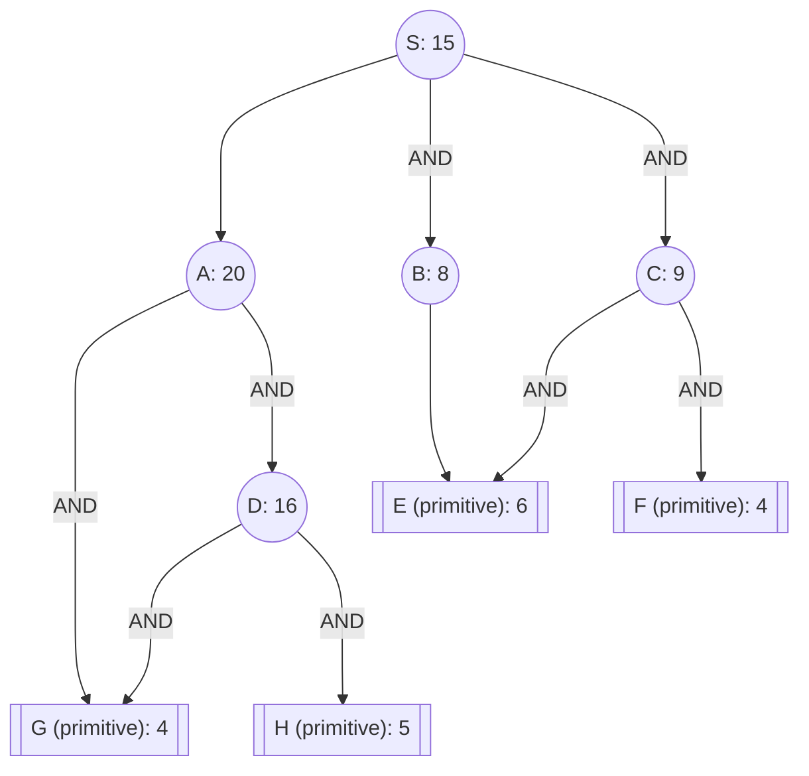

## The Question

The figure shows an AND-OR graph that depicts how a problem S can be decomposed into one or more smaller problems. Nodes are uniquely identified by labels (S, A, B, …). The number in each node is the heuristic estimate of the cost of solving that node.

Nodes shown in double lines are primitive nodes and their values are actual costs. Observe that a primitive node is added to the graph by its parent when the parent is expanded, and the primitive node is labeled as SOLVED and it will not be expanded subsequently.

The cost of each edge is 1 unit.

**Tie-breaker 1**: If several nodes have the sa

| # | Question | Official answer |
|---|----------|-----------------|
| 4.1 | List the first three nodes (including S) expanded by AO* algorithm. List the nod | `S,C,A` |
| 4.2 | Determine the value of the start node S after each node is expanded. What are th | `19,21,22` |
| 4.3 | What is the final value of the start node S? | `20` |

## The Topic in 60 Seconds

> Deep-dive: browse the [Concepts](/concepts) section for the relevant topic page.

## Solutions

**4.1** — List the first three nodes (including S) expanded by AO* algorithm. List the nod  
**Answer:** `S,C,A`

**4.2** — Determine the value of the start node S after each node is expanded. What are th  
**Answer:** `19,21,22`

**4.3** — What is the final value of the start node S?  
**Answer:** `20`

## Tricks & Tips

<Accordion title="Exam method">
1. Read the question carefully — identify the algorithm or technique.
2. Trace step by step, showing your working.
3. Verify your answer against the question constraints.
</Accordion>
