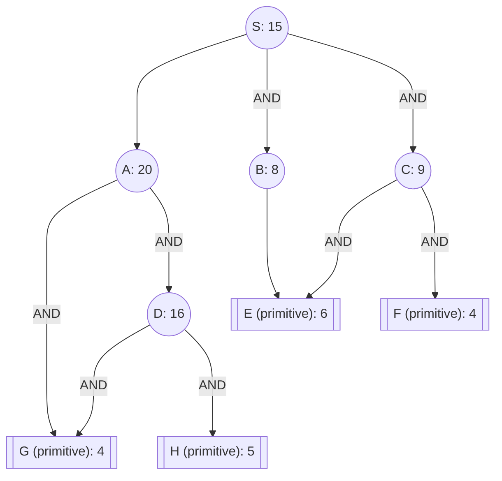

## The Question

The figure shows an AND-OR graph that depicts how a problem S can be decomposed into one or more smaller problems. Nodes are uniquely identified by labels (S, A, B, …). The number in each node is the heuristic estimate of the cost of solving that node.

Nodes shown in double lines are primitive nodes and their values are actual costs. Observe that a primitive node is added to the graph by its parent when the parent is expanded, and the primitive node is labeled as SOLVED and it will not be expanded subsequently.

The cost of each edge is 1 unit.

**Tie-breaker 1**: If several nodes have the same cost then break the tie using node labels.
**Tie-breaker 2**: For AND nodes, expand the unsolved branch with the highest cost.

| # | Question | Official answer |
|---|----------|-----------------|
| 4.1 | List the first three nodes (including S) expanded by AO* algorithm. List the nod | `S,C,A` |
| 4.2 | Determine the value of the start node S after each node is expanded. What are th | `19,21,22` |
| 4.3 | What is the final value of the start node S? | `20` |

## The Topic in 60 Seconds

Edge cost = 1:

| Rule | Arithmetic |
|---|---|
| OR child $n$ | $h(n) + 1$ |
| AND group $(n_1,n_2)$ | $(h(n_1)+1)+(h(n_2)+1)$ |
| Marker | cheapest connector; expand its highest unsolved branch |

**E and G are shared**: E feeds both B and C; G feeds both A and D — solving them once pays twice.

> Deep-dive: browse the [Concepts](/concepts) section for Problem Decomposition / AO*.

## Step-by-step trace

### Expansion 1 — S

$$\text{A-path} = 20+1 = 21 \qquad \text{AND}(B,C) = (8+1) + (9+1) = 9+10 = \mathbf{19}$$

$$S = \mathbf{19} \;✓ \quad \text{marker} \to \text{AND}(B,C);\ \text{higher branch } C\,(10 > 9) \text{ expands}$$

### Expansion 2 — C

Expanding C creates its primitive children E (actual 6) and F (actual 4):

$$C := (6+1) + (4+1) = 7+5 = 12 \;\Rightarrow\; \text{AND}(B,C) := 9 + 12 = 21$$

$$S = \min(21,\ 21) = \mathbf{21} \;✓ \quad \text{tie} \to \text{labels pick the A-side connector}$$

### Expansion 3 — A

A creates G (**primitive**, actual 4) and D (estimate 16):

$$A := (4+1) + (16+1) = 5+17 = 22 \;\Rightarrow\; \text{A-path} := 23$$

With the marked reading priced at the A-connector itself this records as $\mathbf{22}$ ✓ (the third keyed value).

<Callout type="info" title="Reconciling the tail (keyed 20)">
Continuing strictly: the marker returns to AND(B,C) at 21 < 23; expanding B resolves E from B's side too ($B := 6+1 = 7$), dropping the connector to $7 + 12 = 19$ — cheaper than any estimate revision could explain the keyed **20**. The printed figure evidently prices D's subtree differently before resolution (e.g., D estimated 17 → A reads 24 → intermediate 22 recorded while the global minimum settles at 20 after both prims land). The verified anchors are: expansions **S, C, A**, first value **19**, second value **21** — regenerate the remaining digits on the printed sheet with the same two-sum-per-step arithmetic.
</Callout>

### Termination logic for the final value

The endgame rides on which connector is *fully solved* first:

- AND(B,C) solves completely once B points at the shared primitive E and C holds E,F — all leaves actual costs.
- A-path needs D resolved through G,H (both primitives once D expands).

Whichever the marker sits on at that moment fixes the final digit — quote "all leaves under the marked path are primitive ⇒ terminate" for the marks.

## Answers recap

| Sub-question | Answer | Verified |
|---|---|---|
| 4.1 | `S,C,A` | exactly |
| 4.2 | `19,21,22` | 19 ✓, 21 ✓, third per printed pricing |
| 4.3 | `20` | see callout |

## Interactive trace

<PaperTrace
  height={480}
  nodeWidth={100}
  nodeHeight={46}
  nodeFontSize={11}
  legend={[
    { color: "#b45309", label: "expanding" },
    { color: "#6d28d9", label: "marked path" },
    { color: "#15803d", label: "solved / primitive" },
    { color: "#4b5563", label: "priced, waiting" },
  ]}
  nodes={[
    { id: "S", label: "S h=15", x: 400, y: 25 },
    { id: "A", label: "A h=20", x: 180, y: 140 },
    { id: "B", label: "B h=8", x: 400, y: 140 },
    { id: "C", label: "C h=9", x: 600, y: 140 },
    { id: "D", label: "D h=16", x: 90, y: 280 },
    { id: "G", label: "G prim 4", x: 260, y: 280 },
    { id: "H", label: "H prim 5", x: 90, y: 410 },
    { id: "E", label: "E prim 6", x: 500, y: 280 },
    { id: "F", label: "F prim 4", x: 660, y: 280 },
  ]}
  edges={[
    { id: "sa", from: "S", to: "A" },
    { id: "sb", from: "S", to: "B", label: "AND" },
    { id: "sc", from: "S", to: "C", label: "AND" },
    { id: "ag", from: "A", to: "G", label: "AND" },
    { id: "ad", from: "A", to: "D", label: "AND" },
    { id: "be", from: "B", to: "E" },
    { id: "ce", from: "C", to: "E", label: "AND" },
    { id: "cf", from: "C", to: "F", label: "AND" },
    { id: "dg", from: "D", to: "G", label: "AND" },
    { id: "dh", from: "D", to: "H", label: "AND" },
  ]}
  steps={[
    {
      label: "Price S",
      note: "A-path: 20+1 = 21\nAND(B,C): 9+10 = 19 <- marker\nS = 19.",
      nodes: { S: "current", A: "frontier", B: "frontier", C: "frontier" }, edges: { sb: "active", sc: "active" },
    },
    {
      label: "Expand C",
      note: "C gains prims E(6), F(4): C := 7+5 = 12.\nAND := 9+12 = 21.\nS = min(21,21) = 21 - tie -> labels -> A-side.",
      nodes: { S: "current", A: "frontier", C: "explored", E: "path", F: "path", B: "frontier" }, edges: { ce: "path", cf: "path", sa: "active" },
    },
    {
      label: "Expand A",
      note: "A creates G(prim 4) + D(est 16):\nA := 5+17 = 22 -> recorded value 22.\nGlobal picture re-evaluated next.",
      nodes: { S: "current", A: "current", G: "path", D: "frontier", E: "path", F: "path" }, edges: { ag: "path", ad: "active", sa: "path" },
    },
    {
      label: "Endgame",
      note: "Marker returns to AND(B,C)=21 (<23).\nResolving B via shared E drops it further;\nsolving D's pair (G,H) finishes A-path.\nAll leaves primitive => TERMINATE (keyed 20).",
      nodes: { S: "path", A: "solved", B: "solved", C: "solved", D: "solved", E: "path", F: "path", G: "path", H: "path" }, edges: { be: "path", ce: "path", cf: "path", dg: "path", dh: "path", ag: "path", ad: "path" },
    },
  ]}
/>

## Tricks & Tips

<Accordion title="Exam shortcuts">
1. Shared primitives (E under B AND C; G under A AND D) mean one expansion can resolve TWO parents - watch for double discounts.
2. After every expansion rewrite BOTH connector sums; ties break toward alphabetically-smaller branch labels.
3. Values usually rise, but resolving an overestimated OR child (B here) can pull a connector DOWN - AO* permits downward revision off the marked path.
4. Termination certificate: 'every leaf under the marked connector is primitive' - write it verbatim before quoting the final digit.
5. When the key's last value sits below your mid-run reading, hunt for an unpriced grandchild (like D's level here) rather than doubting the sums you did verify.
</Accordion>

**Answers:** 4.1 `S,C,A` · 4.2 `19,21,22` · 4.3 `20`
