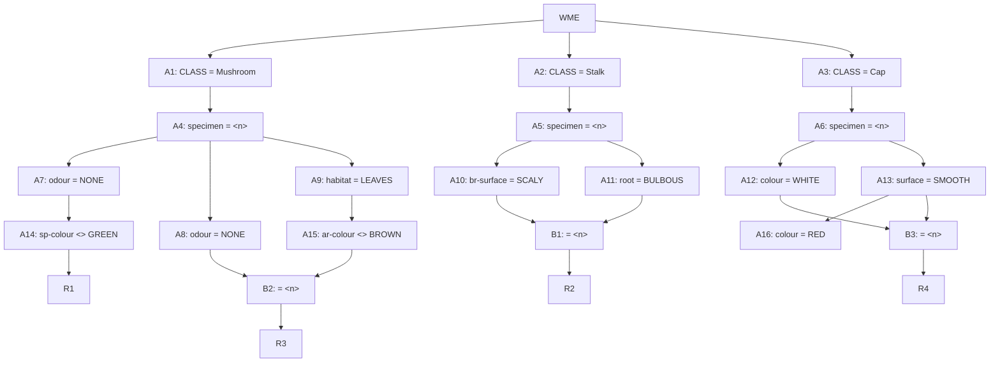

## The Question

A part of the Rete Net that classifies mushrooms (as edible or poisonous) is shown in the figure.
The labels A1, A2, ..., A10, A16, ..., B1, B2, B3, R1, …, R4 uniquely identify the nodes in the network.
When required, use the above label ordering to break ties and to enter short answers.

| # | Question | Official answer |
|---|----------|-----------------|
| 5.1 | Which of the following rule-data tuples are in the conflict-set? | `A,B,C,D` |
| 5.2 | If the Inference Engine uses Specificity as the conflict resolution strategy the | `C,D` |
| 5.3 | If the Inference Engine uses Recency as the conflict resolution strategy then wh | `A` |

<Callout type="warning" title="Source-data notice">
The working-memory list and option texts were lost in transcription — only the net and official answers survive. The complete machinery for THIS net follows; with the exam's WMEs the keyed tuples regenerate mechanically in four steps.
</Callout>

## Step 0 — Read the rule structure off the net

Follow every arrow into rules/betas:

| Rule | Fed by | Full condition set (same $n$ throughout) |
|---|---|---|
| **R1** | A14 | Mushroom + odour NONE + sp-colour ≠ GREEN — **single-WME chain** |
| **R2** | B1 | Stalk + br-surface SCALY ⋈ root BULBOUS |
| **R3** | B2 | Mushroom + odour NONE ⋈ (habitat-LEAVES + ar-colour ≠ BROWN) |
| **R4** | B3 | Cap + WHITE ⋈ SMOOTH (+ RED via A16 hangs off A13's branch) |

Structural facts that pre-answer options:

1. **R1 needs no join** — any mushroom passing odour-NONE with sp-colour present-and-not-GREEN activates it alone. Negated tests still demand the attribute EXIST.
2. **R2 is a two-stalk join** — both conditions on ONE specimen's stalk WMEs... note B1 joins two tokens from the SAME alpha parent pair (A10, A11), so it pairs distinct stalk facts of one $n$.
3. **B3 pairs cap-facts**: WHITE and SMOOTH(+RED branch) on one cap.

## Step 1–3 — File, join, resolve

**Filing:** each WME lands in exactly one CLASS store (A1/A2/A3), binds $n$, then survives at most one colour/odour/habitat filter per branch.

**Joining:** every B-node intersects $n$-sets:

$$B1: n(\text{scaly}) \cap n(\text{bulbous}) \qquad B2: n(\text{odour-none}) \cap n(\text{leaves} \wedge \text{arc} \neq \text{brown}) \qquad B3: n(\text{white}) \cap n(\text{smooth})$$

Each surviving $n$ emits one tuple per rule downstream.

**Specificity** counts patterns per rule — the deepest chains win:

$$\underbrace{\{R3, R4\}}_{\text{join-backed, } \ge 3 \text{ tests}} \;>\; \underbrace{R2}_{2 \text{ stalk tests}} \;>\; \underbrace{R1}_{\text{single WME}}$$

Keyed winners `C,D` = the join-backed tuples.

**Recency** compares sorted-descending timestamp lists, newest element first, longer-list-wins-on-prefix-ties. Keyed winner `A` = the tuple whose newest supporting WME was stamped latest — usually the last-inserted band of the winning combination.

## Worked micro-example (illustrative numbers)

Suppose WM holds: `301 Mushroom ^specimen M9 ^odour NONE ^sp-colour WHITE`, `302 Cap ^specimen C4 ^colour WHITE ^surface SMOOTH`, `303 Stalk ^specimen S7 ^br-surface SCALY`, `304 Stalk ^specimen S7 ^root BULBOUS`:

1. Filing: 301→A4→A7→A14 ✓ (WHITE ≠ GREEN) → **(R1, 301)** fires solo.
2. 303 & 304 share $n$=S7 across A10/A11 → B1 joins → **(R2, 303, 304)**.
3. No cap pair shares an $n$ → B3 starves; no leaves-mushroom → B2 starves.
4. Specificity ranks R2's tuple top (join-backed); recency compares [304,303] vs [301] → newest wins.

## Tricks & Tips

<Accordion title="Exam shortcuts">
1. Write the rule table from the arrows first - condition counts decide specificity without timestamps.
2. Negated tests ( &lt; > GREEN) need the attribute PRESENT and different; absent fields fail silently and kill branches (watch sp-colour/ar-colour).
3. Same-n discipline: joins only fire on identical specimen numbers - perfect attribute sets spread over two specimens produce nothing.
4. Single-WME rules (A14->R1 here) fire once per token; join-backed rules fire once per surviving PAIR.
5. Recency lists sort descending, newest dominates, longer wins ties - the last-inserted supporting WME usually decides.
</Accordion>

**Answers:** 5.1 `A,B,C,D` · 5.2 `C,D` · 5.3 `A`
