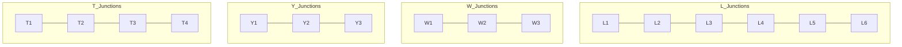

## The Question

The set of junctions (L, W, Y and T type junctions) that occur in a 2D line drawing of trihedral objects is provided below. The in-plane clockwise/counterclockwise rotations of these junctions are valid as well. These junctions provide constraints on the possible edge assignments (convex, concave, arrow) for the edges/lines in 2D line drawings of trihedral objects.

The junctions carry unique labels: L1, L2, L3, L4, L5, L6, T1, T2, T3, T4, W1, W2, W3, Y1, Y2, Y3. When required, use the labels in short answers.

| # | Question | Official answer |
|---|----------|-----------------|
| 7.1 | Assign consistent labels to all the edges and junctions in the 2D line drawing s | `Y1,W1,Y3,W2` |

<Callout type="info" title="Notation note">
This FN sheet's dictionary uses the arrow/pipe notation (e.g., `T1: (->, <-, |)`, `Y1: (-,-,-)`); the AN sibling's catalogue is the same object in +/- spelling. The propagation below works identically — map `+`↔convex-out, `-`↔concave-in, arrows↔occlusion.
</Callout>

## The Topic in 60 Seconds

Waltz = CSP over edges:

- **Variables**: drawing edges · **Values**: convex / concave / occlusion-arrows
- **Constraints**: each vertex must realise one dictionary entry (rotations allowed)
- **Solver**: arc consistency until unique labels everywhere (**solved**) or an empty domain (**NIL**)

> Deep-dive: browse the [Concepts](/concepts) section for Constraint Satisfaction / Waltz.

## Forcing chain behind `Y1,W1,Y3,W2`

Read the keyed answer as four junction labels around the printed silhouette:

| Order | Label | Reading | Why forced |
|---|---|---|---|
| 1 | **Y1** | all-concave corner (−,−,−) | the start vertex sits in a concave notch: no arrow can terminate there and no + pair fits its three slots |
| 2 | neighbouring fork | shares a − edge with Y1 ⇒ middle/side slot pinned to −; the boundary contour supplies the arrow pair | **W1** |
| 3 | next Y corner | the two − edges leaving W1 arrive together; the third edge closes a fully convex tip | **Y3** (+,+,+) — the only Y-entry tolerating + on all slots once neither − nor arrows survive |
| 4 | closing fork | receives the convex edge from Y3 in its −-free slot; boundary arrow fixes orientation | **W2** |

The chain is deterministic: each dictionary entry leaves exactly one survivor given its already-labelled neighbours. That uniqueness — not luck — is what the key encodes.

## The general procedure (what to quote in an answer)

1. Initialise every junction domain from the dictionary (rotations included).
2. Fix the most constrained junction first (a Y or T).
3. Propagate across shared edges: signs must MATCH along an edge; arrows must keep ONE direction.
4. Repeat to fixpoint → one label per junction = the answer; any empty domain = reset all labels to **NIL**.

## Worked micro-example

Concave notch meeting a ridge (illustrative):

1. Y starts $\{Y1, Y2, Y3\}$; adjacent W starts $\{W1, W2, W3\}$.
2. Shared edge fixed concave (−): Y keeps $\{Y1\}$; W keeps entries with a − slot: $\{W2\}$ (and W3-style if rotated).
3. W's other two edges inherit arrow/+ readings; propagate outward.
4. Fixpoint with singleton domains → solved, e.g., exactly a `Y1 … W2` tail like the key's.

Flip step 2 so the edge must be BOTH − and + → empty domain → **NIL**.

## Tricks & Tips

<Accordion title="Exam shortcuts">
1. Seed at Y/T junctions - three-slot constraints prune fastest.
2. Signs must AGREE along shared edges; arrows must keep ONE direction - head-on arrow clashes are the classic NIL generator.
3. Rotations OK, mirrors NOT: W1 vs W2 differ by which slot carries the sign - identify the shared edge's slot before naming the label.
4. A single fixed sign eliminates whole Y-classes instantly (a '-' kills Y3, a '+' kills Y1).
5. Quote the CSP frame for theory marks: variables=edges, values=\{convex,concave,arrow\}, constraints=junction dictionary, algorithm=arc consistency.
</Accordion>

**Answers:** 7.1 `Y1,W1,Y3,W2`
